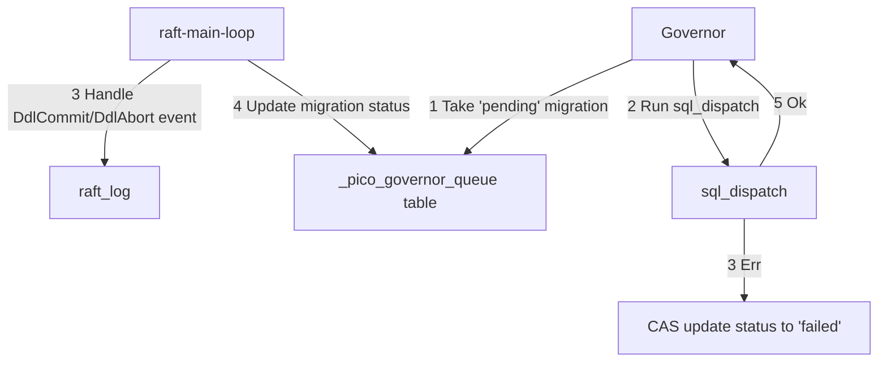

status: "accepted"

decision-makers: @kostja, @d.rodionov, ...

---

# Возможность запускать произвольную миграцию из governor (частный случай: DDL при апгрейде)

## Контекст и проблема

В каждом новом релизе picodata мы можем изменять схему системных таблиц, в зависимости от новых фич/улучшений.
Необходим инструмент для бесшовного автоматического обновления схемы системных таблиц,
со схемы старого релиза до схемы нового релиза.

Назовем это действие апгрейдом. В рамках данного апгрейда мы должны применить серию DDL операций на
изменение схемы данных для всего кластера. Апгрейд производит governor, как сущность
работающая на рафт-лидере, имеющая доступ до глобальных таблиц и выполняющая схожий функционал по шагам.

Сейчас governor не умеет запускать DDL. Текущий механизм исполнения DDL подробно описан в другом
[ADR](https://git.picodata.io/core/picodata/-/blob/master/doc/adr/2024-11-14-truncate.md?ref_type=heads#нынешний-механизм-исполнения-ddl-и-dml-запросов). Механизм можно грубо разделить на две фазы: DdlPrepare, DdlCommit. governor сейчас принимает участие только после того, как применен DdlPrepare на лидере.
Т.е. DDL не применится без участия governor. Получается, если запустить процесс апгрейда,
блокирующий файбер governor, то будет deadlock, т.к. governor будет ждать завершения DDL
для завершения апгрейда, при этом DDL не будет завершен пока governor на очередном шаге не подхватит обработку
второй части выполнения DDL.

Т.е надо научиться запускать серию двухфазных DDL из governor, не блокируя при этом файбер governor. Создавать
дополнительный файбер нам не подходит, архитектурно стремимся так не делать, если можно не делать. Поэтому
рассматриваем варианты с использованием существующих файберов.

**Задача даже более крупная** - хотим научиться запускать произвольную серию операций
(DDL, DML, ACL, Op::Plugin) из governor в любой момент,
рассматривая апгрейд с релиза на релиз как частный случай.

Термин "миграция" в этом документе равносилен операция (DDL, DML, ...).

## Решение

Запуск миграции из governor тригерится появлением значения/ий
в системной табличке. Это может быть осуществлено через `CAS(Dml)` на другом шаге governor,
например при проверке версий инстансов относительно версии кластера (шаг `UpdateClusterVersion`).

**Предлагается завести отдельную новую системную табличку для этого дела.**

**\_pico_governor_queue**:

| имя поля    | описание поля                                                                                                             |
| ----------- | ------------------------------------------------------------------------------------------------------------------------- |
| id          | идентификатор миграции                                                                                                    |
| batch_id    | идентификатор логической группировки миграций (батча из нескольких миграций)                                              |
| op          | SQL-операция, которую нужно выполнить, или значение кастомной операции (задел на будущее)                                 |
| op_format   | формат операции в поле `op` (`sql`, ...)                                                                                  |
| status      | статус миграции (`pending`, `done`, `failed`)                                                                             |
| kind        | тип миграции (`upgrade`, `custom`)                                                                                        |
| description | человекочитаемое описание миграции                                                                                        |

**Операция в табличке лежит в виде SQL-запроса.**

Создавая новую табличку для миграций возникает проблема "курицы и яйца": чтобы создать табличку
надо выполнить миграцию, а чтобы выполнить миграцию надо иметь созданную табличку. Предлагаемые
решения этой проблемы:

- создать табличку вручную до запуска миграции (минус: табличка не получит идентификатора
  спейса в диапазоне системных таблиц)
- захардкодить создание таблицы как нулевой шаг любой миграции (проверять существует
  ли таблица и если нет, то создать)

**Используем второе решение - создание таблицы из кода как нулевой шаг миграции.**

Для этого у governor добавляется 2 новых шага:

- создание системной таблицы `_pico_governor_queue` (триггерится проверкой на существование таблицы)
- наполнение системной таблицы `_pico_governor_queue` начальной миграцией, нужной для апгрейда
  со старого релиза на новый (триггерится проверкой на существование записей в таблице)

После этих 2-х шагов таблица `_pico_governor_queue` будет существовать и будет наполнена начальной миграцией.
Т.е. теперь governor может на каждой итерации брать миграцию из таблички и выполнять.
Это будет делаться в отдельном новом шаге governor "выполнение миграции".

### Алгоритм выполнения миграции

**TLDR**: в рамках одного шага governor делает все действия по выполнению одной
целой операции миграции, но не дедлочится на DDL: использует для выполнения уже
существующую процедуру `sql_dispatch` + мы добавляем правки в `sql_dispatch`, чтобы
DDL не дедлочилось.

1. в `_pico_governor_queue` появляются строки (миграции) со статусом `pending` или `failed`
1. если есть миграция со статусом `failed`, то governor пишет ошибку в лог,
   и не приступает к выполнению миграций (не берет новую
   миграцию для выполнения, не ретраит старую пофейленную миграцию)
1. если есть миграция со статусом `pending`, то governor идет на шаг выполнения миграции
1. governor запускает функцию `sql_dispatch` с SQL-операцией из миграции и дожидается когда она отработает
1. в случае успеха - шаг governor по выполнению миграции считается успешным, governor
   идет заниматься своими делами
1. в случае ошибки - governor обновляет статус миграции в `failed` через CaS

**примечания**:

- делается один большой шаг для каждой миграции, т.е. governor
  не будет делать ничего другого пока не сделает одну миграцию
- при этом другие файберы это не блочит, т.к. в рамках этого большого шага мы yield-им,
  например когда ждем применения индексов

### Правки в `sql_dispatch`

- пробрасываем на вход функции `sql_dispatch` опциональный параметр `governor_op_id` (id миграции
  из таблицы `_pico_governor_queue`)
- пробрасываем `governor_op_id` в событие `DdlPrepare` в рафт-лог
- в коде после `CAS(DdlPrepare)` (но до ожидания индекса `DdlCommit`) проверяем,
  что мы выполняемся на лидере (governor выполняется только на лидере) и что выставлен
  параметр `governor_op_id` (передаем в параметрах процедуры)
- если мы на лидере и есть параметр, то после `CAS(DdlPrepare)` и ожидания применения индекса
  этой операции мы должны иметь заполненное поле `properties.PendingSchemaChange`
  (заполнение произойдет в райфт-мейн-лупе при применении `DdlPrepare`), проверяем это
- в этом случае мы можем сразу тут же продолжать выполнять DDL, а именно:
  отправить всем репликасет-мастерам rpc `ddl_apply`, подождать ответа от всех,
  после этого делать `CAS(DdlCommit)`, ждать применения, и после этого
  продолжать выполнять текущий код `sql_dispatch` (начиная с блока `wait_for_index_globally`)

### Обновление статуса миграции

После выполнения `sql_dispatch` необходимо обновить статус миграции в `_pico_governor_queue`.
Предлагается делать это уже не в governor, а в raft-main-loop, в тот момент, когда
будет обрабатываться событие DdlCommit из рафт лога. В этот момент
из `properties.PendingSchemaChange` можно достать `DdlPrepare`, а из
`DdlPrepare` можно достать `governor_op_id`. Зная `governor_op_id`, несложно
проапдейтить статус миграции (`done` для DdlCommit, `failed` для DdlAbort).

### Ожидаемый результат

Возможность записать любую миграцию (DDL, DML, ACL, etc) в табличку,
и governor автоматизированно выполнил эту миграцию.

Частный случай (на котором запускаемся в первую очередь) -
апгрейд схем системных таблиц между двумя релизами (DDL).
