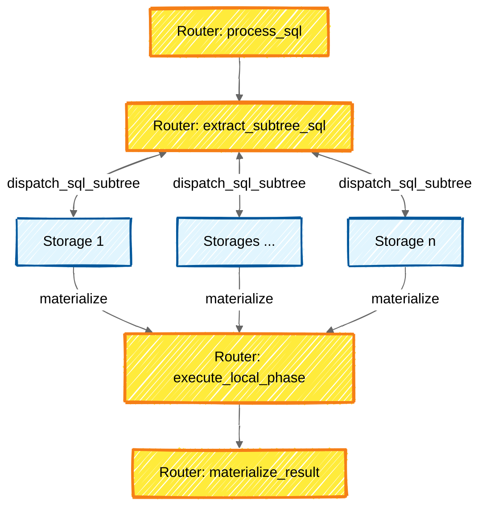

<!--
The template is not strict. You can use any ADR structure that feels best for a particular case.
See these ADR examples for inspiration:
- [Cassandra SEP - Ganeral Purpose Transactions](https://cwiki.apache.org/confluence/display/CASSANDRA/CEP-15%3A+General+Purpose+Transactions)
- [Rust RFC - Lifetime Ellision](https://github.com/rust-lang/rfcs/blob/master/text/0141-lifetime-elision.md)
- [TiKV - Use Joint Consensus](https://github.com/tikv/rfcs/blob/master/text/0054-joint-consensus.md)
-->

- Status: proposed
- Date: 2025-06-11
- Decision-makers: @ypodlesov, @darthunix, @funbringer, @kostja
- Picodata issue: [#1470](https://git.picodata.io/core/picodata/-/issues/1470)
- Picodata MR: [#1953](https://git.picodata.io/core/picodata/-/merge_requests/1953)

<!--
consulted: list everyone whose opinions are sought (typically subject-matter experts); and with whom there is a two-way communication
informed: list everyone who is kept up-to-date on progress; and with whom there is a one-way communication
-->

---

# 0. Резюме

В данном документе описывается подход к реализации
join predicate _pushdown_ (**JPPD**) в СУБД **Picodata**.

- В разделе **Мотивация** формулируется проблема и обсуждается чем вызвана необходимость её решения.
- В разделе **Аналоги** рассматриваются подходы к решению проблемы и возможности функционала в существующих СУБД.
- В разделе **Решение** приводится дизайн целевого решения для распределённой SQL-СУБД **Picodata**. Обсуждаются дальнейшие оптимизации.

---

# 1. Мотивация

На данный момент в **Picodata** оптимизация **JPPD** отсутствует. Есть цель её поддержать.
Полная поддержка всех оптимизаций с **JPPD** потребует существенного изменения кодовой базы.

1. Большой риск допустить ошибку.
2. Высокая сложность покрытия тестами.
3. Даже для самых простых оптимизаций time to merge будет большим.
4. Высокая сложность процесса ревью.

Поэтому предлагается декомпозировать задачу на менее крупные.

## Про **Picodata** в контексте `JOIN`

С целью избежать неоднозначности, введём

### Определения

При `INNER JOIN` внешней и внутренней таблицей называются `LHS` и `RHS` соответственно.
То есть в примере

```sql
select * from t1 join t2
```

- `t1` - внешняя
- `t2` - внутренняя

При `LEFT JOIN` внешняя и внутренняя таблицы определяются стандартным образом.

### Распределённые запросы в **Picodata**

Обсудим запросы с `JOIN`/`LEFT JOIN` по распределённым таблицам в **Picodata**.

Рассмотрим схематично как в общем случае выполняется **SQL** запрос по распределённой таблице в **Picodata**



То есть приоритетом в оптимизации **JPPD** является материализация данных на разных стораджах.

Теперь рассмотрим как выглядит план выполнения запроса с `JOIN`/`LEFT JOIN` в **Picodata** на распределённых таблицах `t1` и `t2`.
С целью упрощения данные распределяем по 2 стораджам.

```sql
create table t1(
    a int primary key,
    b int
) distributed by (a);

create table t2(
    a int primary key,
    b int
) distributed by (a);

insert into t1 values (1, 1), (3, 3), (5, 5), (7, 7);
insert into t2 values (1, 1), (3, 3), (5, 5), (7, 7), (9, 9);
```

Делаем `JOIN` по ключу распределения.
Так как в одном запросе можно работать с таблицами только из **одного** тира,
то мы не нуждаемся в перемещении данных между узлами.

```bash
explain select * from t1 join t2 on t1.a = t2.a;
projection ("t1"."a"::integer -> "a", "t1"."b"::integer -> "b", "t2"."a"::integer -> "a", "t2"."b"::integer -> "b")
    join on "t1"."a"::integer = "t2"."a"::integer
        scan "t1"
            projection ("t1"."a"::integer -> "a", "t1"."b"::integer -> "b")
                scan "t1"
        scan "t2"
            projection ("t2"."a"::integer -> "a", "t2"."b"::integer -> "b")
                scan "t2"
```

В ином случае, будет создан [`motion`](https://docs.picodata.io/picodata/stable/reference/sql/explain/#data_motion_types).

```bash
explain select * from t1 join t2 on t1.a = t2.b;
projection ("t1"."a"::integer -> "a", "t1"."b"::integer -> "b", "t2"."a"::integer -> "a", "t2"."b"::integer -> "b")
    join on "t1"."a"::integer = "t2"."b"::integer
        scan "t1"
            projection ("t1"."a"::integer -> "a", "t1"."b"::integer -> "b")
                scan "t1"
        motion [policy: segment([ref("b")])]
            scan "t2"
                projection ("t2"."a"::integer -> "a", "t2"."b"::integer -> "b")
                    scan "t2"
```

### Локальная фаза исполнения (**Tarantool**)

**Picodata** исполняет локальный **SQL** при помощи **Tarantool**.
Рассмотрим оптимизации для `JOIN` в **Tarantool**.

При `LEFT JOIN` **Tarantool** может использовать на внешней таблице `WHERE <where_condition>`.

```bash
tarantool> explain query plan select * from t1 left join t2 on t1.a = t2.a where t1.a > 1;
---
- metadata:
  - name: selectid
    type: integer
  - name: order
    type: integer
  - name: from
    type: integer
  - name: detail
    type: text
  rows:
  - [0, 0, 0, 'SEARCH TABLE T1 USING PRIMARY KEY (A>?) (~262144 rows)']
  - [0, 1, 1, 'SEARCH TABLE T2 USING PRIMARY KEY (A=?) (~1 row)']
```

При этом **Tarantool** не умеет делать _pushdown_ этого предиката во внутреннюю таблицу.

```bash
tarantool> explain query plan select * from t1 left join t2 on t1.a = t2.a where t1.a > 1;
---
- metadata:
  - name: selectid
    type: integer
  - name: order
    type: integer
  - name: from
    type: integer
  - name: detail
    type: text
  rows:
  - [0, 0, 0, 'SEARCH TABLE T1 USING PRIMARY KEY (A>?) (~262144 rows)']
  - [0, 1, 1, 'SEARCH TABLE T2 USING PRIMARY KEY (A=?) (~1 row)']
```

Стоит заметить что так как по атрибуту `a` таблицы `t2` есть индекс,
то _pushdown_ предиката во внутреннюю таблицу здесь не даст критического улучшения (если вообще даст).

Из рассмотрений в **Picodata** фазы диспатчинга **SQL** запроса и фазы его локального исполнения следует,
что более приоритетной является задача снижения количества данных,
пересылаемых между узлами в запросах по распределённым таблицам.
Оптимизации в **Tarantool** возможны, но они будут применимы в гораздо более узком наборе кейсов.

# 2. Аналоги

## Postgres 17.5

Умеет делать _pushdown_ для предиката вида `t.col_name = x`.
Не умеет делать _pushdown_ в обе таблицы на диапазоны (e.g. `t.col_name > x`, `t.col_name BETWEEEN x AND y`), не умеет делать _pushdown_ предикатов состоящих из нескольких условий соединенных `AND` или `OR`.

### Примеры `EXPLAIN`:

```sql
postgres=# explain select * from t1 join t2 on t1.a = t2.a where t2.a = 3;
                               QUERY PLAN
------------------------------------------------------------------------
Nested Loop  (cost=0.31..16.36 rows=1 width=16)
   ->  Index Scan using t1_pkey on t1  (cost=0.15..8.17 rows=1 width=8)
         Index Cond: (a = 3)
   ->  Index Scan using t2_pkey on t2  (cost=0.15..8.17 rows=1 width=8)
         Index Cond: (a = 3)
(5 rows)

postgres=# explain select * from (select * from t1 where a = 3) as t1 join (select * from t2 where a = 3) as t2 on t1.a = t2.a;
                               QUERY PLAN
------------------------------------------------------------------------
Nested Loop  (cost=0.31..16.36 rows=1 width=16)
   ->  Index Scan using t1_pkey on t1  (cost=0.15..8.17 rows=1 width=8)
         Index Cond: (a = 3)
   ->  Index Scan using t2_pkey on t2  (cost=0.15..8.17 rows=1 width=8)
         Index Cond: (a = 3)
(5 rows)
```

```sql
postgres=# explain select * from t1 join t2 on t1.a = t2.a where t1.a > 0;
                                     QUERY PLAN
------------------------------------------------------------------------------------
Hash Join  (cost=38.82..77.36 rows=753 width=16)
   Hash Cond: (t2.a = t1.a)
   ->  Seq Scan on t2  (cost=0.00..32.60 rows=2260 width=8)
   ->  Hash  (cost=29.40..29.40 rows=753 width=8)
         ->  Bitmap Heap Scan on t1  (cost=9.99..29.40 rows=753 width=8)
               Recheck Cond: (a > 0)
               ->  Bitmap Index Scan on t1_pkey  (cost=0.00..9.80 rows=753 width=0)
                     Index Cond: (a > 0)
(8 rows)

postgres=# explain select * from (select * from t1 where a > 0) as t1 join (select * from t2 where a > 0) as t2 on t1.a = t2.a;
                                     QUERY PLAN
------------------------------------------------------------------------------------
Hash Join  (cost=48.81..70.20 rows=251 width=16)
   Hash Cond: (t1.a = t2.a)
   ->  Bitmap Heap Scan on t1  (cost=9.99..29.40 rows=753 width=8)
         Recheck Cond: (a > 0)
         ->  Bitmap Index Scan on t1_pkey  (cost=0.00..9.80 rows=753 width=0)
               Index Cond: (a > 0)
   ->  Hash  (cost=29.40..29.40 rows=753 width=8)
         ->  Bitmap Heap Scan on t2  (cost=9.99..29.40 rows=753 width=8)
               Recheck Cond: (a > 0)
               ->  Bitmap Index Scan on t2_pkey  (cost=0.00..9.80 rows=753 width=0)
                     Index Cond: (a > 0)
(11 rows)
```

```sql
postgres=# explain select * from t1 join t2 on t1.a = t2.a where t1.a BETWEEN 0 AND 7;
                                    QUERY PLAN
-----------------------------------------------------------------------------------
Hash Join  (cost=15.10..53.65 rows=11 width=16)
   Hash Cond: (t2.a = t1.a)
   ->  Seq Scan on t2  (cost=0.00..32.60 rows=2260 width=8)
   ->  Hash  (cost=14.97..14.97 rows=11 width=8)
         ->  Bitmap Heap Scan on t1  (cost=4.27..14.97 rows=11 width=8)
               Recheck Cond: ((a >= 0) AND (a <= 7))
               ->  Bitmap Index Scan on t1_pkey  (cost=0.00..4.27 rows=11 width=0)
                     Index Cond: ((a >= 0) AND (a <= 7))
(8 rows)

postgres=# explain select * from (select * from t1 where a BETWEEN 0 AND 7) as t1 join (select * from t2 where a BETWEEN 0 AND 7) as t2 on t1.a = t2.a;
                                    QUERY PLAN
-----------------------------------------------------------------------------------
Hash Join  (cost=19.37..30.10 rows=1 width=16)
   Hash Cond: (t1.a = t2.a)
   ->  Bitmap Heap Scan on t1  (cost=4.27..14.97 rows=11 width=8)
         Recheck Cond: ((a >= 0) AND (a <= 7))
         ->  Bitmap Index Scan on t1_pkey  (cost=0.00..4.27 rows=11 width=0)
               Index Cond: ((a >= 0) AND (a <= 7))
   ->  Hash  (cost=14.97..14.97 rows=11 width=8)
         ->  Bitmap Heap Scan on t2  (cost=4.27..14.97 rows=11 width=8)
               Recheck Cond: ((a >= 0) AND (a <= 7))
               ->  Bitmap Index Scan on t2_pkey  (cost=0.00..4.27 rows=11 width=0)
                     Index Cond: ((a >= 0) AND (a <= 7))
(11 rows)
```

```sql
postgres=# explain select * from t1 join t2 on t1.a = t2.a where t1.a = 3 or t1.a = 5;
                                    QUERY PLAN
----------------------------------------------------------------------------------
Hash Join  (cost=16.85..24229.89 rows=1 width=16)
      ->  Bitmap Heap Scan on t1  (cost=8.33..13.67 rows=2 width=8)
            Recheck Cond: ((a = 3) OR (a = 5))
            ->  BitmapOr  (cost=8.33..8.33 rows=2 width=0)
                  ->  Bitmap Index Scan on t1_pkey  (cost=0.00..4.16 rows=1 width=0)
                        Index Cond: (a = 3)
                  ->  Bitmap Index Scan on t1_pkey  (cost=0.00..4.16 rows=1 width=0)
                        Index Cond: (a = 5)
      ->  Index Scan using t2_pkey on t2  (cost=0.15..8.17 rows=1 width=8)
            Index Cond: (a = t1.a)
(10 rows)

postgres=# explain select * from (select * from t1 where a = 3 or a = 5) as t1 join (select * from t2 where a = 3 or a = 5) as t2 on t1.a = t2.a;
                                       QUERY PLAN
----------------------------------------------------------------------------------------
Hash Join  (cost=25.73..33.68 rows=1 width=16)
      Hash Cond: (t1.a = t2.a)
      ->  Bitmap Heap Scan on t1  (cost=8.88..16.83 rows=2 width=8)
            Recheck Cond: ((a = 3) OR (a = 5))
            ->  BitmapOr  (cost=8.88..8.88 rows=2 width=0)
                  ->  Bitmap Index Scan on t1_pkey  (cost=0.00..4.44 rows=1 width=0)
                        Index Cond: (a = 3)
                  ->  Bitmap Index Scan on t1_pkey  (cost=0.00..4.44 rows=1 width=0)
                        Index Cond: (a = 5)
      ->  Hash  (cost=16.83..16.83 rows=2 width=8)
            ->  Bitmap Heap Scan on t2  (cost=8.88..16.83 rows=2 width=8)
                  Recheck Cond: ((a = 3) OR (a = 5))
                  ->  BitmapOr  (cost=8.88..8.88 rows=2 width=0)
                        ->  Bitmap Index Scan on t2_pkey  (cost=0.00..4.44 rows=1 width=0)
                              Index Cond: (a = 3)
                        ->  Bitmap Index Scan on t2_pkey  (cost=0.00..4.44 rows=1 width=0)
                              Index Cond: (a = 5)
(17 rows)
```

#### Ссылки:

- [Описание оптимизатора в репозитории Postgres](https://github.com/postgres/postgres/tree/master/src/backend/optimizer)
- [Дискуссия про _pushdown_ предикатов с Томом Лейном](https://www.postgresql.org/message-id/CAKFQuwbfSUdCGPDsJJcd4_M15MiU4sUzNWNoPnA27%2BZjZ%3D%2BfYQ%40mail.gmail.com)

## MySQL 9.3.0

Умеет делать _pushdown_ для предиката вида `t.col_name = x`.
Не умеет делать _pushdown_ на диапазоны (e.g. `t.col_name > x`, `t.col_name BETWEEEN x AND y`), не умеет делать _pushdown_ предикатов состоящих из нескольких условий соединенных `AND` или `OR`.

### Примеры `EXPLAIN`:

```sql
mysql> explain select * from t1 left join t2 on t1.a = t2.a where t2.a = 2001;
+----+-------------+-------+------------+-------+---------------+---------+---------+-------+------+----------+-------+
| id | select_type | table | partitions | type  | possible_keys | key     | key_len | ref   | rows | filtered | Extra |
+----+-------------+-------+------------+-------+---------------+---------+---------+-------+------+----------+-------+
|  1 | SIMPLE      | t1    | NULL       | const | PRIMARY       | PRIMARY | 4       | const |    1 |   100.00 | NULL  |
|  1 | SIMPLE      | t2    | NULL       | const | PRIMARY       | PRIMARY | 4       | const |    1 |   100.00 | NULL  |
+----+-------------+-------+------------+-------+---------------+---------+---------+-------+------+----------+-------+
2 rows in set, 1 warning (0.000 sec)

mysql> explain select * from (select * from t1 where a = 2001) as t1 left join (select * from t2 where a = 2001) as t2 on t1.a = t2.a;
+----+-------------+-------+------------+-------+---------------+---------+---------+-------+------+----------+-------+
| id | select_type | table | partitions | type  | possible_keys | key     | key_len | ref   | rows | filtered | Extra |
+----+-------------+-------+------------+-------+---------------+---------+---------+-------+------+----------+-------+
|  1 | SIMPLE      | t1    | NULL       | const | PRIMARY       | PRIMARY | 4       | const |    1 |   100.00 | NULL  |
|  1 | SIMPLE      | t2    | NULL       | const | PRIMARY       | PRIMARY | 4       | const |    1 |   100.00 | NULL  |
+----+-------------+-------+------------+-------+---------------+---------+---------+-------+------+----------+-------+
2 rows in set, 1 warning (0.000 sec)
```

```sql
mysql> explain select * from t1 left join t2 on t1.a = t2.a where t1.a > 0;
+----+-------------+-------+------------+--------+---------------+---------+---------+------------+------+----------+-------------+
| id | select_type | table | partitions | type   | possible_keys | key     | key_len | ref        | rows | filtered | Extra       |
+----+-------------+-------+------------+--------+---------------+---------+---------+------------+------+----------+-------------+
|  1 | SIMPLE      | t1    | NULL       | range  | PRIMARY       | PRIMARY | 4       | NULL       | 5000 |   100.00 | Using where |
|  1 | SIMPLE      | t2    | NULL       | eq_ref | PRIMARY       | PRIMARY | 4       | mysql.t1.a |    1 |   100.00 | NULL        |
+----+-------------+-------+------------+--------+---------------+---------+---------+------------+------+----------+-------------+
2 rows in set, 1 warning (0.000 sec)

mysql> explain select * from (select * from t1 where a > 0) as t1 left join (select * from t2 where a > 0) as t2 on t1.a = t2.a;
+----+-------------+-------+------------+--------+---------------+---------+---------+------------+------+----------+-------------+
| id | select_type | table | partitions | type   | possible_keys | key     | key_len | ref        | rows | filtered | Extra       |
+----+-------------+-------+------------+--------+---------------+---------+---------+------------+------+----------+-------------+
|  1 | SIMPLE      | t1    | NULL       | range  | PRIMARY       | PRIMARY | 4       | NULL       | 5000 |   100.00 | Using where |
|  1 | SIMPLE      | t2    | NULL       | eq_ref | PRIMARY       | PRIMARY | 4       | mysql.t1.a |    1 |   100.00 | Using where |
+----+-------------+-------+------------+--------+---------------+---------+---------+------------+------+----------+-------------+
2 rows in set, 1 warning (0.000 sec)
```

#### Ссылки:

- [Документация про _pushdown_ условий в подзапросы](https://dev.mysql.com/doc/refman/9.3/en/derived-condition-*pushdown*-optimization.html)
- [Код оптимизатора `join`](https://github.com/mysql/mysql-server/blob/trunk/sql/join_optimizer/join_optimizer.h#L72)

## DuckDB v1.3.1

В DuckDB поддерживаются различные оптимизации связанные с predicate _pushdown_.

DuckDB может делать _pushdown_ предикатов для запросов вида:

```sql
select * from t1 join t2 on t1.a = t2.a where t1.a > 10000 and t1.a < 55000;
select * from t1 join t2 on t1.a = t2.a where t1.a BETWEEN 0 AND 7;
```

Сценарии в которых не работает predicate _pushdown_ - дизъюнкции и сравнения, где левая часть содержит выражение сложнее значения атрибута в кортеже (i. e. `t.a`). Например,

```sql
select * from t1 join t2 on t1.a = t2.a where t1.a = 3 or t1.a = 5;
select * from t1 join t2 on t1.a = t2.a where t2.a % 100 = 69;
```

### Примеры `EXPLAIN`:

```bash
D explain select * from t1 join t2 on t1.a = t2.a join t3 on t1.a = t3.a join t4 on t1.a = t4.a where t1.a > 10000 and t4.a < 55000;

┌─────────────────────────────┐
│┌───────────────────────────┐│
││       Physical Plan       ││
│└───────────────────────────┘│
└─────────────────────────────┘
┌───────────────────────────┐
│         PROJECTION        │
│    ────────────────────   │
│             a             │
│             b             │
│             a             │
│             b             │
│             a             │
│             b             │
│             a             │
│             b             │
│                           │
│          ~60 Rows         │
└─────────────┬─────────────┘
┌─────────────┴─────────────┐
│         HASH_JOIN         │
│    ────────────────────   │
│      Join Type: INNER     │
│     Conditions: a = a     ├──────────────┐
│                           │              │
│          ~60 Rows         │              │
└─────────────┬─────────────┘              │
┌─────────────┴─────────────┐┌─────────────┴─────────────┐
│         SEQ_SCAN          ││         HASH_JOIN         │
│    ────────────────────   ││    ────────────────────   │
│         Table: t1         ││      Join Type: INNER     │
│   Type: Sequential Scan   ││     Conditions: a = a     │
│                           ││                           │
│        Projections:       ││                           │
│             a             ││                           ├──────────────┐
│             b             ││                           │              │
│                           ││                           │              │
│          Filters:         ││                           │              │
│    a>10000 AND a<55000    ││                           │              │
│                           ││                           │              │
│        ~11011 Rows        ││         ~255 Rows         │              │
└───────────────────────────┘└─────────────┬─────────────┘              │
                             ┌─────────────┴─────────────┐┌─────────────┴─────────────┐
                             │         SEQ_SCAN          ││         HASH_JOIN         │
                             │    ────────────────────   ││    ────────────────────   │
                             │         Table: t2         ││      Join Type: INNER     │
                             │   Type: Sequential Scan   ││     Conditions: a = a     │
                             │                           ││                           │
                             │        Projections:       ││                           │
                             │             a             ││                           ├──────────────┐
                             │             b             ││                           │              │
                             │                           ││                           │              │
                             │          Filters:         ││                           │              │
                             │    a>10000 AND a<55000    ││                           │              │
                             │                           ││                           │              │
                             │        ~11001 Rows        ││         ~2154 Rows        │              │
                             └───────────────────────────┘└─────────────┬─────────────┘              │
                                                          ┌─────────────┴─────────────┐┌─────────────┴─────────────┐
                                                          │         SEQ_SCAN          ││         SEQ_SCAN          │
                                                          │    ────────────────────   ││    ────────────────────   │
                                                          │         Table: t3         ││         Table: t4         │
                                                          │   Type: Sequential Scan   ││   Type: Sequential Scan   │
                                                          │                           ││                           │
                                                          │        Projections:       ││        Projections:       │
                                                          │             a             ││             a             │
                                                          │             b             ││             b             │
                                                          │                           ││                           │
                                                          │          Filters:         ││          Filters:         │
                                                          │    a>10000 AND a<55000    ││    a>10000 AND a<55000    │
                                                          │                           ││                           │
                                                          │        ~10000 Rows        ││        ~10000 Rows        │
                                                          └───────────────────────────┘└───────────────────────────┘
```

```bash
D explain select * from t1 join t2 on t1.a = t2.a where t2.a = 1000;

┌─────────────────────────────┐
│┌───────────────────────────┐│
││       Physical Plan       ││
│└───────────────────────────┘│
└─────────────────────────────┘
┌───────────────────────────┐
│         PROJECTION        │
│    ────────────────────   │
│             a             │
│             b             │
│             a             │
│             b             │
│                           │
│          ~0 Rows          │
└─────────────┬─────────────┘
┌─────────────┴─────────────┐
│         HASH_JOIN         │
│    ────────────────────   │
│      Join Type: INNER     │
│     Conditions: a = a     ├──────────────┐
│                           │              │
│          ~0 Rows          │              │
└─────────────┬─────────────┘              │
┌─────────────┴─────────────┐┌─────────────┴─────────────┐
│         SEQ_SCAN          ││         SEQ_SCAN          │
│    ────────────────────   ││    ────────────────────   │
│         Table: t1         ││         Table: t2         │
│   Type: Sequential Scan   ││   Type: Sequential Scan   │
│                           ││                           │
│        Projections:       ││        Projections:       │
│             a             ││             a             │
│             b             ││             b             │
│                           ││                           │
│      Filters: a=1000      ││      Filters: a=1000      │
│                           ││                           │
│          ~2 Rows          ││          ~2 Rows          │
└───────────────────────────┘└───────────────────────────┘
```

#### Ссылки:

- [Исходный код predicate _pushdown_ для `LEFT JOIN`](https://github.com/duckdb/duckdb/blob/main/src/optimizer/*pushdown*/pushdown_left_join.cpp)
- [Коммит с добавлением _pushdown_ predicate в обе таблицы, участвующие в join](https://github.com/duckdb/duckdb/commit/4b5322a21acf03fcab86560a5bdbed1b32489c91#diff-ef98dfc0840cf69d434efb05a6b87601809036923209d0d4c248339f046ead8f)
- [Прочие оптимизации связанные с predicate _pushdown_ в DuckDB](https://github.com/duckdb/duckdb/tree/main/src/optimizer/*pushdown*)

## Snowflake (Enterprise 1.4.1)

**Snowflake** по итогам тестирования предлагает наиболее полный набор оптимизаций при работе с предикатами `JOIN` / `LEFT JOIN`.

В [статье](https://teej.ghost.io/understanding-the-snowflake-query-optimizer/) описаны какие именно оптимизации для `JOIN` / `LEFT JOIN` предусмотрены.

Из вещей, оставшихся за пределами статьи, интерес представляли кейсы с дизъюнкцией в предикате и с выражениями сложнее значения аттрибута в кортеже. **Snowflake** справляется и с этим.

### Примеры `EXPLAIN`:

```bash
ypodlesov#SF_TUTS_WH@SF_TUTS.PUBLIC>explain using text select * from t1 join t2 on t1.a = t2.a where (t1.a < 1000 or t2.a > 4000) and (t1.b < 1000);
+----------------------------------------------------------------------------------------------------------------------------------+
| content                                                                                                                          |
|----------------------------------------------------------------------------------------------------------------------------------|
| GlobalStats:                                                                                                                     |
|     partitionsTotal=2                                                                                                            |
|     partitionsAssigned=2                                                                                                         |
|     bytesAssigned=36864                                                                                                          |
| Operations:                                                                                                                      |
| 1:0     ->Result  T1.A, T1.B, T2.A, T2.B                                                                                         |
| 1:1          ->InnerJoin  joinKey: (T1.A = T2.A)                                                                                 |
| 1:2               ->Filter  (T1.B < 1000) AND ((T1.A < 1000) OR (T1.A > 4000))                                                   |
| 1:3                    ->TableScan  SF_TUTS.PUBLIC.T1  A, B  {partitionsTotal=1, partitionsAssigned=1, bytesAssigned=18432}      |
| 1:4               ->Filter  (T2.A < 1000) OR (T2.A > 4000)                                                                       |
| 1:5                    ->JoinFilter  joinKey: (T1.A = T2.A)                                                                      |
| 1:6                         ->TableScan  SF_TUTS.PUBLIC.T2  A, B  {partitionsTotal=1, partitionsAssigned=1, bytesAssigned=18432} |
|                                                                                                                                  |
+----------------------------------------------------------------------------------------------------------------------------------+
1 Row(s) produced. Time Elapsed: 0.281s
ypodlesov#SF_TUTS_WH@SF_TUTS.PUBLIC>
```

```bash
ypodlesov#SF_TUTS_WH@SF_TUTS.PUBLIC>explain using text select * from t1 join t2 on t1.a = t2.a where t1.a % 100 <= 69;
+----------------------------------------------------------------------------------------------------------------------------------+
| content                                                                                                                          |
|----------------------------------------------------------------------------------------------------------------------------------|
| GlobalStats:                                                                                                                     |
|     partitionsTotal=2                                                                                                            |
|     partitionsAssigned=2                                                                                                         |
|     bytesAssigned=36864                                                                                                          |
| Operations:                                                                                                                      |
| 1:0     ->Result  T1.A, T1.B, T2.A, T2.B                                                                                         |
| 1:1          ->InnerJoin  joinKey: (T2.A = T1.A)                                                                                 |
| 1:2               ->Filter  ((T2.A) % 100) <= 69                                                                                 |
| 1:3                    ->TableScan  SF_TUTS.PUBLIC.T2  A, B  {partitionsTotal=1, partitionsAssigned=1, bytesAssigned=18432}      |
| 1:4               ->Filter  ((T1.A) % 100) <= 69                                                                                 |
| 1:5                    ->JoinFilter  joinKey: (T2.A = T1.A)                                                                      |
| 1:6                         ->TableScan  SF_TUTS.PUBLIC.T1  A, B  {partitionsTotal=1, partitionsAssigned=1, bytesAssigned=18432} |
|                                                                                                                                  |
+----------------------------------------------------------------------------------------------------------------------------------+
```

## Резюме рассмотренных аналогов

СУБД для _OLTP_ (Postgres и MySQL) не делают _pushdown_ предикатов во внутренние таблицы, так как полагаются на операции _Hash / Merge join_.

_OLAP_ системы (DuckDB, Snowflake) же напротив поддерживают сильно больше оптимизаций **JPPD** в силу специфики паттерна доступа к данным и их хранения.

| DBMS                         | Predicate _pushdown_ to LHS | Predicate _pushdown_ to RHS | Equality predicate _pushdown_ | Range predicate _pushdown_ | Comprehensive expression predicate _pushdown_ | Partial predicate _pushdown_ |
| ---------------------------- | --------------------------- | --------------------------- | ----------------------------- | -------------------------- | --------------------------------------------- | ---------------------------- |
| Postgres 17.5                | :white_check_mark:          | :large_orange_diamond:      | :white_check_mark:            | :x:                        | :x:                                           | :x:                          |
| MySQL 9.3.0                  | :white_check_mark:          | :large_orange_diamond:      | :white_check_mark:            | :x:                        | :x:                                           | :x:                          |
| DuckDB v1.3.1                | :white_check_mark:          | :white_check_mark:          | :white_check_mark:            | :white_check_mark:         | :x:                                           | :x:                          |
| Snowflake (Enterprise 1.4.1) | :white_check_mark:          | :white_check_mark:          | :white_check_mark:            | :white_check_mark:         | :white_check_mark:                            | :white_check_mark:           |

# 3. Решение

## Декомпозиция задачи оптимизации **JPPD**:

1. Преобразовывать `BoolExpr` в плане исполнения к [КНФ](https://ru.wikipedia.org/wiki/Конъюнктивная_нормальная_форма).
   Это потребуется во всех следующих задачах для удобной и человекочитаемой работы с предикатами `JOIN ON` и `WHERE`.
   
   Задача - https://git.picodata.io/core/picodata/-/issues/1132

2. `JOIN` / `LEFT JOIN`: получать классы эквивалентности аттрибутов внешней таблицы.
   
   Цель задачи - установить соответствие между аттрибутами внешней и внутренней таблицы.
   
   Задача - https://git.picodata.io/core/picodata/-/issues/1962

Задачи 1-2 имеют подготовительный характер. Их цель - добавление возможности удобной работы с узлом `BoolExpr` в плане исполнения.

3. `JOIN` / `LEFT JOIN`: делать _pushdown_ копий предикатов на аттрибуты внутренней таблицы,
   которые не входят ни в один класс эквивалентности внешней таблицы.
   
   Цель задачи - уменьшить количество данных для пересылки между узлами.
   
   **Замечание**: предикат `WHERE <where_condition>` на такие аттрибуты сохраняется, чтобы сохранить семантику `LEFT JOIN`

   ```sql
         create table t1(
               a int primary key,
               b int
         ) distributed by (a);

         create table t2(
               a int primary key,
               b int
         ) distributed by (a);

         insert into t1 values (1, 1), (3, 3), (5, 5), (7, 7);
         insert into t2 values (1, 1), (3, 3), (5, 5), (7, 7), (9, 9);
   ```

   Пример запроса:

   ```sql
         select * from t1 left join t2 on t1.a = t2.b where ((t1.a > 1 and t1.a < 5) or (t1.a = 5)) and t2.b > 1 and t2.b < 9;
   ```

   План до оптимизации:

   ```bash
   projection ("t1"."a"::integer -> "a", "t1"."b"::integer -> "b", "t2"."a"::integer -> "a", "t2"."b"::integer -> "b")
         selection (((("t1"."a"::integer > 1::unsigned) and ("t1"."a"::integer < 5::unsigned)) or ("t1"."a"::integer = 5::unsigned)) and ("t2"."b"::integer > 1::unsigned)) and ("t2"."b"::integer < 9::unsigned)
               left join on "t1"."a"::integer = "t2"."b"::integer
                     scan "t1"
                           projection ("t1"."a"::integer -> "a", "t1"."b"::integer -> "b")
                                 scan "t1"
                     motion [policy: segment([ref("b")])]
                           scan "t2"
                                 projection ("t2"."a"::integer -> "a", "t2"."b"::integer -> "b")
                                       scan "t2"
   ```

   План после оптимизации:

   ```bash
   projection ("t1"."a"::integer -> "a", "t1"."b"::integer -> "b", "t2"."a"::integer -> "a", "t2"."b"::integer -> "b")
         selection (((("t1"."a"::integer > 1::unsigned) and ("t1"."a"::integer < 5::unsigned)) or ("t1"."a"::integer = 5::unsigned)) and ("t2"."b"::integer > 1::unsigned)) and ("t2"."b"::integer < 9::unsigned)
               left join on "t1"."a"::integer = "t2"."b"::integer
                     scan "t1"
                           projection ("t1"."a"::integer -> "a", "t1"."b"::integer -> "b")
                                 scan "t1"
                     motion [policy: segment([ref("b")])]
                           scan "t2"
                                 projection ("t2"."a"::integer -> "a", "t2"."b"::integer -> "b")
                                       selection ("t2"."b"::integer > 1::unsigned) and ("t2"."b"::integer < 9::unsigned)
                                             scan "t2"
   ```

   Задача - https://git.picodata.io/core/picodata/-/issues/1963

4. `JOIN` / `LEFT JOIN`: делать _pushdown_ копий всех предикатов на аттрибуты внутренней таблицы,
   которые входят в один из классов эквивалентности внешней таблицы.
   
   Цель задачи - уменьшить количество данных для пересылки между узлами.
   
   **Замечание**: предикат `WHERE <where_condition>` на результат `JOIN` / `LEFT JOIN` сохраняется

   Работаем с теми же таблицами `t1` и `t2`.

   Пример запроса:

   ```sql
         select * from t1 left join t2 on t1.a = t2.b where (t1.a > 1 and t1.a < 5) or (t1.a = 5);
   ```

   План до оптимизации:

   ```bash
   projection ("t1"."a"::integer -> "a", "t1"."b"::integer -> "b", "t2"."a"::integer -> "a", "t2"."b"::integer -> "b")
         selection (("t1"."a"::integer > 1::unsigned) and ("t1"."a"::integer < 5::unsigned)) or ("t1"."a"::integer = 5::unsigned)
               left join on "t1"."a"::integer = "t2"."b"::integer
                     scan "t1"
                           projection ("t1"."a"::integer -> "a", "t1"."b"::integer -> "b")
                                 scan "t1"
                     motion [policy: segment([ref("b")])]
                           scan "t2"
                                 projection ("t2"."a"::integer -> "a", "t2"."b"::integer -> "b")
                                       scan "t2"
   ```

   План после оптимизации:

   ```bash
   projection ("t1"."a"::integer -> "a", "t1"."b"::integer -> "b", "t2"."a"::integer -> "a", "t2"."b"::integer -> "b")
         selection (("t1"."a"::integer > 1::unsigned) and ("t1"."a"::integer < 5::unsigned)) or ("t1"."a"::integer = 5::unsigned)
               left join on "t1"."a"::integer = "t2"."b"::integer
                     scan "t1"
                           projection ("t1"."a"::integer -> "a", "t1"."b"::integer -> "b")
                                 scan "t1"
                     motion [policy: segment([ref("b")])]
                           scan "t2"
                                 projection ("t2"."a"::integer -> "a", "t2"."b"::integer -> "b")
                                       selection (("t2"."b"::integer > 1::unsigned) and ("t2"."b"::integer < 5::unsigned)) or ("t2"."b"::integer = 5::unsigned)
                                             scan "t2"
   ```

   Задача - https://git.picodata.io/core/picodata/-/issues/1964

5. `JOIN`: удалять предикат `WHERE <where_condition>` из з. 4 на аттрибуты внутренней таблицы,
   которые не входят ни в один класс эквивалентности внешней таблицы.
   
   Цель задачи - уменьшить байткод в **VDBE**.

   Те же `t1` и `t2`

   ```sql
         select * from t1 join t2 on t1.a = t2.b where ((t1.a > 1 and t1.a < 5) or (t1.a = 5)) and t2.b > 1 and t2.b < 9;
   ```

   План до оптимизации:

   ```bash
   projection ("t1"."a"::integer -> "a", "t1"."b"::integer -> "b", "t2"."a"::integer -> "a", "t2"."b"::integer -> "b")
         selection (((("t1"."a"::integer > 1::unsigned) and ("t1"."a"::integer < 5::unsigned)) or ("t1"."a"::integer = 5::unsigned)) and ("t2"."b"::integer > 1::unsigned)) and ("t2"."b"::integer < 9::unsigned)
               join on "t1"."a"::integer = "t2"."b"::integer
                     scan "t1"
                           projection ("t1"."a"::integer -> "a", "t1"."b"::integer -> "b")
                                 scan "t1"
                     motion [policy: segment([ref("b")])]
                           scan "t2"
                                 projection ("t2"."a"::integer -> "a", "t2"."b"::integer -> "b")
                                       scan "t2"
   ```

   План после оптимизации:

   ```bash
   projection ("t1"."a"::integer -> "a", "t1"."b"::integer -> "b", "t2"."a"::integer -> "a", "t2"."b"::integer -> "b")
         selection (("t1"."a"::integer > 1::unsigned) and ("t1"."a"::integer < 5::unsigned)) or ("t1"."a"::integer = 5::unsigned)
               join on "t1"."a"::integer = "t2"."b"::integer
                     scan "t1"
                           projection ("t1"."a"::integer -> "a", "t1"."b"::integer -> "b")
                                 scan "t1"
                     motion [policy: segment([ref("b")])]
                           scan "t2"
                                 projection ("t2"."a"::integer -> "a", "t2"."b"::integer -> "b")
                                       selection ("t2"."b"::integer > 1::unsigned) and ("t2"."b"::integer < 9::unsigned)
                                             scan "t2"
   ```

   Задача - https://git.picodata.io/core/picodata/-/issues/1965

Задачи 3-5 непосредственно добавляют оптимизации для запросов с `JOIN` / `JOIN LEFT` по распределённым таблицам.

## Дальнейшие оптимизации `JOIN`

Есть пространство для последующих оптимизаций.
Большей частью они будут для локального исполнения **SQL**.
Такие оптимизации правильнее делать на уровне **Tarantool**, а не **Picodata**.

Например:

- Поддержка в **Tarantool** _pushdown_ произвольных предикатов на результат `JOIN` / `JOIN LEFT`.

- Генерация транзитивных предикатов
  Пример взят из [статьи по оптимизациям в SnowSQL](https://teej.ghost.io/understanding-the-snowflake-query-optimizer/).

      ```bash
      -- Before

      SELECT *
      FROM (
            SELECT *
            FROM website_traffic_by_day
            WHERE traffic_date >= '2022-09-01'
                  ^^^^^^^^^^^^
      ) AS traffic
      LEFT JOIN revenue_by_day AS revenue
      ON traffic.traffic_date = revenue.order_date

      -- After

      SELECT *
      FROM (
            SELECT *
            FROM website_traffic_by_day
            WHERE traffic_date >= '2022-09-01'
      ) AS traffic

      LEFT JOIN (
            SELECT *
            FROM revenue_by_day
            WHERE order_date >= '2022-09-01'
      ) AS revenue

      ON traffic.traffic_date = revenue.order_date
      ```

      Эту оптимизацию можно было бы применить и для диспатч фазы, и для локальной фазы.

# Источники

1. ISO/IEC 9075-2. Fifth edition 2016-12-15.
2. [Postgres](https://github.com/postgres/postgres)
3. [MySQL](https://github.com/mysql/mysql-server)
4. [DuckDB](https://github.com/duckdb/duckdb)
5. [Understanding the Snowflake Query Optimizer](https://teej.ghost.io/understanding-the-snowflake-query-optimizer/)
6. [An Overview of Query Optimization in Relational Systems](https://web.stanford.edu/class/cs345d-01/rl/chaudhuri98.pdf)
7. [Algorithms for Acyclic Database Schemes](https://www.researchgate.net/publication/200034379_Algorithms_for_Acyclic_Database_Schemes)
8. [Optimized Predicate Transfer: Efficient Pre-Filtering on Multi-Join Queries](https://openreview.net/forum?id=GiAayFBIkE)
9. [Datafusion: коммит добавления filter-_pushdown_ для `JOIN`](https://github.com/apache/datafusion/commit/a1c979b3a8e8bc55f299d2ca7dbd14e9ec6367ce)
10. [Building Query Compilers](https://pi3.informatik.uni-mannheim.de/~moer/querycompiler.pdf)
