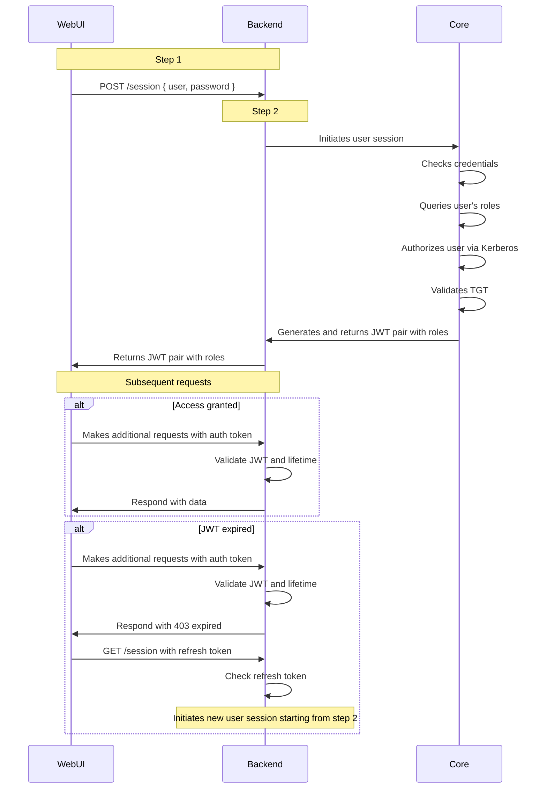
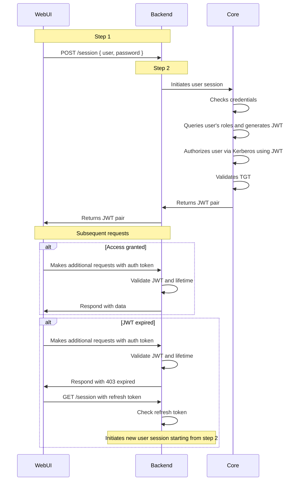

status: in-progress
decision-makers: @vifley, @d.rodionov, @funbringer, @kostja
consulted: @d.rodionov, @funbringer, @kostja

--------------------------------

# Authorization and authentication in WebUI

This document aims to describe a working mechanism of authorization and authentication in WebUI and the decisions that led to it.\
Following up on [the RFC](https://disk.360.yandex.ru/edit/d/HM2DDuJ_J2pGGOX3q8GxlSPegnqahzm72s0qoIz-cKg6NlgtQllKRXpWZw) by the same name.\
Any detailed info/context missing or not directly addressed in the current document should be treated as borrowed from this RFC by proxy.

## Context and Problem Statement

WebUI lacks a system to enforce [access control limits](https://docs.picodata.io/picodata/stable/admin/access_control/) with regards to user interactions, because historically it didn't have a need to.

Now, this lack restricts further evolution, development of new features, and satisfying customers' requests:
- [441](https://git.picodata.io/core/picodata/-/issues/441)
- [1418](https://git.picodata.io/core/picodata/-/issues/1418)
- [1790](https://git.picodata.io/core/picodata/-/issues/1790)
- [1792](https://git.picodata.io/core/picodata/-/issues/1792)

And since proper authorization requires authentication, we need both.

## Considered Options for authentication

Implement JWT as the sole stateless session identifier, leveraging the existing [access control](https://docs.picodata.io/picodata/stable/admin/access_control/) for authorization.

### Proposed JWT schema

Proposed Auth JWT contents:
- Header: `{ "alg": "HS256", "typ": "JWT" }`
- Payload: `{ "user": "id", "exp": "2025-09-05T23:45:15Z" }` (Date in the [ISO 8601 format](https://www.iso.org/iso-8601-date-and-time-format.html))

It's also possible to embed user's role and permissions straight into the JWT to avoid re-fetching them from the server,
but this introduces the possiblity of having outdated permission information until a session is refreshed.
It is up for discussion if this trade-off is reasonable in our context.

For a more detailed look at the schema, see [the document on JWT authentication](./2025-09-22-webui-auth-jwt.md).

### Proposal 1: Simple JWT auth

#### Proposal 1.1: Short live sessions **\[rejected\]**

Originally proposed in the aforementioned RFC:
- User session (token) expires in 30-60 minutes;
- It's the responsibility of the WebUI client/server to detect the expiration before it occurs and re-login the user.

**Rejection Reason**:\
WebUI is not running constantly in the foreground to accomplish this realiably, which would lead to users being regularly logged out and forced to log-in again.\
This is a terrifyingly annoying behaviour for a UI to have.

It *is* possible to bypass this problem,
by storing plain user credentials in the [browser's credential store](https://developer.mozilla.org/en-US/docs/Web/API/CredentialsContainer/store),
but it was decided that the drawbacks outweigh the benefits.

#### Proposal 1.2: Auth Token + Infinite Refresh token

Introduce 2 JWTs in the auth response:
- Authentication JWT - *valid for 30-60 minutes*, stored in a cookie
- Refresh JWT - *valid forever*, stored in the [browser's credential store](https://developer.mozilla.org/en-US/docs/Web/API/CredentialsContainer/store).

**Pros**:
- Simple;
- Stateless;
- Efficient.

**Cons**:
- Security is not ideal, because the refresh token could still be compromised.

#### Proposal 1.3: Auth Token + Invalidating Refresh Token

Same as 1.2, Introduce 2 JWTs in the auth response:
- Authentication JWT - *valid for 30-60 minutes*, stored in a cookie
- Refresh JWT - *valid until used*

This way, once the Refresh Token is used to retrieve a new Auth Token, it is invalidated and cannot be used again.\
The server provides a new Refresh Token along with the new Auth Token, so that the cycle can continue forever.

If the user is detected to have multiple sessions, all but the most recent one is terminated.

**Pros**:
- Simple;
- Efficient;
- More secure than 1.2.

**Cons**:
- Stateful, requires keeping track of sessions.

### Proposal 2: [Kerberos](https://web.mit.edu/kerberos/) auth

There's a need to implement with the Kerberos protocol, which ensures certain compliances with third parties.

Since it looks like we may have to implement it anyway at some point in the future,
it then seems reasonable to propose implementing it from the get-go.

This protocol requires authenticating the user via short-lived TGT (ticket-granting ticket), which immidiately puts it at odds with the same drawback of [Proposal 1.1](#proposal-11-short-live-sessions-rejected):\
Kerberos doesn't natively support refresh tokens - it relies on ticket lifetimes (TGTs and service tickets) that expire after a fixed duration. If a user's session needs to stay active, they must re-authenticate to get new tickets in order to keep the session authentic.

This drawback can be bypassed in the following ways:
1. Extend Ticket Lifetimes:
  - Configure Kerberos to issue longer-lived tickets (e.g., 24h or more).
  - Use ticket renewal (if supported by KDC) to keep the ticket alive without re-authenticating.
2. Client-Side Credential Caching:
  - Store the Kerberos ticket securely in the [browser's credential store](https://developer.mozilla.org/en-US/docs/Web/API/CredentialsContainer/store).
  - When the ticket nears expiration, automatically trigger a silent renewal using stored credentials (no user prompt).
3. Kerberos Delegation (if applicable):
  - For server-to-server communication, use constrained delegation to avoid re-authenticating for each service.

Why it works:
- Kerberos remains the only authority (no refresh tokens).
- Users don't see prompts unless the ticket is truly expired or the system can't renew silently.

[Example Flow](https://www.websequencediagrams.com/?lz=ICBOb3RlIG92ZXIgV2ViVUksIEJhY2tlbmQ6IFN0ZXAgMQogABMGLT4-ABEJUE9TVCAvc2Vzc2lvbiB7IHVzZXIsIHBhc3N3b3JkIH0KAEsMAEIOMgogAFoILT4-Q29yZTogSW5pdGlhdGVzAEQFIABRBwogIENvcmUAHQlDaGVja3MgY3JlZGVudGlhbHMAEhBRdWVyaQA_BydzIHJvbGUAExFBdXRob3JpegBlCHZpYSBLZXJiZXJvAD8RVmFsaWQAgRMFVEdUAIEFCgCCGAlHZW5lcgCBMwVhbmQgcmV0dXJucyBKV1QgcGFpciB3aXRoAHwJAIFqCgCCYgU6IFIAEh0AgnsbdWJzZXF1ZW50IHJlcXVlc3RzCiAgYWx0IEFjY2VzcyBncmFudGVkAIMkFE1ha2VzIGFkZGl0aW9uYWwAOQkAgSYGYXV0aCB0b2tlbgCDGA0AhAgJAIIICACBXgVhbmQgbGlmZXRpbWUAgUoWc3BvbmQAggAGZGF0YQogIGVuZACBJQdKV1QgZXhwaXIAGoEPNDAzAHwcR0UAhW0LAINaBmVmcmVzAIIaHQCFNAUAGBEAhg4TAIV-Cm5ldwCFfw0gc3RhcnRpbmcgZnJvbSBzAIZCCGVuZA&s=default):



**Architecture Overview:**

1. Authentication Layer (Kerberos)
  - Initial Auth: User authenticates via Kerberos (e.g., SPNEGO over HTTP). The KDC issues a ticket-granting ticket (TGT) and service tickets.
  - Server Validation: The service server validates the Kerberos ticket using the KDC's public key or shared secret. Extracts user identity (principal), roles, and other attributes.

2. Token Issuance (JWT)
  - JWT Creation: Server generates a JWT containing claims from the Kerberos principal (e.g., sub = username, roles, exp = expiration time).
  - Signing: JWT is signed with a shared secret key (or private key for RS256) to ensure integrity and prevent tampering.
  - Storage: JWT is sent to the client (e.g., in `Authorization: Bearer <token>` header or cookie).

3. Service Layer (JWT Validation)
  - Token Parsing: Services extract the JWT from headers/cookies.
  - Signature Verification: Use the public key (if RS256) or shared secret (if HS256) to verify the JWT's signature.
  - Claim Inspection: Check claims like exp, nbf, and custom roles for authorization. No Kerberos check required here.

4. Security Layer
  - Kerberos Scope: Only used for initial authentication; never stored in JWT (avoids exposing KDC internals).
  - JWT Scope: Stateless session management; no server-side storage (except short-term cache for revocation, if needed).

**Pros**:
- Fully secure and Kerberos-compliant;
- We can still use JWTs from [Proposal 1](#proposal-1-simple-jwt-auth) to store and trasfer authorization information for access-control;
  The JWT simply needs to match the TGT's expiration time.

**Cons**:
- Silent renewal requires OS-level integration.
- If the user logs out or the machine reboots, they'll still need to re-authenticate.

### Proposal 3: False Hybrid

We implement [Proposal 2](#proposal-2-kerberos-auth),
but also intrduce refresh tokens from [Proposal 1.2](#proposal-12-auth-token--infinite-refresh-token)
or [1.3](#proposal-13-auth-token--invalidating-refresh-token).

**Pros**:
- Simpler to pull off than workarounds for session prolongation from [Proposal 2](#proposal-2-kerberos-auth).
- Session can be kept between client reboots.

**Cons**:
- Kerberos' security relies on ticket expiration and re-authentication - if we skip that, we're trusting the refresh token system to handle auth.

### Proposal 4: True Hybrid

We implement [Proposal 1.3](#proposal-13-auth-token--invalidating-refresh-token), then implement [Proposal 2](#proposal-2-kerberos-auth),
but instead of authenticating directly in Kerberos, use the JWT pair (auth + refresh) as Kerberos authentication credentials.
This way, we completely skip the workarounds of keeping Kerberos sessions alive, while it maintains monopoly on authenticating users.

[Approximate sequence example](https://www.websequencediagrams.com/?lz=Tm90ZSBvdmVyIFdlYlVJLCBCYWNrZW5kOiBTdGVwIDEKIAATBi0-PgARCVBPU1QgL3Nlc3Npb24geyB1c2VyLCBwYXNzd29yZCB9CiAgAE0KAEIOMgogAFoILT4-Q29yZTogSW5pdGlhdGVzAEQFIABRBwogIENvcmUAHQlDaGVja3MgY3JlZGVudGlhbHMAEhBRdWVyaQA_BydzIHJvbGVzIGFuZCBnZW5lcgBcBUpXVABIEEF1dGhvcml6AHcIdmlhIEtlcmJlcm9zIHVzaW5nACIUVmFsaWQAgS8FVEcASAsAgjQJUmV0dXJuAGwFIHBhaXIAgWoNAIJlBQAPFQCCcxt1YnNlcXVlbnQgcmVxdWVzdHMKCiAgYWx0IEFjY2VzcyBncmFudGVkAIMdFE1ha2VzIGFkZGl0aW9uYWwAOgkgd2l0aCBhdXRoIHRva2VuAIMRDQCEAQkAgWUIAIFJBWFuZCBsaWZldGltZQCBQBZzcG9uZABUBmRhdGEKICBlbmQAgSUHSldUIGV4cGlyABqBDzQwMwB8HEdFAIVmCwCCLwVyZWZyZXMAghodAIUtBQAYEQCGBxMAhXcKbmV3AIV4DSBzdGFydGluZyBmcm9tIHMAhjsIZW5k&s=default):



**Pros**:
- Allows to easily implement Propsals 1 & 2 sequentially, they don't become mutually exclusive, therefore we retain all pros.

**Cons**:
- It may be argued that it's a bit less secure than pure Kerberos. But again, pure Kerberos requries re-authenticating every time, which is undesirable.

### Decision Outcome

There is an uncertainty regarding which proposal to pick.\
It may be beneficial to pick Kerberos from the start in order to not waste time on building a simple system that will eventually be scrapped anyway.
However, introducing simple JWT auth can be done in a way as to leave room for later complexity,
with [Proposal 1](#proposal-1-simple-jwt-auth) "paving a way" for [Proposal 2](#proposal-2-kerberos-auth), without them becoming mutually exclusive.

In this way, [Proposal 4](#proposal-4-true-hybrid) looks to be:
- the most complete;
- easy to implement;
- iterative;
- forward-facing.

## Considered Options for authorization

### Proposal 1: Simple Error Schema

Implement a consistent schema for error responses (e.g. a 403 HTTP code with a body detailing the error),
to requests the user is not authorized for.

Proposed error schema for the response body:
```json
{
  "errorCode": "technical-code-for-ui-localization",
  // can be used to freely localize the error on the client

  "reason": ""
  // developer-friendly reason for logs
}
```

When a user does something that they are not authorized for, show an explanation popup instead of completing the action.

**Pros**:
- Easy to implement on the client side;
- Upcoming roles and features do not require much consideration.

**Cons**:
- Not very user-friendly.

### Proposal 2: Client-side RBAC

Given that [access control](https://docs.picodata.io/picodata/stable/admin/access_control/) already exists as a feature,
it is only natural to utilize it on the client side to anticipate unauthorized user actions and change the UI accordingly.

For example, if a user is not authorzied to perform "request A", disable the button that performes "request A" proactively,
instead of making the user wait for the request to result in an error.

#### Server-side

This needs following requests being added:
- Information about currently logged-in user (e.g. `GET /user`).\
  The response should contain at least the user's Roles `string[]`.
- A map of roles to privileges (e.g. `GET /roles`), describing which role gets which privileges.\
  WebUI will then be able to cache the roles-privileges map
  and use it to authorize the user to access certain features,
  based on a predetermined rule-set. Cache duration should be determined by the corresponding response header.

The list of roles and privileges should remain identical to [existing ones](https://docs.picodata.io/picodata/stable/admin/access_control/#privileges).

The following privileges are required to access the WebUI in the first place:
- `LOGIN`

> TBD: do guests get to access the "nodes" or "instances" page?

#### Client-side

Given that users can create their own roles and privileges,
it is only natural that [WebUI in plugins](https://git.picodata.io/core/picodata/-/issues/1790)
should be able to expand upon this system.

Henceforth, implement an RBAC library as a base, that will be used both by WebUI and (in the future) plugins.\
This library should provide the necessary API to transparently access current user's role and privileges information
without the need to make additional requests or store state.

**Pros**:
- Scalable: it will be easy to add new roles and features;
- User-friendly: users will not have to waste time clicking buttons they aren't authorized to click.

**Cons**:
- Time-consuming implementation;
- Upcoming roles and features require some effort to be properly integrated with role-based-access for users.

### Decision Outcome

It is strongly recommended to implement both proposals in sequence,
as it allows to reap all benefits non-exclusively.
Gradually start from the lowest-hanging fruit, and then evolve the implementation to allow for smooth user experience.

This, however, requires some strategy and planning-ahead in the resulting implementation.

## Deliverables

In general (whichever authentication proposal gets accepted), the following must be implemented:
- WebUI client implements:
  - a simple login form (username + password);
  - a system to restrict user actions or displayed information based on user roles or permissions.
- WebUI back-end server implements:
  - a `POST /session` request that returns a JWT (with an optional refresh JWT, depending on the proposal);
  - a `GET /session` request that refreshes the user's session, invalidating the previous one (details depend on the proposal);
  - a `DELETE /session` request that voids the user's session, invalidating both the auth and the refresh tokens associated with the session;
  - an [error schema](#proposal-1-simple-error-schema) for any unauthorized requests;
  - a `GET /user` request with general information about currently logged-in user, including the user's roles;
  - a `GET /roles` request with a map of roles to privileges.
- Core implements an API for the WebUI backend:
  - to create and refresh JWTs;
  - to check if current user session (JWT) is authorized to access specific functions.

Anything Kerberos- or session- related is relegated to Core, with the WebUI back-end being a "transparent" proxy.

## Final Decision

TBD.
