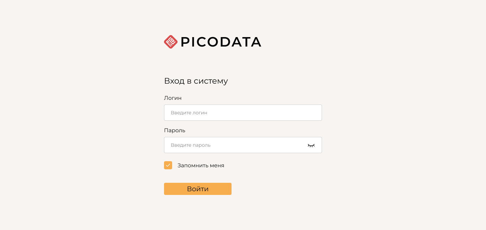

status: in-progress
decision-makers: @vifley, @d.rodionov, @funbringer, @kostja
consulted: @d.rodionov, @funbringer, @kostja

--------------------------------

# Authentication in WebUI: JWT API

This document aims to describe a schema/contract for client-server sessions via JWT and steps needed to implement authentication in WebUI to make it complaint with InfoSec standarts in our customers.
The document is a follow up on [a more general ADR about WebUI auth](./2025-09-04-webui-auth.md), and assumes implementation outcomes of either [Authentication Proposal 4](./2025-09-04-webui-auth.md#proposal-4-true-hybrid) or [Authentication Proposal 1.2](./2025-09-04-webui-auth.md#proposal-12-auth-token--infinite-refresh-token).

# Desired outcome
1. WebUI is behind authentication.
2. WebUI authentication is based on existing DB users.
3. Everybody with `LOGIN` grant are able to view UI.
4. Users do not have to relogin too often.
5. Authentication system naturally supports all of Picodata's auth types (including those unimplemented yet such as Kerberos).

# Proposed solution:
Implement a JWT system to support authentication.\
This allows us to incapsulate the process of credential validation from the frontend.

## JWT schema
In the implementation, assume a JWT consists of 3 parts:
1. `Header` - base64 encoded JSON;
2. `Claims` - base64 encoded JSON;
3. `Signature` - signature to validate that the JWT is issued by Picodata.

`Header` contains token's metadata,\
`Claims` contains token payload (username and expiration date),\
`Signature` is, simply, an xSHA256 hash. In the example the secret for signature is "secret".
Concatenating these parts via period (`.`) characters between the parts yields a complete JWT.

### JWT schema
Expanding on the [JWT schema defined in a presceding document](./2025-09-04-webui-auth.md#proposed-jwt-schema),
define the JWT contents as follows:

#### Header
This part is generated and encoded into the base64 format.

```json
{
    "typ":"JWT",
    "alg":"HS256"
}
```

- `typ` - constant value as a sanity check;
- `alg` - in case we start supporting different algirthms in the future.

#### Claims
This part is generated and encoded into the base64 format.

```json
{
    "sub": "user-name",
    "exp": 1300819380,
    "typ": "type",
}
```

- `sub` - user name that follows the established [SQL-object naming format](https://docs.picodata.io/picodata/stable/reference/sql/object/) for usernames, as per existing mechanisms.
- `exp` - expiration DateTime for the JWT, in the UNIX timestamp format, as per [JWT RFC](https://datatracker.ietf.org/doc/html/rfc7519#section-4.1.4).
- `type` - either `auth` or `refresh`.

#### Signature

The actual secret, that ensures the session's integrity and authenticity.
Example format:
```
dBjftJeZ4CVP-mB92K27uhbUJU1p1r_wW1gFWFOEjXk
```

#### Final Token

Finally, each part is concatenated by `.`.

Example output token:
```
eyJ0eXAiOiJKV1QiLCJhbGciOiJIUzI1NiJ9.eyJ1c2VyIjoidXNlci1uYW1lIiwiZXhwIjoiMjAyNS0wOS0wNVQyMzo0NToxNVoiLCJ0eXAiOiJ0eXBlIiwicm9sZXMiOlsiTE9HSU4iXX0=.dBjftJeZ4CVP-mB92K27uhbUJU1p1r_wW1gFWFOEjXk
```


## Step-by-step authentication process diagram


> To render manually, see [the editor](https://www.websequencediagrams.com/?lz=Tm90ZSBvdmVyIFdlYlVJLCBCYWNrZW5kOiBTdGVwIDEKABIFLT4-AA8JUE9TVCAvc2Vzc2lvbiB7IHVzZXIsIHBhc3N3b3JkIH0KAEkKAD4OMgoAVQctPj5Db3JlOiBJbml0aWF0ZXMAQAUgAE0HCkNvcmUAZgxSZXR1cm5zIEpXVCBwYWlyAD0LAIEwBQAPEwB6CwCBRxF1YnNlcXVlbnQgcmVxdWVzdHMKCmFsdCBBY2Nlc3MgZ3JhbnRlZACBZxJNYWtlcyBhZGRpdGlvbmFsADYJIHdpdGggYXV0aCB0b2tlbgCBXQsAgkUJVmFsaWRhdGUAgUAFbGlmZXRpbWUAgTUUc3BvbmQATAZkYXRhCmVuZACBGAd1dGggZXhwaXIAGIEFNDAzAHQaR0UAhBgLAIIZBXJlZnJlcwCCBhtDaGVjawAYDwCENxMAhCkKbmV3AIQqDSBmcm9tIHMAhGQGZW5k&s=default).


## Technical details of token types

### Auth token

#### Auth claims:

```
    "sub": <username>
    "exp": <expiration time. Auth is issued for 24h>
    "typ": "auth"
```

`auth` is the token used for actual authentication.\
It is to be included in every HTTP request (except GET /session and POST /session) as a header:
```
Authorization: Bearer <auth JWT>
```

Upon receiving any HTTP request we shall validate the JWT and check user's grants.\
Current document does not care about any authorization system, which means that every user with the `LOGIN` grant will be able to use WebUI.

If the JWT is valid we proceed as usual.\
If the JWT is not valid or expired, we return `401` error with debug log:
```
HTTP 401
Response
{
    "error": "sessionExpired",
    "errorMessage": "dev friendly log"
}
```

`error` is used to match errors on client side and error message is used to provide developer friendly debug log.
Upon receiving `error` that suggests auth token expiration, WebUI should request new auth token using a long-living refresh token.

### Refresh token

#### Refresh claims:
```
    "sub": <username>
    "exp": <expiration time. Refresh is issued for 365d>
    "typ": "refresh"
```

`refresh` is the token used to re-initiate a user's session.\
It is supposed to be included only in the `GET /session` request as a header:
```
Authorization: Bearer <refresh JWT>
```

Upon receiving this token via the `GET /session` request,
we shall validate the JWT.\


If the JWT is valid we initiate a new user session, as if the user requested a login with full credentials via the `POST /session` request.\
If the JWT is not valid or expired, we return `401` error with debug log:
```
HTTP 401
Response
{
    "error": "sessionExpired",
    "errorMessage": "dev friendly log"
}
```

### JWT secret

JWT secrets shall be stored as a property in `_pico_db_config` table as `jwt_secret` property.
It will allow us to distribute them across all the nodes, as it is a global table. Also using Picodata as storage shall allow us to preserve the token on instance restart.

The tokens shall be generated randomly (16 random characters) by the authentication middleware if the property is empty.
Token is always generated automatically and no config or CLI parameters are provided to setup it in any way. The only manual actions possible are to change it via SQL.


## Deliverables

### Required endpoints

Assume that all endpoints listed below have a base of `/api/v1`, as per other existing endpoints.

The following API endpoints are required for the process to work:

- `POST /session` - logs user into the system; the **POST** method ensures that credentials are enrypted in case the user logs in via SSL.
    - Body JSON fields:
        - `username`: string
        - `password`: string
    - Response 200 JSON fields:
        - `auth`: string - contains the `auth` JWT;
        - `refresh`: string - contains the `refresh` JWT.
    - Response 401 JSON fields:
        - `error`: `wrongCredentials` error description token, as per the [error type list](#error-types).
        - `errorMessage`: error message with any technical details that have no need to be relayed to the end user; mainly for debugging purposes.

- `GET /session` - requests a new `auth` token via the `refresh` token.
    - Headers:
        - `Authorization: "Bearer <refresh-token>"`, where `<refresh-token>` is replaced with the actual user `refresh` JWT.
    - Response 200 JSON fields:
        - `auth`: string - contains the new `auth` JWT;
        - `refresh`: string - contains the new `refresh` JWT.
    - Response 401 JSON fields:
        - `error`: error description token, as per the [error type](#error-types).
        - `errorMessage`: error message with any technical details that have no need to be relayed to the end user; mainly for debugging purposes.

- `DELETE /session` - requests to log the user out and terminate the session.
    - Headers:
        - `Authorization: "Bearer <auth-token>"`, where `<auth-token>` is replaced with the actual user `auth` JWT.
    - Response 401 JSON fields:
        - `error`: error description token, as per the [error type](#error-types).
        - `errorMessage`: error message with any technical details that have no need to be relayed to the end user; mainly for debugging purposes.

### Error types

All errors are to be sent as description tokens.\
This is required for WebUI to properly localize the error message for different languages.

Required error types:
- `wrongCredentials` - the user has submitted a wrong token or login credentials, the request cannot be fulfilled;
- `sessionExpired` - user's token has expired, and they need to be redirected back to the login form.

Any additional situational error types should follow the same `camelCase` format.

### Authentication middleware
Implement a middleware for our HTTP handlers, which validates JWT and enriches handlers' context with the user's name and role.
Authorization is out of scope of this ADR.

### UI Token middleware
Enrich all requests with an auth token and incapsulate the session validation process from the user.

### UI Login form
A simple login form (username + password):


### UI 401 form
Beautiful "access denied" window:

