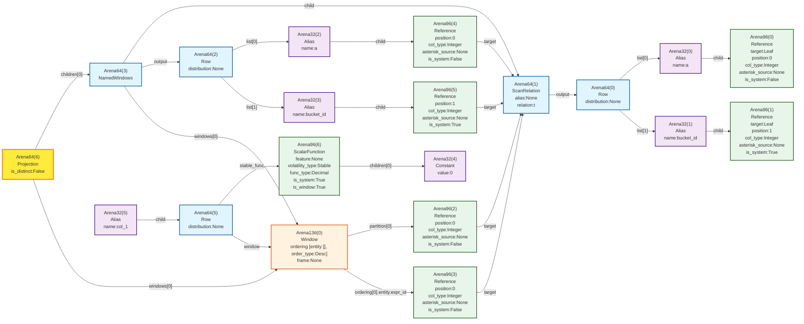
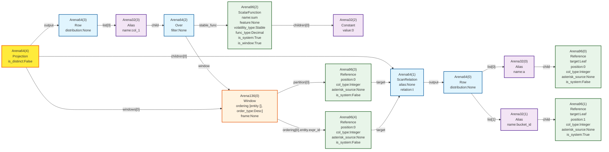
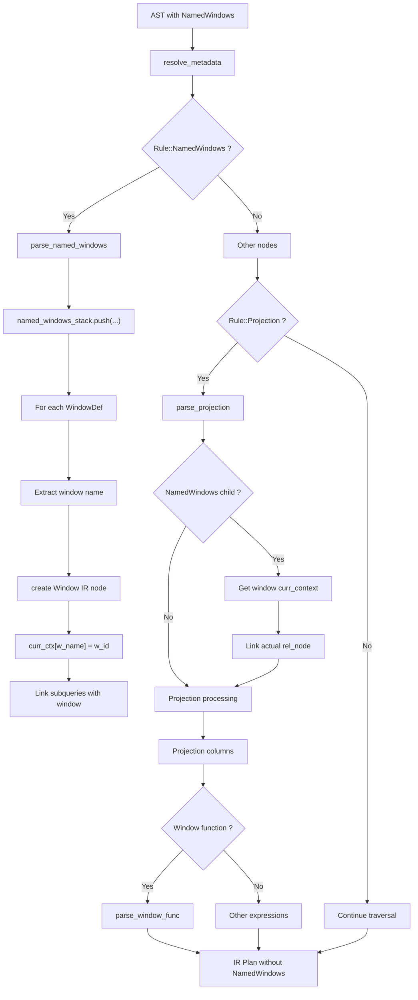

# AST-to-IR Plan: NamedWindows transformation

## Введение

В данном документе рассматривается проблема узла `NamedWindows`
в *AST* и в *IR Plan* для СУБД Picodata.

**Содержание:**

- [Текущая реализация](#текущая-реализация)
- [Мотивация](#мотивация)
- [Решение](#решение)
- [Ссылки и источники](#ссылки-и-источники)

## Текущая реализация

В данный момент (`sha: 4cb3b3bd`) *IR Plan* в СУБД Picodata содержит реляционный
узел `Relational::NamedWindows`.

Например, для запроса:

```sql
select sum(0) over w from t window w as (PARTITION BY a ORDER BY a DESC);
```

имеем такой *IR Plan* до оптимизаций (оптимизации не меняют суть):



## Мотивация

### Проблема

Узел `NamedWindows` не соответствует ни одной операции в реляционной алгебре. Следовательно, в *IR Plan* его быть не должно.

### Задача

1. На этапе превращения *AST* в *IR Plan* в `over <window_identifier>` подставить тело соответствующего `named_window_def`.
2. Убрать *NamedWindows* из *IR Plan*.

Цель — преобразовывать запрос:

```sql
select sum(0) over w from t window w as (PARTITION BY a ORDER BY a DESC);
```

в следующий вид:



## Решение

Задачу можно решать изменением:

- `AbstractSyntaxTree::fill` — создания *AST*
- `AbstractSyntaxTree::resolve_metadata` — превращения *AST* в *IR Plan*

Предлагается решение в `AbstractSyntaxTree::resolve_metadata`, так как изменение построения *AST* не интуитивно, синтаксическое дерево запроса должно остаться тем же.

### Алгоритм

Преобразование именованных окон выполняется в методе `AbstractSyntaxTree::resolve_metadata` во время обхода AST в post-order. Алгоритм состоит из следующих этапов:

#### 1. Инициализация структур данных

В `ExpressionsWorker` инициализируются следующие структуры для работы с именованными окнами:

- `inside_window_body: bool` — флаг того что мы находимся внутри стека обработки тела окна, нужен для корректной обработки подзапросов
- `curr_windows: Vec<NodeId>` — все окна в контексте актуальной проекции
- `named_windows_stack: Vec<HashMap<SmolStr, NodeId>>` — стек именованных окон для обработки вложенных контекстов
- `curr_named_windows: HashMap<SmolStr, NodeId>` — именованные окна в текущем контексте проекции
- `named_windows_sqs: HashMap<NodeId, NodeId>` — сопоставление подзапросов и окон
- `curr_window_sqs: Vec<NodeId>` — подзапросы в текущем окне

#### 2. Обработка узла `NamedWindows`

При встрече узла `Rule::NamedWindows` в post-order обходе вызывается `parse_named_windows`:

1. **Извлекается структура узла**: первый дочерний элемент — реляционный узел, остальные — определения окон (`WindowDef`)
2. **Создается новый уровень стека**: `named_windows_stack.push(HashMap::new())`
3. **Обрабатываются все определения окон**:
   - Для каждого `WindowDef` извлекается имя окна и тело окна (`WindowBody`)
   - Устанавливается флаг `worker.inside_window_body = true`
   - Вызывается `parse_window_body()` для создания IR-узла `Window`
   - Созданный `window_id` добавляется в `named_windows_stack.last_mut().insert(window_name, window_id)`
   - Обрабатываются подзапросы внутри окна через `named_windows_sqs`

#### 3. Использование именованных окон в проекции

При обработке узла `Rule::Projection` в `parse_projection`:

1. **Проверяется наличие `NamedWindows`**: если первый дочерний элемент — `Rule::NamedWindows`
2. **Подмена контекста**: получаем актуальный контекст именованных окон
3. **Исключение узла из плана**: `rel_child_id` перенаправляется на реальный реляционный узел, минуя `NamedWindows`

#### 4. Резолюция ссылок на окна

При парсинге оконных функций в `parse_window_func`:

1. **Обработка именованных ссылок**: если встречается `Rule::Identifier` вместо `Rule::WindowBody`
2. **Поиск в контексте**: на вершине стека

#### 5. Очистка контекста

После завершения обработки проекции удаляем текущие окна.

#### 6. Результат трансформации

В результате:
- Узел `NamedWindows` не попадает в итоговый IR Plan
- Ссылки `over window_name` заменяются прямыми ссылками на соответствующие узлы `Window`

#### 7. Обработка подзапросов внутри WindowBody

Особый случай представляют подзапросы внутри определений окон:

1. **Отслеживание подзапросов**: во время парсинга `WindowBody` все встреченные подзапросы добавляются в `worker.curr_window_sqs`
2. **Связывание с окном**: после создания узла `Window` все подзапросы из `curr_window_sqs` связываются с окном через `named_windows_sqs.insert(sq_id, window_id)`
3. **Очистка контекста**: `curr_window_sqs.clear()` после обработки каждого определения окна

Это обеспечивает корректную обработку вложенных подзапросов с собственными именованными окнами.

#### 8. Схема алгоритма



Пример:

```sql
select 1 from t window w as (partition by (select 1 from t window w as ()));
```



```mermaid
graph LR
	A64_10["Arena64(10)<br>Projection<br>is_distinct:False"]

	%% Arena64 nodes
	A64_0["Arena64(0)<br>Row<br>distribution:None"]
	A64_1["Arena64(1)<br>ScanRelation<br>alias:None<br>relation:t"]
	A64_2["Arena64(2)<br>Row<br>distribution:None"]
	A64_3["Arena64(3)<br>ScanRelation<br>alias:None<br>relation:t"]
	A64_4["Arena64(4)<br>Row<br>distribution:None"]
	A64_5["Arena64(5)<br>Projection<br>is_distinct:False"]
	A64_6["Arena64(6)<br>Row<br>distribution:None"]
	A64_7["Arena64(7)<br>ScanSubQuery<br>alias:None"]
	A64_8["Arena64(8)<br>Row<br>distribution:None"]
	A64_9["Arena64(9)<br>Row<br>distribution:None"]

	%% Arena32 nodes
	A32_0["Arena32(0)<br>Alias<br>name:a"]
	A32_1["Arena32(1)<br>Alias<br>name:bucket_id"]
	A32_2["Arena32(2)<br>Alias<br>name:a"]
	A32_3["Arena32(3)<br>Alias<br>name:bucket_id"]
	A32_4["Arena32(4)<br>Constant<br>value:1"]
	A32_5["Arena32(5)<br>Alias<br>name:col_1"]
	A32_6["Arena32(6)<br>Alias<br>name:col_1"]
	A32_7["Arena32(7)<br>Constant<br>value:1"]
	A32_8["Arena32(8)<br>Alias<br>name:col_1"]

	%% Arena96 nodes
	A96_0["Arena96(0)<br>Reference<br>target:Leaf<br>position:0<br>col_type:Integer<br>asterisk_source:None<br>is_system:False"]
	A96_1["Arena96(1)<br>Reference<br>target:Leaf<br>position:1<br>col_type:Integer<br>asterisk_source:None<br>is_system:True"]
	A96_2["Arena96(2)<br>Reference<br>target:Leaf<br>position:0<br>col_type:Integer<br>asterisk_source:None<br>is_system:False"]
	A96_3["Arena96(3)<br>Reference<br>target:Leaf<br>position:1<br>col_type:Integer<br>asterisk_source:None<br>is_system:True"]
	A96_4["Arena96(4)<br>Reference<br>position:0<br>col_type:Integer<br>asterisk_source:None<br>is_system:False"]
	A96_5["Arena96(5)<br>Reference<br>position:0<br>col_type:Integer<br>asterisk_source:None<br>is_system:False"]

	%% Arena136 nodes
	A136_0["Arena136(0)<br>Window<br>partition:None<br>ordering:None<br>frame:None"]
	A136_1["Arena136(1)<br>Window<br>ordering:None<br>frame:None"]

	classDef arena32 fill:#f3e5f5,stroke:#4a148c,stroke-width:2px
	classDef arena64 fill:#e1f5fe,stroke:#01579b,stroke-width:2px
	classDef arena96 fill:#e8f5e9,stroke:#1b5e20,stroke-width:2px
	classDef arena136 fill:#fff3e0,stroke:#e65100,stroke-width:2px
	classDef arena232 fill:#fce4ec,stroke:#880e4f,stroke-width:2px
	classDef topNode fill:#ffeb3b,stroke:#f57f17,stroke-width:3px
	class A64_10 topNode
	%% Arena32 styles
	class A32_0,A32_1,A32_2,A32_3,A32_4,A32_5,A32_6,A32_7,A32_8 arena32
	%% Arena64 styles
	class A64_0,A64_1,A64_2,A64_3,A64_4,A64_5,A64_6,A64_7,A64_8,A64_9 arena64
	%% Arena96 styles
	class A96_0,A96_1,A96_2,A96_3,A96_4,A96_5 arena96
	%% Arena136 styles
	class A136_0,A136_1 arena136
	%% Arena32 references
	A32_0 -->|"child"| A96_0
	A32_1 -->|"child"| A96_1
	A32_2 -->|"child"| A96_2
	A32_3 -->|"child"| A96_3
	A32_5 -->|"child"| A32_4
	A32_6 -->|"child"| A96_4
	A32_8 -->|"child"| A32_7

	%% Arena64 references
	A64_0 -->|"list[0]"| A32_0
	A64_0 -->|"list[1]"| A32_1
	A64_1 -->|"output"| A64_0
	A64_2 -->|"list[0]"| A32_2
	A64_2 -->|"list[1]"| A32_3
	A64_3 -->|"output"| A64_2
	A64_4 -->|"list[0]"| A32_5
	A64_5 -->|"children[0]"| A64_3
	A64_5 -->|"output"| A64_4
	A64_6 -->|"list[0]"| A32_6
	A64_7 -->|"child"| A64_5
	A64_7 -->|"output"| A64_6
	A64_8 -->|"list[0]"| A96_5
	A64_9 -->|"list[0]"| A32_8
	A64_10 -->|"children[0]"| A64_1
	A64_10 -->|"children[1]"| A64_7
	A64_10 -->|"output"| A64_9

	%% Arena96 references
	A96_4 -->|"target"| A64_5
	A96_5 -->|"target"| A64_7

	%% Arena136 references
	A136_1 -->|"partition[0]"| A64_8
```

## Ссылки и источники

1. Celko, J. (2005). SQL for Smarties: Advanced SQL Programming. Morgan Kaufmann.
2. Graefe, G. (1993). Query Evaluation Techniques for Large Databases. ACM Computing Surveys.
3. [Apache Calcite](https://calcite.apache.org/docs/):
   - [RelNode](https://calcite.apache.org/javadocAggregate/org/apache/calcite/rel/RelNode.html)
   - [LogicalWindow](https://calcite.apache.org/javadocAggregate/org/apache/calcite/rel/logical/LogicalWindow.html)
   - [RexWindow](https://calcite.apache.org/javadocAggregate/org/apache/calcite/rex/RexWindow.html)