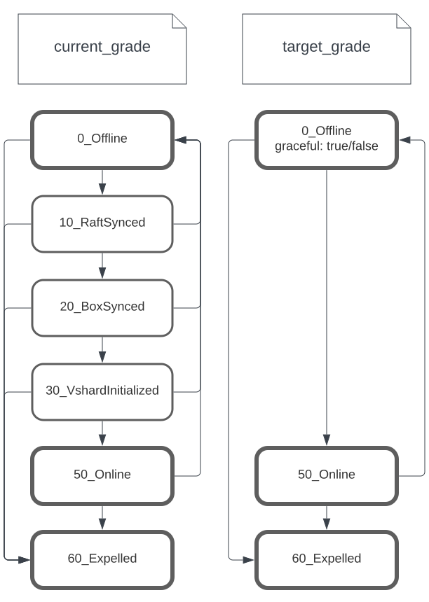

#  Жизненный цикл кластера
Данный раздел содержит описание архитектуры Picodata, в том числе
высокоуровневый процесс инициализации кластера на основе нескольких
отдельно запущенных экземпляров Picodata (инстансов).

Администратор запускает несколько инстансов, передавая в качестве
аргументов необходимые параметры:

```sh
picodata run --instance-id i1 --listen i1 --peer i1,i2,i3
picodata run --instance-id i2 --listen i2 --peer i1,i2,i3
picodata run --instance-id i3 --listen i3 --peer i1,i2,i3
# ...
picodata run --instance-id iN --listen iN --peer i1
```

Независимо от количества запускаемых инстансов, в опции `--peer` у
каждого из них следует указать один и тот же набор из нескольких
инстансов — одного обычно достаточно, но для подстраховки можно взять
три. Именно на их основе будет произведена инициализация кластера и
поиск всех работающих инстансов для их включения в состав кластера
(discovery).

Подробности алгоритма discovery приведены в отдельном
[документе](discovery.md).
В контексте сборки кластера важно лишь понимать, что этот алгоритм
позволяет не более чем одному инстансу (peer'у) создать raft-группу,
т.е. стать инстансом с `raft_id=1`. Если таких инстансов будет несколько,
то и raft-групп, а следовательно и кластеров Picodata получится
несколько.

Топологией raft-группы управляет алгоритм Raft, реализованный в виде крейта
[raft-rs](https://doc.rust-lang.org/rust-by-example/crates.html){:target="_blank"}.

## Этапы инициализации кластера {: #cluster-bootstrap-stages }
На схеме ниже показаны этапы жизненного цикла инстанса в контексте его
присоединения к кластеру Picodata.


В контексте операционных систем каждый инстанс соответствует группе из
двух процессов — родительского (supervisor) и дочернего (именно он
выполняет tarantool runtime).

Красным показан родительский процесс, который запущен на всем протяжении
жизненного цикла инстанса. Вся логика, начиная с присоединения к
кластеру, и заканчивая обслуживанием клиентских запросов, происходит в
дочернем процессе (голубой цвет). Единственное предназначение
родительского процесса — иметь возможность сбросить состояние дочернего
(выполнить rebootstrap) и инициализировать его повторно (сиреневый
цвет).

Данная схема наиболее полно отражает логику кода в файле `main.rs`. Ниже
описаны детали выполнения каждого этапа и соответствующей программной
функции.

### fn main()

На этом этапе происходит ветвление (форк) процесса `picodata`.
Родительский процесс (supervisor) ожидает от дочернего процесса
сообщения по механизму IPC и при необходимости перезапускает дочерний
процесс.

Выполнение дочернего процесса начинается с вызова функции
[`start_discover()`](#fn-start_discover) и далее следует алгоритму. При
необходимости дочерний процесс может попросить родителя удалить все
файлы БД (см. раздел [Ребутстрап](#rebootstrap)). Это используется для
повторной инициализации инстанса с нормальным `replicaset_uuid` вместо
рандомного.

### Ребутстрап {: #rebootstrap }

В СУБД Tarantool имеются две особенности, из-за которых процесс инициализации
выглядит следующим образом:

1. Принадлежность инстанса тому или иному репликасету определяется в
   момент первого вызова `box.cfg()`, когда создается первый снапшот.
   Впоследствии изменить принадлежность репликасету невозможно.
2. Инициализация сервера iproto, реализующего бинарный сетевой протокол
   Tarantool, выполняется той же функцией `box.cfg()`.

В совокупности эти две особенности создают проблему "курицы и яйца":

- инстанс не может общаться по сети, пока не узнает принадлежность
  репликасету;
- принадлежность репликасету невозможно узнать без общения по сети.

Чтобы эту проблему решить, Picodata инициализируется со случайно
сгенерированными идентификаторами, а позже перезапускает процесс,
попутно очищая рабочую директорию.

### fn start_discover()

Дочерний процесс начинает свое существование с функции
[`init_common()`](#fn-init_common), в рамках которой в т.ч.
инициализируется модуль `box`. Возможно, что при этом из БД будет ясно,
что bootstrap данного инстанса уже был произведен ранее и что raft уже
знает о вхождении этого инстанса в кластер — в таком случае никакого
discovery не будет, инстанс сразу перейдет к этапу `postjoin()`. В
противном случае, если место инстанса в кластере еще не известно,
алгоритм discovery определяет значение флага `i_am_bootstrap_leader` и
адрес лидера raft-группы. Далее инстанс сбрасывает свое состояние (см.
[Ребутстрап](#rebootstrap)), чтобы повторно провести инициализацию
`box.cfg()`, теперь уже с известными параметрами. Сам лидер
(единственный с `i_am_bootstrap_leader == true`) выполняет функцию
`start_boot()`. Остальные инстансы переходят к функции `start_join()`.

### fn start_boot()

В функции `start_boot` происходит инициализация raft-группы — лидер
генерирует и сохраняет в БД первые записи в журнале. Эти записи
описывают добавление первого инстанса в пустую raft-группу и создание
начальной clusterwide-конфигурации. Таким образом достигается
однообразие кода, обрабатывающего эти записи.

Сам raft-узел на данном этапе еще не создается. Это произойдет позже, на
стадии `postjoin()`.

### fn start_join()

Вызову функции `start_join()` всегда предшествует
[ребутстрап](#rebootstrap) (удаление всех данных и перезапуск процесса),
поэтому на данном этапе в БД нет ни модуля `box`, ни пространства
хранения. Функция `start_join()` имеет простое устройство:

Инстанс отправляет запрос [`rpc::join`](#rpcjoin) лидеру raft-группы (он
известен после discovery), который в ответе присылает всю необходимую
для инициализации информацию:

Для инициализации raft-узла:

- идентификатор `raft_id`;
- данные таблицы `_picodata_peer_address`.

Для первичного вызова `box.cfg()`:
- идентификаторы  `instance_uuid`, `replicaset_uuid`,
- `box.cfg.replication` — список [адресов](../overview/glossary.md#address) для репликации.

Получив все настройки, инстанс использует их в `box.cfg()` (см.
[`init_common()`](#fn-init_common)), и затем создает в БД группу
`_picodata_peer_address` с актуальными адресами других инстансов. Без
этого инстанс не сможет отвечать на  сообщения от других членов
raft-группы.

По завершении этих манипуляций инстанс также переходит к этапу
`postjoin()`.

### fn postjoin()

Логика функции `postjoin()` одинакова для всех инстансов. К этому
моменту для инстанса уже инициализированы корректные пространства
хранения в БД и могут быть накоплены записи в журнале Raft.

Функция `postjoin()` выполняет следующие действия:

- инициализирует HTTP-сервер в соответствии с параметром `--http-listen`.
- запускает Lua-скрипт, указанный в аргументе `--script`;
- инициализирует узел Raft, который начинает взаимодействовать с
  raft-группой;
- в случае, если других кандидатов нет, инстанс тут же
  избирает себя лидером группы;
- устанавливает триггер `on_shutdown`, который обеспечит
  [корректное завершение работы инстанса](#graceful-shutdown).

Последним шагом инстанс оповещает кластер о том, что он готов проходить
настройку необходимых подсистем (репликации, шардинга, и т.д.). Для
этого лидеру отправляется запрос на обновление `target_grade` текущего
инстанса до уровня `Online`, после чего за дальнейшие действия будет
отвечать специальный поток управления [topology governor](#topology-governor).

Как только запись с обновленным грейдом будет зафиксирована в Raft, узел
готов к использованию.

### fn init_common()

Функция `init_common` обобщает действия, необходимые для инициализации
инстанса во всех трех вышеописанных сценариях — `start_discover`,
`start_boot`, `start_join`.

Инициализация инстанса подразумевает следующие шаги:

- создание `data_dir`;
- первичный вызов `box.cfg`;
- инициализация `package.preload.vshard`;
- инициализация хранимых процедур (`box.schema.func.create`);
- создание системных таблиц (`_picodata_raft_log` и т.д).

Параметры первичного вызова `box.cfg` зависят от конкретного сценария:

| param       | `start_discover` | `start_boot` | `start_join`                  |
|-------------|------------------|--------------|-------------------------------|
| listen      | None             | None         | _from args_                   |
| read_only   | false            | false        | from `rpc::join` response     |
| uuids       | _random_         | _given_      | from `rpc::join` response     |
| replication | None             | None         | from `rpc::join` response     |
| data_dir    | _from args_      | ...          | ...                           |
| log_level   | _from args_      | ...          | ...                           |


## Обработка запросов {: #rpc-handling }

### rpc::join

Значительная часть всей логики по управлению топологией содержится в обработчике запроса `rpc::join`.

Аргументом для нее является следующая структура:

```rust
struct rpc::join::Request {
    cluster_id: String,
    instance_id: Option<String>,
    replicaset_id: Option<String>,
    advertise_address: String,
    failure_domain: FailureDomain,
}
```

Ответом служит структура:

```rust
struct rpc::join::OkResponse {
    /// Добавленный инстанс (чтобы знать все ID)
    instance: Instance,
    /// Голосующие узлы (чтобы добавляемый инстанс мог наладить контакт)
    peer_addresses: Vec<PeerAddress>,
    /// Настройки репликации (чтобы инициализировать репликацию)
    box_replication: Vec<String>,
}

struct Instance {
    // всевозможные идентификаторы
    raft_id: RaftId,
    instance_id: String,
    instance_uuid: String,
    replicaset_id: String,
    replicaset_uuid: String,

    // текущее местоположение, виртуальное и физическое
    peer_address: String,
    failure_domain: FailureDomain,

    // текущий и целевой грейды
    current_grade: CurrentGrade,
    target_grade: TargetGrade,

}
```

Цель такого запроса сводится к добавлению нового инстанса в raft-группу.
Для этого алгоритма справедливы следующие тезисы:

- запрос `rpc::join` всегда делает инстанс без снапшотов;
- в процессе обработки запроса в raft-журнал добавляется запись
  `op::PersistPeer { peer }`, при этом `current_grade: Offline`,
  `target_grade: Offline` (подробнее о них в разделе [topology
  governor](#topology-governor));
- в ответ выдается всегда новый `raft_id`, никому другому ранее не
  принадлежавший;
- помимо идентификаторов нового инстанса, ответ содержит список
  голосующих членов raft-группы. Они необходимы новому инстансу для
  того чтобы отвечать на запросы от raft-лидера;
- также ответ содержит параметр `box_replication`, который требуется для
  правильной настройки репликации.

## Graceful shutdown

Чтобы выключение прошло штатно и не имело негативных последствий,
необходимо следить за соблюдением следующих условий:

- инстанс не должен оставаться голосующим, пока есть другие кандидаты в
  состоянии `Online`;
- инстанс не должен оставаться лидером.

Чтобы этого добиться, каждый инстанс при срабатывании триггера
`on_shutdown` отправляет лидеру запрос `UpdatePeerRequest {
target_grade: Offline }`, обработкой которого займется вышеупомянутый
`governor_loop`. После этого инстанс пытается дождаться применения
записи о смене своего `current_grade` на `Offline` (о том, почему так
произойдет, см. ниже).


## Описание уровней (grades) кластера {: #cluster-grades }
По некоторым причинам коммит записи может не успеть дойти до инстанса в
срок, отведенный на выполнение триггера `on_shutdown` (например
в кластере может быть потерян кворум). В таком случае корректное
завершение работы инстанса (`graceful shutdown`) невозможно.

## Topology governor

В отличие от других кластерных решений (например, того же Tarantool
Cartridge) Picodata не использует понятие "состояния" для описания
отдельных инстансов. Вместо этого теперь применяется новое понятие
«грейд» (grade). Данный термин отражает не состояние самого инстанса, а
конфигурацию остальных участников кластера по отношению к нему.
Существуют две разновидности грейдов: текущий (`current_grade`) и
целевой (`target_grade`). Инициировать изменение `current_grade` может
только лидер при поддержке кворума, что гарантирует консистентность
принятого решения (и поддерживает доверие к системе в плане
отказоустойчивости).

Инициировать изменение `target_grade` может кто угодно — это может быть
сам инстанс (при его добавлении), или администратор кластера командой
`picodata expel` либо нажатием Ctrl+C на клавиатуре. `target_grade` —
это желаемое состояние инстанса, в которое тот должен прийти.

Приведением действительного к желаемому занимается специальный файбер на
лидере — `governor_loop`. Он управляет всеми инстансами сразу.

С грейдом (как с текущим, так и с целевым) также всегда ассоциирована
инкарнация (`incarnation`) — порядковое число, отражающее число попыток
обработать данный инстанс со стороны файбера `governor_loop`. Это
позволяет реагировать на ситуации, когда инстансы выходят из строя на
какой-то период времени, после чего их необходимо снова привести в
актуальное состояние.

На основе совокупности грейдов и их инкарнаций `governor_loop` на каждой
итерации бесконечного цикла генерирует активности (activity) и пытается
их организовать. Пока не организует, никаких других изменений в текущих
грейдах не произойдет (но могут измениться целевые). Если активности
завершатся ошибкой, то на следующей итерации они будут перевычислены с
учетом новых целей.

Инкарнации грейдов вычисляются по следующему принципу:

- каждый раз когда `target_grade` инстанса получает значение `Online`,
  его инкарнация увеличивается на 1;
- все остальные изменения грейдов копируют инкарнацию с противоположного
  грейда, то есть при изменении `target_grade` инкарнация копируется с
  `current_grade`, при изменении `current_grade` — с `target_grade`.

Дальше перечислены активности, которыми занимается `governor_loop`, в
том же порядке, в котором он к ним приступает.




Ниже перечислены существующие варианты активностей, которые создает
`topology_governor`.

### 1. Обновить состав голосующих / неголосующих инстансов {: #voting-members-update }

Сначала нужно проверить необходимость менять конфигурацию raft-группы, а
именно — состав голосующих / неголосующих узлов (`voters` и `learners`).

Правила выбора новой конфигурации описаны в
`picodata::governor::cc::raft_conf_change` и заключаются в следующем:

- любые инстансы, переходящие в грейд `Expelled`, удаляются из
  raft-группы;
- голосующие инстансы, переходящие в грейд `Offline`, перестают быть
  голосующими (становятся `learners`) и для них находится замена;
- среди свежедобавленных инстансов с текущим грейдом `Online`
  подбирается необходимое количество голосующих инстансов (`voters`),
  остальные добавляются как `learners`.

<!-- [TODO](#Предстоит сделать) Новые воутеры должны выбираться с учетом failure
domain'ов. -->

По этим правилам создается `ConfChangeV2`, и, если он не пуст,
отправляется в Raft. Далее нужно дождаться события `TopologyChanged`,
которое будет послано в ответ на успешное применение новой конфигурации.

### 2. target_grade Offline / Expelled. {: #target-grade-offline }

Ниже рассмотрены два варианта вывода инстанса из строя: временный
(`target_grade = Offline`) и постоянный (`target_grade = Expelled`).
Перед тем как выключить инстанс, нужно убедиться, что кластер сможет
продолжить функционировать без него.

Если уходит лидер raft-группы, то есть инстанс, на котором в данный
момент выполняется `governor_loop`, то он снимает с себя полномочия
(делает `transfer_leadership`) и ждет смены raft-статуса, дальше
действовать будет кто-то другой.

Если уходит лидер своего репликасета, то происходят новые выборы такого
лидера, после чего нужно дождаться соответствующей записи в таблицу с
репликасетами.

Далее следует обновить конфигурацию шардирования (`vshard`) на всех
инстансах с ролями хранения данных (`storage`) и маршрутизации
(`routers`), чтобы оповестить их об изменениях в топологии. Если это
последний узел хранения в репликасете, ему будет выставлен вес 0.

<!-- [TODO](#Пока не сделано)
 Также, если это последний узел хранения в репликасете, ему надо выставить вес в 0. Дожидаться ребалансировки на этом шаге не требуется (да и не получится — слишком долгая блокировка), для этого есть отдельный пункт. -->

Наконец, инстансу присваивается `current_grade`, соответствующей его
целевому уровню.

### 3. target_grade: Online, current_grade: * -> RaftSynced {: #target-grade-raftsynced }

Дальше начинается обработка инстансов, которых нужно привести в
актуальное состояние. Это либо свежедобавленные инстансы, либо инстансы,
которые были какое-то время неактивны.

Выбираем инстанс, либо имеющий `current_grade: Offline`, либо имеющий
инкарнацию текущего грейда меньше, чем инкарнацию целевого.

На этом этапе мы синхронизируем raft-журнал выбранных инстансов. Берем
текущий `commit_index` лидера и дожидаемся, пока `commit_index` пира его
не догонит. После этого присваиваем инстансу `current_grade =
RaftSynced`.

<!-- [TODO](#Пока не сделано) Этот шаг можно распараллелить, отправив запрос сразу
нескольким подходящим пирам. -->

### 4. target_grade: Online, current_grade: RaftSynced -> Replicated {: #target-grade-replicated }

Этот этап отвечает за настройку репликации внутри одного репликасета, к
которому относится выбранный инстанс.

Первым делом мы сообщаем всем инстансам репликасета, что необходимо
применить новую конфигурацию репликации через `box.cfg { replication =
... }`. Однако, так как конфигурация кластера (в том числе и
конфигурация репликасетов) распространяется между инстансами через
raft-журнал, необходимо убедиться что журнал у всех свежий. Для этого в
запросе также передаем `commit_index`, которого пиры должны дождаться
прежде чем выполнять сам запрос.

После этого инстансу, инициировавшему активность, присваивается
`current_grade: Replicated`.

<!-- [TODO](#Пока не сделано) Можно обновлять грейд сразу всем инстансам в
репликасете, которым это нужно. -->

На этом же этапе добавляем запись в таблицу с репликасетами, если ее там
еще нет. При этом вес шардирования устанавливается в 0, если только это
не первый репликасет в кластере.

Последнее, что нужно сделать на этом этапе, это обновить значение
`box.cfg { read_only }` в конфигурации лидера затронутого репликасета.
<!-- ([TODO](#Пока не сделано) это не обязательно делать каждый раз). -->

### 5. target_grade: Online, current_grade: Replicated -> ShardingInitialized {: #target-grade-sharding-initialized }

На данном этапе настраивается шардирование всего кластера, поэтому
запросы отправляются сразу всем инстансам.

Рассылаем всем запрос на обновление конфигурации шардирования
(`vshard.router.cfg()` и `vshard.storage.cfg()`) опять вместе с
`commit_index`, чтобы инстансы получили последние данные.

На этом этапе первый репликасет, наполненный до фактора репликации,
запускает начальное распределение бакетов (`vshard.router.bootstrap`)
<!-- ([TODO](#Пока не сделано) пока что это делает первый инстанс в кластере). -->

В конце этого этапа подсистема шардирования данных (`vshard`) на всех
инстансах знает о топологии всего кластера, но на некоторых репликасетах
все еще проставлен вес 0, поэтому данные на них ребалансироваться еще не
будут.

### 6. target_grade: Online, current_grade: ShardingInitialized -> Online {: #target-grade-online}

Этот этап нужен для того, чтобы запустить ребалансировку данных на новые
репликасеты. Для этого проверяем, есть ли у нас репликасеты с весом 0 и
достигнутым фактором репликации. Если есть, то обновляем их вес и
повторно обновляем конфигурацию шардирования на всем кластере, чтобы
данные начали ребалансироваться.

Кластер Picodata поддерживает распределенные SQL-запросы. Подробнее о
работающих кластерных функциях SQL см. в разделе [Распределенный SQL](broadcasted_sql).

---
[Исходный код страницы](https://git.picodata.io/picodata/picodata/docs/-/blob/main/docs/architecture/clustering.md)
