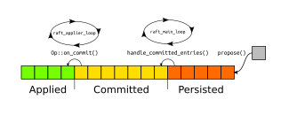
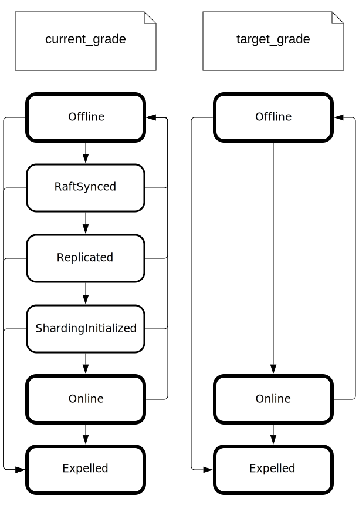

# Общая схема инициализации кластера
Данный раздел содержит описание архитектуры Picodata, в том числе высокоуровневый процесс инициализации кластера на основе нескольких отдельно запущенных экземпляров Picodata (инстансов).

Администратор запускает несколько инстансов, передавая в качестве аргументов необходимые параметры:

```sh
picodata run --instance-id i1 --listen i1 --peer i1,i2,i3
picodata run --instance-id i2 --listen i2 --peer i1,i2,i3
picodata run --instance-id i3 --listen i3 --peer i1,i2,i3
# ...
picodata run --instance-id iN --listen iN --peer i1
```

Независимо от количества запускаемых инстансов, в опции `--peer` у каждого из них следует указать один и тот же набор из нескольких инстансов — одного обычно достаточно, но для подстраховки можно взять три. Именно на их основе будет произведена инициализация кластера и поиск всех работающих инстансов для их включения в состав кластера (discovery).

Подробности алгоритма discovery приведены в отдельном [документе](discovery.md). В контексте сборки кластера важно лишь понимать, что этот алгоритм позволяет не более чем одному инстансу (peer'у) создать Raft-группу, т.е. стать инстансом с raft_id=1. Если таких инстансов будет несколько, то и Raft-групп, а следовательно и кластеров Picodata получится несколько.

Топологией Raft-группы управляет алгоритм Raft, реализованный в виде крейта `raft-rs`.

## Этапы инициализации кластера
На схеме ниже показаны этапы жизненного цикла инстанса в контексте его присоединения к кластеру Picodata.


Красным показан родительский процесс, который запущен на всем протяжении жизненного цикла инстанса. Вся логика, начиная с присоединения к кластеру, и заканчивая обслуживанием клиентских запросов происходит в дочернем процессе (голубой цвет). Единственное предназначение родительского процесса — иметь возможность сбросить состояние дочернего (выполнить rebootstrap) и инициализировать его повторно (сиреневый цвет).

Данная схема наиболее полно отражает логику кода в файле `main.rs`. Ниже описаны детали выполнения каждого этапа и соответствующей программной функции.

### fn main()

На этом этапе происходит ветвление (форк) процесса `picodata`. Родительский процесс (supervisor) ожидает от дочернего процесса сообщения по механизму IPC и при необходимости перезапускает дочерний процесс. При необходимости дочерний процесс может попросить родителя удалить все файлы БД, т.е. вызвать функцию `drop_db()`. Это может понадобиться для повторной инициализации кластера когда, например, у инстанса изначально имеется временный, рандомно сгенерированный `replicaset_id`.

### fn start_discover()

Дочерний процесс начинает свое существование с запуска модуля `box.cfg()` и вызова функции `start_discover()`. Возможно, что при этом из БД будет ясно, что bootstrap данного инстанса уже был произведен ранее и что Raft уже знает о вхождении этого инстанса в кластер — в таком случае никакого discovery не будет, инстанс сразу перейдет к этапу `postjoin()`. В противном случае, если место инстанса в кластере еще не известно, алгоритм discovery определяет значение флага `i_am_bootstrap_leader` и адрес лидера Raft-группы. Далее инстанс сбрасывает свое состояние (этап rebootstrap), чтобы повторно провести инициализацию `box.cfg()`, теперь уже с известными параметрами. Сам лидер (единственный с `i_am_bootstrap_leader == true`) выполняет функцию `start_boot()`. Остальные инстансы переходят к функции `start_join()`.

### fn start_boot()

В функции `start_boot` происходит инициализация Raft-группы — лидер генерирует и сохраняет в БД первые записи в журнале. Эти записи описывают добавление первого инстанса в пустую Raft-группу и создание начальной cluster-wide конфигурации. Таким образом достигается однообразие кода, обрабатывающего эти записи.

Сам Raft-узел на данном этапе еще не создается. Это произойдет позже, на стадии `postjoin()`.

### fn start_join()

Вызову функции `start_join()` всегда предшествует rebootstrap (удаление БД и перезапуск процесса), поэтому на данном этапе в БД нет ни модуля box, ни пространства хранения. Функция `start_join()` имеет простое устройство:

Инстанс-клиент отправляет запрос `raft_join` лидеру Raft-группы (он известен после discovery). После достижения консенсуса в Raft-группе лидер присылает в ответе необходимую информацию:
- Идентификатор `raft_id` и данные таблицы `raft_group` — для инициализации Raft-узла;
- Идентификаторы  `instance_uuid`, `replicaset_uuid` и параметры `replication`, `read_only` для `box.cfg`.

Получив все настройки, инстанс использует их в `box.cfg()`, и затем создает в БД группу `raft_group` с актуальными адресами других инстансов. Без этого инстанс не сможет отвечать на  сообщения от других членов Raft-группы. Для того чтобы записи в `raft_group` не были заменены на менее актуальные из журнала Raft, каждая запись маркируется значением `commit_index`.

По завершении этих манипуляций инстанс также переходит к этапу `postjoin()`.

### fn postjoin()

Логика функции `postjoin()` одинакова для всех инстансов. К этому моменту для инстанса уже инициализированы корректные пространства хранения в БД и могут быть накоплены записи в журнале Raft. Инстанс инициализирует узел Raft, который начинает взаимодействовать с Raft-группой. В случае, если других кандидатов нет, инстанс тут же избирает себя лидером группы.

В этом месте также устанавливает on_shutdown колбек, который обеспечит [graceful shutdown](#Graceful-shutdown).

Следующим шагом инстанс оповещает кластер о том, что он готов проходить
настройку необходимых подсистем (репликации, шардинга, и т.д.). Для этого лидеру
отправляется запрос на обновление `target_grade` текущего инстанса до `Online`,
после чего за дальнейшие действия будет отвечать специальный поток управления
[topology governor](#Topology-governor) (aka `governor_loop`).

Как только запись с обновлённым грейдом будет закоммиченна в Raft, узел готов к
использованию.

## Обработка запросов

### \#\[proc\] fn raft_join()

Значительная часть всей логики по управлению топологией находится в хранимой процедуре `raft_join`. Аргументом для нее является следующая структура:

```rust
struct JoinRequest {
    cluster_id: String,
    instance_id: Option<String>,
    replicaset_id: Option<String>,
    advertise_address: String,
    failure_domain: FailureDomain,
}
```

Ответом служит структура:

```rust
struct JoinResponse {
    /// Добавленный пир (чтобы знать все айдишники)
    peer: Peer,
    /// Воутеры (чтобы добавляемый инстанс мог наладить контакт)
    raft_group: Vec<Peer>,
    /// Настройки репликации (чтобы инициализировать репликацию)
    box_replication: Vec<String>,
}

struct Peer {
    // всевозможные идентификаторы
    raft_id: RaftId,
    instance_id: String,
    instance_uuid: String,
    replicaset_id: String,
    replicaset_uuid: String,

    // текущее местоположение, виртуальное и физическое
    peer_address: String,
    failure_domain: FailureDomain,

    // целевая и текущая оценки состояния инстанса с точки зрения лидера кластера
    target_grade: CurrentGrade,
    current_grade: CurrentGrade,

    /// Индекс записи в Raft-журнале. Препятствует затиранию
    /// более старыми записями, по мере применения Raft-журнала.
    commit_index: RaftIndex,
}
```

Цель такого запроса сводится к добавление нового инстанса в Raft-группу. Для этого алгоритма справедливы следующие тезисы:

- `JoinRequest` отправляет всегда неинициализированный инстанс.
- В зависимости от того, содержится ли в запросе `instance_id`, проводится анализ его корректности (уникальности).
- В процессе обработки запроса в Raft-журнал добавляется запись `op::PersistPeer { peer }`, которая помимо всевозможных айдишников содержит поля `current_grade: Offline`, `target_grade: Offline`, играющие важную роль в обеспечении надежности кластера (подробнее о них в разделе [topology governor](#Topology-governor)).
- В ответ выдаётся всегда новый `raft_id`, никому другому ранее не принадлежавший.
- Генерировать значение `raft_id` может только лидер Raft-группы.
- Помимо всевозможных идентификаторов, ответ содержит список голосующих членов Raft-группы. Они понадобятся новому инстансу чтобы знать адреса соседей и нормально с ними общаться.
- Также ответ содержит параметр `box_replication`, который требуется для правильной настройки репликации.

## Пару слов об обработке записей Raft-журнала

Стейт-машину каждой отдельной записи в Raft-журнале можно описать так:

```md
`Persisted` → `Committed` → `Applied`
```

При добавлении в журнал (по правилам это делает лидер) запись получает статус `Persisted` и начинает реплицироваться (это асинхронно делает файбер `raft_main_loop` ). Когда кворум узлов подтверждает персистентность записи, она считается закоммиченной. Важно понимать, что статус `Committed` присваевается записи на основе совокупной полученной информации, а не какого-то конкретного действия.

Конкретные действия по оработке той или иной записи выполняет отдельный поток `raft_applier` ([TODO](## "Пока что отдельного потока нет, но лучше бы был")). Для каждой записи он выполняет обработчик `Op::on_commit()` и по завершении присваивает записи статус `Applied`. Важно помнить, что обновление статуса и сама операция могут выполняться не атоманро (если в `Op::on_commit()` происходит передача управления другому потоку — yield). В таком случае, следует позаботиться хотя бы об идемпотентности операции.

Схема ниже поможет эту информацию переварить.



Стоит также помнить, что алгоритм Raft гарантирует лишь консистентность последовательности записей, но ничего не говорит о конкретных моментах времени. Смена статусов на разных инстансах так или иначе происходит в разные моменты времени, и иногда эту очередность приходится учитывать в алгоритмах.

Была у нас однажды такая история — шла разработка graceful shutdown. Тест (`test_joining.py::test_deactivation`) останавливал один из двух инстансов и проверял, что тот (назовем его i2) перестал быть голосующим. Иногда тест проходил нормально, но иногда падал — `i2` завершал работу раньше, чем `i1` получал от него подтверждение. При этом критерий остановки включал в себя ожидание коммита, но только локально на `i2`, а не на `i1`. Из-за этого `i1` терял кворум.

## Graceful shutdown

Чтобы выключение прошло штатно и не имело негативных последствий необходимо следующее:

- Инстанс не должен оставаться воутером, пока есть другие онлайн кандидаты.
- Инстанс не должен оставаться лидером.

Чтобы этого добиться, каждый инстанс на `on_shutdown` триггер отправляет лидеру
запрос `UpdatePeerRequest { target_grade: Offline }`, обработкой которого
займётся вышеупомянутый `governor_loop`. После этого инстанс пытается дождаться
применения записи о смене своего `current_grade` на `Offline` (о том почему так
произойдет читай ниже).

По некоторым причинам коммит записи может не успеть дойти до инстанса в срок
отведённый на выполнение `on_shtudown` триггера (например в кластере может быть
потерян кворум) в таком случае graceful shutdown невозможен.

## Topology governor

В отличие от других кластерных решений (например, того же Tarantool Cartridge) Picodata не использует понятие "состояния" для отдельных инстансов. Вместо этого мы говорим об их "грейдах". Грейд инстанса — это лишь синоним слова "состояние", но измениться спонтанно он не может. Мы вводим два конкретных термина: `current_grade` и `target_grade`.

Инициировать изменение `current_grade` может только лидер при поддержке кворума, что гарантирует консистентность принятого решения (и внушает доверие по части отказоустойчивости всей системы).

Инициировать изменение `target_grade` может кто угодно — это может быть сам инстанс (при добавлении), или админ командой `picodata expel`, или нажав Crtl+C на клавиатуре. `target_grade` — это желаемое состояние инстанса, в которое тот должен прийти.

Приведением действительного к желаемому занимается специальный файбер на лидере — `governor_loop`. Он управляет всеми инстансами сразу.

С грейдом (как с текущим так и с целевым) также всегда ассоциирована инкарнация
(`incarnation`) - порядковое число, подсчитывающее количество раз когда governor
начинал процесс обработки данного инстанса. Это позволяет нам замечать ситуации,
когда инстансы выходят из строя на какой-то период времени, после чего их
необходимо снова привести в актуальное состояние.

На основе совокупности грейдов и их инкарнаций `governor_loop` на каждой итерации бесконечного цикла придумывает ~~дурацкие менеджерские~~ активности (activity) и пытается их организовать. Пока не организует, никаких других изменений в текущих грейдах не произойдет (но могут измениться целевые). Если активности сфейлятся, то на следующей итерации они будут перевычислены с учетом новых целей.



Инкарнации грейдов вычисляются по следующему принципу.
- Каждый раз когда `target_grade` инстанса получает значение `Online`,
    его инкарнация увеличивается на 1.
- Все остальные изменения грейдов копируют инкарнацию с противоположного грейда,
    то есть при изменении `target_grade` инкарнация копируется с
    `current_grade`, при изменении `current_grade` - с `target_grade`.

Дальше перечислены активности, которыми занимается governor, в том же порядке, в
котором он к ним приступает.

### 1. Обновить состав воутеров / лернеров

Первым делом проверяем нужно ли внести изменения в конфигурацию Raft группы -
изменить состав воутеров и лернеров.

Правила выбора новой конфигурации описаны в
`picodata::governor::cc::raft_conf_change` и (на момент написание этого текста)
заключаются примерно в следующем:
- Любые инстансы переходящие в грейд `Expelled` удаляем из Raft группы;
- Воутеры переходящие в грейд `Offline` делаем лернерами и находим им замена;
- Среди свеже-добавленных инстансов с текущим грейдом `Online` добираем
    необходимое количество воутеров, а остальных добавляем лернерами;

[TODO](#Предстоит сделать) Новые воутеры должны выбираться с учётом failure
domain'ов.

По этим правилам генерируем `ConfChangeV2`, и отправляем его в Raft, если он не
пустой конечно.
После этого дожидаемся события `TopologyChanged`, которое будет послано в ответ
на успешное применение новой конфигурации.

### 2. target_grade Offline / Expelled.

Следующим шагом берём первый попавшийся инстанс, который нужно вывести из строя
временно (`target_grade = Offline`) или навсегда (`target_grade = Expelled`).
Перед тем как выключить инстанс, нужно убедиться, что кластер сможет продолжить
функционировать без него.

Если уходит лидер Raft группы, то есть инстанс на котором в данный момент
крутится `governor_loop`, то он снимает с себя полномочия (делает
`transfer_leadership`) и ждёт смены Raft статуса, дальше действовать будет
кто-то другой.

Если уходит лидер своего репликасета, выбираем нового и дожидаемся
соответствующей записи в спейс с репликасетами.

Обновляем конфигурацию шардинга (`vhsard`) на всех стораджах и роутерах в
кластере, чтобы оповестить их об изменениях в топологии.

[TODO](#Пока не сделано) Также, если это последний сторадж в репликасете, ему надо выставить вес в 0. Дожидаться ребалансировки на этом шаге не требуется (да и не получится — слишком долгая блокировка), для этого есть отдельный пункт.

После этого, наконец присваиваем инстансу `current_grade` соответствующей его
целевому.

### 3. target_grade: Online, current_grade: * -> RaftSynced

Дальше начинается обработка инстансов, которых нужно привести в актуальное
состояние. Это либо свеже-добавленные инстансы, либо инстансы, которые были
какое-то время неактивны.

Выбираем инстанс либо имеющий `current_grade: Offline`, либо имеющий
инкарнация текущего грейда меньше, чем инкарнацию целевого.

На этом этапе мы синхронизируем Raft журнал выбранных инстансов. Берём текущий
`commit_index` лидера и дожидаемся, пока `commit_index` пира его не догонит.
После этого присваиваем инстансу `current_grade = RaftSynced`.

[TODO](#Пока не сделано) Этот шаг можно распараллелить, отправив запрос сразу
нескольким подходящим пирам.

### 4. target_grade: Online, current_grade: RaftSynced -> Replicated

Этот этап отвечает за настройку репликации внутри одного репликасета, к которому
относится выбранный инстанс.

Первым делом мы сообщаем всем инстансам репликасета, что необходимо применить
новую конфигурацию репликации через `box.cfg { replication = ... }`. Однако, так
как конфигурация кластера (в том числе и конфигурация репликасетов)
распространяется между инстансами через Raft журнал, необходимо убедиться
что журнал у всех свежий. Для этого в запросе также передаём `commit_index`,
которого пиры должны дождаться прежде чем выполнять сам запрос.

После этого инстансу, инициировавшему активность, присваевается `current_grade:
Replicated`.

[TODO](#Пока не сделано) Можно обновлять грейд сразу всем инстансам в
репликасете, которым это нужно.

На этом же добавляем запись в спейс с репликасетами, если её там ещё нет. При
этом, его вес шардирования устанавливается в 0, если только это не первый
репликасет в кластере.

Последнее что нужно сделать на этом этапе это обновить обновить
`box.cfg { read_only }` конфигурацию лидера затронутого репликасета
([TODO](#Пока не сделано) это не обязательно делать каждый раз).

### 5. target_grade: Online, current_grade: Replicated -> ShardingInitialized

На данном этапе настраивается шардирование всего кластера, по этому запросы
отправляются сразу всем инстансам.

Рассылаем всем запрос на обновление конфигурации шардирования
(`vshard.router.cfg()` и `vshard.storage.cfg()`) опять вместе с `commit_index`,
чтобы инстансы получили последние данные.

На этом этапе первый репликасет наполненный до фактора репликации запускает
начальное распределение бакетов (`vshard.router.bootstrap`)
([TODO](#Пока не сделано) пока что это делает первый инстанс в кластере).

В конце этого этапа подсистема шардирования данных (vshard) на всех инстансах
знает о топологии всего кластера, но на некоторых репликасетах вес всё ещё
проставлен в 0, поэтому данные на него ребалансироваться ещё не будут.

### 6. target_grade: Online, current_grade: ShardingInitialized -> Online

Этот этап нужен для того, чтобы запустить ребалансировку данных на новые
репликасеты. Для этого проверяем, есть ли у нас репликасеты с весом 0
наполненные до фактора репликации. Если есть, то обновляем их вес и
повторно обновляем конфигурацию шардирования на всём кластере, чтобы данные
начали ребалансироваться.

В обоих случаях после этого шага все инстансы могут переходить в грейд `Online`.
