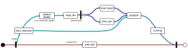

# Общая схема инициализации кластера
Данный документ описывает высокоуровневый процесс инициализации кластера Picodata на основе нескольких отдельно запущенных экземпляров Picodata (инстансов).

Администратор запускает несколько инстансов, передавая в качестве аргументов необходимые параметры:

```sh
picodata run --instance-id i1 --listen i1 --peer i1,i2,i3
picodata run --instance-id i2 --listen i2 --peer i1,i2,i3
picodata run --instance-id i3 --listen i3 --peer i1,i2,i3
# ...
picodata run --instance-id iN --listen iN --peer i1
```

Независимо от количества запускаемых инстансов, в опции `--peer` у каждого из них следует указать один и тот же набор из нескольких инстансов - одного обычно достаточно, но для подстраховки можно взять три. Именно на их основе будет произведена инициализация кластера и поиск всех работающих инстансов для их включения в состав кластера (discovery).

Подробности алгоритма discovery приведены в отдельном [документе](discover.md). В контексте сборки кластера важно лишь понимать, что этот алгоритм позволяет не более чем одному инстансу (peer'у) создать Raft-группу, т.е. стать инстансом с raft_id=1. Если таких инстансов будет несколько, то и Raft-групп, а следовательно и кластеров Picodata получится несколько.

Топологией Raft-группы управляет алгоритм Raft, реализованный в виде крейта `raft-rs`.

# Этапы инициализации кластера
На схеме ниже показаны этапы жизненного цикла инстанса в контексте его присоединения к кластеру Picodata.



Красным показан родительский процесс, который запущен на всем протяжении жизненного цикла инстанса. Вся логика, начиная с присоединения к кластеру, и заканчивая обслуживанием клиентсих запросов происходит в дочернем процессе (голубой цвет). Единственное предназначение родительского процесса - иметь возможность сбросить состояние дочернего (выполнить rebootstrap) и инициализировать его повторно (сиреневый цвет).

Данная схема наиболее полно отражает логику кода в файле `main.rs`. Ниже описаны детали выполнения каждого этапа и соответствующей программной функции.

### fn main()

На этом этапе происходит ветвление (форк) процесса `picodata`. Родительский процесс (supervisor) ожидает от дочернего процесса сообщения по механизму IPC и при необходимости перезапускает дочерний процесс. При необходимости дочерний процесс может попросить родителя удалить все файлы БД, т.е. вызвать функцию `drop_db()`. Это может понадобиться для повторной инициализации кластера когда, например, у инстанса изначально имеется временный, рандомно сгенерированный `replicaset_id`.

### fn start_discover()

Дочерний процесс начинает свое существование с запуска модуля `box.cfg()` и вызова функции `start_discover()`. Возможно, что при этом из БД будет ясно, что bootstrap данного инстанса уже был произведен ранее и что Raft уже знает о вхождении этого инстанса в кластер - в таком случае никакого discovery не будет, инстанс сразу перейдет к этапу `postjoin()`. В противном случае, если место инстанса в кластере еще не известно, алгоритм discovery опредяет значение флага `i_am_bootstrap_leader` и адрес лидера Raft-группы. Далее инстанс сбрасывает свое состояние (этап rebootstrap), чтобы повторно провести инициализацию `box.cfg()`, теперь уже с известными параметрами. Сам лидер (единственный с `i_am_bootstrap_leader == true`) выполняет функцию `start_boot()`. Остальные инстансы переходят к функции `start_join()`.

### fn start_boot()

В функции `start_boot` происходит инициализация Raft-группы - лидер генерирует и сохраняет в БД первые записи в журнале. Эти записи описывают добавление первого инстанса в пустую Raft-группу. Таким образом достигается однообразие кода, обрабатывающего эти записи.

Сам Raft-узел на данном этапе еще не создается. Это произойдет позже, на стадии `postjoin()`.

### fn start_join()

Вызову функции `start_join()` всегда предшествует rebootstrap (удаление БД и перезапуск процесса), поэтому на данном этапе в БД нет ни модуля box, ни пространства хранения. Функция `start_join()` имеет простое устройство:

Инстанс-клиент отправляет запрос `raft_join` лидеру Raft-группы (он известен после discovery). После достижения консенсуса в Raft-группе лидер присылает в ответе необходимую информацию:
- Идентификатор `raft_id` и данные таблицы `raft_group` - для инициализации Raft-узла;
- Идентификаторы  `instance_uuid`, `replicaset_uuid` и параметры `replication`, `read_only` для `box.cfg`.

Получив все настройки, инстанс использует их в `box.cfg()`, и затем создает в БД группу `raft_group` с актуальными адресами других инстансов. Без этого инстанс не сможет отвечать на  сообщения от других членов Raft-группы. Для того чтобы записи в `raft_group` не были заменены на менее актуальные из журнала Raft, каждая запись маркируется значением `commit_index`.

По завершении этих манипуляций инстанс также переходит к этапу `postjoin()`.

### fn postjoin()

Логика функции `postjoin()` одинакова для всех инстансов. К этому моменту для инстанса уже инициализированы корректные пространства хранения в БД и могут быть накоплены записи в журнале Raft. Инстанс инициализирует узел Raft и проверяет, что данные синхронизированы (`read barrier` получен) и журнал Raft актуален. Из журнала становятся известны параметры репликации, и инстанс начинает синхронизацию данных уровне репликационных групп Tarantool.

Следующим шагом инстансу необходимо актуализировать свой статус (`UpdatePeerRequest{ health: Online, failure_domain }`), и дождаться коммита этой записи в Raft.

Теперь узел Raft готов к использованию.

# Обработка запросов

### \#\[proc\] fn raft_join()

Значительная часть всей логики по управлению топологией находится в хранимой процедуре `raft_join`. Аргументом для нее является следующая структура:

```rust
struct JoinRequest {
    cluster_id: String,
    instance_id: Option<String>,
    replicaset_id: Option<String>,
    advertise_address: String,
    failure_domain: FailureDomain,
}
```

Ответом служит структура:

```rust
struct JoinResponse {
    /// Добавленный пир (чтобы знать все айдишники)
    peer: Peer,
    /// Воутеры (чтобы добавляемый инстанс мог наладить контакт)
    raft_group: Vec<Peer>,
    /// Настройки репликации (чтобы инициализировать репликацию)
    box_replication: Vec<String>,
}

struct Peer {
    // всевозможные идентификаторы
    raft_id: RaftId,
    instance_id: String,
    instance_uuid: String,
    replicaset_id: String,
    replicaset_uuid: String,

    // текущее местоположение, виртуальное и физическое
    peer_address: String,
    failure_domain: FailureDomain,

    /// Loading / Online / Offline
    health: Health,

    /// Индекс записи в Raft-журнале. Препятствует затиранию
    /// более старыми записями, по мере применения Raft-журнала.
    commit_index: RaftIndex,
}
```

Цель такого запроса сводится к добавление нового инстанса в Raft-группу. Для этого алгоритма справедливы следующие тезисы:

- `JoinRequest` отправляет всегда неинициализированный инстанс.
- В зависимости от того, содержится ли в запросе `instance_id`, проводится анализ его корректности (уникальности).
- В процессе обработки запроса в Raft-журнал добавляется запись `op::PersistPeer{ peer }`, который помимо всевозможных айдишников содержит поле `health: Loading`, которое играет важную роль в обеспечении надежности кластера. [TODO](## "Сейчас в коде Online вместо Loading, но это надо исправить.")
- Обработка запроса также включает в себя добавление инстанса в Raft-группу в роли `Learner` (процедура также известная как `raft::ConfChangeV2`). Raft не позволяет изменять топологию, пока предыдущее изменение не было применено. Поэтому в целях оптимизации обработка идет в отдельном потоке (т.н. `conf_change_loop`) и выполняется группами.
- Прежде чем отвечать на запрос, инстанс дожидается применения изменений конфигурации. Это произойдет после того как он выйдет из состояния `joint state` ([подробнее](https://web.stanford.edu/~ouster/cgi-bin/papers/OngaroPhD.pdf), §4.3). [TODO](## "этот тезис в коде пока не реализован")
- В ответ выдаётся всегда новый `raft_id`, никому другому ранее не принадлежавший.
- Генерировать значение `raft_id` может только лидер Raft-группы. Ожидание `ConfChangeV2` лидерства не требует.
- Помимо всевозможных идентификаторов, ответ содержит список голосующих членов Raft-группы. Они понадобятся новому инстансу чтобы знать адреса соседей и нормально с ними общаться.
- Также ответ содержит параметр `box_replication`, который требуется для правильной настройки репликации.

# Логика conf_change_loop

Все узлы Raft в кластере делятся на два типа: голосующие (`voter`) и неголосующие (`learner`). На каждом инстансе кластера присутствует поток, управляющий конфигурацией Raft-группы (составом `voters` / `learners`). Реальные изменения тем не менее может генерировать только лидер, на остальных инстансах этот поток спит и ничего не делает.

Поток представляет собой бесконечный цикл. На каждой итерации выполняется проверка, что состав `voters` / `learners` соответствует состоянию инстансов, и при необходимости эти изменения пачкой записываются в Raft-журнал:

- Инстансы в статусе `health: Loading` довавляются как неголосующие.
- Если есть возможность, `Offline` инстансы передают право голоса другим `Online`.
- Если общее количество голосующих инстансов оказывается меньше целевого, `Online` инстансы получают право голоса.

Количество голосующих узлов в кластере не настраивается и зависит только от общего количества инстансов. Если инстансов 1 или 2, то голосующий узел один. Если инстансов 3 или 4, то таких узлов три. Для кластера с 5 или более инстансами — пять голосующих узлов.

# Graceful shutdown

Чтобы выключение прошло штатно и не имело негативных последствий необходимо следующее:

- Инстанс не должен оставаться воутером, пока есть другие онлайн кандидаты.
- Инстанс не должен оставаться лидером.

Чтобы этого добиться, каждый инстанс на `on_shutdown` триггер отправляет лидеру запрос `UpdatePeerRequest{ health: Offline }`. Непосредственно изменением роли `voter` -> `learner` занимается отдеьный поток на лидере (тот самый `conf_change_loop`), инстанс только дожидается его применения.
