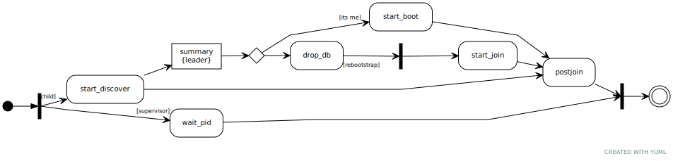

# Инициализация кластера. Высокоуровнево.

Админ запускает пачку инстансов:

```sh
picodata run --instance-id i1 --listen i1 --peer i1,i2
picodata run --instance-id i2 --listen i2 --peer i1,i2
picodata run --instance-id i3 --listen i3 --peer i1,i2
# ...
picodata run --instance-id iN --listen iN --peer i1,i2
```

Сколько бы инстансов ни было, в опции `--peer` у каждого следует указать один и тот же набор из нескольких "первых". На них возлагается особая миссия по инициализации кластера (дискавери).

Подробный алгоритм дискавери в этой истории роли не играет, но описан в соседнем файле `discovery.md`. Пока об алгоритме дискавери достаточно знать лишь то, что, следуя этому алгоритму, один и только один из этих пиров возьмет на себя смелость создать рафт группу. Иначе рафт групп получилось бы неколько.

Всё управление топологией рафт группы по сути возлагается на сам алгоритм рафт. И на его конкретную имплементацию - крейт `raft-rs`.

# Инициализация кластера. Подробнее.

[https://yuml.me/edit/15c7c2d0]



Эта устрашающая схема максимально точно изображает логику кода в `main.rs`. Ниже объясняется подробнее, что происходит на каждом этапе.

### fn main()

Сначала процесс пикодаты форкается. Родитель (supervisor) ждет по механизму IPC сообщения от дочернего процесса и при необходимости рестартит его. Опционально дочерний процесс может попросить родителя дропнуть все файлы БД. Это будет нужно для т.н. ребутстрапа.

### fn start_discover()

Дочерний процесс начинает своё существование с вызова `box.cfg()` и вызова функции `start_discover`.
Если вдруг из спейсов обнаруживается, что нода уже была забутстрапленна, то никакой алгоритм дискавери делаь и не надо, и инстанс сразу переходит на этап `postjoin()`. В противном случае, если это первый запуск, из алгоритма дискавери мы получаем флаг `its_me` и адрес лидера. Сам лидер выполняет `start_boot`, после чего выполняет `postjoin()`. Остальные инстансы (не только проигравшие пиры, но и все будущие) ребутстрапятся и идут делать `start_join`.


### fn start_boot()

В функции `start_boot` происходит инициализация рафт группы - лидер генерирует и персистит первую запись в журнале. В этой записи будет лежать операция добавления ноды, что позволит всем остальным инстансам инициализироваться с пустой рафт группой.

Саму рафт ноду инстанс на этом этапе не создаёт. Это произойдет позже, на стадии `postjoin()`.

### fn start_join()

Вызову `start_join` всегда предшествует ребутстрап (удаление БД и рестарт процесса), поэтому ни бокса, ни спейсов на этом этапе снова нет. Сама функция достаточно примитивная.

Инстанс отправляет запрос `join` на лидера (лидер известен после дискавери). Лидер шушукается с группой, и если всё хорошо, в ответ присылает необходимую для `box.cfg()` информацию - `raft_id`, `raft_group`, `insance_uuid`, `replicaset__uuid`, `replication`, `read_only`.

Получив все настройки, инстанс засовывает их в `box.cfg()`, и после этого персистит `raft_group` с актуальными адресами других инстансов. Без этого инстанс не сможет отвечать на рафт сообщения. А чтобы записи в `raft_group` не были потёрты менее актуальными из рафт лога, каждая маркируется значением `commit_index`.

После всех этих манипуляций, также идёт `postjoin()`.

### fn postjoin()

Логика `postjoin()` для всех инстансов одинакова. К этому моменту на инстансе уже инициализированы правильные спейсы и возможно даже существует предыстория рафт журнала. Инстанс инициализирует рафт ноду и получает read barrier. Если всё хорошо, то в актуальности рафт лога сомневаться не прихоится. Из рафт лога становятся известны параметры репликации, и инстанс синхронизируемся с репликами.

Остаётся один маленький штришок - проверить свой статус voter / learner, при необходимости кинуть запрос на промоут до воутера (всё тот же `join`, лидер известен после получения read barrier), и дождаться его применения.

Всё, нода готова к использованию.

# Обработка запросов

### extern "C" fn join()

Львиная доля всей логики по управлению топологией кроется в хранимке `join`. Её назначение достаточно простое - закоммитить ConfChange, но за этими словами кроется несколько нюансов.

Во-первых, если этот `instance_id` уже есть в группе (закоммиченый) и никакая информация не обновилась (например флаг voter / learner), то можно сразу отвечать клиенту не задействуя рафт.

Если это первое появление инстанса в группе, то он всегда добавляется в роли learner. В роли voter его добавлять нельзя, иначе появится проблема курицы и яйца. Чтобы ConfChange с воутером закоммитился, этот voter должен участвовать в кворуме. А он не может - он ещё ждёт ответа на запрос `join`.

Во-вторых, рафт не позволяет делать ConfChange, если предыдущий ConfChange не был закоммичен. Поэтому запросы `join` на лидере придётся обрабатывать батчами в отдельном файбере. Пачку запросов накопили - обработали - каждому послали индивидуальный ответ.

В-третьих, прежде чем отвечать клиенту, надо дождаться, пока ConfChange закоммитится. Или, более формально, пока лидер не выйдет из т.н. joint state (см. рафт диссер §4.3). После этого можно отвечать клиенту `raft_id`, `raft_group`, `insance_uuid`, `replicaset__uuid`, `replication`, `read_only`. В будущем состав ответа может дополняться новыми параметрами по мере необходимости.

- `raft_id` генерит лидер, и делает это строго последовательно и атомарно на весь батч.
- `raft_group` представляет собой дамп всего спейса с топологией кластера. Он понадобится новому инстансу чтобы знать адреса соседей и нормально с ними общаться.

И, наконец, где-то здесь же надо будет убедиться, что нода является лидером, когда генерит `raft_id`. У остальных нет на это права.

# TODO

Q: провести эксперимент, может ли ConfChange пролезть в MsgPropose?
A: Может

Q: провести эксперимент, можно ли параллельно отравлять simple_conf_change, или это только v2 касается?
A: Пофиг, simple у нас только один в логе - самый первый.

Q: правда ли, что пропоуз сразу после коммита не потеряется, и не задублируется?
A: нет, коммит на фоловерах может прийти, а пропоуз потеряется. тогда у нового лидера не будет подходящего момента, чтобы восполнить эту утрату.  Именно поэтому за промоутом до воутера следит сам фоловер.

Q: может ли фоловер (не лернер) слать другому фоловеру MgsAppend закомиченных энтрей?
A: ???
