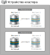
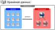
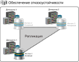

# Общее описание продукта
Данный подраздел содержит общие сведение о продукте Picodata, его назначении, области применения и внутреннем устройстве.

## Что такое Picodata?
Программное обеспечение Picodata — это сервер приложений со встроенной базой данных для работы в распределенных системах.
Picodata предоставляет систему хранения данных, платформу для работы персистентных приложений на языке Rust и средства управления СУБД на языке SQL.

## Назначение
Основным назначением продукта Picodata является горизонтально масштабируемое хранение структурированных и неструктурированных данных, управление ими, предоставление среды вычислений внутри кластера, состоящего из реплицированных отдельных узлов. Такие узлы называют экземплярами Picodata или *инстансами*.

## Задачи
Программное обеспечение Picodata решает следующие задачи:

* реализация общего линеаризованного хранилища конфигурации, схемы данных и топологии кластера, встроенного в распределенную систему управления базами данных;
* предоставление графического интерфейса и интерфейса командной строки по управлению топологией кластера;
* реализация runtime-библиотек по работе с сетью, файловому вводу-выводу, реализация кооперативной многозадачности и управления потоками, работа со встроенной СУБД средствами языка Rust;
* поддержка языка SQL для работы как с данными отдельного инстанса, так и с данными всего кластера;
* управление кластером;
* поддержка жизненного цикла приложения в кластере, включая версионирование, управление зависимостями, упаковку дистрибутива, развертывание и обновление запущенных приложений.

## Область применения
Кластер Picodata обеспечивает быстрый доступ к данным внутри распределенного хранилища. Это позволяет использовать его в следующих областях:

* управление телекоммуникационным оборудованием;
* банковские и в целом финансовые услуги, биржевые торги, аукционы;
* формирование персональных маркетинговых предложений с привязкой ко времени и месту;
* обработка больших объемов данных в реальном времени для систем класса "интернет вещей" (IoT);
* игровые рейтинговые таблицы;
* и многое другое!

## Особенности кластера Picodata
Кластер с СУБД Picodata обладает следующими свойствами:

* автоматическое горизонтальное масштабирование кластера;
* более простая настройка для запуска шардированного кластера. Требуется меньше файлов конфигурации;
* совместимость с любыми инструментами развертывания инстансов (Ansible, Chef, Puppet и др.);
* обеспечение высокой доступности данных без необходимости в кластере Etcd и дополнительных настройках;
* автоматическое определение активного инстанса в репликасетах любого размера;
* единая схема данных во всех репликасетах кластера;
* возможность обновлять схему данных и менять топологию работающего кластера, например добавлять новые инстансы. Picodata автоматически управляет версиями схемы; 
* встроенные инструменты для создания и запуска приложений.

## Архитектура кластера
### Составные части кластера
Архитектура кластера Picodata предполагает систему отдельных *инстансов* — программных узлов, входящих в состав кластера. Каждый такой узел может выполнять различные роли, например роль хранения данных, роль сервера приложения, или служебную роль координатора кластера.
Все инстансы работают с единой схемой данных и кодом приложения. Каждый процесс базы данных выполняется на одном процессорном ядре и хранит используемый набор данных в оперативной памяти. 
Любой отдельный инстанс является частью набора реплик, который также называют *репликасетом*. Репликасет может состоять из одного или нескольких инстансов — дубликатов одного и того же набора данных. Внутри репликасета всегда есть *активный* инстанс и — если реплик больше 1 — то некоторое число *резервных* инстансов, обеспечивающих отказоустойчивость системы в случае выхода из строя или недоступности активного инстанса. Число реплик определяется *фактором репликации*, заданным в глобальных настройках Picodata.

На рисунке ниже показана схема простого кластера из двух репликасетов, каждый из которых состоит из двух инстансов (активного и резервного):

Репликасеты являются единицами горизонтального масштабирования кластера. Данные балансируются между ними автоматически.

### Хранение данных
Внутри каждого репликасета есть *bucket* — виртуализированная неделимая единица хранения, обеспечивающая локальность данных (например, хранение нескольких связанных с клиентом записей на одном физическом узле сети). Сам по себе bucket не имеет ограничений по емкости и может содержать любой объем данных. Горизонтальное масштабирование позволяет распределить bucket'ы по разным шардам, оптимизировав производительность кластера путем добавления новых реплицированных инстансов. Чем больше репликасетов входит в состав кластера, тем меньше нагрузка на каждый из них. Bucket хранится физически на одном репликасете и является промежуточным звеном между данными и устройством хранения. В каждом репликасете может быть много bucket'ов (или не быть ни одного). Внутри bucket'а данные задублированы по всем инстансам в рамках репликасета в соответствии с фактором репликации. Количество bucket'ов задается при первоначальной настройке кластера.

На схеме ниже показан пример схемы хранения данных внутри репликасета:

### Отказоустойчивость
Наличие нескольких реплик внутри репликасета обеспечивают его отказоустойчивость. Дополнительно для повышения надежности каждый инстанс кластера внутри репликасета находится на разных физических серверах, а в некоторых случаях — в удаленных друг от друга датацентрах. Таким образом, в случае недоступности датацентра в репликасете происходит переключение на резервную реплику/инстанс без прерывания работы. 

Пример географического распределения репликасета показан на схеме ниже:

### Шардирование
Шардирование — это распределение bucket'ов между различными репликасетами. В Picodata используется основанное на хэшах шардирование с хранением данных в виртуальных bucket'ах. Каждый репликасет является *шардом*, и чем больше репликасетов имеется в кластере, тем эффективнее данная функция может разделить массив данных на отдельные наборы данных меньшего размера. При добавлении новых инстансов в кластер и/или формировании новых репликасетов Picodata автоматически равномерно распределит bucket'ы с учетом новой конфигурации.
Пример автоматического шардирования при добавлении в кластер новых инстансов показан на схеме ниже:

Таким образом, каждый инстанс (экземпляр Picodata) является *частью репликасета*, а каждый репликасет — *шардом*, а шарды распределены между несколькими серверами.