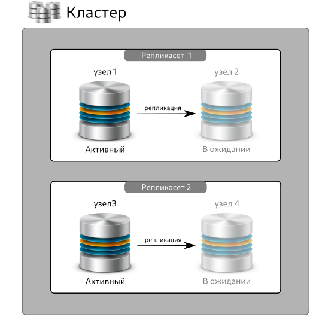
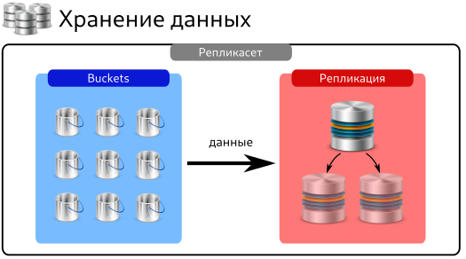

# Общее описание продукта
## Что такое Picodata?
Программное обеспечение Picodata — это сервер приложений со встроенной базой данных для работы в распределённых системах.
Picodata предоставляет систему хранения данных и платформу для работы персистентных приложений на языке Rust и средства управления СУБД на языке SQL.

## Назначение
Основным предназначением продукта Picodata является горизонтально масштабируемое хранение структурированных и неструктурированных данных, управление ими, предоставление среды вычислений внутри кластера.

## Задачи
Задачи, решаемые ПО Picodata, включают в себя:

* Реализацию общего линеаризованного хранилища конфигурации, схемы данных и топологии кластера, встроенного в распределенную систему управления базами данных.
* Предоставление графического интерфейса и интерфейса командной строки по управлению топологией кластера.
* Реализацию runtime-библиотек по работе с сетью, файловому вводу-выводу, созданию зеленых потоков (green threads) и управлению ими, работе со встроенной СУБД средствами языка Rust.
* Поддержку языка SQL для работы как с данными одного узла кластера, так и с данными всего кластера.
* Управление кластером.
* Поддержку жизненного цикла приложения в кластере, включая версионирование, управление зависимостями, упаковку дистрибутива, развертывание и обновление запущенных приложений.

## Область применения
Хранилище данных с использованием ПО Picodata обладает явными преимуществами, которые во многом определяют наиболее выгодные области применения. Речь идёт о быстром доступе к данным внутри распределённого хранилища. Примерами могут служить:

* управление телекоммуникационным оборудованием;
* банковские и в целом финансовые услуги, биржевые торги, аукционы;
* формирование персональных маркетинговых предложений с привязкой ко времени и месту;
* обработка больших объёмов данных в реальном времени для систем класса "интернет вещей" (IoT);
* игровые рейтинговые таблицы;
* и многое другое!

## Преимущества
Picodata позволяет развёртывать и управлять кластерами с СУБД Tarantool, используя следующие возможности:

* горизонтальное масштабирование кластера с использованием библиотеки логического шардирования VShard и собственных высокоуровневых инструментов, облегчающих работу администраторов и разработчиков.
* гибкое управление вычислительной нагрузкой за счёт реплицирования узлов кластера и автоматизированной балансировки.
* гибкое удаление устаревших данных.
* гибкое обновление схемы данных и изменение топологии кластера,в например добавление новых узлов к уже работающему кластеру.
* обеспечение высокой доступности и персистентности данных сразу, без использования дополнительного инструментария.

## Архитектура
Архитектура кластера под управлением Picodata предполагает систему узлов, входящих в состав кластера. Каждый узел может выполнять различные роли, например роль хранения данных, роль сервера приложения, или служебную роль координатора кластера.
Все узлы работают с единой схемой данных и кодом приложения. Каждый процесс базы данных выполняется на одном процессорном ядре и хранит все свои данные в оперативной памяти. 
Любой отдельный узел является часть набора реплик, который также называют *репликасетом*. Репликасет может состоять из одного узла или нескольких дубликатов одного и того же набора данных. Внутри репликасета всегда есть *лидер* (основной узел) и — если реплик больше 1 — то некоторое число вспомогательных узлов, обеспечивающие отказоустойчивость системы в случае выхода из строя или недоступности лидера. Число реплик определяется *фактором репликации*, заданным для набора в глобальных настройках Picodata.

На рисунке ниже показана схема простого кластера из двух репликасетов, каждый из которых состоит из двух узлов (активного и в ожидании):

Репликасеты являются единицами физического масштабирования кластера. Данные балансируются между ними автоматически.
Внутри каждого репликасета есть *bucket* — виртуализированная неделимая единица хранения, обеспечивающая локальность данных (например, хранение нескольких связанных с клиентом записей на одном физическом узле). Таким образом, при горизонтальном масштабировании кластера данные распределяются по устройствам хранения не напрямую, а внутри bucket'ов. Это позволяет увеличить скорость выполнения запросов к БД и одновременно с этим снизить нагрузку на сетевую инфраструктуру кластера. Bucket всегда хранится физически на одном узле и является промежуточным звеном между данными и устройством хранения. В каждом репликасете может быть много bucket'ов (или не быть не одного). Внутри bucket'а данные задублированы по всем узлам в рамках репликасета в соответствие с фактором репликации.

На схеме ниже показан пример схемы хранения данных внутри репликасета:

Узлы внутри репликасета обеспечивают его отказоустойчивость. Однако, для повышения надёжности каждый узел внутри репликасета находится на разных физических серверах, а также, как правило, в разных, географически удалённых друг от друга датацентрах. Таким образом, репликасет становится *распределённым* и в случае недоступности или выходы из строя датацентра продолжает работать, делая активным другой узел. За распределение узлов между разными серверами отвечает библиотека Tarantool vShard, используемая в Picodata. 

Пример географического распределения репликасета показан на схеме ниже:

Таким образом, каждый узел является *репликасетом*, а каждый репликасет — *шардом*.