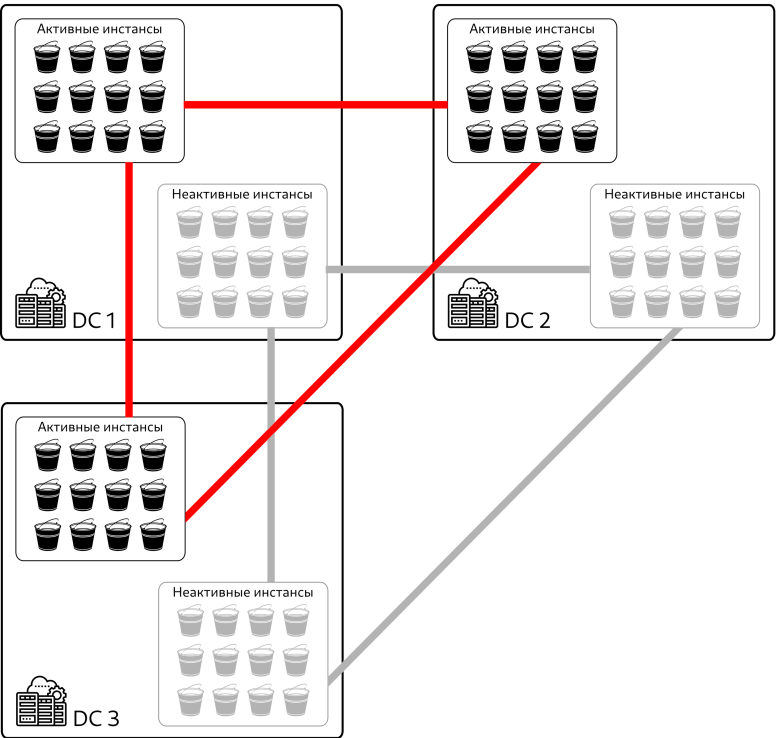

# Общее описание продукта
## Что такое Picodata?
Программное обеспечение Picodata — это сервер приложений со встроенной базой данных для работы в распределённых системах.
Picodata предоставляет систему хранения данных и платформу для работы персистентных приложений на языке Rust и средства управления СУБД на языке SQL.

## Назначение
Основным предназначением продукта Picodata является горизонтально масштабируемое хранение структурированных и неструктурированных данных, управление ими, предоставление среды вычислений внутри кластера.

## Задачи
Задачи, решаемые ПО Picodata, включают в себя:

* Реализацию общего линеаризованного хранилища конфигурации, схемы данных и топологии кластера, встроенного в распределенную систему управления базами данных.
* Предоставление графического интерфейса и интерфейса командной строки по управлению топологией кластера.
* Реализацию runtime-библиотек по работе с сетью, файловому вводу-выводу, созданию зеленых потоков (green threads) и управлению ими, работе со встроенной СУБД средствами языка Rust.
* Поддержку языка SQL для работы как с данными одного узла кластера, так и с данными всего кластера.
* Управление кластером.
* Поддержку жизненного цикла приложения в кластере, включая версионирование, управление зависимостями, упаковку дистрибутива, развертывание и обновление запущенных приложений.

## Область применения
Хранилище данных с использованием ПО Picodata обладает явными преимуществами, которые во многом определяют наиболее выгодные области применения. Речь идёт о быстром доступе к данным внутри распределённого хранилища. Примерами могут служить:

* управление телекоммуникационным оборудованием;
* банковские и в целом финансовые услуги, биржевые торги, аукционы;
* формирование персональных маркетинговых предложений с привязкой ко времени и месту;
* обработка больших объёмов данных в реальном времени для систем класса "интернет вещей" (IoT);
* игровые рейтинговые таблицы;
* и многое другое!

## Преимущества
Picodata позволяет развёртывать и управлять кластерами с СУБД Tarantool, используя следующие возможности:

* горизонтальное масштабирование кластера с использованием библиотеки логического шардирования VShard и собственных высокоуровневых инструментов, облегчающих работу администраторов и разработчиков.
* гибкое управление вычислительной нагрузкой за счёт реплицирования узлов кластера и автоматизированной балансировки.
* гибкое удаление устаревших данных.
* гибкое обновление схемы данных и изменение топологии кластера,в например добавление новых узлов к уже работающему кластеру.
* обеспечение высокой доступности и персистентности данных сразу, без использования дополнительного инструментария.

## Архитектура
Архитектура кластера под управлением Picodata предполагает систему гомогенных узлов, входящих в состав кластера. Каждый узел может выполнять различные роли, например роль хранения данных, роль сервера приложения, или служебную роль координатора кластера.
Все узлы работают с единой схемой данных и кодом приложения. Каждый узел выполняется на одном процессорном ядре (1 ядро - 1 процесс). Если рассматривать кластер именно как хранилище, то в нём все данные распределены между узлами, т.е. реплицированы, что означает, что у каждого узла есть как минимум одна реплика. Такие наборы реплицированных узлов называются *репликасетами*, которые считаются единицами физического масштабирования кластера. Число реплик определяется фактором репликации, заданным для набора в глобальных настройках Picodata. У каждого набора всегда есть основная реплика, или *лидер*. В случае отказа лидера репликасета, лидером автоматически становится одна из оставшихся реплик. Данные автоматически балансируются между репликасетами.
Внутри каждого репликасета есть *bucket* - виртуализированная единица хранения, обеспечивающая локальность данных (например, хранение нескольких связанных с клиентом записей на одном физическом узле). Таким образом, при горизонтальном масштабировании кластера данные распределяются по устройствам хранения не напрямую, а внутри bucket'ов. Это позволяет увеличить скорость выполнения запросов к БД и одновременно с этим снизить нагрузку на сетевую инфраструктуру кластера.

На схеме ниже показано устройство шардированного кластера, распределенного по трем датацентрам:
{ align=left }

Красным показана связь активных узлов (инстансов) посредством встроенной библиотеки шардирования, а серым - связь узлов, находящихся в режиме hot standby, т.е. готовых вступить в работу в случае роста объёмов хранения данных или увеличения вычислительной нагрузки.
Каждый bucket в любой момент времени может находиться только в одном репликасете. В то же время, в репликасете может быть несколько bucket'ов, или не быть ни одного. Внутри bucket'а данные распределены по двум или более узлам в рамках репликасета.