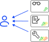

# Управление доступом

В данном разделе описана ролевая модель управления доступом в Picodata и
приведены примеры необходимых для ее настройки с помощью
[DCL](../reference/sql/dcl.md)-команд языка SQL.

## Ролевая модель {: #role_model }

Ролевая модель Picodata позволяет гибко разграничивать возможности
пользователей распределенной системы. Разграничение строится на базе
трех основных понятий: [пользователей](#users),
[привилегий](#privileges) и [ролей](#roles). Привилегии можно назначать
напрямую пользователям:


Также, привилегии могут быть назначены роли, которая, в свою очередь,
может быть присвоена пользователю:



У каждого пользователя может быть одна или несколько ролей. Каждому
пользователю или роли может быть назначена одна или несколько
привилегий. При этом, сразу после создания новая роль не содержит
привилегий: их нужно явно ей присвоить.

Пользователь, который назначает привилегию, должен сам обладать ею.
Глобальные привилегии может назначать только [администратор СУБД](#admin).

См. также:

- [Википедия — Управление доступом на основе ролей][Wiki - RBAC]
- [Википедия — Избирательное управление доступом][Wiki - DAC]
[Wiki - RBAC]: https://ru.wikipedia.org/wiki/Управление_доступом_на_основе_ролей
[Wiki - DAC]: https://ru.wikipedia.org/wiki/Избирательное_управление_доступом

### Объекты доступа {: #access_objects }

<!--
7.1 В СУБД 6, 5, 4 классов защиты должны быть реализованы дискреционный
и ролевой методы управления доступом.
-->

Picodata является распределенной СУБД, и управление доступом происходит
централизованно на всем кластере. Для управления доступом в Picodata
используются дискреционный и ролевой методы. Объектами доступа являются:

<!-- Keep in sync with overview/glossary.md#access_objects -->
- `table` – [таблица БД](#tables_access)
- `user` – учетная запись [пользователя СУБД](#users)
- `role` – [роль](#roles)
- `procedure` – [процедура](#proc_access)

<!--
Дискреционный метод управления доступом субъектов доступа к объектам
доступа СУБД (БД, таблица, запись или столбец, поле, представление,
процедура (программный код) или иные объекты доступа) должен
осуществляться на основе настраиваемых списков управления доступом
(матриц управления доступом).
-->

Доступ к объектам предоставляется на основе настраиваемого списка
управления доступом (access control list, ACL), который определяет,
какими привилегиями обладает пользователь или роль.

### Пользователи СУБД {: #users }

При подключении к системе пользователь указывает имя учетной записи.
Действия, которые пользователь может совершать в системе, определяются
выданными ему привилегиями.

Каждый объект в системе (таблица, роль, учетная запись, процедура) имеет
привязанного к нему владельца — пользователя СУБД. Владельцем объекта
является его создатель. Он обладает неотъемлемыми полными привилегиями
на этот объект.

#### Системные пользователи {: #system_users }

Picodata предоставляет несколько встроенных учетных записей для системных пользователей:

- `admin` — Администратор СУБД
- `pico_service` — служебный пользователь, от имени которого происходит
  коммуникация между инстансами кластера
- `guest` — неавторизованный пользователь

!!! note "Примечание"
    Для установки пароля для служебного пользователя `pico_service`
    поместите в [рабочую директорию инстанса] файл `.picodata-cookie`,
    содержащий пароль. Это нужно сделать до первого запуска инстанса.
    См. также [Безопасный запуск].

[рабочую директорию инстанса]: ../reference/config.md#instance_instance_dir
[Безопасный запуск]: ../tutorial/run.md#secure_run

<!--
Ролевой метод управления доступом должен быть реализован для следующих
ролей пользователей СУБД:

- администратор СУБД,
- администратор БД (администратор информационной системы),
- пользователь БД (пользователь информационной системы).
-->

#### Администратор СУБД {: #admin }

<!--
СУБД должна обеспечивать наделение администратора СУБД следующими правами:

- создавать учетные записи пользователей СУБД;
- модифицировать, блокировать и удалять учетные записи пользователей СУБД;
- назначать права доступа пользователям СУБД к объектам доступа СУБД;
- управлять конфигурацией СУБД;
- создавать, подключать БД.
-->

Администратором СУБД является встроенный пользователь `admin`.

Администратор СУБД является _суперпользователем_ и обладает следующими
привилегиями:

- создавать учетные записи пользователей СУБД
- модифицировать, блокировать и удалять учетные записи пользователей СУБД
- назначать права доступа пользователям СУБД к объектам доступа СУБД
- управлять конфигурацией СУБД
- создавать, подключать БД

#### Администратор БД {: #db_admin }

<!--
СУБД должна обеспечивать наделение администратора БД следующими правами:

- создавать учетные записи пользователей БД;
- модифицировать, блокировать и удалять учетные записи пользователей БД;
- управлять конфигурацией БД;
- назначать права доступа пользователям БД к объектам доступа БД;
- создавать резервные копии БД и восстанавливать БД из резервной копии;
- создавать, модифицировать и удалять процедуры (программный код), хранимые в БД.
-->

Наделить пользователя `alice` правами Администратора БД можно следующим
набором SQL-команд:

```sql
CREATE ROLE db_admin;
GRANT READ TABLE TO db_admin;
GRANT CREATE TABLE TO db_admin;
GRANT CREATE USER TO db_admin;
GRANT CREATE ROLE TO db_admin;
GRANT CREATE PROCEDURE TO db_admin;
GRANT db_admin to alice;
```

Это обеспечивает наличие у администратора БД следующих прав:

- создавать учетные записи пользователей БД
- модифицировать, блокировать и удалять учетные записи пользователей БД
- управлять конфигурацией БД через создание и удаление таблиц БД
- назначать права доступа пользователям БД к таблицам БД
- создавать резервные копии БД и восстанавливать БД из резервной копии
- создавать, модифицировать и удалять хранимые процедуры

При создании объекта пользователь становится его владельцем и
автоматически получает на него неотъемлемые полные привилегии.

#### Пользователь БД {: #db_user }

<!--
СУБД должна обеспечивать наделение пользователя БД следующими правами:

- создавать и манипулировать объектами доступа БД (таблица, запись или
  столбец, поле, представление и иные объекты доступа);
- выполнять процедуры (программный код), хранимые в БД.
-->
Только что созданный пользователь обладает:

- ролью `public`
- привилегией `login` (подключение к кластеру)

Picodata позволяет наделить пользователя БД следующими правами:

- создавать и манипулировать записями в таблицах БД
- выполнять хранимые процедуры

Для этого используйте следующие SQL-команды:

```sql title="Пример для таблицы `warehouse` и пользователя `alice`"
GRANT WRITE ON TABLE warehouse TO alice;
GRANT READ ON TABLE warehouse TO alice;
```

```sql title="Пример для процедуры `proc` и пользователя `alice`"
GRANT EXECUTE ON PROCEDURE proc TO alice;
```

### Привилегии {: #privileges }

В Picodata определены следующие виды привилегий:

- привилегии для работы с пользователями (`CREATE USER`, `ALTER USER`,
  `DROP USER`)
- привилегии для работы с ролями (`CREATE ROLE`, `DROP ROLE`)
- привилегии для работы с таблицами (`CREATE TABLE`, `ALTER TABLE`,
  `DROP TABLE`, `READ TABLE`, `WRITE TABLE`)
- привилегии для работы с процедурами (`CREATE PROCEDURE`, `DROP PROCEDURE`,
  `EXECUTE PROCEDURE`)
- `LOGIN` — право подключаться к экземпляру кластера. Автоматически выдается
  новым пользователям при создании.

!!! note "Примечание"
    Привилегии на управление плагинами имеются только у Администратора СУБД.

См. также:

- [Команды и термины SQL](../sql_index.md)

#### Таблица привилегий {: #privileges_table }

<style>
.md-typeset .admonition.abstract {
    border-color: #9e9e9e;
}

.md-typeset .abstract > .admonition-title {
    background-color: #9e9e9e1a;
}

.md-typeset .abstract > .admonition-title::before {
    background-color: #9e9e9e;
}

.link {
    color:rgb(0, 0, 0) !important;
    text-decoration: none;
}

a.cmd:link,
a.cmd:visited,
a.cmd:hover,
a.cmd:active {
  text-decoration: none;
  color: rgb(0, 0, 0) !important;
}

.sortable table  {

}

td {
    align-content: center;
    padding: 0.75em 0.5em !important;
    line-height: 1.3;
}

td.td3 {
    white-space: nowrap;
}

td.td3 ul {
    list-style-type: none;
}

.td3 ul,
.td3 ul > li {
    margin-left: 0 !important;
    word-break: break-all !important;
}

.tr-header td {
    font-size: 1.25em;
    }

.tr-header > td > span {
    font-family: revert;
}

.tr-header > td.td3 {
    font-size: revert;
}

.center {
    text-align: center !important;
    width: auto;
}

.heading {
    text-align: center !important;
    border: 0.1em solid #9e9e9e;
}

.button {
    font-weight: bold;
}

.legend-id {
    line-height: 2.5em;
    margin-left: 0.5em;
    width: 87em;
}

.legend-dash {
    margin: 0.5em; markdown="span"
}

.ddl,
.dml,
.dcl,
.dql {
    padding: 0.1em 0.5em;
    border-radius: 1em;
    font-family: monospace;
}

.ddl {
    background-color: #d9ead3;
}

.dml {
    background-color: #f4cccc;
}

.dcl {
    background-color: #fff2cc;
}

.dql {
    background-color: #9fcaff;
}

.fill-width {
    width: 600px;
}

.basic table {
    width: 50% !important;
    white-space: nowrap;
    table-layout: fixed !important;
    display: table;
    overflow: auto;
    overflow-x: hidden !important;
    font-size: .64rem;
    max-width: 50%;
    touch-action: auto;
}

.basic th, td {
    overflow-x: hidden !important;
    word-break: break-word;
    border: 0.1em solid #9e9e9e;

}

/* Sortable tables */
table.sortable thead {
    background-color:#eee;
        color:#666666;
    cursor: default;
    margin:0;
    margin-bottom:.5em;
    padding:0 .8rem;
    white-space: nowrap;
    table-layout: fixed !important;
    overflow: auto;
    font-size: .64rem;
    overflow: auto !important;
    overflow-x: visible !important;
}

table.sortable {
    border-width: 0.1em !important;
    border-style: solid;
    width: 67em;
    border-collapse: collapse;
}

table.sortable tbody {
    font-size: .64rem;
}

.container{
  display: block;
  overflow-x: auto;
}

table.legend {
    border-collapse:separate;
    border:solid #9e9e9e 1px;
    border-radius:10px;
    width: 47em;
}

</style>

В таблице ниже показаны привилегии и их возможности по отношению к объектам
доступа. Привилегии показаны отдельно для объектов, созданных текущим
пользователем (_свои объекты_) и объектов, владельцем которых является кто-то
другой (_чужие объекты_).

**Легенда**

SQL-команды выделены в таблице цветом, в зависимости от их типа:

<p markdown="span">
    <span class="ddl legend-id"></span>&nbsp;— [Data Definition Language (DDL)](../reference/sql/ddl.md)<br>
    <span class="dcl legend-id"></span>&nbsp;— [Data Control Language (DCL)](../reference/sql/dcl.md)<br>
    <span class="dml legend-id"></span>&nbsp;— [Data Modification Language (DML)](../reference/sql/dml.md)<br>
    <span class="dql legend-id"></span>&nbsp;— [Data Query Language (DQL)](../reference/sql/dql.md)
</p><br>

<div markdown="span" class="container">
<table markdown="span" class="sortable">
    <thead>
        <tr>
            <th class="heading"><button style='font-weight:bold'>SQL-команда</button></th>
            <th class="heading"><button style='font-weight:bold'>Требуемая привилегия для своих объектов</button></th>
            <th class="heading"><button style='font-weight:bold'>Требуемая привилегия для чужих объектов</button></th>
        </tr>
    </thead>
    <tbody>
        <tr>
            <td><span class="ddl"><a class=cmd href="../../reference/sql/alter_plugin/"/>ALTER PLUGIN</span></td>
            <td>_доступно только для пользователя admin_</td>
            <td>_доступно только для пользователя admin_</td>
        </tr>
        <tr>
            <td><span class="ddl"><a class=cmd href="../../reference/sql/alter_procedure/"/>ALTER PROCEDURE</span></td>
            <td>не требуется</td>
            <td>_не реализовано_</td>
        </tr>
        <tr>
            <td><span class="ddl"><a class=cmd href="../../reference/sql/alter_system/"/>ALTER SYSTEM</span></td>
            <td>_доступно только для пользователя admin_</td>
            <td>_доступно только для пользователя admin_</td>
        </tr>
        <tr>
            <td><span class="ddl"><a class=cmd href="../../reference/sql/alter_table/"/>ALTER TABLE</span></td>
            <td>не требуется</td>
            <td>ALTER TABLE</td>
        </tr>
        <tr>
            <td><span class="ddl"><a class=cmd href="../../reference/sql/create_index/"/>CREATE INDEX</span></td>
            <td>не требуется</td>
            <td>CREATE TABLE</td>
        </tr>
        <tr>
            <td><span class="ddl"><a class=cmd href="../../reference/sql/create_plugin/"/>CREATE PLUGIN</span></td>
            <td>_доступно только для пользователя admin_</td>
            <td>_доступно только для пользователя admin_</td>
        </tr>
        <tr>
            <td><span class="ddl"><a class=cmd href="../../reference/sql/create_procedure/"/>CREATE PROCEDURE</span></td>
            <td>CREATE PROCEDURE</td>
            <td>CREATE PROCEDURE</td>
        </tr>
        <tr>
            <td><span class="ddl"><a class=cmd href="../../reference/sql/create_table/"/>CREATE TABLE</span></td>
            <td>CREATE TABLE</td>
            <td>_не применимо_</td>
        </tr>
        <tr>
            <td><span class="ddl"><a class=cmd href="../../reference/sql/drop_index/"/>DROP INDEX</span></td>
            <td><ul>
                <li>Своя таблица + свой индекс: не требуется</li>
                <li>Чужая таблица + свой индекс: DROP TABLE</li>
                </ul></td>
            <td><ul>
                <li>Своя таблица + чужой индекс: не требуется</li>
                <li>Чужая таблица + чужой индекс: DROP TABLE</li>
                </ul></td>
        </tr>
        <tr>
            <td><span class="ddl"><a class=cmd href="../../reference/sql/drop_plugin/"/>DROP PLUGIN</span></td>
            <td>_доступно только для пользователя admin_</td>
            <td>_доступно только для пользователя admin_</td>
        </tr>
        <tr>
            <td><span class="ddl"><a class=cmd href="../../reference/sql/drop_procedure/"/>DROP PROCEDURE</span></td>
            <td>не требуется</td>
            <td>DROP PROCEDURE</td>
        </tr>
        <tr>
            <td><span class="ddl"><a class=cmd href="../../reference/sql/drop_table/"/>DROP TABLE</span></td>
            <td>не требуется</td>
            <td>DROP TABLE</td>
        </tr>
        <tr>
            <td><span class="ddl"><a class=cmd href="../../reference/sql/truncate_table/"/>TRUNCATE TABLE</span></td>
            <td>не требуется</td>
            <td>WRITE TABLE</td>
        </tr>
        <tr>
            <td><span class="dcl"><a class=cmd href="../../reference/sql/alter_user/"/>ALTER USER</span></td>
            <td>не требуется</td>
            <td>ALTER USER</td>
        </tr>
        <tr>
            <td><span class="dcl"><a class=cmd href="../../reference/sql/create_role/"/>CREATE ROLE</span></td>
            <td>_не применимо_</td>
            <td>CREATE ROLE</td>
        </tr>
        <tr>
            <td><span class="dcl"><a class=cmd href="../../reference/sql/create_user/"/>CREATE USER</span></td>
            <td>_не применимо_</td>
            <td>CREATE USER</td>
        </tr>
        <tr>
            <td><span class="dcl"><a class=cmd href="../../reference/sql/drop_role/"/>DROP ROLE</span></td>
            <td>не требуется</td>
            <td>DROP ROLE</td>
        </tr>
        <tr>
            <td><span class="dcl"><a class=cmd href="../../reference/sql/drop_user/"/>DROP USER</span></td>
            <td>не требуется</td>
            <td>DROP USER</td>
        </tr>
        <tr>
            <td><span class="dcl"><a class=cmd href="../../reference/sql/grant/"/>GRANT</span></td>
            <td>не требуется</td>
            <td>_доступно только для пользователя admin_</td>
        </tr>
        <tr>
            <td><span class="dcl"><a class=cmd href="../../reference/sql/revoke/"/>REVOKE</span></td>
            <td>не требуется</td>
            <td>_доступно только для пользователя admin_</td>
        </tr>
        <tr>
            <td><span class="dcl"><a class=cmd href="../../reference/sql/audit_policy/"/>AUDIT POLICY</span></td>
            <td>_доступно только для пользователя admin_</td>
            <td>_доступно только для пользователя admin_</td>
        </tr>
        <tr>
            <td><span class="dml"><a class=cmd href="../../reference/sql/call/"/>CALL</span></td>
            <td><ul>
                <li>Своя таблица + своя процедура: не требуется</li>
                <li>Чужая таблица + своя процедура: WRITE TABLE</li>
                </ul></td>
            <td><ul>
                <li>Своя таблица + чужая процедура: EXECUTE PROCEDURE</li>
                <li>Чужая таблица + чужая процедура: EXECUTE PROCEDURE + WRITE TABLE</li>
                </ul></td>
        </tr>
        <tr>
            <td><span class="dml"><a class=cmd href="../../reference/sql/delete/"/>DELETE</span></td>
            <td>не требуется</td>
            <td>READ TABLE + WRITE TABLE</td>
        </tr>
        <tr>
            <td><span class="dml"><a class=cmd href="../../reference/sql/insert/"/>INSERT</span></td>
            <td>не требуется</td>
            <td>WRITE TABLE</td>
        </tr>
        <tr>
            <td><span class="dml"><a class=cmd href="../../reference/sql/update/"/>UPDATE</span></td>
            <td>не требуется</td>
            <td>READ TABLE + WRITE TABLE</td>
        </tr>
        <tr>
            <td><span class="dql"><a class=cmd href="../../reference/sql/select/"/>SELECT</span></td>
            <td>не требуется</td>
            <td>READ TABLE</td>
        </tr>
      </tbody>
</table>
</div>

### Роли {: #roles }

Роль представляет собой именованную группу привилегий, что позволяет
структурировать управление доступом. Чтобы выдать или отозвать
привилегию у роли, используйте команды [GRANT](../reference/sql/grant.md)
и [REVOKE](../reference/sql/revoke.md).

Названия ролей `public`, `super` и `replication` являются зарезервированными.

Роль `public` автоматически назначается всем создаваемым
пользователям. Наделение роли `public` привилегией на какой-либо объект
делает его общедоступным.

Роль `super` является системной и используется исключительно для
внутренних целей.

Роль `replication` зарезервирована как системная для корректной работы
механизма репликации.

## Начало работы {: #getting_started }

Для начала работы с пользователями, привилегиями и ролями следует
[подключиться](../tutorial/connecting.md) к инстансу Picodata.

## Управление пользователями {: #user_management }

### Методы аутентификации {: #auth_types }

При создании и модификации пользователей в Picodata поддерживаются следующие
методы аутентификации:

- [md5](https://ru.wikipedia.org/wiki/MD5) (используется по умолчанию)
- [ldap](https://ru.wikipedia.org/wiki/LDAP) (предназначен для для
  доступа [доменных учетных записей](../admin/ldap.md))
- [chap-sha1](https://ru.wikipedia.org/wiki/SHA-1) (рекомендуется
  использовать только для [системных пользователей](#system_users))
- [scram-sha256](https://ru.wikipedia.org/wiki/SCRAM) (безопасный метод
  аутентификации, сохраняющий пароль в зашифрованном виде на сервере.
  Предназначен для доступа по протоколу PostgreSQL)

Для методов `md5`, `chap-sha1` и `scram-sha256` действуют
[требования](#allowed_passwords). Для метода `ldap` пароль не требуется
и игнорируется.

### Создание {: #create_user }

Для создания пользователя используйте SQL-команду [CREATE
USER](../reference/sql/create_user.md).

Пример:

```sql
CREATE USER alice WITH PASSWORD 'P@ssw0rd' USING md5;
CREATE USER bob USING ldap;
```

Для имени пользователя (и в целом для объектов в Picodata) действуют
[правила использования допустимых
символов](../reference/sql/object.md). Также следует учитывать
[требования](#allowed_passwords) к длине и сложности пароля.

Для выполнения команды требуется привилегия `CREATE USER`:

```sql
GRANT CREATE USER TO alice;
```

Такое право по умолчанию есть у [Администратора СУБД](#admin) (`admin`).

### Модификация {: #alter_user }

Для изменения учетных данных пользователя используйте SQL-команду [ALTER
USER](../reference/sql/alter_user.md).

Для выполнения команды требуется привилегия `ALTER USER` на
конкретную учетную запись или на все учетные записи сразу:

```sql
GRANT ALTER ON USER bob TO alice;
GRANT ALTER USER TO alice;
```

Привилегия `ALTER USER` есть по умолчанию у создателя данной учетной
записи и у [Администратора СУБД](#admin).

### Блокирование {: #block_user }

Для блокировки пользователя `alice` используйте следующую SQL-команду:

```sql
ALTER USER alice WITH NOLOGIN;
```

После 4 неуспешных попыток аутентификации пользователь блокируется
автоматически.

Для разблокировки пользователя используйте следующую SQL-команду:

```sql
ALTER USER alice WITH LOGIN;
```

Для выполнения команд требуется привилегия `ALTER USER` — на все учетные
записи или на конкретную.

По умолчанию привилегия `ALTER USER` есть у создателя учетной записи
и у администратора СУБД.

### Удаление {: #drop_user }

Для удаления пользователя `alice` используйте SQL-команду
[DROP USER](../reference/sql/drop_user.md):

```sql
DROP USER alice;
```

Для выполнения команды требуется привилегия `DROP USER` на
конкретную учетную запись или на все учетные записи сразу:

```sql
GRANT DROP ON USER bob TO alice;
GRANT DROP USER TO alice;
```

Привилегия `DROP USER` есть по умолчанию у создателя данной учетной
записи и у [Администратора СУБД](#admin).

### Просмотр списка пользователей {: #list_users }

Пользователи Picodata хранятся в глобальной системной таблице
`_pico_user`. Для просмотра всего списка используется следующая
команда:

```sql
SELECT * FROM _pico_user;
```

Доступ к списку пользователей есть у Администратора СУБД, а также у тех
пользователей, которым была явно выдана такая привилегия:

```sql
GRANT READ ON TABLE _pico_user TO alice;
```

### Установка и изменение пароля {: #setting_password }

Для установки или изменения пароля на `T0psecret` для пользователя `alice` используйте следующую
SQL-команду:

```sql
ALTER USER "alice" WITH PASSWORD 'T0psecret';
```

### Требования к паролю {: #allowed_passwords }

При установке или изменении пароля пользователя следует учитывать требования к
его длине и сложности в том случае, если используются методы аутентификации
`md5`, `chap-sha1` или `scram-sha256` (для метода `ldap` пароль не требуется и игнорируется):

- пароль должен быть не короче 8 символов
- пароль должен одновременно содержать минимум один символ в нижнем
  регистре, символ в верхнем регистре и одну цифру

Пример некорректного пароля: `topsecret`

Пример корректного пароля: `T0psecret`

<!--
Требования к паролю хранятся в системной таблице
[`_pico_property`](../architecture/system_tables.md#_pico_property).

PasswordEnforceUppercase (default value: true)
PasswordEnforceLowercase (default value: true)
PasswordEnforceDigits (default value: true)
PasswordEnforceSpecialchars (default value: false)
-->

### Использование ролей {: #role_management }

Для создания и удаления ролей используйте команды
[CREATE ROLE](../reference/sql/create_role.md) и
[DROP ROLE](../reference/sql/drop_role.md).

Выполнение данных действий требует наличия привилегий `CREATE ROLE` /
`DROP ROLE` соответственно.

Для назначения роли `manager` пользователю `alice` используйте команду [GRANT](../reference/sql/grant.md):

```sql
GRANT manager TO alice;
```

Назначение привилегии `ALTER` на таблицу `warehouse` для роли `manager`:

```sql title="На конкретную таблицу `warehouse`"
GRANT WRITE ON TABLE warehouse TO manager;
```

```sql title="На все таблицы"
GRANT WRITE TABLE TO manager;
```

В подобных командах можно использовать как идентификатор роли, так и
пользователя. Стоит отметить, что не все привилегии можно выдать ролям,
например, привилегия `SESSION` не может быть выдана другой роли при
помощи `GRANT`, а только командой [`ALTER USER`](#alter_user).

Выдать или отозвать роль может только ее создатель.
Исключением является [администратор СУБД](#admin),
который может выдать или отозвать любую роль.

Отозвать роль можно с помощью команды [REVOKE](../reference/sql/revoke.md):


```sql title="Отзыв привилегии у роли"
REVOKE WRITE ON TABLE warehouse FROM manager;
```

```sql title="Отзыв роли у пользователя"
REVOKE manager FROM alice;
```

## Управление доступом к веб-интерфейсу {: #webui_mgmt }

По умолчанию, для доступа к [веб-интерфейсу] необходимо пройти
аутентификацию, указав действующее имя учетной записи в СУБД Picodata и
корректный пароль. Аутентификация доступна всем пользователям с
привилегией `LOGIN`.

Администратор БД может явным образом включать/выключать режим
аутентификации. Когда аутентификация отключена, доступ к веб-интерфейсу
не ограничивается — страница с обзором кластера открывается сразу.

Режим аутентификации для веб-интерфейса управляется параметром
`jwt_secret` в системной таблице `_pico_db_config`. Для отключения
аутентификации задайте параметру пустое значение:

```sql
ALTER SYSTEM SET jwt_secret = '';
```

Для того, чтобы включить аутентификацию обратно, сбросьте значение
параметра:

```sql
ALTER SYSTEM RESET jwt_secret;
```

[веб-интерфейсу]: ../tutorial/webui.md

!!! warning "Внимание"
    Для повышения безопасности необходимо
    использовать SSL-терминатор (обратный прокси с SSL-терминацией) —
    промежуточный сервер, который принимает зашифрованный HTTPS-трафик от
    клиентов, расшифровывает его и перенаправляет на внутренние серверы в
    виде обычного HTTP-запроса. Это позволит не передавать по сети пароль
    пользователя в открытом виде.

## Управление доступом к таблицам {: #tables_access }

<!--
Списки управления доступом (матрицы управления доступом) должны
позволять задавать разрешение или запрет пользователям и процедурам
(программному коду), хранимым в БД, выполнять следующие операции в
отношении объектов доступа СУБД (БД, таблица, запись или столбец, поле,
представление или иные объекты доступа): создание, модификация,
удаление, чтение.
-->

Picodata позволяет задавать разрешение пользователям и процедурам
выполнять следующие операции в отношении таблиц БД: создание,
модификация, удаление, чтение.

Для наделения пользователя `alice` и созданных им процедур указанными
привилегиями на таблицу `warehouse` используйте SQL-команды
[GRANT](../reference/sql/grant.md):

<!-- Keep in sync with #db_user -->
```sql
GRANT CREATE TABLE TO alice;
GRANT ALTER ON TABLE warehouse TO alice;
GRANT DROP ON TABLE warehouse TO alice;
GRANT READ ON TABLE warehouse TO alice;
GRANT WRITE ON TABLE warehouse TO alice;
```

Отозвать привилегию можно SQL-командой
[REVOKE](../reference/sql/revoke.md). Например:

```sql
REVOKE DROP ON TABLE warehouse FROM alice;
```

В качестве `<table_name>` можно использовать имена [системных таблиц] —
по умолчанию доступ к ним запрещен всем [пользователям СУБД](#users), кроме
`admin` и `pico_service`.

Привилегию на создание таблиц можно использовать как на все таблицы
(`CREATE TABLE`), так и на явно указанную таблицу (`CREATE ON TABLE
<table_name>`):

```sql
GRANT CREATE ON TABLE sklad TO alice;
```

Соответственно, администратор может отозвать конкретную привилегию через
`REVOKE`:

```sql
REVOKE CREATE ON TABLE sklad FROM alice;
```

[системных таблиц]: ../architecture/system_tables.md

## Управление доступом к процедурам {: #proc_access }

<!--
Списки управления доступом (матрицы управления доступом) должны
позволять задавать разрешение или запрет пользователям СУБД выполнять
следующие операции в отношении процедур (программного кода), хранимых в
БД:

- создание;
- модификация, удаление, исполнение.
-->

Picodata позволяет задавать разрешение пользователям СУБД
выполнять следующие операции в отношении процедур: создание,
модификация, удаление, исполнение.

Для наделения пользователя `alice` указанными привилегиями для процедуры `proc` используйте
SQL-команду [GRANT](../reference/sql/grant.md):

<!-- Keep in sync with #db_user -->
```sql
GRANT CREATE PROCEDURE TO alice;
GRANT DROP ON PROCEDURE proc TO alice;
GRANT EXECUTE ON PROCEDURE proc TO alice;
```

Отозвать привилегию можно SQL-командой
[REVOKE](../reference/sql/revoke.md). Например:

```sql
REVOKE DROP ON PROCEDURE proc FROM alice;
```
