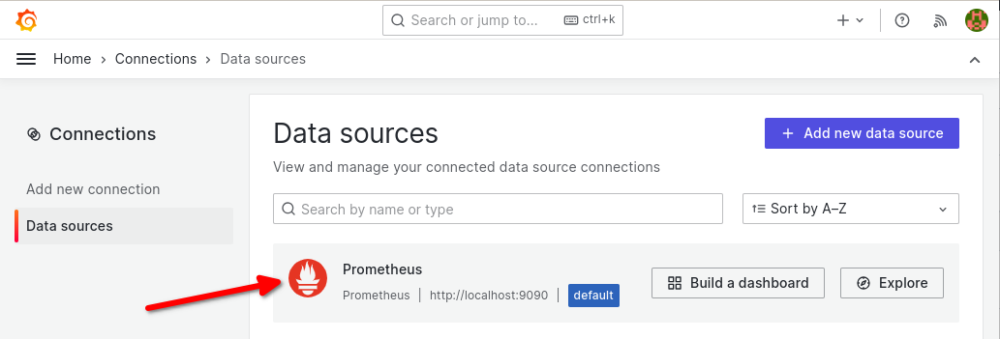
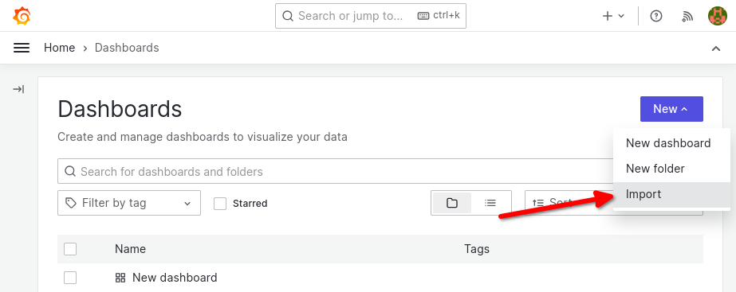
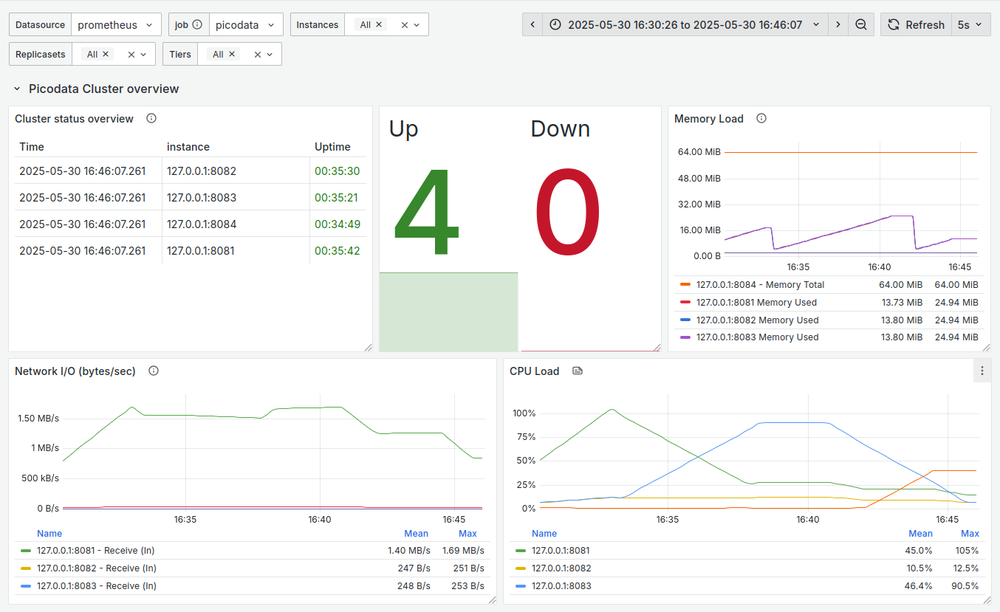

# Dashboard для Grafana

В данном разделе приведена информация об установке dashboard для мониторинга
запущенного кластера Picodata в [Grafana]. Dashboard представляет собой
интерактивную приборную панель, которая отображает данные в реальном времени и
позволяет в удобном и наглядном виде визуализировать важные параметры кластера,
следить за его производительностью, оперативно реагировать на инциденты и
устранять неполадки.

## Возможности и требования {: #features_and_requirements }

Мы предоставляем заранее сконфигурированный dashboard-файл
[Picodata.json], который можно импортировать в интерфейсе Grafana и
использовать для отслеживания [состояния кластера], изменения [состава и
роли узлов], а также для оперативного доступа к [метрикам] Picodata.

Для использования dashboard-файла необходимо:

- иметь доступ к [развернутому] кластеру Picodata
- настроить [источник данных](#datasource_setup) для Grafana

[состояния кластера]: local_monitoring.md
[метрикам]: ../reference/metrics.md
[состава и роли узлов]: ../overview/glossary.md#node_states
[развернутому]: ../tutorial/deploy.md

## Настройка для развернутого кластера {: #cluster_case }

### Настройка источника данных {: #datasource_setup }

Перед настройкой Grafana сконфигурируйте и запустите систему мониторинга
[Prometheus], которая является источником данных для Grafana.

Установите и настройте Prometheus согласно рекомендациям для вашей ОС.
Укажите для Prometheus цели в файле `/etc/prometheus/prometheus.yml`:

```yaml title="Пример минимальной конфигурации"
global:
  scrape_interval: 10s

scrape_configs:
  - job_name: 'picodata'
    scrape_interval: 5s
    metrics_path: /metrics
    static_configs:
      - targets: ['127.0.0.1:8081']
```

В приведенном примере:

- `127.0.0.1:8081` — адрес, с которого Prometheus собирает метрики
  (должен соответствовать параметру `--http-listen` при запуске инстанса
  Picodata или параметру [instance.http.listen] при использовании [файла конфигурации])

Под каждый инстанс Picodata нужно выделять отдельный адрес сбора метрик.
Например, если локально запустить 4 инстанса Picodata, то файл
конфигурации Prometheus может выглядеть так:

```yaml
global:
  scrape_interval: 10s

scrape_configs:
  - job_name: 'picodata'
    scrape_interval: 5s
    metrics_path: /metrics
    static_configs:
      - targets: ['127.0.0.1:8081', '127.0.0.1:8082', '127.0.0.1:8083', '127.0.0.1:8084']
```

В промышленной эксплуатации кластера для получения списка значений для
поля `targets` используйте роль Ansible: после выполнения плейбука будет
создан yaml-файл `report.yml`, в котором будет, в том числе, готовая
секция `scrape_configs` с перечислением всех инстансов и портов
кластера.

См. также:

- [Развертывание кластера через Ansible](deploy_ansible.md)

### Настройка Grafana {: #grafana_setup }

После того как Prometheus сконфигурирован и запущен, установите и
настройте Grafana согласно рекомендациям для вашей ОС. Удостоверьтесь,
что Grafana работает, открыв в веб-браузере URL, на котором она запущена.

!!! note "Примечание"
    URL для доступа к Grafana задается в файле [grafana.ini]. По
    умолчанию это `127.0.0.1:3000`.

[grafana.ini]: https://grafana.com/docs/grafana/latest/setup-grafana/configure-grafana/

Далее выполните следующие шаги.

1.&nbsp;Убедитесь, что в настройках подключений в Grafana (`Connections` >
   `Data sources`) имеется источник данных Prometheus:



2.&nbsp;Импортируйте dashboard с данными Picodata. Для этого понадобится файл
   [Picodata.json], который следует добавить в меню `Dashboards` > `New` > `Import`:



После этого в Grafana можно будет оперативно отслеживать состояние
инстансов, потребляемую память, нагрузку на сеть, изменения в составе
кластера и прочие параметры:



[Docker]: https://www.docker.com
[Grafana]: https://grafana.com
[Prometheus]: https://prometheus.io
[Picodata.json]: https://git.picodata.io/core/picodata/-/tree/master/monitoring/dashboard
[instance.http.listen]: ../reference/config.md#instance_http_listen
[файла конфигурации]: ../reference/config.md#config_file_description
[исходного кода]: ../tutorial/install.md#getting_sources

## Локальный доступ к Grafana {: #grafana_local }

Picodata предоставляет быстрый способ автоматически поднять
веб-интерфейс Grafana и получить доступ к приборной панели с метриками
кластера. Для этого необходимо иметь в системе запущенную службу
[Docker] и консольную утилиту `docker-compose`.

??? note "Доступ к Grafana для локальной отладки"
    В дереве [исходного кода] Picodata перейдите в директорию `monitoring` и
    выполните команду:

    ```shell
    docker-compose up -d
    ```
    На локальном узле будет запущен [Prometheus], настроенный на получение
    данных с адресов `127.0.0.1:8081`, `127.0.0.1:8082`, `127.0.0.1:8083`
    (адреса и прочие настройки Prometheus можно изменить в файле
    `monitoring/prometheus/prometheus.yml`).

    Также, будет поднят сервер Grafana по адресу `127.0.0.1:3000` (порт
    настраивается в файле `docker-compose.yml`). Для авторизации используйте
    `admin`/`grafana`.

    Импортируйте dashboard из файла [Picodata.json].
