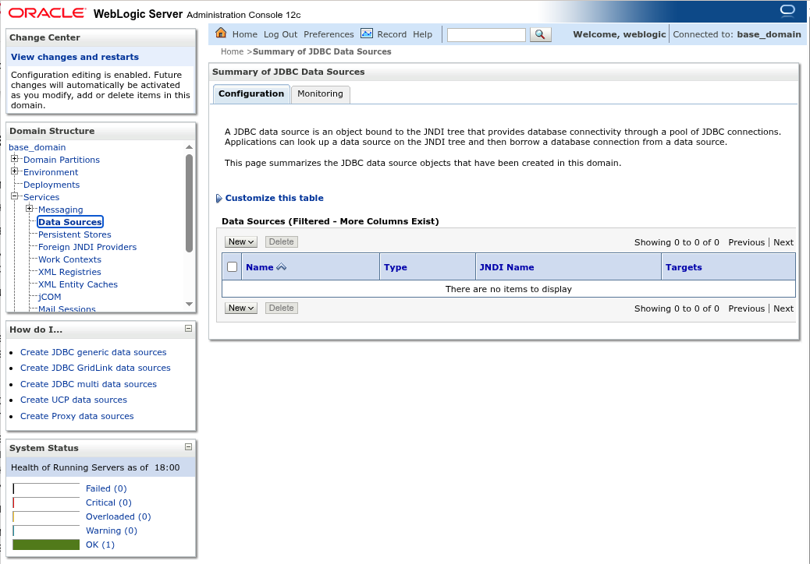
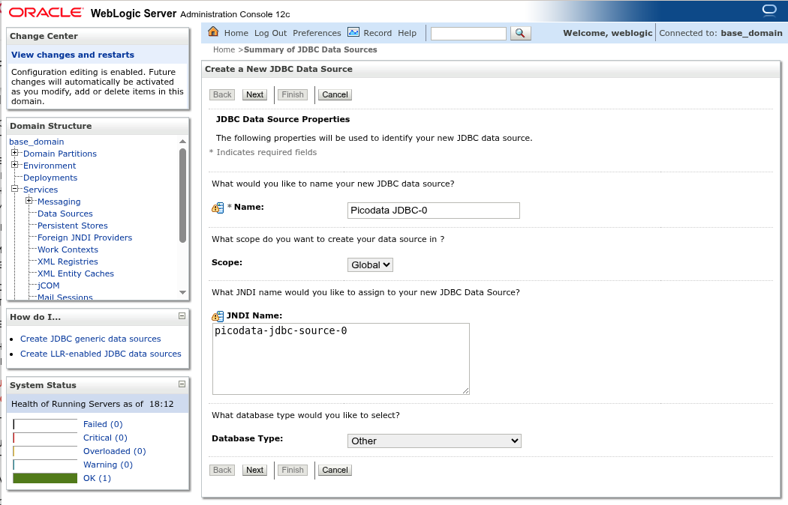
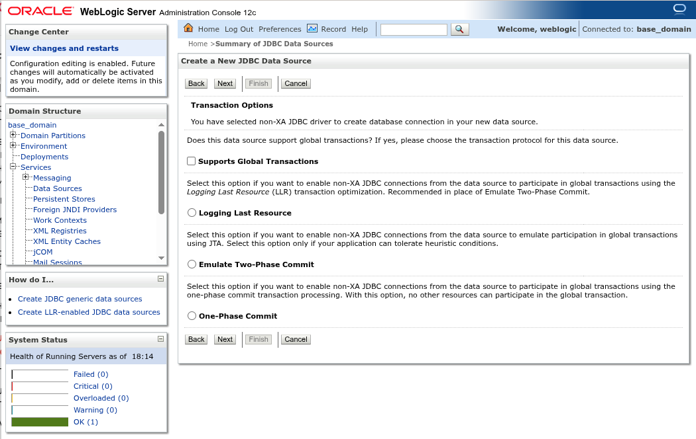
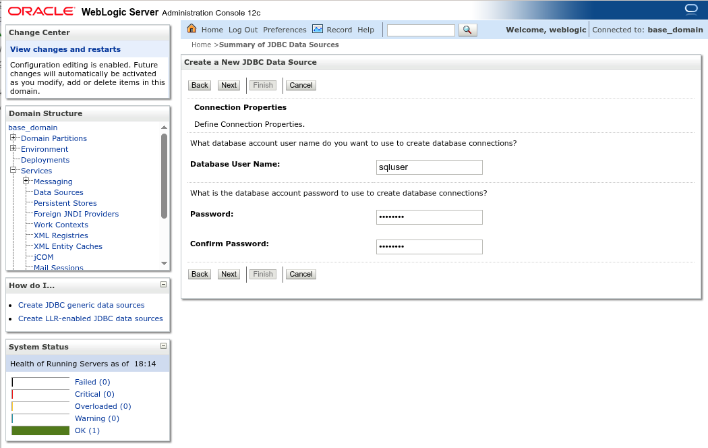
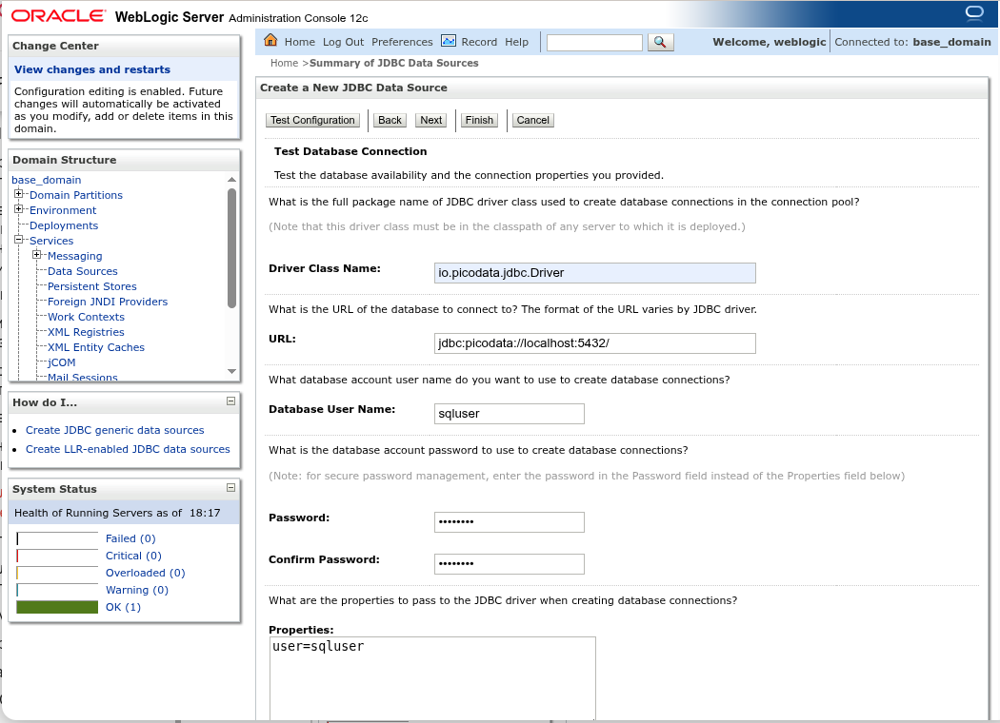
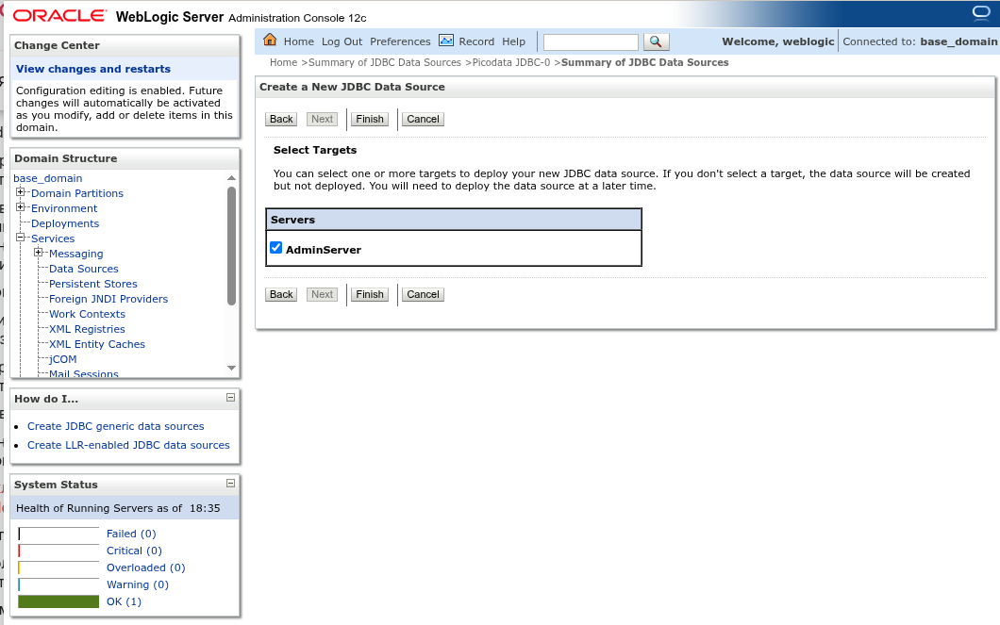
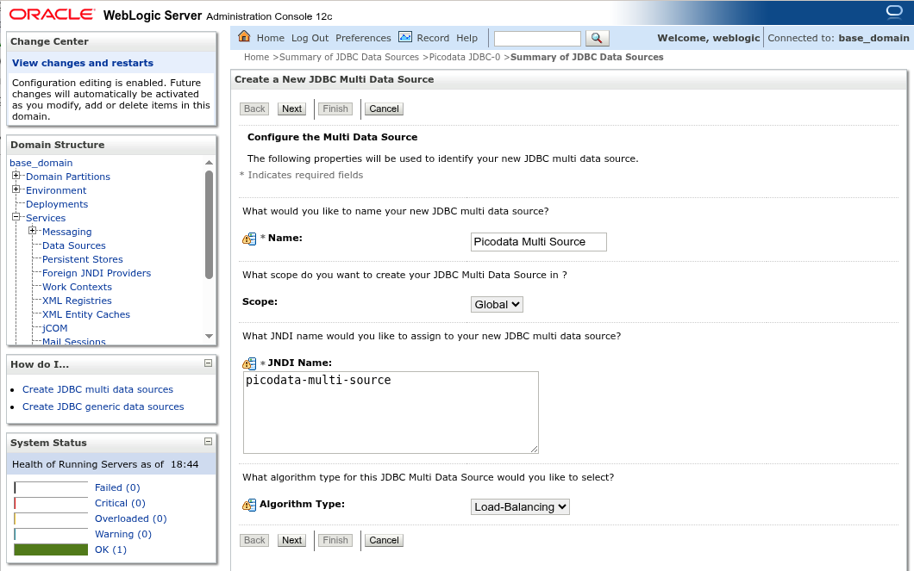
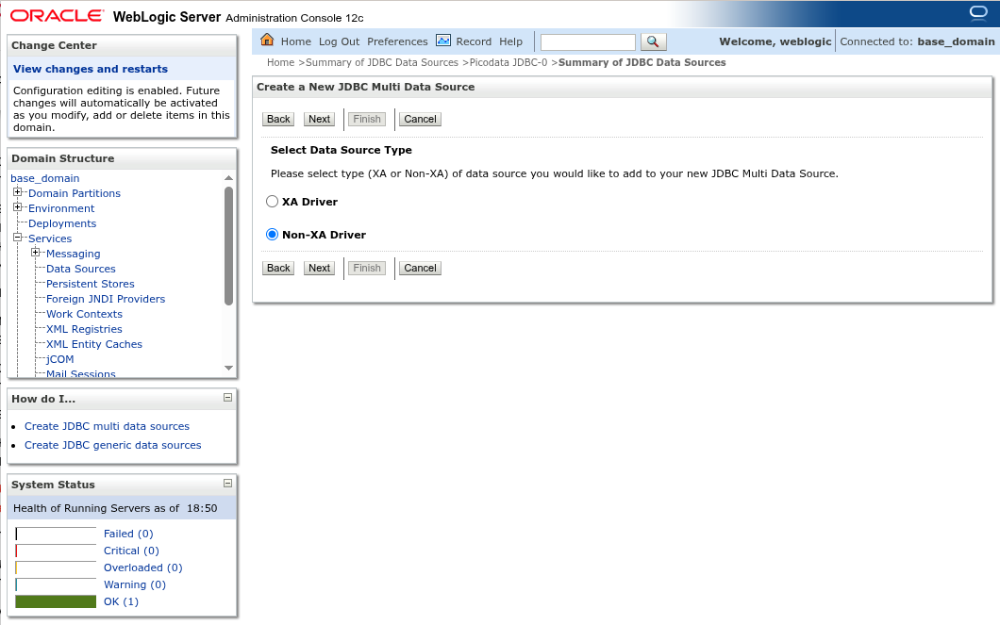
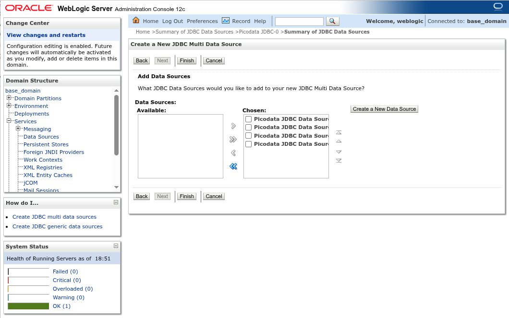

# Подключение к кластеру в Oracle Weblogic

В данном разделе приведены сведения о настройке подключения к
[работающему кластеру Picodata] в [Oracle Weblogic Server] —
коммерческом сервере Java-приложений.

[работающему кластеру Picodata]: ../tutorial/deploy.md
[Oracle Weblogic Server]: https://www.oracle.com/java/weblogic/

## Общие сведения {: #intro }

Для использования Java-приложений с СУБД Picodata необходим JDBC-драйвер
Picodata. Драйвер импортируется в Weblogic Server и позволяет
использовать СУБД Picodata как источник данных (Data Source). Поскольку
кластер Picodata — распределённая система, то для каждого [репликасета]
кластера следует создать по отдельному источник данных и затем
объединить их в общий мульти-источник для того, что обеспечить
балансировку нагрузки при работе с данными. В дальнейшем, при
развёртывании клиентских приложений в Weblogic Server, следует
использовать именно этот мульти-источник.

[репликасета]: ../overview/glossary.md#replicaset

!!! note "Примечание"
    В данном руководстве для примера приводится Oracle
    Weblogic Server 12, работающий под Oracle Java 8. Настройки для других
    версий могут отличаться.

## Предварительные требования {: #prerequisites }

Для выполнения действий, описанных в данном руководстве, понадобятся:

- доступ к [работающему кластеру Picodata], в том числе, возможность
  повышения привилегий до Администратора СУБД
- драйвер [picodata-jdbc]
- установленный и развёрнутый [Oracle Weblogic Server], включая доступ у
  его консоли управления

[picodata-jdbc]: https://binary.picodata.io/service/rest/repository/browse/maven-releases/io/picodata/picodata-jdbc/

См. также:

- [Описание JDBC-драйвера Picodata](../dev/connectors/jdbc.md)

## Подготовка окружения {: #preparations }

Выполните следующие шаги:

- разверните Oracle Weblogic Server согласно [документации]
  производителя и настройте сервер (например, запустив исполняемый файл
  `Oracle_Home/oracle_common/common/bin/config.sh`)
- загрузите дистрибутив драйвера [picodata-jdbc] с включёнными
  зависимостями (`picodata-jdbc-x.x.x-shaded.jar`) и положите его в
  директорию `DOMAIN_HOME/lib`
- запустите Weblogic Server с помощью исполняемого файла
  `startWebLogic.sh` в директории `DOMAIN_HOME/bin`
- запустите кластер Picodata, определив для каждого инстанса порт [приёма подключений по протоколу PostgreSQL].
  Указанные порты будут использоваться в дальнейшем JDBC-драйвером Picodata
- в Picodata [создайте пользователя], под которым JDBC-драйвер сможет
  авторизоваться в кластере. Важно указать `md5` в качестве типа
  авторизации. Убедитесь, что подключение к кластеру по протоколу
  PostgreSQL с выбранными параметрами [корректно работает].

[приёма подключений по протоколу PostgreSQL]: ../reference/config.md#instance_pgproto_listen
[документации]: https://www.oracle.com/webfolder/technetwork/tutorials/obe/fmw/wls/12c/12_2_1/01-02-002-InstallWLSGeneric/installwlsgeneric.html
[создайте пользователя]: access_control.md#create_user
[корректно работает]: ../tutorial/connecting.md

## Настройка источников данных {: #setup_sources }

### Добавление источника {: #add_datasource }

Авторизуйтесь в консоли управления Oracle Weblogic Server
(`http://<server>:7001/console`) и перейдите в раздел **Services** >
**Data Sources**:

Создайте новый обычный источник данных (**New** > **Generic Data
Source**). Заполните следующие поля:

- имя источника (_Name_)
- имя JNDI (_JNDI Name_), по которому клиентские приложения смогут идентифицировать источник данных
- тип базы данных (_Database Type_) — выберите вариант **Other**

Нажмите **Next** для подтверждения настроек, и затем ещё раз *Next*. На
следующем экране снимите флаг у пункта, отвечающего за поддержку
глобальных транзакций (**Supports Global Transactions**):

Нажмите **Next** для перехода к следующему шагу. Укажите имя
пользователя и пароль для подключения к базе данных (пользователь с
этими данными должен существовать в Picodata).

Нажмите **Next** для перехода к следующему шагу. Укажите данные
JDBC-драйвера и параметры подключения:

- Driver Class Name: `io.picodata.jdbc.Driver`
- URL: `jdbc:picodata://localhost:5432/`
- Database User Name: `sqluser` (пример пользователя, под которым драйвер сможет авторизоваться в Picodata)
- поля `Password:` и `Confirm Password:` — идентичные экземпляры пароля для указанного выше пользователя

В качестве значения URL можно указать несколько инстансов, относящихся к
одному и тому же репликасету в кластере Picodata, например:

 `jdbc:picodata://srv1:5432,srv2:5432/`

!!! note "Прмиечание"
    В примере использован порт `5432` — он должен соответствовать порту
    [приёма подключений по протоколу PostgreSQL] для каждого инстанса. Также,
    в конце URL должен обязательно стоять замыкающий знак `/`.

Проверьте корректность настроек с помощью кнопки **Test Configuration**:
должно появиться сообщение _Connection test succeeded_. Если это не так,
то при вводе данных была сделана ошибка, либо инстанс Picodata по
какой-либо причине не принимает подключения (сетевая недоступность,
пользователь с неверным типом авторизации и т.д.).

Нажмите **Next** для перехода к следующему шагу. Отметьте целевой
сервер, на котором будет развёрнут источник данных:

Нажмите **Finish**. Добавление и развёртывание источника данных завершено.

Аналогичным образом добавьте источники данных для остальных инстансов кластера.

### Объединение источников {: #join_datasources }

Для объединения ранее созданных источников данных перейдите в раздел **Services** >
**Data Sources** и создайте новый мульти-источник (**New** > **Multi Data
Source**). Заполните следующие поля:

- имя мульти-источника (_Name_)
- имя JNDI (_JNDI Name_), по которому клиентские приложения смогут идентифицировать мульти-источник данных
- тип алгоритма (_Algorithm Type_), по которому будут использоваться
  разные вложенные источники — выберите вариант **Load Balancing**
  (алгоритм балансировки по принципу Round Robin).

Нажмите **Next** для перехода к следующему шагу. Отметьте целевой
сервер, на котором будет развёрнут источник данных и нажмите **Next**.

Убедитесь, что на данном шаге выбран вариант **Non-XA Driver** — именно к
нему относятся ранее добавленные обычные источники данных.

Нажмите **Next** для перехода к следующему шагу. Добавьте в состав
мульти-источника ранее созданные обычные источники.

Нажмите **Finish**. Добавление и развёртывание мульти-источника данных завершено.
