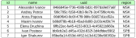
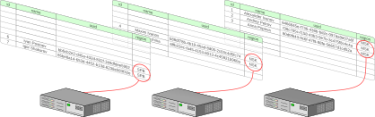

# Типы таблиц

В данном разделе описаны доступные в Picodata типы таблиц и приведены
рекомендации по выбору типа в зависимости от характера нагрузки и задач
эксплуатации СУБД.

## Шардированные таблицы {: #sharded_tables }

**Описание**

Шардирование в SQL — это метод [горизонтального масштабирования], при
котором одна большая таблица разбивается на части (шарды) по
определенному ключу и распределяется по узлам кластера. Каждый
шард содержит только часть строк, что позволяет параллельно обрабатывать
запросы и снимать нагрузку с одного узла.

В Picodata применяется шардирование на основе хеш-функций — это
обеспечивает равномерность разделения строк таблицы между узлами
кластера.

Проиллюстрируем принцип шардирования. [Создадим таблицу] с ключом
распределения по колонке `region`:

```sql
CREATE TABLE t (
    id INTEGER NOT NULL,
    name TEXT,
    uuid UUID,
    region TEXT,
    PRIMARY KEY (id))
USING memtx DISTRIBUTED BY (region)
OPTION (TIMEOUT = 3.0);
```

После заполнения данными таблица может выглядеть, например, так:



Если кластер Picodata располагается на трёх вычислительных узлах, то
каждый из них будет хранить часть строк таблицы — в соответствие с тем,
по какой колонке задано распределение:



Распределенность в Picodata проявляется в виде поддержки шардированных
таблиц — это ключевое преимущество данной СУБД.

При этом, SQL-планировщик предоставляет интерфейс доступа к
шардированной таблице целиком — соответственно, при необходимости он
может обойти несколько узлов при исполнении запроса.

См. также:

- [Распределенный SQL](../architecture/distributed_sql.md)

[Создадим таблицу]: ../reference/sql/create_table.md
[горизонтального масштабирования]: ../overview/glossary.md#sharding

**Рекомендации по использованию**

Используйте шардированные таблицы в тех случаях, когда в БД требуется
хранить часто меняющиеся данные и предполагается значительная нагрузка
на запись в кластере.

### Нежурналируемые таблицы {: #unlogged_tables }

**Описание**

Нежурналируемые таблицы — разновидность шардированных таблиц. Обновления
такой таблицы не записываются в [журнал упреждающей записи]. Если
доступность мастера репликасета, на котором хранится нежурналируемая
таблица, теряется (например, при перезапуске соответствующего инстанса),
то хранимая на репликасете часть таблицы будет утеряна.
Нежурналируемые таблицы не реплицируются, и могут быть созданы только на
[движке хранения данных] `memtx`. Достоинством нежурналируемых таблиц
является более быстрое исполнение [DML]-запросов.

[журнал упреждающей записи]: ../overview/glossary.md#wal
[движке хранения данных]: ../overview/glossary.md#db_engine
[DML]: ../reference/sql/dml.md

**Рекомендации по использованию**

Используйте нежурналируемые таблицы для выигрыша в скорости записи
данных в тех случаях, когда персистентность информации не так важна.

## Глобальные таблицы {: #global_tables }

**Описание**

Глобальные таблицы присутствуют на всех узлах кластера. Все записи,
хранимые в таких таблицах, "физически" находятся на каждом узле
(поддерживается их актуальная копия). В отличие от шардированных таблиц,
глобальные таблицы обеспечивают высокую скорость локального чтения и
эффективные [JOIN]-запросы, так как полная копия данных доступна на
любом узле без межсетевого взаимодействия

[JOIN]: ../reference/sql/join.md

**Рекомендации по использованию**

Используйте глобальные таблицы для хранения редко меняющихся данных.
Например, для этого подходят справочники, которые редко обновляются, но
часто обрабатывают запросы на чтение данных.

## Системные таблицы {: #system_tables }

**Описание**

Системные таблицы — разновидность глобальных таблиц. Они так же
присутствуют на всех узлах кластера, но используются в служебных целях.
Например, в них хранятся данные о всех существующих объектах БД
(таблицы, пользователи, роли), а также системные настройки кластера.

См. также:

- [Описание системных таблиц](../architecture/system_tables.md)
