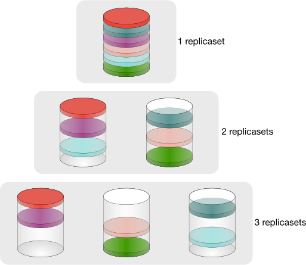
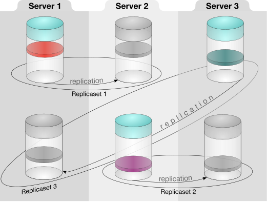
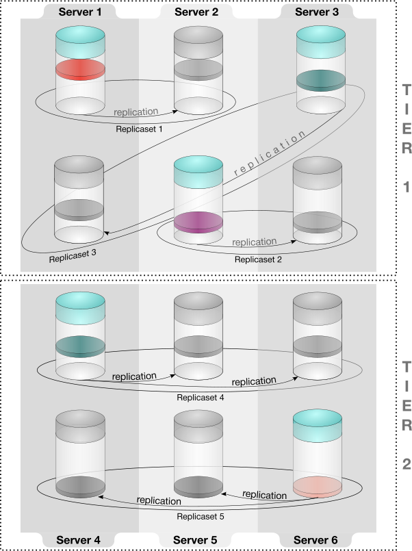
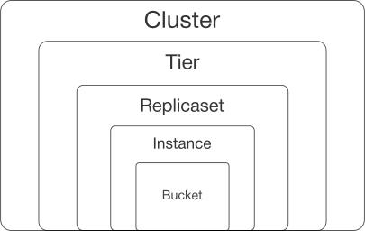
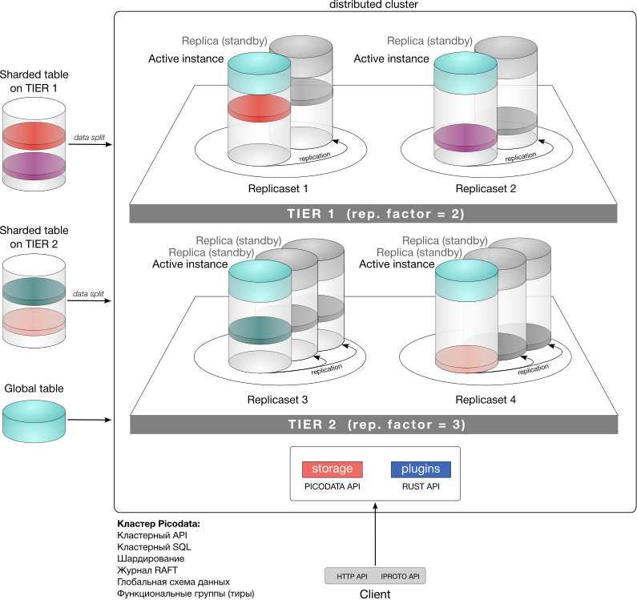
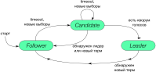

# Общее описание продукта

Данный раздел содержит общие сведения о продукте Picodata, его назначении, области применения и внутреннем устройстве.

## Что такое Picodata? {: #description }

Picodata — это распределенная СУБД, совместимая с PostgreSQL, с возможностью расширения функциональности за счет плагинов. Исходный код Picodata открыт и
доступен как в нашем [основном репозитории](https://git.picodata.io/core/picodata), так и в [зеркале на
GitHub](https://github.com/picodata/picodata).

Программное обеспечение Picodata реализует хранение структурированных и неструктурированных данных, транзакционное управление данными, язык запросов SQL, а также поддержку плагинов на языке Rust.

## Назначение {: #purpose }

Основным назначением продукта Picodata является хранение структурированных и неструктурированных данных, а также высокопроизводительные вычисления над данными внутри горизонтально масштабируемого кластера. Данная комбинация возможностей позволяет эффективно работать с наиболее востребованными, часто изменяющимися, *горячими* данными в высоконагруженной среде.
В традиционных корпоративных архитектурах, где используются классические универсальные СУБД, для ускорения и повышения надежности доступа к данным применяют кэши и шины данных. Picodata позволяет заменить три компонента корпоративной архитектуры — кэш, шину и витрину доступа к данным — единым, высокопроизводительным и строго консистентным решением.

## Роль в платформе данных {: #platform }

В составе корпоративной платформы данных Picodata отвечает за операционный слой хранения данных и является решением класса In-Memory Data Grid (IMDG). Это резидентная база данных для очень быстрой обработки среднего по объему массива данных. Все данные хранятся в оперативной памяти, но при этом они персистентны за счет журнала упреждающей записи (WAL) и создания снимков БД (snapshots) на диске. Ниже показана условная пирамида управления данными с точки зрения их объема.

Picodata занимает верхнюю часть пирамиды, т.к. оперирует данными ограниченного объема. На изображении показаны примеры прочих СУБД, которые служат для управления более крупными массивами данных и лучше подходят для архивного хранения и построения аналитических отчетов. В то же время такие СУБД хуже справляются с потоком часто меняющихся данных. Это именно та область, где Picodata эффективно решает поставленные задачи.

## Решаемые задачи {: #features }

Программное обеспечение Picodata решает следующие задачи:

* реализация общего [линеаризованного](../overview/glossary.md#linearizability) хранилища конфигурации, схемы данных и топологии кластера, встроенного в распределенную систему управления базами данных;
* предоставление интерфейса командной строки по управлению топологией кластера;
* реализация runtime-библиотек по работе с сетью, файловому вводу-выводу, реализация кооперативной многозадачности и управления потоками, работа со встроенной СУБД средствами языка Rust;
* поддержка языка SQL для работы как с данными отдельного инстанса, так и с данными всего кластера;
* управление кластером;
* поддержка жизненного цикла приложения в кластере, включая версионирование, управление зависимостями, упаковку дистрибутива, развертывание и обновление запущенных приложений.

## Варианты и области применения {: #use_cases }

Мы выделяем для продукта Picodata следующие четыре варианта применения:

* использование непосредственно как БД с хранением данных в оперативной памяти (IMDB);
* распределенное хранилище объектов в памяти с доступом по объектным ключам (IMDG);
* запуск и использование бизнес-логики на сервере приложений Picodata непосредственно рядом с данными;
* возможность использования сервера приложений Picodata как платформы для микросервисов.

## Picodata и ваш бизнес {: #business_cases }

Ключевые преимущества Picodata (скорость, отказоустойчивость, гибкость) позволяют использовать продукт в следующих областях:

* управление телекоммуникационным оборудованием;
* банковские и в целом финансовые услуги, биржевые торги (высокочастотный трейдинг), аукционы;
* формирование персональных маркетинговых предложений с привязкой ко времени и месту;
* обработка больших объемов данных в реальном времени для систем класса "интернет вещей" (IoT);
* игровые рейтинговые таблицы;
* и многое другое!

## Особенности кластера Picodata {: #cluster_features }

Кластер Picodata обладает следующими характеристиками:

* высокая производительность: от 10000 запросов к данным в секунду;
* объем обрабатываемых данных: 2-100 Тб;
* простая настройка для запуска шардированного кластера. Не требуется много файлов конфигурации;
* автоматическое горизонтальное масштабирование кластера, возможность менять топологию работающего кластера, например, добавлять новые инстансы;
* совместимость с любыми инструментами развертывания инстансов (Ansible, Chef, Puppet и др.);
* обеспечение высокой доступности данных без необходимости в кластере Etcd и дополнительных настройках;
* автоматическое определение активного инстанса в [репликасетах](../overview/glossary.md#replicaset) любого размера;
* единая схема данных во всех репликасетах кластера, автоматическое управление версиями схемы;
* встроенные инструменты для создания и запуска приложений;
* гарантия сохранности и консистентности данных.

## Архитектура кластера {: #architecture }

### Составные части кластера {: #cluster_internals }

Кластер Picodata состоит из отдельных *[инстансов](../overview/glossary.md#instance)* — экземпляров приложения `picodata`, формирующих кластер. Каждый инстанс используется для хранения данных и маршрутизации запросов внутри кластера, а при наличии в кластере [плагинов] — также для исполнения их кода. Кластер может состоять как из множества инстансов, так и всего из одного.

Все инстансы работают с единой схемой данных и кодом приложения. Инстанс представлен процессом ОС. Каждый процесс выполняется на одном процессорном ядре.
Любой отдельный инстанс входит в состав *[репликасета](../overview/glossary.md#replicaset)* — группы инстансов, хранящих одинаковый набор данных. Число инстансов в репликасете определяется [фактором репликации]. Например, при факторе репликации 2, в репликасете будут 1 активный и 1 резервный инстанс (полная копия данных, доступ только на чтение). Процесс репликации непрерывно синхронизирует изменения между активным и резервным инстансами. При выходе из строя или недоступности активного инстанса на его место автоматически встает резервный.

### Шардирование {: #sharding }

[Шардирование](../overview/glossary.md#sharding) — это распределение данных между различными репликасетами. Чем больше репликасетов имеется в кластере, тем эффективнее данная функция может разделить массив данных на отдельные наборы данных меньшего размера. При добавлении новых инстансов в кластер и/или формировании новых репликасетов Picodata автоматически равномерно распределит данные с учетом новой конфигурации.

Принцип автоматического шардирования при добавлении в кластер новых инстансов показан на схеме ниже.

### Отказоустойчивость {: #failover }

Наличие нескольких инстансов внутри репликасета обеспечивают его [отказоустойчивость](../overview/glossary.md#failsoft). Инстансы кластера внутри репликасета находятся на разных физических серверах, а при катастрофоустойчивом развертывании — в удаленных друг от друга датацентрах. Таким образом, в случае недоступности датацентра в репликасете происходит переключение на резервный инстанс без прерывания работы.

Принцип распределения инстансов по разным серверам показан на схеме ниже.

### Тиры {: #tiers }

На более высоком уровне репликасеты объединяются в [тиры] — функциональные группы, которым явно присваивается нужный фактор репликации. То есть, в кластере с несколькими тирами могут быть группы репликасетов с разными факторами репликации, отражающими разный уровень надежности хранения. Например, фактор может быть равен 2 для хранения одной дополнительной копии данных, 3 — для двух дополнительных копий и т.п. Ниже показан кластер с двумя тирами и разными настройками репликации.

Фактор репликации 1 (отсутствие дополнительных копий) подходит для хранения временных данных, где надежность не является приоритетом, или для масштабирования вычислений. В последнем случае тир может вообще не хранить данные и использоваться для выполнения "тяжелых" SQL-запросов, логики плагинов или балансировки нагрузки.

Тиры позволяют более гибко использовать возможности кластера. Один из сценариев — эффективное использование оборудования с разными характеристиками для решения разных задач. Это достигается сочетанием следующих функций:

- одна таблица БД размещается строго на одном тире
- инстанс при запуске обязательно привязан к определенному тиру
- при создании таблицы БД можно указать нужный [движок хранения]

Связь между оборудованием, тирами и клиентскими задачами отражена на следующей схеме:

[движок хранения]: glossary.md#db_engine

### Хранение данных {: #data_storage }

Каждый репликасет содержит [бакеты](../overview/glossary.md#bucket) — логические неделимые единицы хранения, обеспечивающие эффективную балансировку данных и их совместное хранение (например, размещение нескольких связанных с клиентом записей из различных таблиц на одном инстансе).

Бакет является наиболее низкоуровневой единицей хранения данных в кластере. В каждом репликасете может быть много бакетов (или не быть ни одного). Количество бакетов может быть задано при первоначальной настройке кластера. По умолчанию кластер Picodata использует 3000 бакетов. Концептуально понятия тиров, репликасетов, инстансов и бакетов показаны на схеме ниже:

Ниже показана более подробная схема кластера с наглядной демонстрацией принципа распределения данных, а также устройства репликасетов, внутри каждого из которых имеется активный и резервный инстанс. В составе кластера на схеме есть инстансы, репликасеты и тиры:

[тиры]: ../overview/glossary.md#tier
[плагинов]: ../overview/glossary.md#plugin
[фактором репликации]: ../overview/glossary.md#replication_factor

Разделение данных по разным инстансам относится только к шардированным таблицам. Глобальные таблицы кластера присутствуют целиком на каждом инстансе кластера.

### Управление кластером {: #cluster_management }

Основные задачи при управлении кластером — отказоустойчивость и поддержка целостности данных. На практике, в распределенной системе для этого требуется корректная синхронизация узлов и своевременное их информирование о состоянии друг друга. В Picodata это происходит при помощи Raft — алгоритма решения задач консенсуса в сети ненадежных вычислений.

#### Raft: кворумный подход и модель выборов {: #raft_model }

Алгоритм Raft применяется для поддержания кластера в консистентном состоянии: то есть в таком, когда ожидаемое и фактическое состояние каждого узла (online/offline) совпадают. Для этого применяется кворумный подход и модель выборов, в которой несколько узлов кластера наделены правом голоса и выбирают raft-лидера (централизованную сущность), координирующую работу кластера. Голосующих узлов никогда не бывает больше 5: на больших кластерах лишь небольшая часть узлов может голосовать. Такие узлы выбираются с учетом их физического размещения: если в кластере есть несколько локаций, то Picodata автоматически назначит голосующими те узлы, которые максимально удалены друг от друга. В случае, к примеру, аварии в одном из датацентров, это позволит сохранить кворум, т.к. остальные участники голосования (расположенные в других датацентрах) не будут затронуты. При нарушении состава голосующих узлов алгоритм Raft автоматически повысит уровень одного из “обычных” узлов, выдав ему статус голосующего:

- _Leader_ — единственный, кто ведет журнал операций по изменении схемы данных и топологии
- _Follower_ — перенаправляет запросы по изменении схемы данных лидеру

#### Консистентность метаданных {: #consistency_meta }

Журнал изменений, сформированный на лидере, требуется распространить на всех участников кластера. В результате применения записей журнала, все участники кластера получают согласованный набор данных, т.к. применение изменений происходит в одном и том же порядке на всех узлах. Соответственно, совпадение журналов на узлах означает, что кластер находится в согласованном состоянии.

#### Компоненты менеджера кластера {: #cluster_manager_components }

Менеджер кластера в Picodata состоит из следующих сущностей:

- **governor** — губернатор, который централизованно управляет конфигурациями инстансов. Губернатор выполняется на raft-лидере и отвечает как за хранение конфигураций, так и за применение runtime-конфигураций к инстансам
- **sentinel** — “дозорный”. Это отдельный процесс, который специализируется на корректном завершении работы инстанса, когда он по той или иной причине более не может поддерживать связь с raft-лидером
- **алгоритм двухфазного управления состоянием инстансов**. В распределенном кластере требуется каким-то образом надежно определять состояние узлов, и данный алгоритм делает это в два этапа. На первом этапе с raft-лидера происходит широковещательная рассылка состояния узла, а на втором — сбор обратной связи. Состояние узла (offline/online) определяется надежно только с учетом оценки от остальных узлов.

### Консистентность данных {: #consistency_data }

Синхронизация наборов данных между узлами относится к процессу репликации. При этом, в Picodata следует различать два вида репликации:

- синхронизацию данных внутри репликасета. Реализуется средствами raft-репликации между инстансами репликасета
- синхронизацию данных глобальных таблиц, в которых хранятся, в том числе, данные конфигурации кластера. Это относится к функциям управления кластера.

Изменения данных кластера записываются в журнал упреждающей записи (WAL), а изменения метаданных (записи raft-журнала) хранятся в таблицах СУБД, причем ведение журнала для пользователя полностью прозрачно: он взаимодействует с кластером целиком, как с высокоуровневой абстракцией.

### Распределенный SQL {: #distributed_sql }

Picodata поддерживает исполнение SQL-запросов в рамках распределенного кластера так, как если бы эти запросы были локальными и исполнялись на одном узле.

Обработка кластерного SQL-запроса происходит на любом узле кластера, который выполняет роль координатора запросов. Задача координатора состоит в обработке исходного SQL-запроса, нарезании его на части, отправки этих частей через RPC на другие узлы и сбор результата.

Технически это включает в себя несколько стадий:

- создание абстрактного синтаксического дерева запроса (AST)
- превращение его в план исполнения (IR)
- отправка локальных фрагментов плана на отдельные узлы
- сбор и консолидация результата

Библиотека кластерного SQL в Picodata обходит план исполнения запроса и вычисляет, на каких бакетах нужно выполнить отдельные его части, с учетом того, что запрашиваемые данные шардированы. Если для корректного выполнения отдельных частей запроса не хватает данных (например, часть таблицы находится на другом репликасете), то Picodata автоматически подтянет недостающие данные (в план запроса будут добавлены т.н. motion-узлы).

Таким образом для шардированных таблиц поддерживаются все основные SQL-команды, относящиеся к созданию и модификации таблиц, чтению, обновлению, записи данных и т.д.
