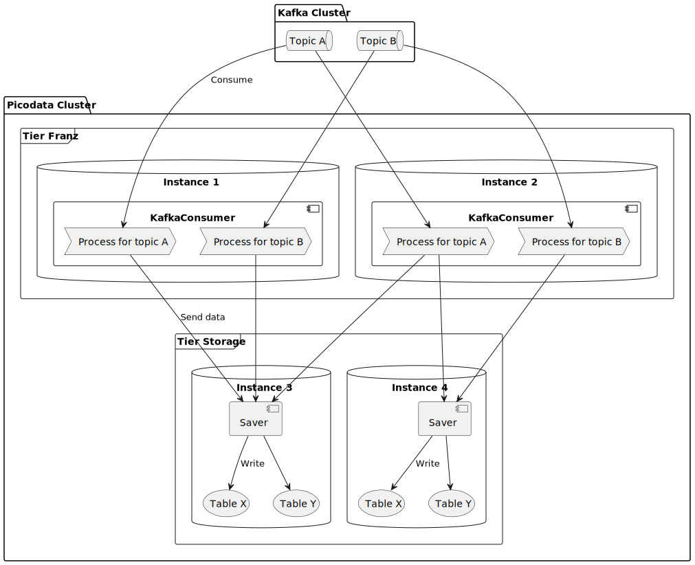
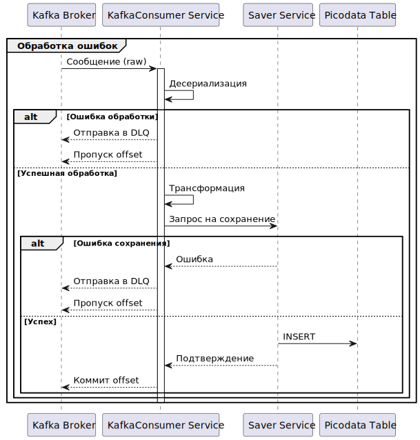

# Franz

В данном разделе приведены сведения о Franz, плагине для СУБД Picodata.

!!! tip "Picodata Enterprise"
    Функциональность плагина доступна только в коммерческой версии Picodata.

## Общие сведения {: #intro }

Franz — плагин, который позволяет импортировать данные из
топиков [Apache Kafka] в СУБД Picodata.

[Apache Kafka]: https://ru.wikipedia.org/wiki/Apache_Kafka

Плагин поддерживает форматы сообщений JSON, Avro Object Container Files,
и Avro с поддержкой Schema Registry. Для корректной работы требуется соответствие
между схемой сообщений и структурой таблицы в Picodata.

## Состав плагина {: #plugin_files }

Внутри архива с плагином находится структура вложенных директорий,
включающая имя и версию плагина, а также его файлы:

```
└── franz
    └── 0.3.6
        ├── assets
        ├── libfranz_plugin.so
        └── manifest.yaml
```

Основная логика плагина обеспечивается разделяемой библиотекой
`franz-lib` (`libfranz_plugin.so`). Исходная конфигурация плагина
задается в файле манифеста
(`manifest.yaml`).

Разделяемая библиотека `franz-lib` реализует сервис `franz-service`—
вместе они могут быть использованы как в составе плагина `franz-plugin`,
так и как самостоятельные компоненты для интеграции в сторонние решения.

## Подключение плагина {: #plugin_enable }

1. Запустите инстанс Picodata с поддержкой плагинов (параметр [`--share-dir`])
1. Поместите файлы плагина в директорию, указанную на предыдущем шаге
1. Подключитесь к [административной консоли][admin_console] инстанса и выполните команды, указанные ниже.

[`--share-dir`]: ../reference/cli.md#run_share_dir
[admin_console]: ../tutorial/connecting.md#admin_console

Далее последовательно выполните следующие SQL-команды
в административной консоли Picodata.

```sql
CREATE PLUGIN franz 0.3.6;
ALTER PLUGIN franz 0.3.6 ADD SERVICE "kafka-consumer" TO TIER default;
ALTER PLUGIN franz 0.3.6 ADD SERVICE saver TO TIER default;
ALTER PLUGIN franz 0.3.6 ENABLE OPTION(TIMEOUT=30);
```

## Архитектура {: #architecture }

В зависимости от потребностей конечного решения, функциональность Franz
может быть представлена в трех вариантах:

* **Плагин** (franz-plugin)
  Основной сценарий использования: законченное
  решение для получения данных из Kafka в кластер Picodata. Позволяет
  получить "из коробки" интеграцию Kafka → Picodata со [стандартным
  механизмом конфигурации](../architecture/plugins.md#plugin_config)
  плагинов.

* **Сервис** (franz-service)
  Основной сценарий использования: интеграция полного набора задач по
  чтению из Kafka в собственный плагин. Основная функциональность
  библиотеки реализуется в виде
  [сервиса](..//architecture/plugins.md#service_trait), который подходит
  для интеграции в любой [плагин](../architecture/plugins.md) для
  Picodata.

* **Библиотека** (franz-lib)
  Основной сценарий использования: импорт и
  переиспользование отдельных компонентов для реализации собственной
  интеграции с Kafka. Позволяет использовать компоненты Franz напрямую и
  максимально гибко.

<!--
> Использование franz-lib и franz-service рассматривается в [руководстве разработчика](DEVELOPER_GUIDE.md)
 -->

Компоненты Franz разделены на два сервиса:

1. **KafkaConsumer** (`kafka-consumer`) — основной процесс обработки
   данных. Сервис читает данные из Apache Kafka и отправляет
   подготовленные к записи данные сервису **Saver**
1. **Saver** (`saver`) — вспомогательный компонент для сохранения
   результата обработки. Сервис принимает RPC-запросы от
   **KafkaConsumer** и записывает локально полученные данные

Концептуальная схема обработки данных при использовании Franz:



Обработка сообщения из Kafka происходит в сервисе `kafka-consumer` и состоит из следующих стадий:

1. **Получение сообщения**
   Franz вычитывает сообщения из топика Kafka
   небольшими порциями для улучшения пропускной способности
2. **Десериализация**
   Данные из сообщения преобразуются в объект,
   используя JSON или Apache Avro
3. **Трансформация**
   Исходный объект из сообщения превращается в объект,
   готовый к записи в Picodata
4. **Сохранение**
   Обработанная порция сообщений распределяется сервисом
   `saver` по протоколу RPC для сохранения на конечных инстансах.
5. **Отправка в DLQ**
   Сообщения, которые были признаны "сломанными" на
   стадиях десериализации или трансформации (например, из-за
   неправильной структуры), отправляются в отдельный топик Kafka.

Схема работы воркера:



## Сценарии использования {: #franz_scenarios }

- Реализации сложных ETL-процессов
- Миграцию данных из любого источника данных в Picodata через Kafka
- Построение CQRS-системы

## Конфигурация плагина {: #franz_config }

Исходная конфигурация Franz задается в файле `manifest.yaml`:

```yaml
name: franz
description: A plugin for consuming messages from Kafka and saving them to configured space
version: 0.3.6
services:
  - name: kafka-consumer
    description: Consumes messages from Kafka
    default_configuration:
      tasks: []
  - name: saver
    description: Saves messages on behalf of kafka-consumer
    default_configuration:
migration:
```

Описания пайплайнов обработки сообщений помещаются в секцию `tasks` сервиса `kafka-consumer`. Элементы этой секции-списка имеют следующие свойства:

* `target_space` (обязательный) — строка
  Таблица в Picodata для записи данных. Должна быть создана в кластере заранее.
* `target_tier` (обязательный) — строка
  Целевой [тир](../overview/glossary.md#tier). Должен быть настроен в кластере заранее.
* `consumer` (обязательный) — конфигурация потребителя сообщений:
    * `broker` (обязательный) — строка
      Адрес брокера Kafka в формате "host:port" (поддерживается указание нескольких брокеров через запятую)
    * `topic` (обязательный) — строка
      Название топика Kafka для подписки
    * `consumer_group` (обязательный) — строка
      Идентификатор группы потребителей ([group.id](https://kafka.apache.org/documentation/#consumerconfigs_group.id))
    * `batch_size` (по умолчанию: 100) — целое положительное число
      Количество сообщений которые будут обработаны пачкой за одну итерацию обработки
    * `buffer_size` (по умолчанию: 5 000 000) — целое положительное число
      Максимальный размер временного буфера сообщений, который используется для предварительного сохранения полученных из Kafka сообщений
    * `opts` (опциональный) — маппинг (строка) -> (строка)

      Дополнительные параметры для драйвера Kafka cм. в [документации librdkafka](https://github.com/confluentinc/librdkafka/blob/v2.10.0/CONFIGURATION.md)

* `decoder` (по умолчанию: JSON) — конфигурация десериализации сообщений. Имеет обязательное свойство `type`, а также может иметь дополнительные свойства — в зависимости от выбранного декодера:

    * `JSON` — не имеет дополнительных параметров
        * `type`: "json"

    * `Avro` — десериализация с использованием схем Apache Avro
        * `type`: "avro"
        * `remote_registry_url` (обязательный) — строка
          Адрес Schema Registry, который предоставит схемы для десериализации сообщений.

    * `Avro OCF` — десериализация сообщений из Apache Avro Object Container Files
        * `type`: "avro_ocf"

* `flow_control` (обязательный) — конфигурация потока обработки

    * `step_delay_ms` (обязательный) — целое положительное число

      Задержка между итерациями получения и обработки пачки сообщений. Чем меньше значение, тем чаще сервис будет опрашивать Kafka на появление новых сообщений.

    * `step_hard_duration_ms` (обязательный) — целое положительное число

      Максимальная продолжительность одной итерации обработки пачки сообщений. Защищает от зависания стадий обработки (например декодирования или трансформации).
      Если время обработки закончится, то текущая итерация прервётся и повторится после `step_delay_ms`

!!! note "Примечание"
    Конфигурация DLQ и трансформаций сообщения не
    поддерживаются через конфигурацию плагина и требуют использования
    библиотеки `franz-lib`.

## Мониторинг {: #monitoring }

Сообщения плагина попадают в общий журнал кластера Picodata.

Помимо записи в журнал, плагин экспортирует набор метрик в формате Prometheus, которые позволяют следить за состоянием системы, производительностью и использованием ресурсов.

Метрики можно получить [стандартным для Picodata способом](../admin/monitoring.md#curls_metrics)

<br>

Основные метрики сервиса `kafka-consumer` для мониторинга чтения
сообщений из источника:

* потребленные сервисом сообщения Kafka
* записанные оффсеты Kafka
* показатель отставания сервиса (см. [consumer lag](https://docs.confluent.io/platform/current/monitor/monitor-consumer-lag.html))
* смещение репликации сообщений Kafka (high/low watermark)


!!! note "Примечание"
    Для сбора метрик сервисом `kafka-consumer` необходимо указать
    периодичность сбора статистики в конфигурации потребителя сообщений
    через параметр `consumer.opts`(см.
    [`statistics.interval.ms`](https://github.com/confluentinc/librdkafka/blob/v2.10.0/STATISTICS.md#statistics))

Полный список метрик, поддерживаемый librdkafka, содержится в файле [STATISTICS.md](https://github.com/confluentinc/librdkafka/blob/v2.10.0/STATISTICS.md)

<br>

Основные метрики аллокатора Rust для мониторинга использования памяти,
выделенной через jemalloc или системный аллокатор процессу:

* количество аллокаций
* объем выделенной памяти
* объем деаллоцированной памяти

## Рекомендации {: #advice }

* Используйте разные `consumer_group` для разных процессов/кластеров

## Приложение {: #appendix }

### Конвертируемость типов Apache Avro ↔ Picodata {: #convert_types }

[Типы, поддерживаемые Picodata](../reference/sql_types.md), могут
быть получены из полей сообщения в формате Apache Avro следующим образом:

| Целевой тип данных Picodata   |  Исходные типы данных Apache Avro              |
|-------------------------------|------------------------------------------------|
| BOOLEAN                       | boolean                                        |
| DECIMAL                       | string, decimal, float, double                 |
| DOUBLE                        | int, long, float, double                       |
| INTEGER                       | int, long                                      |
| JSON                          | `not supported`                                |
| TEXT, VARCHAR                 | string, int, long, boolean, float, double `(1)`|
| UUID                          | string, uuid                                   |
| DATETIME                      | int, long, string, date, timestamp-micros      |
| UNSIGNED                      | int, long `(2)`                                |

* `(1)` Числа будут отформатированы в строку с использованием основания 10, булевы значения
   преобразуются в строку как `"true"` и `"false"` соответственно.
* `(2)` Требуются положительные значения полей с этими типами, иначе возникнет ошибка при
   сохранении обработанных записей.
