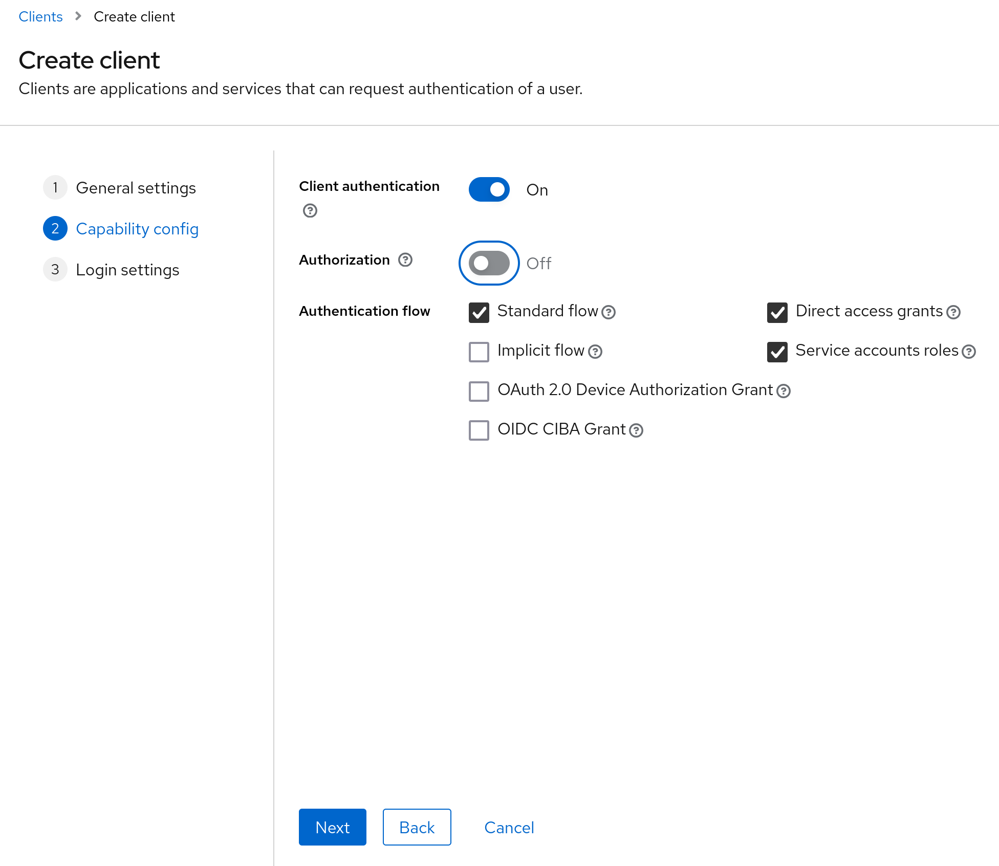

# Kirovets

В данном разделе приведены сведения о Kirovets, плагине для СУБД Picodata.

!!! tip "Picodata Enterprise"
    Функциональность плагина доступна только в коммерческой версии Picodata.

## Общие сведения {: #intro }

Kirovets — это платформа виртуализации данных, разработанная как расширяемый
плагин для СУБД Picodata. Ее основная задача — организовать эффективный
сбор, обработку, хранение и публикацию данных в виде HTTP API. Платформа
позволяет проектировать собственные витрины данных и обрабатывать
входящие данные с использованием пользовательской логики на языке Lua.

Система предназначена для использования в сценариях, где важно
централизованное хранение данных из различных источников и возможность
публикации витрин, агрегатов и аналитических представлений через API.

??? note "Основные термины"

      **Витрина данных** — это конфигурируемый срез данных из хранилища, определяемый пользователем через SQL- или Lua-обработчики,
      привязанные к конечным точкам системы. Витрины обеспечивают гибкий доступ к данным, адаптируясь под конкретные требования
      пользователей (например, отчеты, аналитические выборки или интеграционные сценарии).

      **Конечная точка** — это уникальный URL-адрес, связанный с определенным обработчиком запросов (SQL или Lua), который
      предоставляет доступ к витрине данных. Если витрина — это логический срез данных (например, «продажи по регионам»),
      то конечная точка — это способ доступа к нему через API (например, URL /api/sales с параметром region).

      **Триггер (Trigger)** — это пользовательская Lua-функция, автоматически выполняемая при изменении данных в связанной таблице (добавлении, обновлении или удалении записи).
      Ключевые свойства:

      - запускается системой без явного вызова пользователем, реагируя на события модификации данных (`INSERT`, `UPDATE`, `DELETE`).
      - позволяет модифицировать как другие таблицы, так и ту, к которой привязан триггер, но так как выполнение происходит после
        фактической модификации данных в таблице, то мутация входящих данных выполнена быть не может. По сути триггер — это реакция
        на уже совершенное изменение данных.
      - позволяет реализовать произвольную обработку: обновление связанных таблиц, отправку уведомлений, логирование изменений и т.д.
      - каждая таблица может иметь несколько триггеров, которые выполняются последовательно в порядке, указанном в конфигурации.
      - внутри функции доступны:
        - изменяемые данные (например, значения полей новой записи),
        - контекст операции (тип события — `create`, `update`, `delete`).

      Подробнее см. в разделе [Пользовательские триггеры](#custom_triggers)

      **Отличие от витрины данных**:

      Если **витрина данных** реагирует на HTTP-запросы и возвращает данные, **триггер** срабатывает на события БД и может
      вернуть только ошибку (его цель — побочные эффекты).

      **Фильтр (Filter)** — это пользовательская Lua-функция, выполняемая **до** попытки изменения данных в таблице (создания, обновления или удаления записи) и определяющая, должно ли изменение быть применено.

      **Ключевые свойства:**

      - анализирует данные и контекст операции (например, поля новой записи или условия удаления).
      - может **отклонить** изменение, вернув `false` или ошибку, либо **разрешить** его (вернув `true`).
      - привязывается к конкретной таблице в конфигурации и может быть только один.
      - внутри функции доступны:
        - новые/изменяемые данные (для `INSERT`/`UPDATE`),
        - старые данные (для `UPDATE`/`DELETE`),
        - тип операции (`"create"`, `"update"`, `"delete"`).

      Примеры использования:

      - запрет удаления записей с определенным статусом.
      - проверка корректности формата данных перед сохранением.
      - динамическое ограничение прав доступа ("только автор может редактировать").

     Отличия от триггера:

      - **Триггер** срабатывает **после** изменения и не может его отменить (только реагирует).
      - **Фильтр** выполняется **до** изменения и имеет право **вето**.

      **Обработчик (Handler)** — это пользовательская логика, написанная на Lua, которая определяет поведение системы при выполнении определенных операций. В зависимости от контекста, обработчик может выступать в различных ролях:

      - витрина данных
      - триггер
      - фильтр

      **SQL-витрина** — это SQL-запрос, находящийся в файле конфигурации, который может выступать как обработчик витрины данных.

      **Импортер** — компонент, обеспечивающий интеграцию с внешними источниками данных. Импортер может быть пакетным, загружающим
      весь объем данных из источника, или потоковым, загружающим поток изменений, приходящий из источника.

      **Сервис** — концепция системы плагинов СУБД Picodata, представляющая собой изолированную часть функциональности.
      Аналогом этой концепции является микросервис. Сервис может быть запущен на одном или нескольких
      узлах СУБД Picodata. Сервис взаимодействует с другими сервисами и может предоставлять интерфейс
      взаимодействия пользователю системы, например, HTTP API.

      **Задача** — операция, которая выполняется по расписанию внутри платформы. На данный момент поддерживается только операция
      запуска импорта пакетного импортера.

## Архитектура и компоненты системы {: #architecture }

Архитектура платформы разделена на 4 ключевых сервиса, каждый из которых выполняет уникальные функции в системе.


### 1. Router {: #router }

Сервис, отвечающий за взаимодействие с потребителями данных. Основные функции:

- обработка входящих HTTP-запросов от пользователей и выполнение соответствующих
  витрин данных
- предоставление API для администрирования системы, а также UI
- выполнение запросов к хранилищу для получения данных

### 2. Storage {: #storage }

Основной сервис хранения данных, обеспечивающий:

- хранение данных согласно сконфигурированной схеме
- получение и применение данных, переданных импортерами
- выполнение пользовательских фильтров и триггеров (на Lua)

### 3. Importer {: #importer_step }

Компонент, обеспечивающий интеграцию с внешними источниками данных:

- чтение данных из потоковых и пакетных источников
- отправку данных в хранилище данных

### 4. Task Coordinator {: #task_coordinator }

Служба, отвечающая за запуск задач по расписанию:

- поддерживает cron-расписания, а также однократные и непрерывные задачи
- позволяет настроить автоматический импорт данных
- обеспечивает периодическое выполнение задач в фоновом режиме
- позволяет запускать произвольные задачи, написанные на Lua

## Конфигурация системы {: #system_config }

Конфигурация описывается в нескольких файлах:

- `config.yml` содержит описание всех компонентов системы: таблиц, импортеров, задач и API.
- файлы с расширением lua в директории `datamarts` содержат lua-функции, которые могут
  быть использованы как для триггеров и фильтров, так и для витрин данных
- файлы с расширением sql в директории `datamarts` содержат запросы на языке SQL, которые
  могут быть использованы как витрины данных

Пример структуры директории с конфигурацией:

```shell
.
├── config.yaml
└── datamarts
    ├── datamarts.lua
    ├── filters.lua
    ├── relations.sql
    └── triggers.lua
```

### Загрузка конфигурации {: #config_load }

После того как все конфигурационные файлы подготовлены, их необходимо
загрузить в платформу "Кировец". Это можно сделать двумя основными
способами: через командную строку с использованием `curl` или через
графический пользовательский интерфейс.

#### Подготовка ZIP-архива {: #prepare_zip }

Перед началом работы все конфигурационные файлы необходимо упаковать в
ZIP-архив. Важно, чтобы файл `config.yaml` находился на верхнем уровне
этого архива (не внутри поддиректории).

Создайте такой архив, выполнив следующую команду в корневой директории
вашей конфигурации:

```shell
zip -r ../config.zip *
```

Эта команда создаст в родительской директории ZIP-архив `config.zip` c
нужным набором файлов и директорий.

#### Загрузка конфигурации с помощью `curl` {: #load_via_curl }

Для загрузки конфигурации через API выполните POST-запрос к конечной
точке `api/v1/config` платформы "Кировец". Если у вас включена
авторизация, не забудьте включить соответствующие авторизационные
заголовки в ваш запрос.

Пример команды `curl`:
```shell
curl -X POST kirovets.local/api/v1/config -F 'file=@config.zip'
```

- `kirovets.local/api/v1/config`: URL-адрес вашей платформы "Кировец" и конечная точка для загрузки конфигурации.
  Замените `kirovets.local` на актуальный адрес вашей системы.

??? example "Пример с авторизацией:"
      ```shell
      # Получение `access_token`
      http -a kirovets-dev:QmM4gvSI4ENfZwBjzCdv6Dr4RxBxcDlM -f POST keycloak:8989/realms/kirovets_dev/protocol/openid-connect/token grant_type=client_credentials
      
      curl -X POST kirovets.local/api/v1/config \                                                                                                                 
        -H 'Authorization: Bearer ACCESS_TOKEN' \
        -F 'file=@config.zip'
      ```

#### Загрузка конфигурации через пользовательский интерфейс {: #load_via_ui }

Платформа "Кировец" также предоставляет удобный графический интерфейс
для управления конфигурацией. Выполните следующие шаги:

- откройте веб-браузер и перейдите по адресу `/config` относительно
  базового URL вашей платформы. Например, если ваша платформа доступна
  по `http://kirovets.local`, то UI конфигурации будет доступен по
  `http://kirovets.local/config`
- на странице пользовательского интерфейса вы увидите редактор
  конфигурации и кнопки управления
- нажмите кнопку `Upload` для выбора ранее созданного ZIP-архива с
  конфигурацией. После выбора нажмите кнопку подтверждения в окне выбора
  файла

### Таблицы (`schema`) {: #schema }

Каждая таблица описывается через поля, индексы и источники данных. Поддерживаются следующие опции:

- `fields`: определяет столбцы таблицы, их типы данных и дополнительные свойства
- `indexes`: определяют, по каким полям будут созданы индексы для ускорения поиска и фильтрации данных
- `sources`: список источников (`ogg`, `parquet` и другие)
- `affinity`: определяет стратегию распределения данных таблицы по узлам кластера
- `triggers`: Lua-функции, выполняемые после применения изменений
- `filter`: Lua-функция, определяющая применение изменений

Пример:

```yaml
schema:
  table1:
    fields:
      - name: id
        type: string
        is_nullable: false
    indexes:
      pk:
        fields:
        - id
    affinity:
      - id
    triggers:
      - triggers.table1
    filter: filters.table1
    sources:
      ogg:
        table: TABLE1
```

#### Определение полей (fields) {: #fields_def }

Раздел `fields` описывает структуру каждого столбца (поля) в вашей
таблице. Каждое поле должно иметь имя, тип данных и, при необходимости,
дополнительные свойства. Раздел представляет собой массив с объявлениями
полей. Поля хранятся в рядах таблицы в том порядке, в каком они
объявлены в конфигурации.

Объявление поля состоит из трех обязательных атрибутов:

- `name` — имя поля
- `type` — тип данных в поле
- `is_nullable` — признак нулабельности поля. Если выставлено в `true`,
  то в поле может быть записано значение `null`. В противном случае в
  поле могут быть записаны данные только указанного типа

Список поддерживаемых типов полей:

- `unsigned` — целые неотрицательные числа
- `string` — строка любой длины
- `number` — число, в том числе и с дробной частью
- `integer` — целые числа со знаком
- `boolean` — булево значение
- `decimal` — используется для хранения точных числовых значений с заданной точностью и масштабом
- `uuid` — идентификатор UUID
- `datetime` — дата и время в соответствии с RFC 3339

Также в конце каждого ряда существует сервисное поле `apply_at`, которое имеет тип `integer`.

#### Определение индексов (indexes) {: #indexes_def }

Раздел `indexes` — это словарь, где ключом выступает имя
индекса, а значением — его описание. Можно задать один или несколько
индексов. Один из индексов обязательно должен называться `pk`. Этот
индекс будет первичным ключом таблицы. Поля, входящие в него, не могут
иметь признак нулабельности.

Объявление состоит из атрибута `fields` — массива имен полей, входящих в
индекс. Порядок важен, см. ниже.

Все запросы к данным в системе выполняются исключительно по индексам. При этом, допустимы запросы только по части полей,
входящих в индекс, но эти поля должны идти с начала индекса. Таким образом, порядок полей в запросе имеет значение.
Например, если индекс состоит из полей `field1`, `field2`, `field3`, то можно выполнить запрос по `field1`, либо по комбинации
`field1` и `field2`, но нельзя запросить данные только по `field2` или
`field3`.

#### Определение локализации по значениям полей (affinity) {: #affinity_def }

Платформа "Кировец" обладает распределенным хранилищем данных. Это
значит, что каждый набор реплик хранит только свою часть данных.
Определение набора реплик, на которые попадут данные, производится путем
вычисления хеша от полей, указанных в поле `affinity`. Правильное
использование `affinity` позволяет оптимизировать производительность за
счет минимизации сетевого трафика при выполнении запросов. Когда вы
определяете `affinity` по одному или нескольким полям, "Кировец"
гарантирует, что все записи, имеющие одинаковые значения в этих полях,
будут храниться на одном и том же узле кластера.

Поле представляет собой массив с именами полей.

При использовании `affinity` не гарантируется уникальность первичного
ключа, если данные попали на разные узлы хранения.

#### Определение триггеров (triggers) {: #triggers_def }

Параметр `triggers` — это массив с именами функций. Каждая функция — в
том порядке, в каком она объявлена в конфигурации — будет выполнена
после изменения данных в таблице, к которой она привязана. Триггер
представляет собой lua-функцию, которая может менять данные в системе.
Имя функции в конфигурации формируется из имени файла в директории
`datamarts`, где эта функция объявлена, и самого имени функции,
объединенных через точку. Подробнее о написании функций см. ниже.

#### Определение фильтра (filter) {: #filter_def }

Объект `filter` — это строка, содержащая имя Параметр-фильтра, которая
будет применена до изменения данных в таблице и которая позволяет эти
изменения отменить. Как и у триггера, имя функции-фильтра формируется из
имени файла, где она объявлена и имени самой функции, объединенных через
точку. Подробнее о написании функций см. ниже.

#### Определение источников данных для таблицы (sources) {: #sources_def }

Параметр `sources` определяет, откуда система будет загружать данные для
таблицы. Это словарь, где:

- `ключ` — имя импортера (должно соответствовать секции `importers`),
- `значение` — конфигурация этого импортера для текущей таблицы.

**Поддерживаемые типы импортеров:**

**OGG-импортер**

Используется для загрузки изменений данных через Oracle GoldenGate.

Доступные параметры:

- `table` (обязательный) — имя таблицы-источника в OGG.

**Особенности работы:**

OGG генерирует два типа файлов:

- DSV-файлы — содержат операции изменения данных (INSERT/UPDATE/DELETE),
- Control-файлы — перечисляют актуальные DSV-файлы (формат:
  `<TABLE_NAME>control`, где `TABLE_NAME` — имя таблицы в источнике).

**Пример конфигурации:**

```yaml
sources:
  ogg:
    table: TABLE1  # Имя control-файла будет TABLE1control
```

**Parquet-импортер**

Загружает данные из файлов в формате Parquet.

Доступные параметры (в блоке files):

- `type` (обязательный) — тип источника:
  - `dir` — загрузка всех файлов из указанной директории,
  - `files` — загрузка конкретного списка файлов.

Для типа `dir` доступен параметр:

- `dir` — путь к директории с Parquet-файлами.

Для типа `files` доступен параметр:

- `files` — список путей к файлам.

**Пример конфигурации:**

```yaml
# Загрузка всех файлов из директории
sources:
  parquet:
    files:
      type: "dir"
      dir: "dev/example_data/parquets/table1"

# Загрузка конкретных файлов
sources:
  parquet:
    files:
      type: "files"
      files:
        - "path/to/file1.parquet"
        - "path/to/file2.parquet"
```

**KafkaDebezium-импортер**

Ммпортёр предназначен для загрузки данных из Kafka, которые поступают в неё через Debezium.

Доступные параметры:

- `table` (обязательный) — имя таблицы-источника в Debezium.

**Пример конфигурации:**

```yaml
sources:
  kafka_debezium:
    table: table_debezium
```

### Пользовательские фильтры {: #custom_filters }

Пользовательский фильтр — это функция, написанная на языке Lua, которая
предоставляет пользователю возможность определить критерии для
применения операции модификации (создания, обновления и удаления) к
текущим сохраненным данным. Другими словами, при помощи фильтра можно
принять решение: применять ли операцию из источника данных или
пропустить ее. Фильтр срабатывает только на изменения, пришедшие из
источника данных, но не созданные триггером.

#### Конфигурация фильтра {: #filter_config }

Для использования пользовательских фильтров необходимо создать
Lua-модуль (например, `sample.lua`) и разместить его в директории
`datamarts`, расположенной в корневом каталоге конфигурации (например,
`datamarts/sample.lua`). Модуль должен возвращать таблицу, содержащую
все доступные в нем функции. При этом, один модуль может содержать
функции, используемые как в качестве фильтра, так и в качестве триггера.
Однако, рекомендуется разделять фильтры и триггеры по разным модулям.

Пример модуля с пользовательскими фильтрами:

```lua
local function filter1(old, new)
    -- Логика фильтрации
    return true
end

local function filter2(old, new)
    -- Логика фильтрации
    return true
end

return {
    filter1 = filter1,
    filter2 = filter2,
}
```

Далее, фильтры необходимо указать в конфигурации системы. Для каждой
таблицы можно задать свой фильтр, для этого в секции `schema.<имя
таблицы>.filter` укажите его в формате `<имя модуля>.<имя фильтра>`.
Например:

```yaml
schema:
  TBL:
    filter: sample.filter1
```

#### Сигнатура пользовательской функции {: #custom_function_signature }

Пользовательская функция должна иметь следующую сигнатуру:

```lua
local function filter(old, new)
    -- Логика фильтрации
end
```

Здесь:

- `old` — таблица, представляющая старый объект (данные, находящиеся в таблице)
- `new` — таблица, представляющая новый объект (данные, поступающие для обработки)

Функция фильтрации должна возвращать одно из следующих значений:

- `true` — операция применяется к таблице, и транзакция завершается
- `false` — операция пропускается, и транзакция завершается
- `nil, error` — где error — это объект ошибки, который сериализуется в строку: строка или объект библиотеки `errors`
  В таком случае операция пропускается, а ошибка выводится в журнал

**Особенности разработки логики фильтрации:**

Логика фильтрации должна учитывать наличие трех видов операций: `update`, `create` и `delete`.

- **Операция `update`**
  Только в этом случае оба объекта (`old` и `new`) представлены непустыми таблицами, поскольку обновление предполагает
  наличие как исходных данных, так и данных после изменения.

- **Операция `create`**
  В случае операции `create` старый объект (`old`) представлен пустой таблицей, так как данные до создания записи отсутствуют.

- **Операция `delete`**
  В случае операции `delete` новый объект (`new`) представлен пустой таблицей, так как после удаления записи данных для объекта
  больше не существует.

Пример пользовательской функции, учитывающей все описанные случаи:

```lua
local function filter(old, new)
    -- Обработка операции create: old — пустая таблица
    if next(old) == nil then
        return true  -- Принимаем новый объект
    end

    -- Обработка операции delete: new — пустая таблица
    if next(new) == nil then
        return true  -- Удаляем существующий объект
    end

    -- Основная логика фильтрации (например, сравнение временных меток)
    if old.timestamp and new.timestamp and old.timestamp >= new.timestamp then
        return false  -- Запрещаем обновление объекта в базе
    end

    return true  -- Разрешаем обновление объекта в базе
end
```

В данном случае фильтрация фактически применяется только к операции
`update`, для других случаев операция всегда применяется.

### Пользовательские триггеры {: #custom_triggers }

Пользовательский триггер — это Lua-функция, позволяющуая
реагировать на изменения данных в связанной таблице и выполнять
произвольные действия в ответ на эти изменения. Триггер срабатывает
только на данные, которые попали в таблицу из источника данных, но не на
записанные другим триггером. **Триггер** срабатывает **после** изменения
и не может его отменить (только реагирует).

#### Конфигурация триггеров {: #triggers_conf }

Для использования пользовательских триггеров необходимо создать
Lua-модуль (например, `sample.lua`) и разместить его в директории
`datamarts`, расположенной в корне конфигурации (например,
`datamarts/sample.lua`). Модуль должен возвращать таблицу, содержащую
все функции, доступные в модуле. При этом, один модуль может содержать
функции используемые как в качестве фильтра, так и в качестве триггера.
Однако, рекомендуется разделять фильтры и триггеры по разным модулям.

Пример модуля с пользовательскими триггерами:

```lua
local function trigger1(old, new, operation)
    -- Логика триггера
    return true
end

local function trigger2(old, new, operation)
    -- Логика триггера
    return true
end

return {
    trigger1 = trigger1,
    trigger2 = trigger2,
}
```

Далее, триггеры необходимо указать в конфигурации системы. Для каждой
таблицы можно задать несколько триггеров, для этого в секции
`schema.<имя таблицы>.triggers` укажите их в формате `<имя модуля>.<имя
фильтра>`:

```yaml
schema:
  TBL:
    triggers:
      - sample.trigger1
      - sample.trigger2
```

Триггеры будут выполнены в той последовательности, в какой они указаны в конфигурации.

#### Сигнатура пользовательской функции {: #triggers_custom_function_signature }

Пользовательская функция должна иметь следующую сигнатуру:

```lua
local function trigger(old, new, operation)
    -- Логика фильтрации
end
```

Здесь:

- `old` — таблица, представляющая старый объект (данные, находившиеся в таблице до изменения).
- `new` — таблица, представляющая новый объект (данные, находящиеся в таблице после изменения).
- `operation` — текстовое наименование операции. Возможные значения: `update`, `create` и `delete`.

Функция-триггер может вернуть `nil, error`, где `error` — это объект,
который можно сериализовать в строку (например, строка или ошибка из
пакета `errors`). В таком случае ошибка попадет в журнал, а следующий
триггер в цепочке (если он есть) будет выполнен. Любые другие
возвращаемые значения, кроме `nil`, считаются успешным выполнением
триггера.

**Особенности разработки логики триггера:**

Логика триггера должна учитывать наличие трех видов операций: `update`,
`create` и `delete`.

- **Операция `update`** Только в этом случае оба объекта (`old` и `new`)
  представлены непустыми таблицами, поскольку обновление предполагает
  наличие как исходных данных, так и данных после изменения.

- **Операция `create`** В случае операции `create` старый объект (`old`)
  представлен пустой таблицей, так как данные до создания записи
  отсутствуют.

- **Операция `delete`** В случае операции `delete` новый объект (`new`)
  представлен пустой таблицей, так как после удаления записи данных для
  объекта больше не существует.

Пример пользовательской функции, учитывающей все описанные случаи:

```lua
local function update_destination(old, new, operation)
    if operation == 'delete' then --- игнорируем операции delete
        return true
    end

    --- Получаем данные из таблицы по идентификатору из нового объекта
    local rv, err = sql.execute('select * from table_with_trigger_destination where user_id=?', {new.user_id});
    if err then
        --- Возвращаем ошибку в случае если select не удался. Ошибка будет отображена в журнале платформы.
        return nil, err
    end

    --- select всегда возвращает массив данных, даже если там всего один объект
    local user = rv[1]

    if not user then
        log.verbose("Object with id %s doesn't exist", new.user_id)

        --- Создаем объект в таблице на основе нового объекта
        return sql.execute(
            "insert into table_with_trigger_destination (user_id, value, apply_at) values (?, ?, ?)",
            {
                new.user_id,
                new.value,
                --- Поле находится в каждой таблице и является обязательным.
                --- Оно представляет собой время обновления объекта
                math.floor(fiber.time())
            }
        )
    end

    log.verbose("Update user with id %s with value %s", new.user_id, new.value)

    --- Обновляем существующий объект в таблице на основе нового объекта
    return sql.execute("update table_with_trigger_destination set value = ?, apply_at = ? where user_id = ?", {
        new.value,
        math.floor(fiber.time()),
        new.user_id,
    })
end
```

Данная логика обеспечивает синхронизацию между таблицами: при изменении
данных в основной таблице автоматически создается или обновляется
соответствующий объект в зависимой таблице.

### Импортеры (`importers`) {: #triggers_importers }

Импортеры являются элементом платформы "Кировец" для загрузки данных из внешних источников в ваши таблицы. В разделе `importers`
файла `config.yaml` вы определяете, откуда и как данные будут поступать в систему, а также настраиваете правила их обработки.

Каждый импортер имеет уникальное имя и содержит конфигурацию, зависящую от его типа. "Кировец" поддерживает два основных типа
импортеров: пакетные импортеры для периодической загрузки файлов и потоковые импортеры для непрерывной обработки изменений из
систем типа CDC (Change Data Capture).

- Пакетные (batch) импортеры:
  - загружают статичный срез данных на определенный момент времени
  - предоставляют полный "слепок" данных
  - используются для первоначальной загрузки или полного обновления данных
- Потоковые (stream) импортеры:
  - обеспечивают непрерывный поток изменений данных
  - передают последовательность модификаций (добавления/обновления/удаления)
  - используются для инкрементального обновления данных в реальном времени

Ключевое отличие: пакетные импортеры работают с фиксированным состоянием данных, тогда как потоковые обрабатывают
изменения данных во времени.

Существуют следующие пакетные импортеры:

- `parquet` — импортирует данные из parquet-файлов

Существуют следующие потоковые импортеры:

- `ogg`: импортирует данные, предоставляемые Oracle Golden Gate через flat files
- `kafka_debezium`: импортирует сгенерированные Debezium данные,используя Kafka в качестве брокера сообщений.

Секция `importers` определяет, откуда платформа будет получать данные. Это словарь, где:

- `ключ` — имя импортера. Оно используется при настройке таблиц в атрибуте sources и при настройке задач в секции tasks.
- `значение` — конфигурация этого импортера

#### OGG {: #ogg }

Импортер потребляющий данные, формируемые Oracle Golden Gate в формате flat files. Импортер ожидает следующий вид операций
в dsv-файлах:

1. INSERT-операция все OLD-значения должна иметь в NULL (или вообще их не указывать), а для всех ненулабельных полей схемы
   иметь ненулевое NEW-значение. Пример корректной строки:

   ```ogg
   "ROW_ID"|NULL|"NEW_ROW_ID_1"|"CREATED"|NULL|"1988-09-25 17:45:30.00"|"CURR_STG_ID"|NULL|"NEW_STG_ID"|
   ```

2. UPDATE-операция должна содержать только первичный ключ и обновленные поля. Пример корректной строки:

   ```ogg
   "ROW_ID"|"ROW_ID_1"|"ROW_ID_1"|"CREATED"|"2000-09-25 17:45:30.00"|"1988-09-25 17:45:30.00"|"CURR_STG_ID"|"PREV_STG_ID"|"NEW_STG_ID"|
   ```

3. DELETE-операция должна содержать `NULL` во всех NEW-значениях полей(в т.ч. для первичного ключа). Пример корректной строки:

   ```ogg
   "ROW_ID"|"ROW_ID_1"|NULL|"CREATED"||NULL|"NEW_STG_ID"||NULL|
   ```

Рекомендации по настройке OGG для взаимодействия с импортером см. в [Приложении №1](#setup_ogg)

Импортер из OGG поддерживает следующие атрибуты конфигурации:

- `type` (обязательный) — тип импортера данных. В данном случае `ogg`
- `file_dir` (обязательный) — путь до директории с control-файлами.
- `ogg_home` — задает базовый путь, который объединяется с
  относительными путями из control-файла для формирования абсолютных
  путей к DSV-файлам. Если не задан, то равен `file_dir`. Используется в
  случае, если control-файлы и dsv-файлы находятся в разных директориях,
  при этом control-файл содержит относительные пути до файлов
- `max_batch_size` (обязательный) — задает размер пакета с записями,
  которые будут отправлены из импортера в слой хранения за один раз

Пример:

```yaml
importers:
  ogg:
    type: "ogg"
    file_dir: dev/example_data/ogg
    max_batch_size: 1000
```

#### Parquet  {: #parquet }

Импортер, потребляющий данные из файлов в формате [parquet](https://parquet.apache.org).

Импортер из parquet поддерживает следующие атрибуты конфигурации:

- `type` (обязательный) — тип импортера данны. В данном случае `parquet`

#### KafkaDebezium {: #kafka_debezium}

Доступные параметры для настройки импортёра:

- `type` (обязательный) - тип импортера, необходимо установитиь значение `kafkadebezium`.
- `broker` (обязательный) - адрес для подключения к Kafka.
Доступно перечисление нескольких адресов через запятую (например, `kafka1:9092,kafka2:9092`).
- `topic_prefix` (обязательный) - часть имени топика Kafka, которая идёт перед именем таблицы (например, для топика `dbserver1.public.your_table_name` префикс будет `dbserver1.public`).
- `consumer_group` (обязательный) - наименование группы потребителей Kafka.
- `kafka_batch_size` - количество сообщений, которое будет считываться из Kafka за один раз (значение по умолчанию).
- `opts` — параметры конфигурации драйвера Kafka. Например, `message.max.bytes` (максимальный размер сообщения). Полный перечень доступных опций находится в официальной документации [librdkafka](https://github.com/confluentinc/librdkafka/blob/master/CONFIGURATION.md).
- `max_batch_size` - аксимальное количество записей, которое может быть отправлено из импортера в слой хранения за один раз.

Привер:

```yaml
importers:                                    
  kafka_debezium:
    type: kafkadebezium
    broker: localhost:9092
    topic_prefix: dev_prefix.public
    consumer_group: dev_consumer
    kafka_batch_size: 10
    opts:
      message.max.bytes: 3145728
    max_batch_size: 100
```

### Задачи (`tasks`) {: #triggers_tasks }

Раздел `tasks` в вашем файле `config.yaml` позволяет автоматизировать выполнение различных операций в платформе "Кировец".
Вы можете настроить запуск импортеров, выполнение пользовательских Lua-скриптов (пока не поддерживается) и другие фоновые
процессы по определенному расписанию или в непрерывном режиме.

Каждая задача имеет уникальное имя и содержит конфигурацию, определяющую ее тип, расписание и выполняемые действия.
"Кировец" поддерживает три основных типа задач:

- **Задачи по расписанию (scheduled)**: Запускаются в определенные моменты времени, используя Cron-выражения
- **Непрерывные задачи (continuous)**: Запускаются постоянно, выполняясь последовательно с заданной задержкой между выполнениями
- **Однократные задачи (once)**: Выполняются только один раз при загрузке конфигурации

Секция представляет собой словарь, в которой:

- `ключ` — имя задачи, которое используется при доступе к задаче через API
- `значение` — конфигурация задачи

Конфигурация задачи состоит из следующих атрибутов:

- `exec` — описывает задачу, которую необходимо запускать по расписанию. Состоит из следующих атрибутов:
  - `kind` — тип задачи. На данный момент поддерживается только тип `import`. Этот тип задачи позволяет
      запускать потребление данных пакетными импортерами
  - `importer` — наименование импортера, который должен совершать потребление данных по расписанию
- `schedule` — настройки расписания задачи. Состоит из следующих атрибутов:
  - `type` — тип расписания. Доступны `cron`, `continuous` и `once`. Для каждого типа доступен свой атрибут, задающие расписания.
      В зависимости от типа задачи запускаются следующим образом:
    - `cron` — в соответствии с расписанием, заданным cron-строкой
    - `continuous` — друг за другом через указанный промежуток времени
    - `once` — один раз через небольшое время после загрузки конфигурации в платформу. Также может быть запущен через API
  - `cron` — доступен и обязателен при указании типа расписания `cron`. Представляет собой cron-строку, начинающуюся с секунд.
      Полный формат выглядит следующим образом: секунды, минуты, часы, номер дня в текущем месяце, месяц, день недели, год
  - `interval` — доступен и обязателен при указании типа расписания `continuous`. Представляет собой человекочитаемое количество
      времени, которое пройдет между окончанием предыдущего запуска задачи и началом следующего. Пример: `1s` — для одной секунды,
      `1m` — для одной минуты, `1h30m` — для 90 минут

Пример:

```yaml
tasks:
  parquet_cron:
    exec:
      kind: import
      importer: parquet1
    schedule:
      type: cron
      schedule: "*/10 * * * * * *"

  parquet_continuous:
    exec:
      kind: import
      importer: parquet2
    schedule:
      type: continuous
      interval: 1h40m

  parquet_once:
    exec:
      kind: import
      importer: parquet3
    schedule:
      type: once
```

### Витрины данных (`api`) {: #triggers_api }

Секция API предназначена для описания витрин данных и конечных точек, по
которым витрины данных доступны для пользователей. К каждой конечной
точке должен быть задан обработчик запроса, который формирует
необходимый пользователю срез данных. Обработчик может быть написан как
на языке SQL и по сути представлять собой обычный параметризированный
SQL-запрос, так и написанный на языке Lua.

Витрины возвращают `200 OK` и данные в случае успешного выполнения
запроса, и `500` во всех остальных случаях.

Секция представляет собой массив с описаниями витрин данных. Описание
витрины данных состоит из следующих атрибутов:

- `path` (обязательно) — относительный URI конечной точки. Например:
  `/v1/app/mydata`
- `method` (обязательно) — HTTP-метод запроса. Доступны: `GET`, `POST`,
  `PUT` и `DELETE`
- `handler` (обязательно) — настройки обработчика запроса. Представляет
  собой словарь, состоящую из следующих атрибутов:
    - `type` (обязательно) — тип обработчика витрины. Доступны `sql` и `lua`.
    - `name` (обязательно) — имя обработчика запроса. Для типа `lua`
      необходимо указать имя LUA-модуля, расположенного в директории
      `datamarts` и предоставляющего требуемую функцию и имя самой
      функции, объединенные через точку. Например: если имя файла
      LUA-модуля `datamarts.lua` и он предоставляет функцию `handler`,
      то в атрибуте `name` необходимо указать `datamarts.handler`. Для
      типа `sql` необходимо указать имя SQL-файла, находящегося в
      директории `datamarts`. Например, для файла `my_sql_handler.sql` в
      атрибуте `name` необходимо указать `my_sql_handler`
  - `args` — словарь, в которой ключ — имя аргумента запроса, а
      значение — его описание. Аргументы запроса необходимо указывать
      для SQL-витрин, содержащих именованные аргументы в своем теле.
      Описание аргумента состоит из следующих атрибутов:
    - `type` (обязательно) — тип аргумента
    - `is_nullable` — если выставлено true, то аргумент не обязан
          присутствовать в запросе к витрине. Все аргументы могут быть
          необязательными

Пример конфигурации витрин:

```yaml
api:
  - path: /v1/app/lua
    method: GET
    handler:
      type: lua
      name: datamarts.get_destination

  - path: /v1/app/relations
    method: GET
    handler:
      type: sql
      name: relations
      args:
        id:                                       # имя аргумента
          type: string                            # тип аргумента
          is_nullable: false                      # признак обязательности аргумента. Если выставлено false, то аргумент — обязательный
        apply_at:
          type: decimal
          is_nullable: true
```

#### SQL-обработчик для витрины {: #sql_handler }

SQL-обработчик для витрины — это SQL-файл в директории `datamarts`, который
предоставляет пользователю необходимый срез данных. Запрос может
содержать именованные переменные внутри директивы `where`.

Пример файла `relations.sql` с SQL-обработчиком витрины:

```sql
SELECT
    t1.*,
    t2.*
FROM
    table1 t1
JOIN
    table2 t2
ON
    t1.id = t2.table1_id
WHERE
    t1.id = %arg:id% and t1.apply_at = %arg:apply_at% -- именованные аргументы id и apply_at
```

#### Lua-обработчик для витрины {: #lua_handler }

Lua-обработчик для витрины — это файл, написанный на Lua, в директории
`datamarts`, который выставляет функцию обработчика.

??? example "Пример файла с lua-обработчиком витрины:"
      ```lua
      local errors = require('errors')
      local json = require("json")

      local RouterError = errors.new_class("RouterError")

      return {

          ---Функция обрабатывает запрос от пользователя и возвращает
          ---объект с данными, которые будут возвращены пользователю
          ---@param request table Таблица с аргументами запроса.
          ---@return nil|table
          ---@return string|nil
          get_destination = function(request)
              local id = request["id"]

              if not id then
                  return nil, RouterError:new("Query param id is mandatory")
              end

              local rv, err = sql.execute('select * from table_with_trigger_destination where user_id=?', {tonumber(id)});
              if err then
                  return nil, RouterError:new("Failed to execute sql query: %s", err)
              end

              if not rv then
                  return nil, RouterError:new("Dest with id %s doesn't exist", id)
              end

              -- MUST RETURN JSON IN DATAMARTS
              return json.encode(rv)
          end
      }
      ```

#### Примеры запросов к витринам данных {: #sample_queries }

Запрос с аргументами:

```shell
curl http://kirovets.loc/v1/app/relations?id=id_35

HTTP/1.1 200 Ok
Connection: keep-alive
Content-length: 213
Content-type: application/json; charset=utf8
Server: Tarantool http (tarantool v2.11.5-232-g0acc1353f)

[
    {
        "apply_at": 1752601680,
        "created": 1640928856,
        "curr_id": 43,
        "description": "Description for row 35",
        "id": 2375,
        "instance_id": 655,
        "last_upd": "2024-07-04 15:59:27",
        "row_id": "row_35",
        "sum": "5802.60",
        "table1_id": "id_35"
    }
]
```

### Настройки авторизации через внешний SSO (Keycloak) {: #sso_setup }

Платформа позволяет включить внешнюю авторизацию для графического
интерфейса и для конечных точек доступа к данным.

Cекция `auth` конфигурации отвечает за настройки аутентификации через
OpenID Connect с использованием Keycloak в качестве провайдера
идентификации.

**Параметры конфигурации:**

- `issuer_url` (обязательный) — URL-адрес сервера аутентификации Keycloak, включающий realm (область). Формат: `http(s)://<host>:<port>/realms/<realm_name>/`. Пример: `http://localhost:8989/realms/kirovets_dev`. Должен соответствовать реально существующему realm в Keycloak
- `redirect_url` (обязательный) — URL в вашем приложении, на который Keycloak будет перенаправлять пользователя после успешной аутентификации. Формат: полный URL, включая схему (http/https), хост и путь. Пример: `http://localhost:8002/auth/user/callback`. Этот URL должен быть зарегистрирован в настройках клиента в Keycloak
- `client_id` (обязательный) — идентификатор клиента, зарегистрированного в Keycloak. Пример: `kirovets-dev`. Должен точно соответствовать Client ID в настройках Keycloak
- `client_secret` (обязательный для confidential clients) — секретный ключ клиента, выданный Keycloak. Пример: `QmM4gvSI4ENfZwBjzCdv6Dr4RxBxcDlM`

**Пример конфигурации:**

```yaml
auth:
  issuer_url: "http://localhost:8989/realms/kirovets_dev"
  redirect_url: "http://localhost:8002/auth/user/callback"
  client_id: "kirovets-dev"
  client_secret: "QmM4gvSI4ENfZwBjzCdv6Dr4RxBxcDlM"
```

Руководство по настройке Keycloak смотри в соответствующем [приложении](#setup_sso)

### Особенности процесса обновления конфигурации {: #update_config}

Процесс обновления конфигурации имеет ряд особенностей.
Большинство компонентов системы объявляются явным образом, в соответствии с новой конфигурацией, а некоторые остаются неизменными, чтобы обеспечить работоспособность системы. Ниже описаны ключевые особенности процесса обновления конфигурации, на которые стоит обратить внимание.

#### Обновление схемы данных (`schema`) {: #update_schema}

При обновлении конфигурации схема данных может быть изменена **только путем добавления новых таблиц**. Попытки изменить структуру уже существующих таблиц будут игнорироваться.

Если необходимо изменить схему данных существующей таблицы, ее следует предварительно удалить из системы с помощью DDL-команды ([DROP TABLE](https://docs.picodata.io/picodata/25.1/reference/sql/drop_table/)).

## API для управления системой {: #admin_api }

### Управление задачами {: #tasks_api }

**Базовый URL:** `https://<router-host>:<port>/api/v1/tasks`

#### Получить информацию о задаче {: #tasks_api_info }

Возвращает текущее состояние и конфигурацию задачи.

- **Метод:** `GET`
- **URL:** `/<task_name>`
- **Параметры URL:**
  - `task_name` (**обязательный**) — имя задачи
- **Пример запроса:**

  ```shell
  curl -X GET "http://localhost:8002/api/v1/tasks/parquet"
  ```

- **Пример ответа:**

  ```json
  {
    "is_running": false,
    "cfg": {
      "exec": {
        "kind": "import",
        "importer": "parquet"
      },
      "schedule": {
        "type": "cron",
        "schedule": "*/10 * * * *"
      },
      "enabled": true
    },
    "recent_results": []
  }
  ```

- **Коды ответов:**
  - `200 OK` — запрос успешно выполнен
  - `500 Internal Server Error` — внутренняя ошибка сервера

#### Выключить задачу {: #tasks_api_disable }

Отключает задачу, удаляя ее из расписания планировщика. Это API **не
прерывает** выполнение уже запущенной задачи, а только предотвращает ее
последующие автоматические запуски по расписанию.

- **Метод:** `POST`
- **URL:** `/<task_name>/disable`
- **Параметры URL:**
  - `task_name` (**обязательный**) -  имя задачи

- **Пример запроса:**

  ```shell
  curl -X POST "http://localhost:8002/api/v1/tasks/parquet/disable"
  ```

- **Пример ответа:**

  ```shell
  "Task disabled"
  ```

- **Коды ответов:**
  - `200 OK` — запрос успешно выполнен
  - `500 Internal Server Error` — внутренняя ошибка сервера

#### Включить задачу {: #tasks_api_enable }

Включает включает задачу, добавляя ее в расписание планировщика для
последующих автоматических запусков. Одноразовые задачи (`once`)
запускаются **немедленно** после добавления в планировщик.

- **Метод:** `POST`
- **URL:** `/<task_name>/enable`
- **Параметры URL:**
  - `task_name` (**обязательный**) — имя задачи
- **Пример запроса:**

  ```shell
  curl -X POST "http://localhost:8002/api/v1/tasks/parquet/enable"
  ```

- **Пример ответа:**

  ```shell
  "Task enabled"
  ```

- **Коды ответов:**
  - `200 OK` — запрос успешно выполнен
  - `500 Internal Server Error` — внутренняя ошибка сервера

#### Принудительно выполнить задачу (вне расписания) {: #tasks_api_exec }

Принудительно запускает выполнение задачи вне зависимости от заданного
расписания. Для одноразовых задач (типа `once`) это действие аналогично
включению (см. [Включить задачу](#tasks_api_enable)). Расписание
выполнения задачи остается неизменным после ее принудительного запуска.

- **Метод:** `POST`
- **URL:** `/<task_name>`
- **Параметры URL:**
  - `task_name` (**обязательный**) — имя задачи
- **Пример запроса:**

  ```shell
  curl -X POST "http://localhost:8002/api/v1/tasks/parquet"
  ```

- **Примеры ответов:**

  ```json
  "Task has been triggered"
  ```

  ```json
  "Task is already running"
  ```

- **Коды ответов:**
  - `201 Created` — задача успешно запущена
  - `409 Conflict` — задача уже запущена
  - `500 Internal Server Error` — внутренняя ошибка сервера

### Управления таблицами {: #tables_api }

**Базовый URL:** `https://<router-host>:<port>/api/v1/tables`

#### Получить информацию о таблицах {: #tables_api_info }

Возвращает информацию о всех пользовательских таблицах или об одной конкретной.

- **Метод:** `GET`
- **URL:** `/<table_name>`
- **Параметры URL:**
  - `table_name` — имя таблицы, информацию о которой требуется получить.
    Если параметр не указан, возвращается информация обо всех таблицах.
- **Примеры запроса:**

  ```shell
  curl -X GET "http://localhost:8002/api/v1/tables/"
  curl -X GET "http://localhost:8002/api/v1/tables/users"
  ```

- **Пример ответа:**

  ```json
  {
      "table_with_filter": {
          "name": "table_with_filter",
          "sources": {
              "ogg": {
                  "type": "stream",
                  "table": "TABLE_WITH_FILTER"
              }
          }
      },
      "table_debezium": {
          "name": "table_debezium",
          "sources": {
              "kafka_debezium": {
                  "type": "stream",
                  "table": "table_debezium"
              }
          }
      },
      "table_with_trigger_destination": {
          "name": "table_with_trigger_destination",
          "sources": {}
      },
      "table_with_trigger_source": {
          "name": "table_with_trigger_source",
          "sources": {
              "ogg": {
                  "type": "stream",
                  "table": "TABLE_WITH_TRIGGER_SOURCE"
              }
          }
      }
  }
  ```

  ```json
  {
      "error":"Table 'user' not found",
      "status":404
  }
  ```

- **Коды ответов:**
  - `200 OK` — запрос успешно выполнен
  - `404 Not Found` — таблица с заданным именем не найдена
  - `500 Internal Server Error` — внутренняя ошибка сервера

#### Удалить все данные из таблицы (Truncate) {: #tables_api_truncate }

Полностью очищает таблицу, удаляя все содержащиеся в ней данные.

- **Метод:** `DELETE`
- **URL:** `/<table_name>`
- **Параметры URL:**
  - `table_name` (**обязательный**) — имя задачи
- **Пример запроса:**

  ```shell
  curl -X DELETE "http://localhost:8002/api/v1/tables/users"
  ```

- **Пример ответа:**

  ```json
    {
        "error":"Table 'user' not found",
        "status":404
    }
  ```

- **Коды ответов:**
  - `204 No content` — таблица успешно очищена
  - `404 Not found` — таблица не найдена
  - `500 Internal Server Error` — внутренняя ошибка сервера

### Управления импортерами {: #importers_api }

**Базовый URL:** `https://<router-host>:<port>/api/v1/importers`

Указанные ниже эндпоинты используются только для управления потоковыми
импортерами, для манипуляций с пакетными импортерами следует
использовать [API для управления задачами](#tasks_api).

#### Получить статус импортера {: #importers_api_status }

Возвращает текущий статус импортера для указанной таблицы.

- **Метод:** `GET`
- **URL:** `/<importer_name>/<table_name>`
- **Параметры URL:**
  - `importer_name`(**обязательный**) — имя импортера
  - `table_name` (**обязательный**) — имя таблицы

- **Пример запроса:**

  ```shell
  curl -X GET "http://localhost:8002/api/v1/importers/ogg/table1"
  ```

- **Пример ответа:**

  ```json
  {
      "name": "ogg",
      "table": "table1",
      "status": "Running"
  }
  ```

  ```json
  {
      "error":"RPC call failed: rpc `/importer/status_schema` call error: box error #10000: /importer/status_schema importer.lock().status_schema error: [ogg] table table not found in importer ogg",
      "status":502
  }
  ```

- **Коды ответов:**
  - `200 OK` — запрос успешно выполнен
  - `502 Bad gateway` — ошибка на восходящем сервере

#### Остановить импортер {: #importers_api_stop }

Прекращает импорт данных в указанную таблицу.

- **Метод:** `DELETE`
- **URL:** `/<importer_name>/<table_name>`
- **Параметры URL:**
  - `importer_name`(**обязательный**) — имя импортера
  - `table_name` (**обязательный**) — имя таблицы

- **Пример запроса:**

  ```shell
  curl -X DELETE "http://localhost:8002/api/v1/importers/ogg/table1"
  ```

- **Пример ответа:**

  ```json
  {
      "name": "ogg",
      "table": "table1",
      "status": "Paused"
  }
  ```

- **Коды ответов:**
  - `200 OK` — запрос успешно выполнен
  - `502 Bad gateway` — ошибка на восходящем сервере

#### Запустить импортер {: #importers_api_start }

Инициирует импорт данных в указанную таблицу.

- **Метод:** `POST`
- **URL:** `/<importer_name>/<table_name>`
- **Параметры URL:**
  - `importer_name`(**обязательный**) — имя импортера
  - `table_name` (**обязательный**) — имя таблицы

- **Пример запроса:**

  ```shell
  curl -X POST "http://localhost:8002/api/v1/importers/ogg/table1"
  ```

- **Пример ответа:**

  ```json
  {
      "name": "ogg",
      "table": "table1",
      "status": "Running"
  }
  ```

- **Коды ответов:**
  - `200 OK` — запрос успешно выполнен
  - `502 Bad gateway` — ошибка на восходящем сервере

#### Сбросить состояние импортера {: #importers_api_reset }

Сбрасывает состояние импортера для повторного импорта данных в указанную
таблицу. После успешного выполнения запроса импортер останавливается,
для возобновления загрузки данных импортер требуется вручную запустить с
помощью отдельного запроса (см. [Запустить
импортер](#importers_api_start)).

- **Метод:** `POST`
- **URL:** `/<importer_name>/<table_name>/reset`
- **Параметры URL:**
  - `importer_name`(**обязательный**) — имя импортера
  - `table_name` (**обязательный**) — имя таблицы
- **Пример запроса:**

  ```shell
  curl -X POST "http://localhost:8002/api/v1/importers/ogg/table1/reset"
  ```

- **Коды ответов:**
  - `200 OK` — запрос успешно выполнен
  - `502 Bad gateway` — ошибка на восходящем сервере

## Пользовательский интерфейс {: #user_interface }

Пользовательский интерфейс доступен по относительному пути `/config`.
Например, <http://kirovets.loc/config>. Он позволяет загрузить, скачать и
редактировать конфигурацию платформы. При открытии пользователем
страницы в редактор подгружается текущая версия конфигурации.


- кнопка `Upload` позволяет загрузить zip-архив с конфигурацией платформы
- кнопка `Download` позволяет скачать zip-архив с конфигурацией. При
  этом скачивается та конфигурация, которая отображена в редакторе
  конфигурации, а не та, что фактически может быть на сервере в текущий
  момент
- кнопка `Apply` позволяет применить конфигурацию из редактора к платформе

## Развертывание платформы (deploy) {: #platform_deploy }

Деплой приложения kirovets производится из артефакта в виде tgz-архива при помощи плейбука Ansible.

### Предварительные требования {: #system_requirements }

1. ОС Astra Linux 1.7 "Орел"
2. ПО Ansible 2.14 установленное на машине, предназначенной для развёртывания и администрирования приложения Kirovets

### Состав поставки {: #files }

```shell
.
├── .roles                                      каталог, содержащий роли Ansible, которые применяются при деплое.
│   └── picodata-ansible                        директория с ролью picodata-ansible: https://git.picodata.io/core/picodata-ansible.git.
│                                               роль предназначена для развёртывания БД Picodata и плагинов для нее.
├── ansible.cfg                                 настройки Ansible для текущего деплоя.
├── hosts.yaml                                  файл с инвентарем Ansible. Его необходимо актуализировать перед деплоем.
├── packages                                    директория, содержащая пакеты с БД Picodata
│   ├── picodata_25.2.2.0-1.7_amd64.deb
│   └── picodata-dbgsym_25.2.2.0-1.7_amd64.deb
├── plugin                                      директория, содержащая плагины к БД Picodata
│   └── kirovets-ng-1.0.0.tar.gz
└── run.yml                                     плейбук Ansible для деплоя
```

### Первоначальное развёртывание кластера БД Picodata {: #cluster_setup }

1. В файле `hosts.yaml` в секциях `DC1` и `DC2` необходимо указать
   актуальные адреса серверов
2. В файле `hosts.yaml` в секции
   `all.vars.tiers.storage.config.memtx.memory` указать объем памяти,
   необходимый для хранения данных на слое хранения
3. Запустить плейбук:

```shell
ansible-playbook -i hosts.yaml run.yml
```

### Удаление кластера БД Picodata {: #remove_cluster }

```shell
ansible-playbook -i hosts.yaml run.yml -t remove
```

### Обновление плагина или версии БД {: #plugin_update }

1. В файле `hosts.yaml` изменить пути до нового пакета с плагином или
   новых пакетов с БД
2. Удалить текущую установку:

  ```shell
  ansible-playbook -i hosts.yaml run.yml -t remove
  ```

3. Запустить установку новой версии:

  ```shell
  ansible-playbook -i hosts.yaml run.yml
  ```

## Мониторинг платформы {: #monitoring }

Мониторинг платформы осуществляется при помощи связки системы
визуализации телеметрии Grafana и системы агрегации телеметрии
Prometheus. Для получения телеметрии от платформы необходимо настроить
Prometheus на сбор телеметрии со всех узлов платформы. Каждый узел
предоставляет телеметрию по относительному URL `/metrics`.

Для визуализации телеметрии предоставляется дашборд Grafana.

## Приложение №1. Настройка OGG для взаимодействия с платформой "Кировец" {: #setup_ogg }

### Настройки экстракторов {: #setup }

**На первом экстракторе в цепочке** необходимо задать параметры:

   ```ggsci
   GETUPDATEBEFORES
   UPDATERECORDFORMAT COMPACT
   ```

**На pump-экстракторе** достаточно включить:

   ```ggsci
   GETUPDATEBEFORES
   ```

**На OGG-экстракторе** конфигурация должна содержать параметры `INCLUDEUPDATEBEFORES` и `GETUPDATEBEFORES`. Пример:

   ```ggsci
   EXTRACT ogg_extract
   CUSEREXIT /u01/gg/flatfilewriter.so CUSEREXIT PASSTHRU, INCLUDEUPDATEBEFORES, PARAMS '/u01/gg/dirprm/ffwriter.properties'
   GETUPDATEBEFORES
   ```

Эти параметры обеспечивают корректную передачу операций `UPDATE` вместе с предыдущими значениями полей.

---

### Включение Supplemental Logging и Metadata {: #metadata }

На стороне первого экстрактора необходимо выполнить:

   ```ggsci
   ADD SCHEMATRANDATA <YOUR_SCHEMA_NAME>
   ```

В базе данных через SQL\*Plus или другой клиент:

   ```sql
   ALTER DATABASE ADD SUPPLEMENTAL LOG DATA;
   ALTER DATABASE FORCE LOGGING;
   ```

Для включения метаданных в trail-файлах укажите в параметрах экстрактора:

   ```ggsci
   TRANLOGOPTIONS ENABLEMETADATA
   ```

   или (в зависимости от версии OGG):

   ```ggsci
   TRANLOGOPTIONS INCLUDEMAPPEDMETADATA
   ```

Это позволит сохранять служебную информацию (например, схемы, имена таблиц и транзакционные атрибуты), что может быть полезно при отладке и экспорте данных.

---

### Настройки Flat File Writer {: #dsvwriter }

В `*.properties`-файле на стороне OGG-экспортера пропишите:

```ogg
goldengate.flatfilewriter.writers=dsvwriter
dsvwriter.mode=DSV
dsvwriter.rawchars=false
dsvwriter.includebefores=true
dsvwriter.includecolnames=true
dsvwriter.omitvalues=false
dsvwriter.diffsonly=false
dsvwriter.omitplaceholders=false
dsvwriter.files.onepertable=true
dsvwriter.files.data.ext=\_data.dsv
dsvwriter.files.data.tmpext=\_data.dsv.temp
dsvwriter.dsv.nullindicator.chars=NULL
dsvwriter.dsv.fielddelim.chars=|
dsvwriter.dsv.linedelim.chars=|\n
dsvwriter.files.data.rollover.size=10000
writer.dsv.quotes.chars="
```

---

### Проверка корректности данных  {: #check }

Перед передачей DSV-файлов в систему **kirovets** рекомендуется проверить формат данных:

**INSERT**: все OLD-значения должны быть `NULL`, а NEW — заполнены.

  ```ogg
  "ROW_ID"|NULL|"NEW_ROW_ID_1"|"CREATED"|NULL|"1988-09-25 17:45:30.00"|"CURR_STG_ID"|NULL|"NEW_STG_ID"|
  ```

**UPDATE**: должны присутствовать только первичный ключ и изменяемые поля.

  ```ogg
  "ROW_ID"|"ROW_ID_1"|"ROW_ID_1"|"CREATED"|"2000-09-25 17:45:30.00"|"1988-09-25 17:45:30.00"|"CURR_STG_ID"|"PREV_STG_ID"|"NEW_STG_ID"|
  ```

**DELETE**: все NEW-значения должны быть `NULL`.

  ```ogg
  "ROW_ID"|"ROW_ID_1"|NULL|"CREATED"||NULL|"NEW_STG_ID"||NULL|
  ```

---

### Устранение неполадок {: #troubleshooting }

#### Неполные UPDATE-операции {: #troubleshooting_update }

Если в trail-файле операции `UPDATE` выглядят так:

```ogg
"ROW_ID"|||"CREATED"|||"CREATED_BY"|||"CURR_STG_ID"|"1-00003"|"1-00004"|
```

и отсутствует первичный ключ, это означает, что не была выполнена команда:
```ggsci
ADD SCHEMATRANDATA <YOUR_SCHEMA_NAME>
```

Если же ключи теряются в середине цепочки экспортеров, используйте `logdump` для пошаговой диагностики, включая при этом конфигурацию `DETAIL DATA`.   
Ссылки на документацию Oracle:   
* [Using logdump utility](https://docs.oracle.com/goldengate/c1230/gg-winux/GLOGD/using-logdump-utility.htm)
* [Logdump reference](https://docs.oracle.com/en/middleware/goldengate/core/19.1/logdump-ref/logdump-reference-oracle-goldengate.pdf)


## Приложение №2. Настройка Keycloak для авторизации в "Кировце" через SSO {: #setup_sso }

План настройки `Keycloak`:`

1. Создать реалм
2. Создать клиента в реалме для "Кировца" — нужно включить `Standard Flow`, получить `Client Secret` в `Credentials`
3. Создать пользователя (администратора "Кировца")" в реалме
4. Задать пользователю пароль для аутентификации в UI (можно и любой другой способ аутентификации)
5. Внести конфигурационные параметры в `auth`-секцию "Кировца"
6. `(опционально)` Увеличить таймаут `access_token` (для машинной аутентификации) и `client_session_max` (для пользовательской аутентификации)

### Создание реалма {: #create_realm }


### Создание клиента, связанного с инсталляцией "Кировца" {: #create_client }




На финальном шаге создания клиента нужно указать "Valid redirect URIs" —
если поставить в "\*", то будет возможно перенаправление на любые эндпоинты.
Пользователя всегда перенаправляет на `redirect_url`, указанный в
конфигурации.


Необходимо получить `Client Secret`, который в дальнейшем будет занесен в конфигурацию "Кировца":


### Создание пользователя реалма {: #create_realm_user}

Пользователь — это, например, администратор. Пользователю нужно
непосредственно проходить аутентификацию в UI согласно standard flow.


Необходимо задать пароль новому пользователю. Можно задать и иные формы credentials — показан самый тривиальный вариант с постоянным паролем, который задает администратор keycloak:


### Внесение параметров в auth-секцию "Кировца" {: #setup_auth }

Допустим, что Keycloak находится по адресу `http://localhost:8989`, реалм назван `kirovets_dev_2`, роутер доступен пользователю по адресу `http://localhost:8081`, клиент для "Кировца" назван `kirovets_dev_cluster`.

Получение `client_secret` показано в финальной части пункта о клиенте.

```yaml
auth:
  issuer_url: "http://localhost:8989/realms/kirovets_dev_2"
  redirect_url: "http://localhost:8081/auth/user/callback"
  client_id: "kirovets_dev_cluster"
  client_secret: "Myr1GE3l8iEdf6k9N0miyJS5Pli1Tdxk"
```

### `(опционально)` Увеличение таймаутов сессий {: #increase_session_timeout }

Таймауты сессий стоит увеличивать индивидуально для клиента — на вкладке `Advanced`.


`Access Token Lifespan` влияет на время жизни токена для машинной
аутентификации — чем больше это значение, тем реже необходимы действия
администратора сторонней системы.

`Client Session Max` влияет на время жизни пользовательской сессии — чем
больше это значение, тем реже пользователю необходимо проходить
повторную аутентификацию при работе с "Кировцем".

### Машинная аутентификация {: #machine_auth }

Базовая настройка Keycloak и kirovets такая же, как у user-аутентификации.
Получить `access_token` можно через service-аккаунт клиента в ручном режиме.

Пример с помощью [httpie](https://httpie.io/) — используется
basic-аутентификация с логином `client_id` и паролем `client_secret`:

`http -a kirovets_dev_cluster:Myr1GE3l8iEdf6k9N0miyJS5Pli1Tdxk -f POST http://localhost:8989/realms/kirovets_dev_2/protocol/openid-connect/token grant_type=client_credentials`

Пример ответа:

```json
{
  "access_token": "eyJhbGciOiJSUzI1NiIsInR5cCIgOiAiSldUIiwia2lkIiA6ICI4NzdPWS1LNlNqTHpsR0RqNFdOR0o1YlI1bXM1OVZLdlB6bURsT3EyVk1nIn0.eyJleHAiOjE3MjM3MTMyODIsImlhdCI6MTcyMzcxMjk4MiwianRpIjoiOTI2ZDFiNGItMzQ0YS00N2I5LWI0MzMtODBjOWFhYjI0ZTgwIiwiaXNzIjoiaHR0cDovL2xvY2FsaG9zdDo4OTg5L3JlYWxtcy9raXJvdmV0c19kZXZfMiIsImF1ZCI6ImFjY291bnQiLCJzdWIiOiI1NTUzMzFlNC1iZTI4LTQ5ODQtOTZmMS01OGIzMDQ0MGI2MGUiLCJ0eXAiOiJCZWFyZXIiLCJhenAiOiJraXJvdmV0c19kZXZfY2x1c3RlciIsImFjciI6IjEiLCJyZWFsbV9hY2Nlc3MiOnsicm9sZXMiOlsib2ZmbGluZV9hY2Nlc3MiLCJ1bWFfYXV0aG9yaXphdGlvbiIsImRlZmF1bHQtcm9sZXMta2lyb3ZldHNfZGV2XzIiXX0sInJlc291cmNlX2FjY2VzcyI6eyJhY2NvdW50Ijp7InJvbGVzIjpbIm1hbmFnZS1hY2NvdW50IiwibWFuYWdlLWFjY291bnQtbGlua3MiLCJ2aWV3LXByb2ZpbGUiXX19LCJzY29wZSI6ImVtYWlsIHByb2ZpbGUiLCJlbWFpbF92ZXJpZmllZCI6ZmFsc2UsImNsaWVudEhvc3QiOiIxNzIuMTguMC4xIiwicHJlZmVycmVkX3VzZXJuYW1lIjoic2VydmljZS1hY2NvdW50LWtpcm92ZXRzX2Rldl9jbHVzdGVyIiwiY2xpZW50QWRkcmVzcyI6IjE3Mi4xOC4wLjEiLCJjbGllbnRfaWQiOiJraXJvdmV0c19kZXZfY2x1c3RlciJ9.hGh8t7sP1TX8X0DIuLVtv1_fb_Pj0a5gXl59tjQ-YHWBekh2bcC2O9km_eP8jwl__C7F6g8KpdPpstNLKMmqUBHrTpSEM7btvKCwMv_FXXZZeVtGLF-9k769U0uPPvIjJCQBwY19MeugUNU4R7JPrq2JOJl6v61SpZsoEp-wyU50wgfvMkgJ3AS5fwLO1pJMAUQMM7qUfYnOILdA3mI6mSyf2Y9IMeMPUpy6Qx4Nt3h0dx4RXH8pFBw8Bwmua30hXPw5bh1WOjR4vFwvnd_hP9mnUDObZQuFhCl2JJ9Yylsh0eJXBLw-g6PF1SSJ6bzSbNAIt50i9dFGMSEo4nE1qw",
  "expires_in": 300,
  "not-before-policy": 0,
  "refresh_expires_in": 0,
  "scope": "email profile",
  "token_type": "Bearer"
}
```

Этот `access_token` необходимо передать в заголовке `Authorization` в
форме `Bearer <access_token>` при обращении к эндпоинтам "Кировца".

Пример обращения стороннего сервиса к "Кировцу" используя выданный
токен:

`http http://localhost:8081/v1/application/crud\?x_cdi_id\=5 'Authorization:Bearer ey...qw'`

Получение access_token через сервисный аккаунт подробно описано в
[документации
Keycloak](https://www.keycloak.org/docs/latest/server_admin/index.html#_service_accounts).

## Приложение №3. Пример конфигурации "Кировца" {: #config_example }

??? example "config.yaml"
      ```yaml
      ---
      schema:                             # секция, задающая схему данных. Согласно ей в системе будут созданы таблицы.
        table1:
          fields:                         # секция, описывающая поля таблицы
            - name: id                    # имя поля
              type: string                # тип поля
              is_nullable: false          # если значение false, то поле является обязательным.
            - name: row_id
              type: string
              is_nullable: false
            - name: sum
              type: decimal
              is_nullable: true
            - name: curr_id
              type: unsigned
              is_nullable: true
            - name: instance_id
              type: integer
              is_nullable: true
            - name: last_upd
              type: string
              is_nullable: true
            - name: created
              type: unsigned
              is_nullable: true
          indexes:                        # секция, содержащая описание индексов
            pk:                           # имя индекса
              fields:                     # список полей таблицы, входящих в индекс
                - id
            by_org_id:
              unique: false               # признак уникальности индекса. Если выставлено false, то данные в индексе могут быть неуникальными

              fields:
                - curr_id
          sources:                        # источники данных для таблицы
            ogg:                          # имя источника. Должно совпадать с объявлением источника в секции importers

              table: TABLE1               # из какой таблицы, выгруженной через OGG, будут импортированы данные
            parquet:
              files:                      # откуда будут получены parquet-файлы для импорта данных
                type: "dir"               # все файлы из указанной директории
                dir: dev/example_data/parquets/table1    # путь до директории с файлами
          affinity:                       # задает локальность данных. Все данные, значения указанного поля или полей
                                          # которых равны, будут помещены на один и тот же узел хранения.
                                          # Если в качестве поля для локальности не используется первичный индекс, то
                                          # гарантия уникальности для первичного индекса распространяется только на
                                          # один узел хранения.
            - id

        table2:
          fields:
            - name: id
              type: unsigned
              is_nullable: false
            - name: table1_id
              type: string
              is_nullable: false
            - name: description
              type: string
              is_nullable: true
          indexes:
            pk:
              fields:
                - id
            table1_rel:
              fields:
                - table1_id
          sources:
            ogg:
              table: TABLE2
            parquet:
              files:
                type: "dir"
                dir: dev/example_data/parquets/table2
          affinity:
            - table1_id

        table_with_trigger_source:
          fields:
            - name: id
              type: unsigned
              is_nullable: false
            - name: user_id
              type: unsigned
              is_nullable: false
            - name: value
              type: unsigned
              is_nullable: false
          indexes:
            pk:
              fields:
                - id
          affinity:
            - user_id
          sources:
            ogg:
              table: TABLE_WITH_TRIGGER_SOURCE
          triggers:                                 # список имен функций, которые будут применены к каждой измененной, добавленной
                                                    # или удаленной записи. Указываются в формате <file_name>.<func_name>.
            - triggers.update_destination

        table_with_trigger_destination:
          fields:
            - name: user_id
              type: unsigned
              is_nullable: false
            - name: value
              type: unsigned
              is_nullable: false
          indexes:
            pk:
              fields:
                - user_id
          affinity:
            - user_id

        table_with_filter:
          fields:
            - name: id
              type: unsigned
              is_nullable: false
            - name: value
              type: unsigned
              is_nullable: false
            - name: updated_at
              type: unsigned
              is_nullable: false
          indexes:
            pk:
              fields:
                - id
          affinity:
            - id
          sources:
            ogg:
              table: TABLE_WITH_FILTER
          filter: filters.filter_by_updated_at      # имя функции, которая будет применена для каждой записи перед ее изменением,
                                                    # удалением или добавлением. Указывается в формате <file_name>.<func_name>.
                                                    # При помощи функции можно решить, применять ли изменение данных.

      importers:                                    # секция, описывающая импортеры данных
        ogg:                                        # наименование импортера. Используется в секциях sources таблиц и в расписании задач

          type: "ogg"                               # тип импортера. На данный момент существует поддержка
                                                    # Oracle Golden Gate через Flat Files Adapter и файлов в формате parquet.

          file_dir: dev/example_data/ogg            # директория, в которой находятся control- и dsv-файлы, выгруженные через OGG

          max_batch_size: 1000                      # управляет размером пакетов записей, которые отправляются
                                                    # из сервиса importer в слой хранения
        parquet:
          type: "parquet"

      tasks:                                          # секция содержит расписание выполнения задач
        parquet:                                      # наименование задачи
          exec:
            kind: import                              # тип импортера. На данный момент поддерживается только тип import

            importer: parquet                         # наименование импортера. Должно совпадать с наименованием в секции importers

          schedule:
            type: cron                                # тип расписания. Поддерживаются три типа:
                                                        # cron — расписание в виде cron
                                                        # continuous — задача выполняется через указанное количество времени после завершения предыдущей
                                                        # once — задача выполняется один раз после применения конфигурации

            schedule: "*/10 * * * * * *"              # строка в формате cron с расписанием.
                                                      # состоит из следующих полей: sec, min, hour, day of month, month, day of week, year

      api:                                            # список конечных точек API, доступных пользователям
        - path: /v1/app/lua                           # путь конечной точки. Может быть произвольным за исключением
                                                      # нескольких зарезервированных путей.

          method: GET                                 # HTTP-метод, которым можно вызвать витрину через конечную точку.
          handler:
            type: lua                                 # тип выставляемой функции. Доступны lua и sql
            name: datamarts.get_destination           # имя выставляемой функции. Для lua-функций указывается в формате <file_name>.<func_name>,
                                                      # где <file_name> — имя файлв, расположенного в каталоге datamarts и содержащего код выставляемой функции <func_name>.
                                                      # (см. пример файоа datamarts.lua ниже)


        - path: /v1/app/relations
          method: GET
          handler:
            type: sql
            name: relations                             # имя файла, расположенного в директории datamarts в формате <name>.sql.
                                                        # В этом файле должен присутствовать SQL-запрос (см. пример файла relations.sql ниже).

            args:                                       # список аргументов. В запросе используется специальное обозначение
                                                        # для переменных. Переменные задаются при запросе через конечную точку
                                                        # и подставляются в запрос.
              id:                                       # имя аргумента
                type: string                            # тип аргумента
                is_nullable: false                      # признак обязательности аргумента. Если выставлено false, то аргумент — обязательный
              apply_at: # Имя аргумента
                type: decimal
                is_nullable: true

      # Example AUTH section
      #auth:
      #  issuer_url: "http://localhost:8989/realms/kirovets_dev"
      #  redirect_url: "http://localhost:8002/auth/user/callback"
      #  client_id: "kirovets-dev"
      #  client_secret: "QmM4gvSI4ENfZwBjzCdv6Dr4RxBxcDlM"
      ...
      ```

??? example "datamarts/datamarts.lua"
      ```lua
      local errors = require('errors')
      local json = require("json")

      local RouterError = errors.new_class("RouterError")

      return {

          ---Функция обрабатывает запрос от пользователя и возвращает
          ---объект с данными, которые будут возвращены пользователю
          ---@param request table Таблица с аргументами запроса.
          ---@return nil|table
          ---@return string|nil
          get_destination = function(request)
              local id = request["id"]

              if not id then
                  return nil, RouterError:new("Query param id is mandatory")
              end

              local rv, err = sql.execute('select * from table_with_trigger_destination where user_id=?', {tonumber(id)});
              if err then
                  return nil, RouterError:new("Failed to execute sql query: %s", err)
              end

              if not rv then
                  return nil, RouterError:new("Dest with id %s doesn't exist", id)
              end

              -- MUST RETURN JSON IN DATAMARTS
              return json.encode(rv)
          end
      }
      ```

??? example "datamarts/filters.lua"
      ```lua
      local log = require('log')

      return {

          ---Функция принимает решение о применении операции пришедшей
          ---из источника данных. Не влияет на операции, происходящие
          ---через механизм триггеров. Если функция возвращает true,
          ---то изменения применяются, если false — то нет.
          ---@param old table Объект с текущими данными. Данные можно получать по именам полей.
          ---@param new table Объект с данными, которые будут применены.
          ---@return boolean
          filter_by_updated_at = function(old, new)
              if old.id == nil then
                  return true
              end

              if old.updated_at >= new.updated_at then
                  log.verbose("Skip update operation for id %s", old.id)
                  return false
              end

              return true
          end
      }
      ```

??? example "datamarts/relations.sql"
      ```sql
      SELECT
          t1.*,
          t2.*
      FROM
          table1 t1
      JOIN
          table2 t2
      ON
          t1.id = t2.table1_id
      WHERE
          t1.id = %arg:id% and t1.apply_at = %arg:apply_at%
      ```

??? example "datamarts/triggers.lua"
      ```lua
      local log = require('log')
      local fiber = require('fiber')

      return {
          ---Функция может выполнять любые действия, в том числе и запись
          ---данных в другие таблицы.
          ---@param old table Кортеж, содержащий значения полей старого объекта. Будет равняться null при операциях вставки
          ---@param new table Кортеж, содержащий значения полей нового объекта. Будет равняться null при операциях удаления
          ---@param operation string Наименование операциии: create/update/delete
          ---@return boolean|nil error
          update_destination = function(old, new, operation)
              log.error({old, new, operation})
              if operation == 'delete' then
                  return true
              end

              local rv, err = sql.execute('select * from table_with_trigger_destination where user_id=?', {new.user_id});
              if err then
                  return nil, err
              end

              local user = rv[1]

              if not user then
                  log.verbose("Object with id %s doesn't exist", new.user_id)

                  return sql.execute(
                      "insert into table_with_trigger_destination (user_id, value, apply_at) values (?, ?, ?)",
                      {
                          new.user_id,
                          new.value,
                          --- Поле находится в каждой таблице и является обязательным.
                          --- Оно представляет собой время обновления объекта
                          math.floor(fiber.time())
                      }
                  )
              end

              log.verbose("Update user with id %s with value %s", new.user_id, new.value)

              return sql.execute("update table_with_trigger_destination set value = ?, apply_at = ? where user_id = ?", {
                  new.value,
                  math.floor(fiber.time()),
                  new.user_id,
              })
          end
      }
      ```
