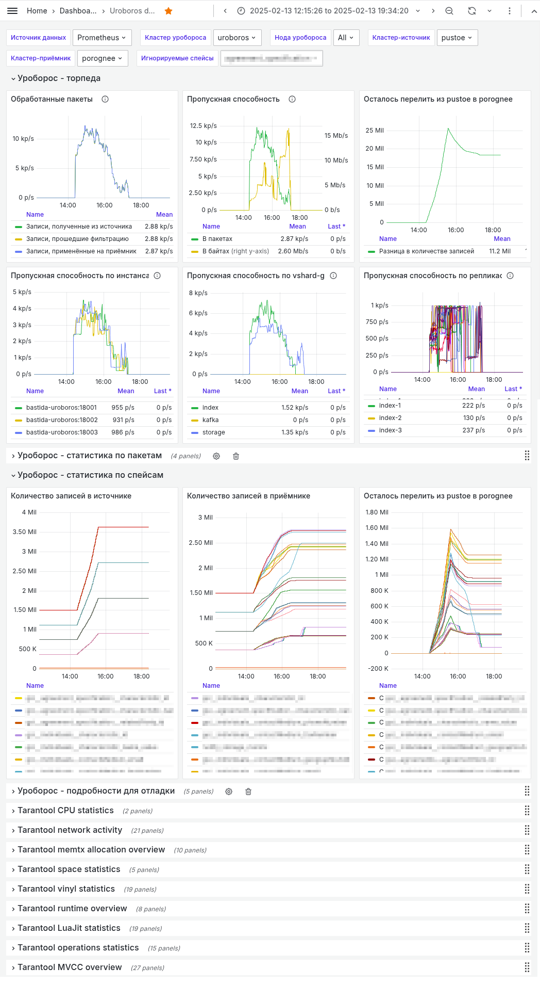

# Ouroboros

В данном разделе приведены сведения о
[Ouroboros](https://git.picodata.io/picodata/plugin/ouroboros), плагине для
СУБД Picodata.

!!! tip "Picodata Enterprise"
    Функциональность плагина доступна только в коммерческой версии Picodata.

## Общие сведения {: #intro }

Плагин Ouroboros используется для однонаправленной асинхронной логической
[репликации](../overview/glossary.md#replication) данных между двумя
кластерами Picodata.

Основные задачи Ouroboros:

- перенос кластера на новую площадку без простоя
- обеспечение отказоустойчивости путем репликации одного кластера в другой

<!--
## Ограничения {: #limitations }

1. Источником может быть только кластер Tarantool Cartridge, где
   развернуты [роли-сайдкары], включенные в поставку.
2. Роли надо развернуть на всех Vshard-группах, которые планируется
   реплицировать.
3. Источник должен быть запущен на форке Tarantool от компании Picodata,
   для которого должно быть включено расширение для
   [WAL](../overview/glossary.md#wal):

```lua
local ok, err = cartridge.cfg({}, {
    wal_ext = { new_old = true },
})
```

[роли-сайдкары]: https://git.picodata.io/picodata/plugin/uroboros-sidecars/cartridge-sidecar
-->

## Принцип работы {: #details }

Для использования Ouroboros требуются два кластера:
кластер источник и кластер-приемник. Далее необходимо [развернуть кластер]
Picodata с включенным плагином Ouroboros. В этом кластере может быть как
один инстанс, так и несколько — число инстансов определяет то, сколько
исполнителей (процессов копирования) будет выполняться одновременно.

При условии [корректной настройки](#config) подключения к кластерам Ouroboros
будет переносить данные из кластера-источника в кластер-приемник с помощью
логической репликации (копирования журналов изменений). Этот способ
предоставляет необходимую гибкость (позволяет работать с отдельными таблицами) и
учитывает семантику данных.

[развернуть кластер]: ../tutorial/deploy.md
[файберов]: ../overview/glossary.md#fiber

Схема работы плагина показана ниже:


Плагин учитывает топологию кластеров, с которыми он работает. Каждый
исполнитель плагина Ouroboros реплицирует один или более репликасетов из
кластера-источника. На исполнителе создается набор [файберов], каждый
из которых обрабатывает свою связку <репликасет источник + диапазон
бакетов>. Таким образом, получается паралелльная отправка в
кластер-приемник записей из различных бакетов. При этом сохраняется
упорядоченность записей и изменений в рамках каждого бакета (не
возникает "состояния гонки").

## Состав плагина {: #plugin_files }

Внутри архива с плагином находится структура вложенных директорий,
включающая имя и версию плагина, а также его файлы:

```
└── ouroboros
    └── 1.1.0
        ├── deps.toml                     # файл со списком зависимостей плагина
        ├── libouroboros.so               # основная часть плагина, разделяемая библиотека
        ├── manifest.yaml                 # манифест, задающий исходную конфигурацию плагина
        ├── migrations                    # файлы миграций плагина
        │   ├── 0001_state.db
        │   ├── 0002_ouroboros_state.db
        │   └── 0003_ouroboros_bucket.db
        └── ouroboros-cli                 # сверяет количество записей между кластерами по таблицам и бакетам
```

## Конфигурация плагина {: #config }

Основные параметры плагина включают в себя:

- имя отдельного пользователя (должно совпадать на кластере-источнике и
  кластере-приемнике), под которым Ouroboros будет подключаться
- группа параметров для подключения к кластеру-источнику (producer) и
  кластеру-приемнику (consumer)
- группа параметров по настройке репликации (группы шардирования, исключаемые
  спейсы (таблицы), настройки параллелизма, переподключения и т.д.)

Исходная конфигурация плагина определяется файлом-манифестом:

??? example "manifest.yaml"
    ```yaml
    description: Plugin tnt clusters replication
    name: ouroboros
    version: 1.1.0
    services:
      - name: ouroboros
        description: ouroboros descr
        default_configuration:
          password: password
          producer:
            user_url: http://localhost:9001/ouroboros/api/v1/user
            topology_url: http://localhost:9001/ouroboros/api/v1/topology
            space_info_url: http://localhost:9001/ouroboros/api/v1/space
            version_url: http://localhost:9001/ouroboros/api/v1/version
          consumer:
            type: tarantool
            attributes:
              space_info_url: http://localhost:9002/ouroboros/api/v1/space
              user_url: http://localhost:9002/ouroboros/api/v1/user
              topology_url: http://localhost:9002/ouroboros/api/v1/topology
              version_url: http://localhost:9002/ouroboros/api/v1/version
          enabled_groups: ["default"]
          disabled_spaces: []
          buckets_per_writer: 1000
          reconnect_delay: 10
          reader_buffer_size: 10000
          writer_buffer_size: 1000
          skip_ddl_replication: false
          small_packet_max_size: 1024
          small_packets_pool_size: 5000
          large_packets_pool_size: 500
    migration:
    - migrations/0001_state.db
    - migrations/0002_ouroboros_state.db
    - migrations/0003_ouroboros_bucket.db
    ```

Пользовательская конфигурация плагина определяется отдельным
конфигурационным файлом для сервиса плагина:

```yaml
ouroboros:
  producer: # настройки кластера-источника
    space_info_url: "http://<source_address>/ouroboros/api/v1/space"
    user_url: "http://<source_address>/ouroboros/api/v1/user"
    topology_url: "http://<source_address>/ouroboros/api/v1/topology"
  consumer: # настройки приемника
    type: "tarantool" # может быть tarantool, или, в будущем kafka
    attributes:
      space_info_url: "http://<destination_address>/ouroboros/api/v1/space"
      user_url: "http://<destination_address>/ouroboros/api/v1/user"
      topology_url: "http://<destination_address>/ouroboros/api/v1/topology"
  enabled_groups: # vshard-группы, которые следует реплицировать
    - index
    - kafka
    - storage
  disabled_spaces: # спейсы (таблицы) из указанных выше vshard-group, которые реплицировать НЕ следует
    - notify_storage_vinyl
    - distributed_index_queue_vinyl
    - distributed_index_queue_memtx
    - _repair_queue_v2
    - _tmp_event_storage
    - notify_storage_memtx
    - event_storage
  buckets_per_writer: 300 # степень параллелизации обработки. Не стоит изменять без консультации с разработчиками.
  reconnect_delay: 10 # задержка перед восстановлением коннекта к источнику
  skip_ddl_replication: false # отключить репликацию DDL
  # технические параметры плагина
  reader_buffer_size: 10000
  writer_buffer_size: 1000
  small_packet_max_size: 1024
  small_packets_pool_size: 5000
  large_packets_pool_size: 500
```

Для изменения настроек уже запущенного плагина используйте SQL-команду `ALTER PLUGIN ...`

См. также:

- [Конфигурация плагинов](../architecture/plugins.md#plugin_config)

## Подключение плагина {: #plugin_enable }

Содержимое архива с плагином следует распаковать в любую удобную
директорию, которую после этого нужно будет указать как `PLUGIN_DIR` для
инстанса Picodata.

При запуске одного инстанса из [командной строки] директорию плагина
можно указать с помощью параметра:

```bash
picodata run --plugin-dir=<PLUGIN-DIR> ...
```

Однако, для полноценной использования плагина рекомендуется запустить кластер с помощью [роли Ansible].

[командной строки]: ../reference/cli.md
[роли Ansible]: ../admin/deploy_ansible.md

После запуска Picodata с поддержкой плагинов в заданной директории подключитесь к [административной
консоли] инстанса Picodata.

Установите плагин, добавьте его к тиру и включите его с помощью
следующих SQL-команд:

```sql
CREATE PLUGIN ouroboros 1.1.0;
ALTER PLUGIN ouroboros MIGRATE TO 1.1.0;
ALTER PLUGIN ouroboros 1.1.0 ADD SERVICE ouroboros TO TIER default;
ALTER PLUGIN ouroboros 1.1.0 ENABLE;
```

[административной консоли]: ../tutorial/connecting.md#admin_console

## Проверка с помощью Ansible {: #ansible_test }

### Подготовка {: #preparation }

1. Изучите [документацию по развертыванию кластера Picodata](https://docs.picodata.io/picodata/stable/tutorial/deploy_ansible/). Выполнить инструкции по установке роли.
2. Скачайте нужную версию плагина `ouroboros` и положите пакет в рабочую директорию.
3. Проверьте наличие конфигурационного файла для плагина `ouroboros-config.yml`, проверьте настройки в нем (см. ниже).

!!! note "Примечание"
    На сервере, с которого будет происходить установка,
    необходим Ansible и доступ на серверы кластера с повышением привилегий.

### Установка окружения {: #setting_env }

Создайте файл с описанием кластера согласно [руководству по
развертыванию кластера](../admin/deploy_ansible.md). Ниже показан пример
для 4-х серверов, расположенных в 3-х группах (DC1, DC2 и DC3). Группа —
отдельный [домен отказа].

[домен отказа]: ../overview/glossary.md#failure_domain

```yaml title="ouroboros.yml"
---
all:
  vars:
    user: username # имя пользователя, под которым будут запущены процессы picodata
    group: groupname # группа пользователя, под которой будут запущены процессы picodata
    password: "<password>"
    cluster_name: ouroboros
    audit: false
    log_level: warn
    log_to: file

    conf_dir: "/opt/picodata/etc"
    data_dir: "/opt/picodata/data"
    run_dir: "/var/run/picodata"
    log_dir: "/opt/picodata/logs"

    fd_uniq_per_instance: true

    purge: true # при очистке кластера удалять в том числе все данные и логи с сервера

    listen_ip: "{{ ansible_default_ipv4.address }}" # ip-адрес, который будет слушать инстанс, по умолчанию ansible_default_ipv4.address

    first_bin_port: 13301 # начальный бинарный порт для первого инстанса (он же main_peer)
    first_http_port: 18001
    first_pg_port: 15001

    init_system: "supervisord"
    rootless: true

    plugins:
      ouroboros:
        path: "ouroboros_1.1.0.tar.gz"
        services:
          tiers:
            - default
        config: "ouroboros-config.yml"
    tiers:                          # описание тиров
      arbiter:                      # имя тира
        replicaset_count: 1         # количество репликасетов
        replication_factor: 1       # фактор репликации
        config:
          memtx:
            memory: 64M             # количество памяти, выделяемое каждому инстансу тира
        host_groups:
          - ARBITERS                # целевая группа серверов для установки инстанса

      default:                      # имя тира
        replicaset_count: 3         # количество репликасетов
        replication_factor: 3       # фактор репликации
        bucket_count: 16384         # количество бакетов в тире
        config:
          memtx:
            memory: 71M             # количество памяти, выделяемое каждому инстансу тира
        host_groups:
          - STORAGES                # целевая группа серверов для установки инстанса
    admin_password: "<password>"
    property:
      auto_offline_timeout: 30

    GROUP1:                             # Группа серверов (failure_domain)
      hosts:                            # серверы в группе
        server-1-1:                     # имя сервера в инвентарном файле
          ansible_host: '192.168.19.21' # IP-адрес или fqdn если не совпадает с предыдущей строкой
          host_group: 'STORAGES'        # определение целевой группы серверов для установки инстансов

        server-1-2:                     # имя сервера в инвентарном файле
          ansible_host: '192.168.19.22' # IP-адрес или fqdn если не совпадает с предыдущей строкой
          host_group: 'ARBITERS'        # определение целевой группы серверов для установки инстансов

    GROUP2:                             # Группа серверов (failure_domain)
      hosts:                            # серверы в группе
        server-2-1:                     # имя сервера в инвентарном файле
          ansible_host: '192.168.20.21' # IP-адрес или fqdn если не совпадает с предыдущей строкой
          host_group: 'STORAGES'        # определение целевой группы серверов для установки инстансов

    GROUP3:                             # Группа серверов (failure_domain)
      hosts:                            # серверы в группе
        server-3-1:                     # имя сервера в инвентарном файле
          ansible_host: '192.168.21.21' # IP-адрес или fqdn если не совпадает с предыдущей строкой
          host_group: 'STORAGES'        # определение целевой группы серверов для установки инстансов
```

Создайте файл с [конфигурацией](#config).

Подготовьте плейбук `picodata.yml`:

```yaml
---
- name: Deploy Picodata cluster
  hosts: all
  become: true

  tasks:
    - name: Import picodata-ansible role
      ansible.builtin.import_role:
        name: picodata-ansible
```

В результате в рабочем каталоге должно быть 4 файла:

- ouroboros.yml
- picodata.yml
- ouroboros_config.yml
- ouroboros_xxxxx.tar.gz

Запустите раскатку Ouroboros:

```bash
ansible-playbook -i ouroboros.yml picodata.yml
```

## Мониторинг показателей плагина {: #grafana_board}

Процесс работы плагина Ouroboros можно удобно отслеживать в графическом
интерфейсе [Grafana], для которого Picodata поставляет файл
конфигурации (dashboard).

Для настройки мониторинга импортируйте dashboard с данными Ouroboros. Для
этого понадобится файл [dashboard.grafana.json], который следует
добавить в меню `Dashboards` > `New` > `Import`:


Панель dashboard для плагина Ouroboros отображает ряд графиков, на
которых отражена пропускная способность кластера с Ouroboros, статистика
по скопированным пакетам, а также данные по количеству записей в
кластере-источнике и кластере-приемнике.

Внешний вид dashboard для Ouroboros показан ниже:



Для настройки dashboard используйте параметры в верхней части экрана:

- **Источник данных** — по умолчанию `Prometheus`
- **Кластер уробороса** — имя кластера с Ouroboros
- **Нода уробороса** — данные с каких узлов кластера с Ouroboros следует отображать (по умолчанию `All`, т.е. со всех узлов)
- **Кластер источник** — имя кластера, с которого Ouroboros будет забирать данные (значение по умолчанию — `pustoe`)
- **Кластер-приемник** — имя кластера, в который Ouroboros будет записывать данные (значение по умолчанию — `porognee`)
- **Игнорируемые спейсы** — список спейсов, данные которых не будут скопированы

[Grafana]: ../admin/monitoring.md#grafana
[dashboard.grafana.json]: https://git.picodata.io/picodata/plugin/uroboros/-/raw/master/observability/dashboard.grafana.json

См. также:

- [Управление плагинами](../dev/plugin_mgmt.md)

<!--
## Сборка и подготовка файлов плагина {: #local_build }

Склонируйте репозиторий с исходным кодом Ouroboros:

```bash
git clone https://git.picodata.io/picodata/plugin/uroboros.git
```

Соберите разделяемые библиотеки Ouroboros (требуется актуальные версии Rust, Cargo, GNU Make):

```bash
cd ouroboros
make build
```

Результатом сборки будут следующие библиотеки в директории `target/debug`:

- liburoboros_config.so
- liburoboros.so
- liburoboros_utils.so

-->

<!--  ## Проверка плагина вручную {: #manual_test }

Скопируйте библиотеки Uruboros, файл манифеста и файлы миграций в директорию
плагина. Выполните следующий набор команд из основной директории
репозитория:

```bash
mkdir -p plugins/uroboros
cp ./target/debug/liburoboros*.so ./plugins/uroboros/<версия>/
cp manifest.yml ./plugins/uroboros/<версия>/manifest.yaml
cp -r migrations/* plugins/uroboros/<версия>
```

Запустите плагин согласно руководству [Управление плагинами](../dev/plugin_mgmt.md)

## Проверка в локальном тестовом окружении {: #docker_test }

Локальное тестовое окружение использует Docker-образ с ОС Rocky Linux 8
и предоставляет два кластера (источник и назначение) для проверки работы
плагина Ouroboros. Файлы тестового окружения находятся в директории
`local-dev-clusters`.

Для запуска локального тестового окружения требуется запущенная
системная служба Docker. Выполните следующий набор команд из основной
директории репозитория:

```bash title="Сборка образа для поднятия тестовых кластеров"
make build_docker_cluster
```

```bash title="Запуск образов"
make run_docker_clusters
```

Перед запуском тестов убедитесь, что в системе установлены Python-модули
`pytest` и `tarantool`. После этого выполните команду:

```bash title="Запуск интеграционных тестов"
TEST_RUN_CLUSTERS=docker make test
```
-->
