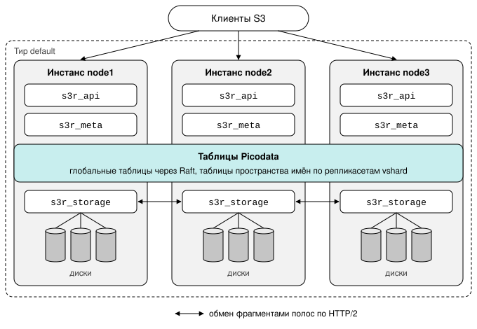
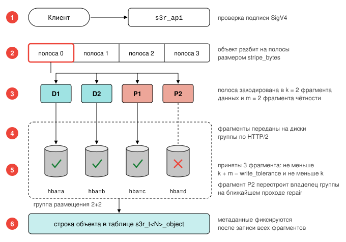
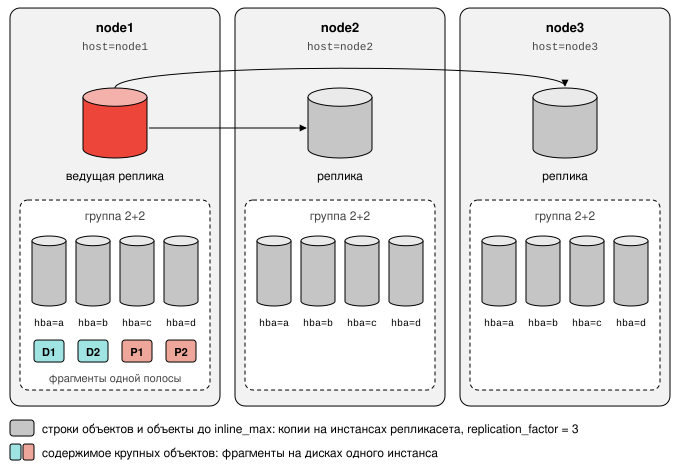
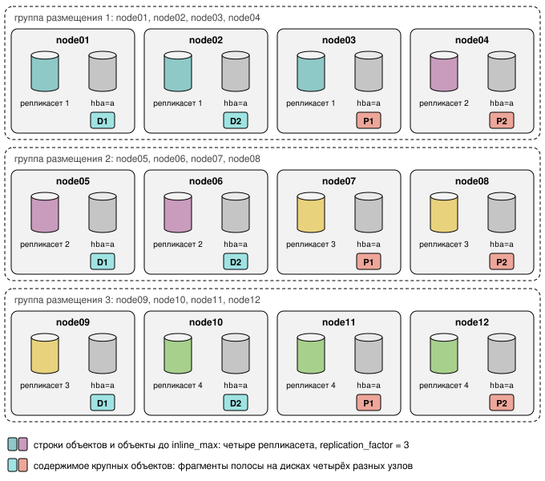
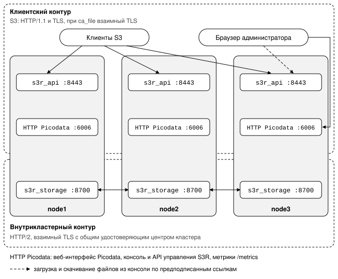
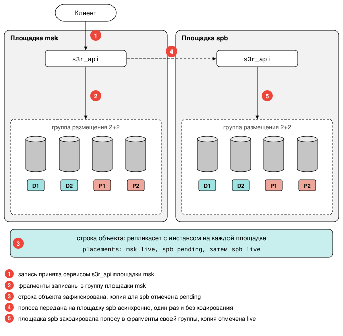
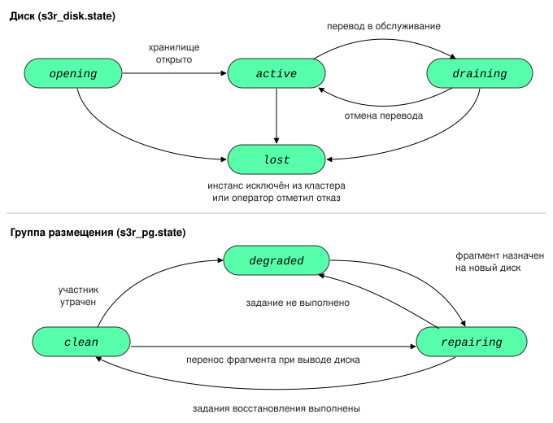
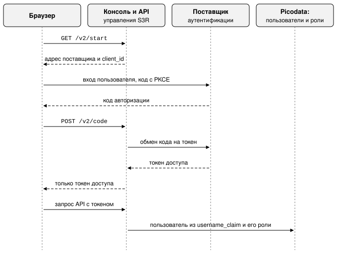

# S3R

В данном разделе приведены сведения о S3R, плагине объектного хранилища для
СУБД Picodata. Это же руководство поставляется вместе со сборкой плагина.

!!! tip "Picodata Enterprise"
    Функциональность плагина доступна только в коммерческой версии Picodata.

Документ описывает установку, настройку и эксплуатацию
[плагина](../overview/glossary.md#plugin)
S3R для администраторов, разработчиков прикладных систем и инженеров
эксплуатации.

## Назначение и устройство {: #purpose_and_design }

### Общие сведения {: #intro }

Плагин S3R реализует объектное хранилище с интерфейсом, совместимым с Amazon S3,
и работает внутри СУБД Picodata. Плагин хранит метаданные объектного хранилища
(бакеты, объекты, директории и карту размещения) как в глобальных таблицах, так и в
шардированных:

- Бакеты и карта размещения хранятся в глобальных таблицах и согласуются через
  Raft-консенсус.
- Метаданные каждого объекта размещаются на соответствующем шарде. Шардированные
  таблицы распределяются по репликасетам средствами vshard.

Содержимое объектов размещается на локальных дисках узлов в хранилище полос
и защищается репликацией либо
избыточным кодированием Рида-Соломона.

Архитектура плагина обеспечивает три свойства:

**Согласованность.** По умолчанию плагин использует параметр `read_consistency =
strong`, при котором операции с одним ключом линеаризуемы, и успешно записанные
данные сразу доступны для чтения. Отдельный слой метаданных с отложенной
согласованностью и внешние хранилища, например etcd или RocksDB, не требуются.
При значении `read_consistency = eventual` плагин разрешает чтение с реплики в
любое время, и результат такого чтения может быть устаревшим.

**Горизонтальная масштабируемость.** Так как метаданные распределяются по репликасетам,
то пропускная способность работы с метаданными растёт с числом
репликасетов и не ограничена возможностями одного узла.

**Скорость обработки малых объектов.** Объект размером до `inline_max` хранится
в строке своих метаданных. При движке `memtx`, который применяется по умолчанию,
чтение такого объекта не требует обращения к диску и выполняется в оперативной
памяти.

### Состав плагина {: #plugin_contents }

Плагин состоит из трёх
[сервисов](../overview/glossary.md#service),
которые следует назначить на один и тот же
[тир](../overview/glossary.md#tier)
Picodata.

| Сервис        | Назначение                                                                                                                           |
|---------------|--------------------------------------------------------------------------------------------------------------------------------------|
| `s3r_api`     | Приём запросов S3: разбор HTTP, проверка подписи SigV4, авторизация, разбиение объекта на полосы, кодирование и сборка полос         |
| `s3r_meta`    | Операции над таблицами пространства имён и передача обращений от среды выполнения Tokio транзакционному потоку TX                    |
| `s3r_storage` | Хранилище полос на локальных дисках, регистрация дисков в кластере, обмен фрагментами полос между узлами, ведение карты размещения |

Размещение сервисов и данных в кластере показано на схеме ниже:



Сервисы запускаются независимо друг от друга и в произвольном порядке. Плагин
становится доступным для работы после запуска сервиса `s3r_meta`.

> **Примечание.** Плагин можно включить на нескольких тирах. В этом случае на
> каждый из них назначаются все три сервиса: при запуске плагин сравнивает
> списки тиров сервисов и не включается, если списки различаются.

## Путь запроса на запись {: #query_write }

Если размер объекта превышает значение, указанное в `inline_max` (в
рамках настройки сервиса [s3r_api](#s3r_api)), то он записывается в
следующем порядке:

1. Сервис `s3r_api` принимает тело запроса и проверяет подпись.
2. Объект разбивается на полосы размером `stripe_bytes`, заданным для выбранной
   группы размещения.
3. В зависимости от класса хранения каждая полоса кодируется в `k` фрагментов
   данных и `m` фрагментов чётности, либо копируется `R` раз.
4. Фрагменты передаются на диски группы размещения по протоколу HTTP/2. Единица
   передачи совпадает с единицей записи на диск.
5. Полоса считается записанной, когда её фрагменты приняли и сохранили не менее
   `k + m − write_tolerance` дисков и не менее `k` дисков. Непринятый фрагмент
   перестраивает владелец группы на ближайшем проходе восстановления.
6. После записи всех полос в пространстве имён создаётся строка объекта.



Метаданные фиксируются только после записи данных.

#### Кворум записи {: #write_quorum }

Параметр `write_tolerance` сервиса `s3r_storage` задаёт число фрагментов,
которые запись вправе оставить недописанными. Значение по умолчанию равно 1.

Значение 1 допускает недоступность одного участника группы: отказ диска либо,
если группа распределена по дискам разных [инстансов](../overview/glossary.md#instance), отказ одного инстанса.
Группа, собранная из дисков одного инстанса, при отказе этого инстанса
недоступна целиком (см. [«Схема избыточности»](#redundancy_scheme)). При
значении 0 для записи требуются все фрагменты, и недоступность одного участника
приводит к отказу каждой записи в группу.

Кворум записи не опускается ниже `k`. Полоса из `k` фрагментов доступна для
чтения, но потеря ещё одного фрагмента сделает чтение невозможным. Полоса, у
которой сохранилось от `k + 1` до `k + m` фрагментов, остаётся доступной для
чтения при ещё одном отказе, пока недостающие фрагменты восстанавливаются.
Значение `write_tolerance` больше `m` не отклоняется, и кворум в этом случае
равен `k`.

Если группа размещения, выбранная для объекта, не набирает кворума, например при
недоступности инстанса, из дисков которого она собрана, запись выполняется в
следующую группу той же площадки. За границу площадки выбор группы не выходит.

Очереди дозаписи нет. Участник, не принявший свой фрагмент, не держит в этой
позиции того ключа, который записан в каталоге, и владелец группы перестраивает
такую позицию на ближайшем проходе восстановления. Что восстановлению осталось
исправить, показывает `GET /v2/repair`.

Чтение выполняется в обратном порядке. Строка объекта содержит идентификатор
группы размещения и размер объекта. По ним вычисляется геометрия полос, после
чего запрашиваются полосы, попадающие в запрошенный диапазон.

## Требования {: #requirements }

| Компонент | Требование |
| --- | --- |
| СУБД | Picodata той версии, под которую выпущена версия плагина; см. [«Соответствие версий S3R и Picodata»](#picodata_s3r_versions). При несовпадении версий плагин не загружается и выводит обе версии |
| Ядро | Linux 5.10 или новее |
| Подсистема ввода-вывода | `io_uring` и открытие файлов с флагом `O_DIRECT` (см. [подробнее](#check_fs)). Резервная реализация отсутствует: при недоступности этих механизмов диск не монтируется, и событие фиксируется в журнале |
| Файловая система | Локальная, с поддержкой `O_DIRECT` и `posix_fallocate` |

Окружение контейнера проверяется отдельно. Профиль seccomp в ядре Linux
может запрещать системные вызовы `io_uring`, а оверлейная файловая
система может запрещать открытие файлов с флагом `O_DIRECT`. Эти причины
независимы, и отказ одного механизма не означает отказа другого.

## Установка {: #plugin_installation }

### Соответствие версий S3R и Picodata {: #picodata_s3r_versions }

Под каждую выпущенную версию Picodata собирается соответствующая выпущенная
версия плагина.

| S3R   | Picodata |
|-------|----------|
| 2.0.0 | 26.2.1   |

## Состав поставки {: #plugin_package }

Плагин представляет собой файл архива `s3r_2.0.0-<ОС>.tar.gz`. Доступ к
репозиторию предоставляется по запросу.

Структура архива соответствует стандартной структуре плагина Picodata: директория
`s3r/2.0.0/` содержит библиотеку `libs3r.so`, файл манифеста `manifest.yaml` и
поддиректорию миграций `migrations/`.

### Расчёт ресурсов {: #resources_allocation }

#### Число инстансов {: #instances_count }

Инстанс Picodata с плагином S3R размещается в пределах одного
вычислительного узла. В мультипроцессорных системах промышленного уровня
следует рассчитывать на загрузку всех [NUMA]-узлов в составе сервера.

[NUMA]: https://en.wikipedia.org/wiki/Non-uniform_memory_access

Один инстанс обслуживает в секунду до 10 000 операций с метаданными:
записей, чтений, запросов атрибутов и листингов. Необходимое число
инстансов определяется делением ожидаемой нагрузки на это значение.

### Процессорные ядра {: #cpu_cores }

Каждому инстансу выделяется 10 логических ядер процессора. Логическим
ядром считается аппаратный поток, а не физическое ядро. Одно ядро
занимает транзакционный поток TX, восемь ядер занимает пул рабочих
потоков Tokio, в котором выполняются разбор запросов, кодирование,
сжатие и обмен фрагментами полос, и одно ядро остаётся для фоновых
операций, например для создания
[снимков](../overview/glossary.md#snapshotting).
Размер пула задаётся переменной окружения `S3R_WORKER_THREADS=8`. Без
неё пул рассчитывается по числу ядер всего сервера, и при нескольких
инстансах на сервере потоков запускается больше, чем ядер.

### Оперативная память {: #ram }

Метаданные хранятся в памяти `memtx`. Объект, содержимое которого
размещено на дисках, занимает в памяти около 320 байт вместе с индексами
и, кроме того, столько байт, сколько занимает его ключ. Объект размером
до `inline_max` дополнительно занимает объём своего содержимого.
Например, 100 миллионов объектов с ключами длиной 80 байт требуют около
40 ГБ памяти. Этот объём необходим каждому инстансу репликасета, потому
что каждая реплика хранит полную копию данных.

Объём памяти под метаданные увеличивается двумя способами: добавлением узлов,
между которыми распределяются шарды метаданных, либо увеличением параметра
`instance.memtx.memory`.

Плагин устанавливается двумя способами: вручную, как описано в разделе
[«Пошаговая установка»](#install_steps), либо ролью Ansible для
Picodata, как описано в разделе [«Установка ролью
Ansible»](#install_with_ansible). В обоих случаях выполняются одни и те же
действия.

### Схема избыточности {: #redundancy_scheme }

Схема избыточности выбирается до установки. На кластере с данными её
изменить нельзя: фактор репликации тира задаётся при первом запуске
кластера, а [форма кодирования](#encoding_formats), под которой уже
записаны данные, не изменяется.

> **Внимание.** Если схема не выбрана, S3R хранит одну копию данных. Picodata
> по умолчанию создаёт тир с фактором репликации 1, а без объявленных форм
> кодирования группа размещения состоит из одного диска. Отказ диска делает
> недоступными объекты крупнее `inline_max`, фрагменты которых хранились на
> этом диске. Отказ инстанса делает недоступными также метаданные его
> репликасета.

#### Уровни избыточности {: #redundancy_levels }

Каждый уровень избыточности задаётся своими параметрами и защищает свою часть
данных.

| Уровень | Параметры | Защищаемые данные | Отказ, который переживают данные |
|---------|-----------|-------------------|----------------------------------|
| Инстанс | `failure_domain` инстанса и `replication_factor` тира Picodata | строки объектов и содержимое объектов размером до `inline_max` (по умолчанию 4 КиБ) | отказ инстанса или узла |
| Диск | поддомен диска `hba=` и формы `s3r_storage.erasure` | содержимое объектов крупнее `inline_max` | отказ дисков, число которых не больше `m` |
| Площадка | компонент `dc` домена отказа инстанса | копия каждого объекта на каждой площадке | отказ площадки |

Распределение данных по уровням для кластера из раздела [«Пример: одна
площадка»](#one_place) показано на схеме:



Важно понимать разницу между _доменом отказа Picodata_ и _поддоменами дисков_. Домен отказа
инстанса определяет, какие инстансы Picodata объединяет в репликасет. Поддомен
диска определяет, какие диски одного инстанса могут хранить фрагменты одной
полосы.

Если домен отказа не задан, Picodata объединяет инстансы в репликасеты в
порядке их подключения к кластеру. Такой вариант применяется в виртуализированном
окружении, где размещение инстансов по физическим серверам определяет платформа
виртуализации, но реплики одного репликасета при этом могут оказаться на одном
сервере.

Если домен отказа задан, Picodata объединяет в репликасет только
инстансы, домены отказа которых не совпадают ни в одном компоненте (при
этом набор компонентов должен быть одинаковым у всех инстансов
кластера). Компонент с одинаковым значением у всех инстансов, например
`dc: msk` в кластере с одной площадкой, не позволяет собрать репликасет
больше чем из одного инстанса. Поэтому на одной площадке домен отказа
инстанса задаётся без компонента `dc`, например компонентом `host`, и
все инстансы относятся к площадке `default`. Если площадок несколько, то
следует убедиться, что фактор репликации не превышает их число — тогда
репликасет будет содержать не более одного инстанса с каждой площадки.

Группа размещения собирается из дисков одного инстанса, если у этого инстанса
достаточно дисков для формы кодирования. По дискам разных инстансов группа
распределяется, только когда ни у одного инстанса дисков недостаточно. Группа на
дисках одного инстанса переживает отказ `m` дисков, но не отказ самого
инстанса. Пока инстанс недоступен, не читается содержимое тех объектов крупнее
`inline_max`, фрагменты которых находятся в его группах, хотя строки этих
объектов доступны на других репликах.
Копия объекта на другой площадке в этом случае для чтения не используется.

#### Пример: одна площадка {: #one_place }

Кластер состоит из трёх узлов, на каждом из которых работает один инстанс с
четырьмя дисками. Метаданные и объекты до `inline_max` хранятся в трёх копиях.
Содержимое крупных объектов кодируется формой 2+2 и занимает на дисках вдвое
больше своего объёма.

Конфигурация инстанса на `node1`:

```yaml
cluster:
  tier:
    default:
      replication_factor: 3
      can_vote: true
instance:
  failure_domain:
    host: node1
```

Диски инстанса:

```bash
S3R_DISKS=/data/s3r/d0:hba=a,/data/s3r/d1:hba=b,/data/s3r/d2:hba=c,/data/s3r/d3:hba=d
```

Форма кодирования:

```sql
ALTER PLUGIN s3r 2.0.0 SET s3r_storage.erasure = '[{"k":2,"m":2}]';
```

Picodata собирает из трёх инстансов один репликасет, а плагин создаёт по одной
группе 2+2 на дисках каждого инстанса.

| Отказ                 | Метаданные и объекты до `inline_max` | Объекты крупнее `inline_max`                                                                        |
|-----------------------|--------------------------------------|-----------------------------------------------------------------------------------------------------|
| один диск             | доступны                             | доступны: недостающие фрагменты вычисляются при чтении, а фрагмент перестраивается на другом диске      |
| два диска одного узла | доступны                             | доступны                                                                                            |
| узел                  | доступны на двух других репликах     | объекты, фрагменты которых хранятся на этом узле, недоступны до его возвращения; остальные доступны |

#### Пример: группы на дисках разных узлов {: #grouped_drives_on_different_nodes }

Кластер состоит из двенадцати узлов, на каждом из которых работает один
инстанс с одним диском. Коэффициент репликации тира и форма кодирования те же,
что в примере с одной площадкой. Поддомен `hba=` задаётся и для единственного
диска инстанса, потому что без него кодирование не выполняется.

```bash
S3R_DISKS=/data/s3r/d0:hba=a
```

Ни один инстанс не может собрать группу 2+2 из своих дисков, поэтому каждая
группа собирается из дисков четырёх инстансов на разных узлах. Picodata
собирает из двенадцати инстансов четыре репликасета по три инстанса.



| Отказ                   | Метаданные и объекты до `inline_max`                               | Объекты крупнее `inline_max`                        |
|-------------------------|--------------------------------------------------------------------|-----------------------------------------------------|
| один диск или один узел | доступны на двух других репликах                                   | доступны: группа теряет одного участника из четырёх |
| два узла одной группы   | доступны на других репликах, если узлы входят в разные репликасеты | доступны                                            |

Такая группа переживает отказ узла, но чтение полосы и её восстановление
обращаются к дискам других узлов по сети.

#### Пример: несколько площадок {: #many_places }

Кластер размещён на трёх площадках `msk`, `spb` и `ekb`. На каждой площадке
находятся два узла, и на каждом узле работает один инстанс с четырьмя дисками. Компонент `dc` домена отказа задаёт площадку, а компонент
`host` различает узлы.

Конфигурация инстанса на первом узле площадки `msk`:

```yaml
cluster:
  tier:
    default:
      replication_factor: 3
      can_vote: true
instance:
  failure_domain:
    dc: msk
    host: msk1
```

Диски и форма кодирования задаются так же, как в примере с одной площадкой.

Picodata собирает два репликасета, в каждом из которых по одному инстансу с
каждой площадки, и строки объектов хранятся на всех трёх площадках. Плагин
создаёт группы 2+2 внутри каждой площадки, а каждая площадка хранит собственную
закодированную копию содержимого. Кодирование не выходит за границу площадки,
а копии между площадками передаются асинхронно фоновым процессом `siterepl`.
Содержимое крупных объектов занимает на дисках в шесть раз больше своего
объёма: вдвое на каждой из трёх площадок.

| Отказ                   | Метаданные и объекты до `inline_max` | Объекты крупнее `inline_max`                                                                           |
|-------------------------|--------------------------------------|--------------------------------------------------------------------------------------------------------|
| один или два диска узла | доступны                             | доступны                                                                                               |
| узел                    | доступны на репликах других площадок | объекты, фрагменты которых хранятся на этом узле, недоступны клиентам его площадки до возвращения узла |
| площадка                | доступны на двух других площадках    | доступны на других площадках, если их копия успела перейти в состояние `live`                          |

При двух площадках кворум Raft не переживает отказ площадки, на которой
находится большинство голосующих инстансов. Для этого случая предусмотрен
инстанс арбитра на третьей площадке, как описано в разделе [«Установка ролью
Ansible»](#install_with_ansible).

### Пошаговая установка {: #install_steps }

В примерах кластер состоит из трёх узлов `node1.example.net` …
`node3.example.net`, на каждом из которых работает один инстанс Picodata с
четырьмя дисками. Схема избыточности соответствует разделу [«Пример: одна
площадка»](#one_place). Версия плагина в примерах `2.0.0`, тир
`default`.

#### Шаг 1. Проверка узлов {: #check_fs }

На каждом узле проверьте, что файловая система, на которой будут размещены диски
хранилища, допускает открытие файлов с флагом `O_DIRECT`:

```bash
mkdir -p /data/s3r/d0
dd if=/dev/zero of=/data/s3r/d0/probe bs=4096 count=1 oflag=direct
rm /data/s3r/d0/probe
```

Если команда `dd` завершается ошибкой `Invalid argument`, файловая система не
поддерживает `O_DIRECT`, и эта директория диском хранилища служить не может.

Доступность `io_uring` проверяется при запуске плагина: диск, для которого
механизм недоступен, не монтируется, и событие фиксируется в журнале. Результат
виден на шаге 7.

#### Шаг 2. Размещение архива {: #plugin_rollout }

На каждом узле распакуйте архив в директорию плагинов Picodata, заданную параметром
`instance.share_dir`:

```bash
tar -xzf s3r_2.0.0-astra_1.8_x86-64.tar.gz -C /usr/share/picodata
```

В директории `/usr/share/picodata/s3r/2.0.0/` должны появиться `libs3r.so`,
`manifest.yaml` и `migrations/`. Имя директории должно совпадать с версией,
указанной в командах SQL на шаге 5.

#### Шаг 3. Конфигурация инстансов {: #configure_instances }

В файле конфигурации каждого инстанса Picodata укажите фактор репликации
тира, домен отказа, директорию плагинов и слушатели двух сервисов плагина. Пример
для `node1`:

```yaml
cluster:
  tier:
    default:
      replication_factor: 3
      can_vote: true
instance:
  share_dir: /usr/share/picodata
  failure_domain:
    host: node1
  plugin:
    s3r:
      service:
        s3r_api:
          listener:
            enabled: true
            listen: "0.0.0.0:8443"
            tls:
              enabled: true
              cert_file: /etc/s3r/server.pem
              key_file:  /etc/s3r/server.key
        s3r_storage:
          listener:
            enabled: true
            listen: "0.0.0.0:8700"
            advertise: "node1.example.net:8700"
            tls:
              enabled: true
              cert_file: /etc/s3r/node1.pem
              key_file:  /etc/s3r/node1.key
              ca_file:   /etc/s3r/cluster-ca.pem
```

Конфигурация узлов различается для следующих параметров:

- компонент `host` домена отказа
- адрес `advertise`
- сертификат узла для внутрикластерного контура.

Коэффициент репликации тира применяется при первом запуске кластера и в
дальнейшем не изменяется. Домен отказа не содержит компонента `dc`, потому что
площадка одна: инстансы с одинаковым значением компонента не объединяются в
репликасет (см. [«Схема избыточности»](#redundancy_scheme)).

Слушатель `s3r_api` принимает запросы S3 от клиентов. Слушатель `s3r_storage`
служит для обмена фрагментами между узлами; его порт должен быть
недоступен клиентам. Для внутрикластерного контура параметр `ca_file`
обязателен. Выпуск сертификатов и назначение каждого параметра описаны в главе
[«Шифрование трафика»](#data_encryption).

Диски хранилища задаются одним из двух способов. Если пути дисков совпадают на
всех узлах, они задаются параметром плагина `s3r_storage.disks` на шаге 5. Если
пути различаются, например при нескольких инстансах на одном узле, каждому
инстансу задаётся переменная окружения `S3R_DISKS`:

```bash
S3R_DISKS=/data/s3r/d0:hba=a,/data/s3r/d1:hba=b,/data/s3r/d2:hba=c,/data/s3r/d3:hba=d
```

Свойство `hba=` задаёт поддомен отказа диска. Без него несколько дисков одного
инстанса считаются одним доменом отказа, и группа размещения для кодирования на
них не собирается. Формат переменной описан в разделе [«Переменные
окружения»](#shell_variables).

Объём памяти memtx задаётся параметром `instance.memtx.memory`, а размер пула
рабочих потоков переменной окружения `S3R_WORKER_THREADS`. Значения обоих
параметров рассчитываются по разделу [«Расчёт ресурсов»](#resources_allocation).

#### Шаг 4. Запуск кластера {: #start_cluster }

Запустите инстансы Picodata с подготовленной конфигурацией и подключитесь к
административной консоли любого из них, например:

```bash
picodata admin /var/run/picodata/node1.sock
```

Команды шагов 5 и 7 выполняются в этой консоли.

#### Шаг 5. Регистрация и включение плагина {: #plugin_enable }

Выполните команды SQL в указанном порядке:

```sql
CREATE PLUGIN s3r 2.0.0;

ALTER PLUGIN s3r 2.0.0 ADD SERVICE s3r_storage TO TIER default;
ALTER PLUGIN s3r 2.0.0 ADD SERVICE s3r_meta TO TIER default;
ALTER PLUGIN s3r 2.0.0 ADD SERVICE s3r_api TO TIER default;

ALTER PLUGIN s3r 2.0.0 SET migration_context.storage_tier = 'default';
ALTER PLUGIN s3r 2.0.0 SET migration_context.engine = 'memtx';
ALTER PLUGIN s3r 2.0.0 SET migration_context.unlogged = '';

ALTER PLUGIN s3r MIGRATE TO 2.0.0;

ALTER PLUGIN s3r 2.0.0 SET
  s3r_storage.disks = '[{"path":"/data/s3r/d0","failure_domain":"hba=a"},
                        {"path":"/data/s3r/d1","failure_domain":"hba=b"},
                        {"path":"/data/s3r/d2","failure_domain":"hba=c"},
                        {"path":"/data/s3r/d3","failure_domain":"hba=d"}]';
ALTER PLUGIN s3r 2.0.0 SET
  s3r_storage.erasure = '[{"k":2,"m":2}]';

ALTER PLUGIN s3r 2.0.0 ENABLE;
```

Порядок команд существенен. Назначение сервисов тирам и установка
контекста миграции должны происходить до запуска самих миграций (потому
что имя тира и движок хранения подставляются в текст миграций). Диски
задаются до включения плагина, потому что изменение списка дисков на
работающем сервисе вступает в силу только при следующем запуске
инстанса. Команду с `s3r_storage.disks` пропустите, если диски заданы
переменной `S3R_DISKS`.

Все три сервиса назначаются на один тир. Разделение сервисов по разным
тирам не поддерживается: сервис `s3r_meta` предоставляет эндпоинту
S3 доступ к метаданным на том же узле, фоновые процессы читают строки
своего инстанса, а вызовы между сервисами рассчитаны на соседний сервис
того же узла. Плагин проверяет совпадение списков тиров при запуске и не
включается, если списки имеют отличия. Имя тира выбирает оператор, и то
же имя указывается в `migration_context.storage_tier`.

Форма кодирования `k=2, m=2` собирается из четырёх дисков каждого инстанса с
различными поддоменами `hba=`. Если формы кодирования не объявлены, объекты
крупнее `inline_max` хранятся копиями, число которых равно коэффициенту
репликации тира, и при коэффициенте 1 копия одна. Схема избыточности выбирается
по разделу [«Схема избыточности»](#redundancy_scheme), а форма по разделу
[«Выбор формы кодирования»](#encoding_formats).

#### Шаг 6. Проверка эндпоинта {: #endpoint_check }

На любом узле проверьте, что эндпоинт S3 отвечает:

```bash
curl --cacert /etc/s3r/ca.pem https://node1.example.net:8443/-/health
```

> **Примечание.** Ответ подтверждает только работу процесса и не означает
> готовности дисков и групп размещения. Готовность проверяется на следующем шаге.

#### Шаг 7. Проверка дисков и групп размещения {: #disks_check }

В административной консоли выполните запросы:

```sql
SELECT name, replication_factor FROM _pico_tier;

SELECT instance_name, path, failure_domain, tier, state FROM s3r_disk
 ORDER BY instance_name;

SELECT pg_id, site, tier, k, m, state FROM s3r_pg ORDER BY pg_id;
```

Коэффициент репликации тира должен совпадать с выбранной схемой избыточности.
Каждый диск должен находиться в состоянии `active`, а каждая группа размещения
в состоянии `clean`. Группа со значением `m = 0` избыточности не имеет: отказ
любого её диска делает недоступным содержимое хранящихся в ней объектов. Диск, отсутствующий в `s3r_disk`, не смонтирован; причина
записана в журнале его инстанса. Если групп размещения нет, дисков или
независимых доменов отказа недостаточно для объявленной формы кодирования.

#### Шаг 8. Учётные данные {: #credentials }

Создайте пользователя Picodata и выдайте ему ключ доступа S3 начального
арендатора:

```sql
CREATE USER "alice" WITH PASSWORD 'Str0ngPassw0rd' USING scram-sha256;

ALTER PLUGIN s3r 2.0.0 SET s3r_api.credentials =
  '[{"access_key":"AKIAEXAMPLE000000001","secret_key":"...","pico_user":"alice"}]';
```

Ключ доступа действителен, пока существует названный им пользователь. Выдача
ключей другим арендаторам и смена ключей описаны в разделе [«Учётные
данные»](#storage_credentials).

#### Шаг 9. Проверка работы {: #checkup }

С рабочего места клиента выполните запись и чтение объекта через AWS CLI:

```bash
aws configure set aws_access_key_id AKIAEXAMPLE000000001
aws configure set aws_secret_access_key ...
aws configure set default.s3.addressing_style path

export AWS_CA_BUNDLE=/etc/s3r/ca.pem
aws --endpoint-url https://node1.example.net:8443 s3 mb s3://smoke-test
aws --endpoint-url https://node1.example.net:8443 s3 cp /etc/hostname s3://smoke-test/
aws --endpoint-url https://node1.example.net:8443 s3 ls s3://smoke-test/
aws --endpoint-url https://node1.example.net:8443 s3 rb --force s3://smoke-test
```

Установка завершена. Дальнейшая настройка описана в главах [«Изоляция
арендаторов»](#tenants_isolation), [«Квоты и ограничение
скорости»](#quotas) и [«Первый вход в консоль
управления»](#accessing_console).

### Установка ролью Ansible {: #install_with_ansible }

Роль Ansible для Picodata распаковывает архив плагина на узлы, выполняет команды
SQL шага 5, применяет файл настроек плагина и включает плагин. В инвентарный
файл добавляется блок `plugins`:

```yaml
plugins:
  s3r:
    path: '../files/s3r_2.0.0-astra_1.8_x86-64.tar.gz'
    config: '../files/s3r-config.yml'
    services:
      s3r_storage:
        tiers:
          - default:
              listener:
                enabled: true
                listen: "0.0.0.0:87<INSTANCE_NUM>"
                advertise: "<INSTANCE_ADDR>:87<INSTANCE_NUM>"
      s3r_meta:
        tiers:
          - default
      s3r_api:
        tiers:
          - default:
              listener:
                enabled: true
                listen: "0.0.0.0:84<INSTANCE_NUM>"
    migration_context:
      storage_tier: 'default'
      engine: 'memtx'
      unlogged: ''
```

Литералы `<INSTANCE_ADDR>` и `<INSTANCE_NUM>` роль заменяет адресом узла и
двузначным номером инстанса на узле. Разделы `tls` слушателей задаются так же,
как на шаге 3; файлы сертификатов должны находиться на узлах до установки
плагина.

Диски и размер пула рабочих потоков задаются переменными окружения в параметре
`extra_vars` тира:

```yaml
tiers:
  default:
    extra_vars:
      S3R_DISKS: '/data/s3r/i<INSTANCE_NUM>d0:hba=a,/data/s3r/i<INSTANCE_NUM>d1:hba=b'
      S3R_WORKER_THREADS: '8'
```

Файл настроек плагина `s3r-config.yml` содержит параметры сервисов:

```yaml
s3r_api:
  credentials:
    - access_key: AKIAEXAMPLE000000001
      secret_key: "..."
      pico_user: alice
s3r_storage:
  erasure:
    - k: 2
      m: 2
```

Пользователь, указанный в `pico_user`, должен существовать до применения
настроек. Его создание выполняется скриптом, заданным параметром роли
`sql_file_pre_plugins`.

Для тира, на котором работает плагин, рекомендуется установить следующие параметры:

- **Синхронная репликация.** Параметр `replication_mode: sync` делает репликацию
  внутри репликасета синхронной: запись подтверждается только после того, как
  её принял кворум реплик.
- **Запись журнала с синхронизацией.** Вместе с синхронной репликацией
  задаётся `wal_mode: fsync`. Picodata синхронизирует записи журнала
  Raft на диске независимо от этого параметра, но он защищает данные
  репликасета. При асинхронной репликации параметр пользы не даёт,
  потому что запись на реплику всё равно выполняется асинхронно.

> **Примечание.** Отдельный тир арбитров для S3R, как правило, не нужен и
> только добавляет административную нагрузку. Он оправдан, когда данные
> размещаются в двух датацентрах, а в третьем — например во внешнем
> облаке — можно разместить инстанс арбитра: тогда кластер переживёт отказ
> любого одного датацентра.

> **Пример.** Инвентарный файл кластера из трёх серверов с плагином S3R
>
> ```yaml
> all:
>   vars:
>     ansible_user: root
>
>     repo: 'https://download.picodata.io'  # репозиторий пакетов Picodata
>     cluster_name: 'demo'
>     admin_password: '<пароль администратора>'
>
>     audit: false
>     log_level: 'info'
>     log_to: 'file'
>
>     conf_dir: '/etc/picodata'
>     data_dir: '/var/lib/picodata'
>     run_dir: '/var/run/picodata'
>     log_dir: '/var/log/picodata'
>     share_dir: '/usr/share/picodata'  # директория плагинов
>
>     listen_address: '{{ ansible_fqdn }}'
>     first_bin_port: 13301
>     first_http_port: 18001
>     first_pg_port: 15001
>
>     sql_file_pre_plugins: files/sql_start.sql   # создание пользователей до установки плагина
>     sql_file_post_plugins: files/sql_finish.sql # действия после установки плагина
>
>     tiers:
>       default:                  # ярус хранилища S3R
>         replicaset_count: 2
>         replication_factor: 3
>         can_vote: true
>         replication_mode: sync
>         wal_mode: fsync
>         extra_vars:
>           S3R_API_LISTEN: '0.0.0.0:80<INSTANCE_NUM>'
>           S3R_DISKS: '/data/s3r/i<INSTANCE_NUM>'
>           S3R_WORKER_THREADS: '8'
>         config:
>           memtx:
>             memory: 16G         # по разделу «Расчёт ресурсов»
>
>     plugins:
>       s3r:
>         path: '../plugins/s3r_2.0.0-ubuntu_24.04.tar.gz'
>         services:
>           s3r_storage:
>             tiers:
>               - default:
>                   listener:
>                     enabled: true
>                     listen: "0.0.0.0:17<INSTANCE_NUM>"
>                     advertise: "<INSTANCE_ADDR>:17<INSTANCE_NUM>"
>           s3r_meta:
>             tiers:
>               - default
>           s3r_api:
>             tiers:
>               - default
>         migration_context:
>           storage_tier: default
>           engine: memtx
>           unlogged: ""
>
> GROUP1:                       # группа серверов задаёт домен отказа
>   hosts:
>     server-1-1:
>       ansible_host: 'node1.example.net'
>       host_group: 'STORAGES'
>
> GROUP2:
>   hosts:
>     server-2-1:
>       ansible_host: 'node2.example.net'
>       host_group: 'STORAGES'
>
> GROUP3:
>   hosts:
>     server-3-1:
>       ansible_host: 'node3.example.net'
>       host_group: 'STORAGES'
> ```

В примере адрес эндпоинта S3 задаётся переменной `S3R_API_LISTEN`.
Раздел `listener` сервиса `s3r_api` задаёт тот же адрес и, кроме того,
позволяет включить TLS (без TLS оба способа дают одинаковый результат).
Путь, указанный в `S3R_DISKS`, включает номер инстанса, потому что на
одном сервере работает несколько инстансов, а одна и та же директория
диска не может принадлежать двум инстансам.

После работы роли выполните проверки шагов 6, 7 и 9.

### Тестовый кластер {: #demo_cluster }

Локальный тестовый кластер разворачивается средством Pike:

```bash
cargo install picodata-pike
cargo pike run
```

Pike собирает плагин, поднимает кластер по описанию из `topology.toml`,
устанавливает плагин, применяет миграции и включает сервисы. Для остановки
кластера используйте команду `cargo pike stop`.

### Удаление {: #plugin_removal }

```sql
ALTER PLUGIN s3r 2.0.0 DISABLE;
DROP PLUGIN s3r 2.0.0 WITH DATA;
```

> **Внимание.** Параметр `WITH DATA` применяет миграции в обратном направлении и
> удаляет таблицы плагина вместе с метаданными объектов. Без метаданных
> содержимое объектов на дисках прочитать нельзя; сами файлы сохраняются, и
> директории дисков очищаются отдельной операцией.

## Конфигурация {: #plugin_configuration }

Конфигурация плагина едина для всего кластера. Значения по умолчанию заданы в
манифесте плагина и изменяются командой `ALTER PLUGIN ... SET`.

Параметры, которые различаются от узла к узлу, задаются в конфигурации самой
Picodata, в разделе `instance.plugin`, и переменными окружения.

Сводный перечень параметров со значениями по умолчанию приведён в приложении В.

### Контекст миграции {: #migration_context }

Параметры контекста миграции задаются до применения миграций и после этого не
изменяются, потому что их значения подставляются в текст миграций как фрагменты
SQL.

| Параметр       | По умолчанию | Описание                                                                            |
|----------------|--------------|-------------------------------------------------------------------------------------|
| `storage_tier` | `default`    | тир Picodata, в котором создаются шардированные таблицы и работает хранилище полос |
| `engine`       | `memtx`      | движок таблиц пространства имён: `memtx` или `vinyl`                                |
| `unlogged`     | пусто        | `UNLOGGED` отключает журнал упреждающей записи (WAL) для таблиц пространства имён.  Допустимо только для `memtx` и только там, где допустима потеря метаданных при перезапуске мастера репликасета  |

### Сервис s3r_api {: #s3r_api }

| Параметр | По умолчанию | Описание |
| --- | --- | --- |
| `listen` | `127.0.0.1:8000` | адрес и порт эндпоинта S3; применяется, только если в конфигурации Picodata нет раздела слушателя |
| `inline_max` | `4096` | верхняя граница размера объекта класса `inline` |
| `max_body_bytes` | `268435456` | устаревший параметр, сохранённый для совместимости с существующими конфигурациями; текущая версия его не использует |
| `credentials` | `[]` | начальный список ключей доступа, только для арендатора 0; пустой список не отключает аутентификацию |
| `backend` | `picodata` | источник данных; значение `fs` включает отладочный режим поверх файловой системы |
| `fs_root` | `null` | директория для режима `backend = fs` |
| `region` | `default` | значение в ответе `GetBucketLocation` и допустимое значение `LocationConstraint` при создании бакета |
| `service_timeout_s` | `30` | предельное время ожидания внутренних ресурсов: памяти, очередей, дисков и узлов; время ожидания данных от клиента не учитывается |
| `api_memory` | `auto`, то есть четверть памяти, доступной процессу | общий предел памяти для содержимого объектов в обрабатываемых запросах. Значение `auto` выбирает предел автоматически, число задаёт его в байтах. Ноль не является значением: с нулевым пределом не был бы принят ни один запрос |
| `diagnostics` | `health` | доступная часть пространства `/-/`: `health`, `debug` или `bench` |
| `control_api` | `false` | включает консоль и API управления на HTTP-порту Picodata (`instance.http_listen`) |
| `iam` | `null` | аутентификация в консоли и API управления: внешний поставщик OpenID Connect либо проверка паролей самим кластером |
| `s3_public_url` | `null` | адрес эндпоинта S3 в том виде, в каком к нему обращается браузер; используется для заранее подписанных ссылок, если у арендатора нет собственного домена. Для арендатора с доменом из этого адреса берутся схема и порт, а при незаданном адресе ссылка строится как `https://<домен>` |
| `grafana_url` | `null` | адрес Grafana для ссылки из консоли; без значения ссылка не показывается |

Ограничения на полный размер тела запроса нет. Запись выполняется потоком:
данные кодируются и передаются на диски по мере поступления, и записываемый
объект целиком в памяти не накапливается. Параметр `api_memory` учитывает буфер
приёма и созданные из него фрагменты. Для формы кодирования `k+m` это
приблизительно объём буфера, умноженный на `1 + (k + m) / k`.

При чтении в памяти собирается весь запрошенный диапазон, и его размер также
резервируется из `api_memory`. Если память не освобождается за время
`service_timeout_s`, запрос завершается ответом `SlowDown`.

Параметры TLS задаются в конфигурации инстанса Picodata.

Каждый инстанс с сервисом `s3r_api` открывает собственный порт и обслуживает
запросы к любым данным кластера, поэтому балансировщик нагрузки может направить
запрос на любой узел.

### Сервис s3r_meta {: #s3r_meta }

| Параметр | По умолчанию | Описание |
| --- | --- | --- |
| `bridge_fibers` | `16` | число служебных [файберов](../overview/glossary.md#fiber), которые обрабатывают обращения к метаданным со стороны среды выполнения Tokio; ограничивает число одновременных операций |
| `bridge_queue` | `256` | предельное число заданий в очереди к служебным файберам; при заполнении очереди приём новых запросов приостанавливается |
| `read_consistency` | `strong` | `strong`: чтение с мастера репликасета, успешно записанные данные сразу доступны для чтения; `eventual`: чтение с реплики с меньшими затратами ресурсов, результат может быть устаревшим |

### Сервис s3r_storage {: #s3r_storage }

| Параметр | По умолчанию | Описание |
| --- | --- | --- |
| `disks` | `[]` | список директорий хранилища полос с необязательными поддоменом отказа, ярусом, ёмкостью и размером экстента |
| `erasure` | `[]` | формы групп размещения для избыточного кодирования: `k`, `m`, `stripe_bytes` (по умолчанию 2 МиБ) и `tier` (ярус, по умолчанию `standard`) |
| `tiers` | `[]` | карта классов хранения S3: пары `{name, class}` в порядке от наиболее частого к наиболее редкому доступу; пустая карта означает ярус `standard` с классом `STANDARD`. Необязательное поле `compress` включает сжатие данных, записываемых в ярус |
| `write_tolerance` | `1` | число фрагментов, которые запись вправе оставить недописанными; см. [«Кворум записи»](#write_quorum) |
| `refill_after_s` | `60` | таймаут, после которого освободившаяся позиция группы снова выдаётся под запись |
| `dirgc_grace_s` | `auto` | таймаут перед проверкой опустевшей директории; значение `auto` означает `max(2, 2 × service_timeout_s)`, то есть 60 секунд при значениях по умолчанию, а число задаёт таймаут в секундах. Ноль значением не является: он записывается в журнал, и применяется вычисленный таймаут |
| `mpu_abandon_after_s` | `604800` | срок в секундах, после которого заброшенная составная загрузка отменяется; значение `off` останавливает фоновый процесс |
| `scrub_staleness_s` | `604800` | наибольший допустимый возраст полной проверки данных и чётности группы размещения |

Для параметра `erasure` форма кодирования, под которой уже есть
данные, не изменяется: изменение отклоняется при загрузке конфигурации.

Значения `refill_after_s` и `dirgc_grace_s` задают границы
корректности, а не периоды опроса. Каждое из них задаёт, сколько нужно
подождать, чтобы отличить незавершённую работу от несделанной. Нулевое значение
`refill_after_s` выдаёт освободившуюся позицию сразу и допустимо только в
испытательном контуре. Ноль в `dirgc_grace_s` не применяется.

Пример объявления формы кодирования:

```sql
ALTER PLUGIN s3r 2.0.0 SET
  s3r_storage.erasure = '[{"k":8,"m":4,"stripe_bytes":1048576}]';
```

Формы для репликации не объявляются. Число копий определяется параметром
`replication_factor` тира Picodata, на котором работает хранилище.

Форма записывается в строку группы размещения в таблице `s3r_pg` при создании
группы и после этого не меняется: чтение и запись берут `k`, `m` и
`stripe_bytes` из этой строки, а не из конфигурации. Поэтому изменение параметра
`erasure` на работающем кластере не меняет избыточность уже записанных данных и
не затрагивает существующие группы, которые продолжают принимать запись в
прежней форме. Новая форма получает группы только из дисков, не входящих ни в
одну группу. Если таких дисков нет, форма остаётся без групп, а в журнале
инстанса появляется предупреждение `those shapes have no group`.

Адрес обмена фрагментами различается на каждом узле, поэтому он задаётся
в конфигурации Picodata.

### Конфигурация Picodata {: #picodata_config }

Часть параметров плагина задаётся в рамках конфигурации инстанса Picodata:

```yaml
instance:
  failure_domain:
    dc: msk
    rack: r3
  plugin:
    s3r:
      service:
        s3r_api:
          listener:
            enabled: true
            listen: "0.0.0.0:8000"
            tls:
              enabled: true
              cert_file: /etc/s3r/server.pem
              key_file:  /etc/s3r/server.key
              ca_file:   /etc/s3r/clients-ca.pem
        s3r_storage:
          listener:
            enabled: true
            listen: "0.0.0.0:8700"
            advertise: "node3.example.net:8700"
```

#### Домен отказа инстанса {: #failure_domain }

Домен отказа инстанса (`failure_domain`) задаётся в конфигурации Picodata.
Компонент `dc` задаёт площадку, и группа размещения не выходит за границу
площадки. Инстансы, домены отказа которых совпадают хотя бы в одном компоненте,
Picodata не объединяет в один репликасет (см. [«Схема
избыточности»](#redundancy_scheme)).

#### Слушатель `s3r_api` {: #s3r_api_listener }

Слушатель `s3r_api` задаёт адрес эндпоинта S3 и его сертификат. Параметр
`ca_file` включает двустороннюю аутентификацию TLS (mTLS): клиент без
сертификата отклоняется на этапе рукопожатия. Если раздела `listener` нет,
применяется переменная `S3R_API_LISTEN`, а при её отсутствии параметр
`s3r_api.listen`. Явное значение `listener.enabled: false` отключает эндпоинт
S3, и запасной адрес в этом случае не применяется.

#### Слушатель `s3r_storage` {: #s3r_storage_listener }

Слушатель `s3r_storage` задаёт адрес обмена фрагментами. Объявленный
адрес (`advertise`) Picodata публикует в таблице `_pico_peer_address`, и по этой
таблице узлы находят друг друга. Собственного реестра узлов плагин не ведёт.

Инстанс, на котором заданы диски и не задан слушатель `s3r_storage`, не
запускается. Иначе инстанс опубликовал бы диски, недоступные остальным узлам
кластера, и при этом выглядел бы исправным.

### Переменные окружения {: #shell_variables }

| Переменная           | Назначение                                                                                      |
|----------------------|-------------------------------------------------------------------------------------------------|
| `S3R_DISKS`          | список дисков инстанса; перекрывает параметр `s3r_storage.disks`                                |
| `S3R_API_LISTEN`     | адрес эндпоинта S3; применяется, только если в конфигурации Picodata нет раздела слушателя      |
| `S3R_WORKER_THREADS` | верхняя граница пула рабочих потоков Tokio                                                      |

Переменная `S3R_DISKS` задаётся как список дисков через запятую. Диск
описывается полями через двоеточие:
`путь[:КЛЮЧ=ЗНАЧЕНИЕ]*[:ёмкость[:размер_экстента]]`, например
`/mnt/d0:hba=a,/mnt/d1:hba=b:tier=hdd`. Поле со знаком `=` задаёт свойство
диска. Свойство `tier=` назначает ярус (метку оператора из символов
`[a-z0-9_-]`, по умолчанию `standard`), а остальные свойства образуют поддомен
отказа. Поля без знака `=` позиционные: сначала ёмкость, затем размер экстента.

Параметр `disks` в конфигурации плагина описывает установку, в которой на всех
узлах одинаковые устройства смонтированы по одинаковым путям. Если пути
различаются, например из-за нескольких инстансов на одном узле, диски задаются
переменной окружения. На каждой площадке должно хватать дисков и независимых
доменов отказа для каждого используемого яруса; результат проверяется по полю
`unsatisfied` в ответе `/-/debug/topology`.

Переменная `S3R_WORKER_THREADS` нужна на узлах с несколькими инстансами. Без неё
каждый инстанс определяет размер пула по всей машине, и на узле с четырьмя
инстансами рабочих потоков запускается вчетверо больше, чем процессорных ядер.
Если ресурсы инстансов ограничены средствами cgroup, переменная не требуется,
потому что функция `available_parallelism()` учитывает квоту.

## Шифрование трафика {: #data_encryption }

Плагин обслуживает два независимых сетевых контура. По клиентскому контуру
приходят запросы S3, по внутрикластерному узлы обмениваются фрагментами.
Контуры настраиваются отдельно.

| Контур                                      | Транспорт | Шифрование                         |
|---------------------------------------------|-----------|------------------------------------|
| Клиентский (S3)                             | HTTP/1.1  | TLS; при заданном `ca_file` mTLS   |
| Внутрикластерный (обмен фрагментами полос) | HTTP/2    | взаимный TLS, `ca_file` обязателен |

По умолчанию оба контура работают без шифрования. Шифрование включается
разделом `tls` в конфигурации соответствующего слушателя. Контуры показаны на
схеме, номера портов на ней взяты из примеров конфигурации:



### Клиентский контур {: #userspace }

Параметры шифрования (TLS/mTLS) для эндпоинта S3 задаются в разделе
`listener` сервиса `s3r_api` в конфигурации Picodata:

```yaml
instance:
  plugin:
    s3r:
      service:
        s3r_api:
          listener:
            enabled: true
            listen: "0.0.0.0:8443"
            tls:
              enabled: true
              cert_file: /etc/s3r/server.pem
              key_file:  /etc/s3r/server.key
              ca_file:   /etc/s3r/clients-ca.pem
```

Параметр `ca_file` включает двустороннюю аутентификацию (mTLS). Клиент без
сертификата, подписанного указанным удостоверяющим центром, отклоняется на
этапе рукопожатия TLS, до разбора запроса S3.

При проверке подлинности рукопожатие выполняется в среде выполнения
Tokio средствами OpenSSL.

#### Версии протокола и наборы шифров {: #encryption_options }

Набор шифров соответствует профилю Mozilla Intermediate v5. Плагин
использует библиотеку OpenSSL, с которой собрана Picodata, и собственной
криптографии не вводит. Поэтому доступные версии протокола и наборы
шифров совпадают с доступными остальным слушателям Picodata, а TLS 1.3
поддерживается в обоих контурах.

Поддержка отечественных алгоритмов определяется сборкой OpenSSL: в
сертифицированной конфигурации с поддержкой ГОСТ они доступны без
отдельной настройки в плагине.

#### Сертификат арендатора и выбор по SNI {: #tenant_cert_and_sni }

Слушатель `s3r_api` использует сертификат кластера, заданный в конфигурации
Picodata. Арендатор может отвечать по собственному доменному имени
(`s3r_tenant.domain`, см. главу [«Изоляция
арендаторов»](#tenants_isolation)) с собственным сертификатом.

Сертификат арендатора хранится в строке таблицы `s3r_tenant`, в столбцах
`cert_chain`, `cert_key` и, для взаимного TLS, `mtls_ca`. Строка реплицируется
на все узлы одной транзакцией. Если бы сертификаты хранились в файлах, их
пришлось бы распространять по узлам, а расхождение файлов привело бы к ошибкам
TLS на части узлов.

Сертификат и ключ задаются как текст PEM в кодировке Base64. Закрытый ключ в
формате PEM занимает несколько строк, а не все способы передачи значения
сохраняют переносы строк. Значение в кодировке Base64 занимает одну строку и от
способа передачи не зависит.

Во время рукопожатия сервер выбирает сертификат арендатора по имени из SNI. Если
у арендатора задан `mtls_ca`, сервер также требует клиентский сертификат. Выбор
выполняется до чтения заголовка `Host`, потому что к этому моменту рукопожатие
TLS уже завершено.

Соединение без SNI обслуживается только как соединение с арендатором по
умолчанию. Оно получает сертификат этого арендатора и его режим проверки
клиентского сертификата, а если собственного сертификата у арендатора по
умолчанию нет, получает сертификат кластера. Запрос, адресованный заголовком
`Host` любому другому арендатору, по такому соединению отклоняется. Имя из SNI
должно соответствовать арендатору запроса, поэтому клиент не может предъявить
сертификат одного арендатора и обратиться к данным другого, а требование
клиентского сертификата нельзя обойти, опустив SNI.

Сертификат арендатора заменяется командой `UPDATE` его строки. Изменение
реплицируется на все узлы и не прерывает обслуживание других арендаторов.

> **Внимание.** Закрытый ключ арендатора сохраняется в журнале упреждающей
> записи и в снимках до их компактизации. При компрометации ключа недостаточно
> заменить его: старый ключ остаётся восстановимым из резервных копий за этот
> период.

Таблица `s3r_tenant` выдаётся только роли `s3r_superuser` и не входит в наборы
табличных разрешений для остальных ролей. Плагин читает столбец ключа только
для того, чтобы собрать контекст TLS, и не выводит ключ ни в журнал, ни в
диагностику.

### Обмен фрагментами внутри кластера {: #fragments_flow_in_cluster }

Обмен фрагментами между узлами шифруется, если в конфигурации слушателя
`s3r_storage` задан раздел `tls`. Без него порт обмена фрагментами принимает и
передаёт содержимое объектов в открытом виде.

> **Внимание.** Шифрование обмена фрагментами по умолчанию выключено. Без
> раздела `tls` порт `s3r_storage` размещается только в изолированной сети;
> для тестового кластера на одном узле это допустимо.

Каждый узел выступает одновременно сервером и клиентом обмена фрагментами,
поэтому применяется взаимная аутентификация через общий удостоверяющий центр
кластера. Узел предъявляет собственный сертификат и проверяет сертификат узла на
другой стороне соединения.

```yaml
instance:
  plugin:
    s3r:
      service:
        s3r_storage:
          listener:
            enabled: true
            listen: "0.0.0.0:8700"
            advertise: "node3.example.net:8700"
            tls:
              enabled: true
              cert_file: /etc/s3r/node3.pem
              key_file:  /etc/s3r/node3.key
              ca_file:   /etc/s3r/cluster-ca.pem
```

| Параметр | Роль в схеме |
| --- | --- |
| `cert_file`, `key_file` | сертификат и ключ узла; предъявляются при приёме и при установлении соединения |
| `ca_file` | удостоверяющий центр кластера; по нему проверяется сертификат другого узла |

Для внутрикластерного контура параметр `ca_file` обязателен, а для клиентского
нет: в клиентском контуре сертификат подтверждает подлинность сервера для
клиента. Запрос фрагмента не несёт подписи S3, и право на запрос
определяется принадлежностью узла к кластеру, которую подтверждает его
сертификат. Без `ca_file` проверить, что соединение установлено с доверенным
узлом, невозможно, поэтому раздел `tls` без `ca_file` останавливает загрузку
плагина с сообщением об ошибке.

При запуске узел записывает в журнал выбранный режим:

```text
chunk endpoint serving on Some(127.0.0.1:9801) over mutual TLS, repair workers started
```

Часть `over mutual TLS` означает, что включены шифрование и взаимная
аутентификация. Без раздела `tls` сообщение содержит фрагмент `over plaintext;
carry it over a trusted network`: данные передаются без шифрования, и порт
следует размещать в изолированной сети. Режим передачи в таблицы `s3r_pg` и
`s3r_disk` не записывается.

#### Проверка узлов {: #node_verification }

Адреса узлов берутся из таблицы `_pico_peer_address` в виде `IP:порт`,
то есть из консенсуса самого кластера, а не из службы имён. Имена узлов
не проверяются: это потребовало бы указывать IP-адрес в расширении
`subjectAltName` каждого сертификата и перевыпускать сертификат при
переносе узла, но ничего не добавило бы к адресу, полученному через
Raft. Проверяется цепочка сертификатов: сертификат узла должен быть
подписан удостоверяющим центром кластера, иначе рукопожатие не
состоится.

Эта схема не различает узлы между собой: любой владелец сертификата,
подписанного удостоверяющим центром кластера, может выступать в качестве
любого узла. Для различения узлов нужна проверка имени, а для неё нужны
устойчивые имена узлов, которых в установке пока нет.

Выпуск сертификатов узлов средствами `openssl`:

```bash
# Удостоверяющий центр кластера, один на установку.
openssl req -x509 -newkey rsa:4096 -days 3650 -nodes \
  -keyout cluster-ca.key -out cluster-ca.pem \
  -subj "/CN=s3r cluster CA"

# Сертификат узла.
openssl req -newkey rsa:2048 -nodes \
  -keyout node3.key -out node3.csr \
  -subj "/CN=node3.example.net"

openssl x509 -req -in node3.csr -days 825 \
  -CA cluster-ca.pem -CAkey cluster-ca.key -CAcreateserial \
  -extfile <(printf "subjectAltName=DNS:node3.example.net\nextendedKeyUsage=serverAuth,clientAuth") \
  -out node3.pem
```

Расширение `extendedKeyUsage` содержит оба назначения, потому что узел
использует один сертификат и как сервер, и как клиент.

Если шифрование не включено, внутрикластерный трафик изолируется сетевыми
средствами: отдельным сегментом сети или VLAN для межузлового обмена,
фильтрацией порта обмена фрагментами на границе сегмента,
туннелированием через IPsec или WireGuard при передаче между площадками.

## Диски и домены отказа {: #disks_and_failure_domains }

### Идентификация диска {: #disk_identification }

Диском S3R служит директория локальной файловой системы. При первом запуске в нём
создаётся суперблок с постоянным идентификатором диска и идентификатором
кластера. Записи о размещении ссылаются на идентификатор диска, а не на путь или
имя инстанса.

Такая идентификация обеспечивает два свойства:

- диск можно перенести на другой узел вместе с данными, и состав групп
  размещения при этом сохраняется;
- диск, отформатированный другим кластером, к монтированию не принимается, и
  плагин выводит оба идентификатора кластера; ошибка в конфигурации не приводит
  к затиранию данных.

Параметр диска `capacity_bytes` ограничивает используемую ёмкость значением
меньше размера файловой системы. Параметр `extent_bytes` задаёт размер файла
экстента: по умолчанию 1 ГиБ, допустимы кратные 4096 значения от 16 МиБ до
2 ГиБ. Оба параметра задаются в YAML либо позиционными полями `S3R_DISKS`.
Размер экстента и вычисленное из ёмкости число экстентов записываются при
форматировании и для диска с данными не меняются; чтобы задать другую ёмкость
или другой размер экстента, нужна новая пустая директория.

### Домен отказа диска {: #disk_failure_domain }

Домен отказа диска состоит из домена отказа его инстанса и поддомена диска.

```text
инстанс dc=msk,rack=r3   диск (не задан)  ->  dc=msk,rack=r3
инстанс dc=msk,rack=r3   диск hba=a       ->  dc=msk,rack=r3,hba=a
```

Поддомен диска показывает, отказывают ли два диска одного инстанса независимо
друг от друга. Домен инстанса одинаков для всех его дисков и такую
независимость выразить не может.

Правило размещения одно для обоих классов хранения: участники группы
размещаются в различных доменах отказа, насколько позволяют диски. Для класса
`replica` участниками служат `R` копий, для класса `ec` участниками служат `k+m`
фрагментов. Группа собирается из дисков одного инстанса, если их достаточно, как
описано в разделе [«Схема избыточности»](#redundancy_scheme).

Диск без объявленного поддомена считается настолько же независимым, насколько
независим его инстанс. Несколько таких дисков одного инстанса образуют один
домен отказа, группа из `k+m` фрагментов на них не собирается, и применяется
репликация. Без сведений о независимости дисков кодирование не выполняется.

## Классы хранения и группы размещения {: #storage_classes_and_groups }

Размещение объекта определяется двумя независимыми решениями.

| Ось              | Что определяет                                                                                  | Чем задаётся                                                 |
|------------------|-------------------------------------------------------------------------------------------------|--------------------------------------------------------------|
| Внутри площадки  | как данные разложены по дискам: `inline`, `ec` или, при отсутствии групп кодирования, `replica` | параметром `inline_max` и формами в `s3r_storage.erasure`    |
| Между площадками | на скольких площадках хранится копия объекта                                                    | составом доменов отказа: компонентом `dc` в `failure_domain` |

Кодирование не выходит за границу площадки. Внутри площадки объект кодируется
по `k+m` дискам, а между площадками объект реплицируется целиком, и каждая
площадка хранит собственную, независимо закодированную копию. Столбец
`placements` строки объекта содержит отображение площадки в группу размещения и
служит единицей межплощадочной избыточности.

Репликация между площадками дополняет кодирование, а не заменяет его. При одной
площадке применяется кодирование, при нескольких площадках применяется
кодирование внутри каждой площадки и репликация между площадками.

Причина ограничения состоит в пропускной способности канала между площадками.
При кодировании через границу площадки каждое чтение с потерей фрагментов
передавало бы по каналу `k` фрагментов, каждое восстановление передавало бы
объём в `k` раз больше утраченного, а каждая запись ожидала бы самое медленное
из `k+m` соединений.

Межплощадочная репликация асинхронна: успешный ответ на запись подтверждает
сохранение на местной площадке и не ожидает создания копий на остальных.

> **Внимание.** Пока в `placements` есть только одна запись `live`, безвозвратная
> потеря этой площадки делает содержимое объекта недоступным, даже если строка
> объекта сохранилась. Перед плановым выводом площадки дождитесь пустой очереди
> `s3r_t<N>_siterepl` каждого арендатора и проверьте наличие записей `live` на
> других площадках.

Размещение голосующих реплик Picodata и сохранение кворума Raft настраиваются
отдельно от размещения содержимого объектов.

### Классы хранения внутри площадки {: #storage_classes_inside_placements }

| Размер объекта                                  | Класс     | Размещение                                              |
|-------------------------------------------------|-----------|---------------------------------------------------------|
| до `inline_max` включительно                    | `inline`  | строка метаданных; избыточность обеспечивает Picodata   |
| больше `inline_max`                             | `ec`      | `k` фрагментов данных и `m` фрагментов чётности на полосу |
| больше `inline_max`, если групп кодирования нет | `replica` | `R` полных копий на `R` различных дисках                |

Размер объекта определяет только одно: хранится ли содержимое в строке
метаданных или в хранилище фрагментов. Содержимое объекта размером до `inline_max`
хранится в строке, и его избыточность обеспечивает Picodata. Всё, что попадает в
хранилище фрагментов, кодируется.

Класс `replica` служит запасным вариантом. Он выбирается там, где группу
кодирования собрать не из чего, например когда ни один диск не объявил поддомен
отказа. Без этого варианта установка без поддоменов не смогла бы хранить
объекты крупнее `inline_max`.

Внутри хранилища фрагментов второй границы по размеру объекта, между репликацией и
кодированием, нет. Объект, для которого репликация выгодна по размеру,
помещается в строку метаданных, а строки реплицирует сама Picodata. Кроме того,
каждая запись в хранилище фрагментов выравнивается до 4 КиБ, что существенно для
малых объектов. Сравнение формы `k=8, m=4` с тремя копиями:

| Объект | `ec` 8+4 | 3 копии  | Меньший объём |
|--------|----------|----------|---------------|
| 5 КиБ  | 48 КиБ   | 24 КиБ   | копии         |
| 8 КиБ  | 48 КиБ   | 36 КиБ   | копии         |
| 16 КиБ | 48 КиБ   | 60 КиБ   | `ec`          |
| 64 КиБ | 144 КиБ  | 204 КиБ  | `ec`          |
| 1 МиБ  | 1584 КиБ | 3084 КиБ | `ec`          |

Для объектов размером примерно от 4 до 10 КиБ, то есть немного больше
`inline_max`, репликация занимает меньше места, а чтение закодированного объекта
требует `k` обращений к дискам против одного. Для этого диапазона
предназначен параметр `inline_max`, который задаёт границу хранения содержимого в
оперативной памяти узла.

### Классы хранения S3 и ярусы {: #storage_classes_and_tiers }

Класс хранения S3 (`x-amz-storage-class`) выбирает клиент, а ярус
(`tier=` на диске) назначает администратор. Соответствие между ними задаётся
параметром `s3r_storage.tiers`: каждому ярусу соответствует один класс, а каждому
классу один ярус. Список упорядочен от наиболее частого к наиболее редкому
доступу.

```yaml
s3r_storage:
  tiers:
    - { name: standard, class: STANDARD  }
    - { name: cold, class: STANDARD_IA  }
  erasure:
    - { k: 4, m: 2, stripe_bytes: 2097152  }
    - { k: 8, m: 2, stripe_bytes: 4194304, tier: cold  }
```

Объект создаётся в ярусе, который соответствует его классу. Операции
`PutObject`, `CopyObject` и `CreateMultipartUpload` принимают заголовок
`x-amz-storage-class`. Без заголовка назначается класс `STANDARD`, а
`CopyObject` не наследует класс источника. Части составной загрузки наследуют
класс загрузки. Класс возвращается в ответах `HeadObject`, `GetObject`,
`GetObjectAttributes` и операций перечисления.

Класс, которого нет в карте, отклоняется с ответом `400 InvalidStorageClass`.
Кластер с единственным ярусом принимает любое имя класса AWS и хранит его как
метку. Если карта не называет ни ярус `standard`, ни класс `STANDARD`, ярус
`standard` с классом `STANDARD` подразумевается.

Привязка класса к ярусу постоянна: строки объектов хранят класс, размещения
ссылаются на группы одного яруса, и изменение конфигурации данные не переносит.

Необязательное поле `compress: true` в записи яруса включает сжатие всех данных,
которые записываются в этот ярус. В постоянную привязку поле не входит: его можно
изменить в любой момент, и изменение действует на последующие записи.

> **Внимание.** Команда `ALTER PLUGIN`, которая связывает уже известный класс с
> другим ярусом или ярус с другим классом, может завершиться успешно: Picodata не
> даёт плагину проверить конфигурацию до её сохранения. Сервис записывает в
> журнал ошибку с обеими привязками, игнорирует несовместимую карту и продолжает
> использовать прежнюю. После изменения проверьте журнал и действующую карту в
> таблице `s3r_tier`.

Объекты размером до `inline_max` хранятся в строке метаданных при любом классе,
и класс для них служит только меткой. Если на площадке нет группы нужного яруса,
запись объекта этого класса отклоняется с ответом `503`, в котором названы
класс, ярус и площадка; объект не размещается на дисках яруса с более частым
доступом. Такие отказы считает метрика `s3r_class_refused_total{class}`. Задание
перехода в недоступный ярус остаётся в очереди и выполняется, когда
администратор добавит диски и появится подходящая группа.

Кластер с ярусами строится по двум правилам:

1. Ярусу нужны диски не менее чем в `k+m` доменах отказа на каждой
площадке, иначе его формы не образуют групп, а диски другого яруса не
заимствуются.
2. Если ярус представлен на меньшинстве узлов, весь его трафик и
восстановление проходят через сетевые интерфейсы этих узлов. Подробности
приведены в главе [«Администрирование»](#administration).

### Группы размещения {: #placement_groups }

Группа размещения представляет собой упорядоченный набор дисков в пределах одной
площадки и геометрию записи на них. Фрагмент с номером `i` каждой полосы,
размещённой в группе, хранится на `i`-м диске набора.

Группа перечисляет именно диски, а не репликасеты. Инстанс с четырьмя дисками,
потерявший один из них, остаётся в прежнем репликасете, но теряет часть данных,
и перечень репликасетов показывал бы исправное размещение неполных данных.

Группы формируются автоматически. Менеджер топологии пересматривает группы при
изменении состава кластера и дисков и создаёт на каждой площадке столько групп
каждой формы, сколько позволяют свободные диски. Группа размещения постоянна:
объекты записываются в её конкретный состав.

Реплицированная группа не создаётся в ярусе площадки, где уже есть группа
кодирования, а также пока ярусу, для которого объявлена форма кодирования,
не хватает дисков. Иначе реплицированная группа заняла бы диски, которые нужны
форме кодирования.

Диски, уже распределённые по группам, новой форме не достаются. Поэтому форма
кодирования объявляется до ввода кластера в эксплуатацию.

#### Выбор формы кодирования {: #encoding_formats }

Число фрагментов ограничено сверху значением `k + m` не больше 32768, до
которого на практике не доходят. Существенное ограничение другое: форма `k+m`
требует `k + m` различных доменов отказа, потому что фрагменты одной полосы не
размещаются в одном домене.

Испытаниями охвачены формы от 2+2 до 12+4. Более широкие схемы, например 17+3
и 61+3, кодировщик принимает, но на стенде они не проверялись.

Избыточность формы `k+m` равна `(k + m) / k`, а полезная ёмкость пула равна сырой
ёмкости, делённой на эту величину. Форма 8+4 даёт 1,5, то есть треть сырой
ёмкости уходит на чётность; форма 12+3 даёт 1,25; форма 10+2 даёт 1,2. Форму
следует выбирать вместе с составом дисков, а не после его определения.

> **Внимание.** Форма, под которой уже есть данные, не изменяется: изменение
> отклоняется при загрузке конфигурации.

Геометрия хранится в строке группы размещения, а не в строке объекта, и
одинакова для всех записанных в группу полос.

#### Контроль целостности {: #integrity_control }

Каждый фрагмент хранится вместе с контрольными суммами: заголовок защищён своей
суммой, массив сумм защищён суммой в заголовке, а каждый участок содержимого
защищён своей записью в массиве. Контрольные суммы проверяются при каждом
чтении, а не только фоновым процессом: фрагмент, не сошедшийся с контрольной
суммой, не отдаётся клиенту и восстанавливается по остальным фрагментам полосы.

Кроме того, целостность проверяют два фоновых процесса. Процесс `repair`
сравнивает ключ в каждой позиции группы с тем, что записано в каталоге, и
перестраивает фрагмент, которого нет или который лежит под чужим ключом. Фрагментов,
на которые не ссылается ни одна строка, при этом не остаётся: место
освобождается изменением строки, а не отдельной уборкой.

Процесс `scrub` проверяет избыточное кодирование: заново вычисляет фрагменты
чётности по `k` фрагментам данных и сравнивает результат с сохранёнными `m`
фрагментами. Параметр `scrub_staleness_s` задаёт наибольший допустимый возраст
полной проверки группы размещения, а не период запуска процесса.

### Межплощадочная репликация {: #replication_across_placements }

Запись фиксируется на местной площадке, а остальные площадки получают копию
асинхронно. Пространство имён едино для всего кластера, поэтому объект
существует с момента фиксации своей строки. Клиент на площадке, куда копия ещё
не пришла, получает содержимое объекта, которое запрашивается по каналу с другой
площадки, а не ответ `NoSuchKey`.

Полоса передаётся в исходном виде между площадками один раз, а принимающая
площадка кодирует её в собственные `k+m` фрагментов средствами своей группы
размещения. Передача `k+m` готовых фрагментов расходовала бы канал между
площадками на тот самый объём, который кодирование должно экономить.



Столбец `placements` содержит по записи на каждую площадку:

| Состояние | Значение                             |
|-----------|--------------------------------------|
| `live`    | копия записана и доступна для чтения |
| `pending` | копия ещё не записана                |
| `lost`    | площадка или её диски утрачены       |

Досылку копий выполняет фоновый процесс `siterepl`, а сверку содержимого
площадок между собой выполняет процесс `siterepl-reconcile`.

#### Репликация как свойство кластера {: #replication_as_a_feature }

Набор площадок задаётся при развёртывании кластера и действует на весь кластер.
Включить или отключить межплощадочную репликацию для отдельного арендатора
нельзя: все арендаторы используют один набор площадок, и объект любого
арендатора получает копию на каждой площадке.

Данное ограничение проистекает от того, что площадка является свойством
группы размещения, а группы размещения общие для всего кластера.
Арендатор представляет собой пространство имён со своим набором таблиц,
а не собственный набор оборудования.

Если у арендаторов разные требования к географии данных, то им нужны
разные кластеры.

## Изоляция арендаторов {: #tenants_isolation }

Один кластер обслуживает несколько арендаторов, и каждый арендатор представляет
собой отдельное пространство имён. Объекты, директории, составные загрузки и
служебные очереди арендатора хранятся в его собственных таблицах:
`s3r_t<N>_object`, `s3r_t<N>_dir`, `s3r_t<N>_mpu` и других. Запрос не может
обратиться к объектам другого арендатора, потому что не может назвать его
таблицу. Бакеты и ключи доступа хранятся в глобальных таблицах `s3r_bucket` и
`s3r_credential`: идентификатор арендатора входит в ключ строки бакета и указан
в строке ключа доступа.

Арендатор с номером 0 и именем `default` служит арендатором по умолчанию. Если в
кластере не создано других арендаторов, кластер целиком принадлежит арендатору
по умолчанию, и всё описанное в остальных главах относится к нему.

### Создание и удаление арендатора {: #tenants_management }

Арендатор создаётся запросом к API управления, который доступен для роли
`s3r_superuser` (см. [«Ролевая модель арендаторов»](#tenants_role_model)),
или на экране арендаторов веб-консоли:

```bash
curl -u ivanov -X POST https://mhd.example.ru:6006/s3gateway/api/v2/tenants \
  -H 'content-type: application/json' \
  -d '{"name": "acme", "fqdn": "acme.s3.example.com"}'
```

Запрос записывает строку в глобальную таблицу `s3r_tenant` в состоянии
`creating`. Эта запись запускает процесс согласования, который создаёт таблицы
нового арендатора и переводит его в состояние `active`. Ответ `201` с
идентификатором арендатора приходит, когда арендатор уже активен.

Идентификатор выдаёт счётчик `tenant_id` таблицы `s3r_seq` той же
записью Raft, которая добавляет строку арендатора, поэтому идентификатор
никогда не выдаётся повторно. Не добавляйте строки в таблицу
`s3r_tenant` командой `INSERT`: такой запрос игнорирует проверку домена
и обходит счётчик: следующий запрос к API получит уже занятый
идентификатор и завершится ошибкой.

Запроса на удаление в API управления нет, поэтому удаление выполняется командой
SQL, которая переводит арендатора в состояние `draining`:

```sql
UPDATE s3r_tenant SET state = 'draining' WHERE tenant_id = 1;
```

Процесс согласования удаляет таблицы арендатора и оставляет его строку в
состоянии `dropped`. Запросы обслуживаются только для арендатора в состоянии
`active`. Арендатор в состоянии `creating` ещё не готов, а арендаторы в
состояниях `draining` и `dropped` больше не проходят аутентификацию, поэтому
перевод арендатора в удаление отзывает его доступ той же записью Raft.

Основные столбцы таблицы `s3r_tenant`:

| Столбец | Назначение |
| --- | --- |
| `tenant_id` | малое постоянное число; входит в имена таблиц и в заголовки фрагментов, поэтому переименование арендатора эти данные не меняет |
| `name` | уникальное имя, которое задаёт оператор |
| `domain` | FQDN, по которому отвечает арендатор (см. [«Адресация арендатора»](#tenant_addressing)), или `NULL`. Хранится только имя узла в нижнем регистре: значение со схемой, портом или путём, IP-адрес и `localhost` отклоняются с ответом `400` |
| `cert_chain`, `cert_key`, `mtls_ca` | материал TLS (см. [«Сертификат арендатора и выбор по SNI»](#tenant_cert_and_sni)) |
| `state` | одно из значений `creating`, `active`, `draining`, `dropped` |

Два арендатора принадлежат самому кластеру и не удаляются. Первый из них
арендатор 0, пространство имён по умолчанию. Второй системный арендатор с
последним идентификатором 4294967295, в таблицах которого хранятся данные, не
принадлежащие ни одному пользовательскому арендатору, а именно объекты
дедупликации. У системного арендатора нет ни домена, ни ключей доступа; если
перевести его в состояние `draining`, процесс согласования вернёт его в
состояние `active`.

#### Поля описания оборудования {: #hardware_description_columns }

Столбец `appliance` хранит поля, которые описывают развёртывание арендатора на
программно-аппаратном комплексе: `ns_count`, `os_count`, `s3gw_count`,
`storage_lvl` и `failure_domain`. API управления принимает эти поля при создании
и изменении арендатора и возвращает их в том же виде, но плагин их не применяет.

Применить их нельзя: все арендаторы S3R делят один кластер и один набор
инстансов, а сервисы `s3r_api`, `s3r_meta` и `s3r_storage` работают на одном
тире. Поля сохраняются, чтобы клиент, который их задал, мог прочитать их
обратно.

Поле `redundancy_lvl` составляет исключение и проверяется. Его значение задаётся
строкой `k+m`, например `2+2`, из числа уровней, которые возвращает запрос
`GET /v2/cluster/tiers-redundancy-levels`. Уровень, которого в кластере нет,
отклоняется при создании арендатора ответом `400` с перечнем доступных уровней.
Без этой проверки арендатор создавался бы успешно, а ошибка возникала бы только
при первой записи. Размещение объектов к этому уровню не привязывается: объекты
по-прежнему размещаются в соответствии с классом хранения.

### Дедупликация {: #deduplication }

По умолчанию дедупликация выключена. Для её включения следует выполнить
SQL-запрос для арендатора или бакета:

```sql
UPDATE s3r_bucket SET dedup = true WHERE tenant_id = 0 AND name = 'archive';
UPDATE s3r_tenant SET dedup = true WHERE tenant_id = 0;
```

Переключатель бакета доступен также в консоли, рядом с переключателем сжатия, и
в API управления: `PUT /v2/buckets/{bucket}/deduplication` с телом
`{"dedup": true}`.

Пока дедупликация выключена, запись не оставляет никаких следов: ни записи в
очереди, ни строки в индексе хэшей. Включение действует на записи, выполненные
после него, и ранее записанные объекты в индекс не попадают. Выключение не
разделяет уже объединённое содержимое: записанное при включённом переключателе
остаётся общим, но новые объекты к нему не добавляются.

### Определение арендатора запроса {: #tenant_resolution }

Запрос может указывать арендатора двумя способами, и решение принимается по
обоим:

- заголовок `Host` с FQDN арендатора из `s3r_tenant.domain` называет арендатора
  ещё до разбора запроса;
- ключ доступа указывает арендатора через столбец `s3r_credential.tenant_id`.

Если запрос указывает арендатора обоими способами, они должны совпадать. Ключ
одного арендатора, пришедший на FQDN другого, отклоняется с ответом `403`, а не
разрешается в пользу одного из них: молчаливый выбор открыл бы путь к чтению
данных другого арендатора. Запрос без обоих признаков относится к арендатору 0.

### Адресация арендатора {: #tenant_addressing }

Арендатор с заданным `domain` отвечает по своему FQDN в обеих формах адресации:

```text
Формат пути: FQDN арендатора, бакет и ключ указаны в пути
https://acme.s3.example.com/documents/report.pdf

Виртуально-хостовая адресация: бакет указан меткой перед FQDN арендатора
https://documents.acme.s3.example.com/report.pdf
```

Точка входа по умолчанию, то есть обращение по IP-адресу или имени узла без
FQDN арендатора, обрабатывается как путь, и арендатор определяется по ключу
доступа, по умолчанию это арендатор 0. Хост, похожий на схему адресов
арендаторов, но не принадлежащий ни одному из них, отклоняется, а не
обслуживается арендатором по умолчанию, потому что иначе запросы к
несуществующему арендатору попадали бы к данным арендатора по умолчанию.

Собственный сертификат арендатора и обязательный клиентский сертификат описаны в
разделе [«Сертификат арендатора и выбор по
SNI»](#tenant_cert_and_sni), роли `s3r_superuser` и
`s3r_tenant_admin_<id>` описаны в разделе [«Ролевая модель
арендаторов»](#tenants_role_model).

## Работа с хранилищем {: #storage_operation }

### Учётные данные {: #storage_credentials }

Ключ доступа S3 сопоставляется с пользователем Picodata, и права на операции S3
проверяются средствами СУБД. Отдельной системы управления доступом плагин не
вводит. Ключ действителен, пока существует пользователь, которому он выдан.

Ключи доступа хранятся в глобальной таблице `s3r_credential`. В таблице указаны
арендатор, которому принадлежит ключ, и пользователь Picodata. Ключи выдаются
тремя способами:

- через API управления или консоль: `POST /v2/credentials` с телом
  `{"username": "alice"}` создаёт ключ и возвращает секретный ключ один раз, в
  ответе на этот запрос;
- для арендатора 0 параметром `s3r_api.credentials`, как описано ниже;
- для арендаторов, созданных после установки, только через API управления
  арендатора.

Параметр `s3r_api.credentials` служит начальным списком ключей арендатора 0.
При каждом запуске сервиса `s3r_api` ключи из списка добавляются в таблицу
`s3r_credential`. Пользователь, указанный в `pico_user`, должен существовать
заранее:

```sql
CREATE USER "alice" WITH PASSWORD '...' USING scram-sha256;

ALTER PLUGIN s3r 2.0.0 SET s3r_api.credentials =
  '[{"access_key":"AKIA...","secret_key":"...","pico_user":"alice"}]';
```

Если параметр `pico_user` не указан, пользователем считается сам ключ доступа.
Пользователя с таким именем, как правило, нет, и подписанные запросы
отклоняются с сообщением о неизвестном ключе доступа.

Список `credentials` только добавляет ключи и не удаляет ключи, созданные
администратором. Пустой список не переводит эндпоинт в режим без
аутентификации: ключи из таблицы `s3r_credential` продолжают действовать, а
неизвестные ключи отклоняются. Запрос без подписи выполняется, только если это
разрешает список управления доступом или политика бакета. Запросы без
аутентификации при пустом списке обслуживает только отладочный режим
`backend = fs`, который таблицу Picodata не использует.

Действующие ключи показывает запрос:

```sql
SELECT access_key, tenant_id, pico_user, state FROM s3r_credential;
```

Роли создаются миграциями плагина; см. [«Ролевая модель
арендаторов»](#tenants_role_model).

#### Смена и отзыв ключей {: #storage_credentials_revoke }

Одному пользователю можно выдать несколько ключей. Смена ключа без перерыва в
обслуживании выполняется в три шага: выдать пользователю второй ключ, перевести
приложение на новый ключ и отозвать старый.

Ключ отзывается запросом `DELETE /v2/credentials/{access_key}` или в консоли.
Запрос `PUT /v2/credentials/{access_key}` выдаёт ключу новый секретный ключ, и
прежний секретный ключ после этого не действует.

> **Внимание.** Удаление ключа из списка `s3r_api.credentials` ключ не отзывает:
> строка в таблице `s3r_credential` остаётся. И наоборот, ключ, отозванный через
> API управления, но оставшийся в списке, снова добавляется в таблицу при
> следующем запуске сервиса `s3r_api`. Отзывая ключ из начального списка,
> удалите его и из списка, и через API управления.

Чтобы отозвать все ключи пользователя, удалите или заблокируйте пользователя
средствами SQL: ключ, выданный несуществующему пользователю, не действует.
Срок действия для ключа доступа не задаётся.

#### Пароль для входа по SQL {: #sql_client_password }

Пользователь, созданный через консоль или API управления, получает случайный
пароль, который никому не сообщается, потому что ключ доступа S3 не даёт права
входа в СУБД. Подключиться таким пользователем через `psql` можно только после
того, как пароль задан явно.

Пароль задаётся для отдельного пользователя кнопкой «SQL password» в списке
пользователей консоли или запросом к API управления:

```http
PUT /v2/users/password?tenant_id=0
{"username": "alice", "password": "..."}
```

Пароль сохраняется методом `scram-sha256`. Только этот метод принимают
одновременно `psql`, консоль и протокол iproto. Метод `chap-sha1` принадлежит
Tarantool, и протокол PostgreSQL его отклоняет, намеренно не уточняя причину,
чтобы по ответу нельзя было подбирать имена пользователей; метод `md5` слабее.
Тот же запрос переводит на `scram-sha256` пользователя, созданного ранее с другим
методом.

> **Примечание.** Пароль задаётся только там, где пароли проверяет сам кластер
> (`auth_type: "picodata"`). Если настроен внешний поставщик учётных записей,
> пароли принадлежат ему: запрос отклоняется с кодом `ProviderOwnsPasswords`, а
> консоль не показывает кнопку.

Смена пароля записывается в журнал аудита Picodata событием `change_password`.
Инициатором в этом событии указан служебный пользователь плагина, поэтому для
полной картины событие сопоставляется с журналом обращений к API управления.

Пароль пользователя, созданного средствами SQL, меняется штатной командой
Picodata:

```sql
ALTER USER "alice" WITH PASSWORD '...';
```

### Поддерживаемые операции {: #supported_operations }

Запросы подписываются по схеме AWS Signature Version 4, в заголовке или в
параметрах запроса (заранее подписанная ссылка). Поддерживается потоковая подпись
`STREAMING-AWS4-HMAC-SHA256-PAYLOAD` для передачи тела запроса частями.

Нереализованная операция, как правило, возвращает `NotImplemented`. Проверка
доступа может выполняться раньше выбора обработчика, поэтому запрос без
требуемых прав получит ответ `AccessDenied`.

| Операция | Есть | Примечание |
| --- | --- | --- |
| `AbortMultipartUpload` | да | |
| `CompleteMultipartUpload` | да | условная публикация `If-Match` и `If-None-Match` |
| `CopyObject` | да | `CopySource` с `versionId`, директивы `COPY` и `REPLACE` |
| `CreateBucket` | да | в том числе `ObjectLockEnabledForBucket` |
| `CreateMultipartUpload` | да | |
| `DeleteBucket` | да | только для пустого бакета |
| `DeleteBucketCors` | да | |
| `DeleteBucketEncryption` | нет | шифрование на стороне сервера не реализовано |
| `DeleteBucketLifecycle` | да | |
| `DeleteBucketPolicy` | да | |
| `DeleteBucketReplication` | нет | межплощадочная репликация настраивается не через S3 API |
| `DeleteBucketTagging` | да | |
| `DeleteBucketWebsite` | да | удаляет конфигурацию; сайт не отдаётся, см. [«Ограничения»](#limitations) |
| `DeleteObject` | да | в том числе удаление конкретной версии |
| `DeleteObjects` | да | до 1000 ключей, результат по каждому ключу отдельно |
| `DeleteObjectTagging` | да | |
| `DeletePublicAccessBlock` | да | |
| `GetBucketAcl` | да | |
| `GetBucketCors` | да | 404, если правила не задавались |
| `GetBucketEncryption` | нет | |
| `GetBucketLifecycleConfiguration` | да | |
| `GetBucketLocation` | да | регион задаётся параметром `region` |
| `GetBucketLogging` | нет | |
| `GetBucketNotificationConfiguration` | нет | уведомлений в очереди сообщений нет |
| `GetBucketPolicy` | да | документ возвращается без изменений |
| `GetBucketPolicyStatus` | да | |
| `GetBucketReplication` | нет | |
| `GetBucketTagging` | да | |
| `GetBucketVersioning` | да | |
| `GetBucketWebsite` | да | без конфигурации отвечает `NoSuchWebsiteConfiguration` |
| `GetObject` | да | `Range`, `PartNumber`, условные заголовки, `versionId` |
| `GetObjectAcl` | да | |
| `GetObjectAttributes` | да | `Checksum`, `ObjectParts` с размерами и смещениями; `ETag` возвращается в кавычках |
| `GetObjectLegalHold` | да | |
| `GetObjectLockConfiguration` | да | |
| `GetObjectRetention` | да | режимы `GOVERNANCE` и `COMPLIANCE` |
| `GetObjectTagging` | да | |
| `GetPublicAccessBlock` | да | 404, если настройка не задавалась |
| `HeadBucket` | да | |
| `HeadObject` | да | |
| `ListBuckets` | да | в том числе `max-buckets` и `continuation-token` |
| `ListDirectoryBuckets` | нет | каталожные бакеты S3 Express не поддерживаются |
| `ListMultipartUploads` | да | |
| `ListObjects` | да | |
| `ListObjectsV2` | да | |
| `ListObjectVersions` | да | |
| `ListParts` | да | |
| `POST Object` | да | загрузка формой из браузера; см. [«Ограничения»](#limitations) |
| `PutBucketAcl` | да | |
| `PutBucketCors` | да | до 100 правил, документ проверяется при записи |
| `PutBucketEncryption` | нет | |
| `PutBucketLifecycleConfiguration` | да | |
| `PutBucketLogging` | нет | |
| `PutBucketNotificationConfiguration` | нет | |
| `PutBucketPolicy` | да | документ проверяется при записи |
| `PutBucketReplication` | нет | |
| `PutBucketTagging` | да | |
| `PutBucketVersioning` | да | `Enabled` и `Suspended` |
| `PutBucketWebsite` | да | конфигурация сохраняется целиком; сайт не отдаётся |
| `PutObject` | да | условная запись `If-Match` и `If-None-Match`, контрольные суммы SHA-256 и CRC64/NVME |
| `PutObjectAcl` | да | |
| `PutObjectLegalHold` | да | |
| `PutObjectLockConfiguration` | да | |
| `PutObjectRetention` | да | |
| `PutObjectTagging` | да | |
| `PutPublicAccessBlock` | да | четыре флага, заменяются целиком |
| `RestoreObject` | нет | архивного класса хранения нет |
| `SelectObjectContent` | нет | S3 Select не поддерживается |
| `UploadPart` | да | контрольные суммы SHA-256 и CRC64/NVME |
| `UploadPartCopy` | да | в том числе `copy-source-range` |

### Адресация {: #address_format }

По умолчанию для адресации используется путь вида `http://узел:8000/бакет/ключ`.
В клиенте она включается параметром `addressing_style: path` или флагом
`force_path_style`. На точке входа по умолчанию, то есть при обращении по IP-адресу
или имени узла, это единственная поддерживаемая форма.

Виртуально-хостовая адресация, при которой имя бакета входит в имя узла
(`бакет.домен`), поддерживается для арендатора с заданным FQDN. Такой арендатор
отвечает и по своему FQDN, и в форме `бакет.FQDN`, для чего нужна запись DNS с
подстановочным знаком на домен арендатора. См. главу [«Изоляция
арендаторов»](#tenants_isolation).

### Совместимость с клиентами {: #clients_compatibility }

Работает любой клиент протокола S3 с подписью версии 4, например `aws-sdk-go`,
`aws-sdk-java`, `boto3`, `aws-sdk-cpp`, `aws-cli`, `s3cmd`, `rclone` и `mc`.
Собственного протокола плагин не вводит: в настройках клиента задаются адрес
эндпоинта, ключ доступа и путь адреса.

### Ключи объектов и логическая структура {: #object_keys }

Ключ объекта представляет собой произвольную строку. Символ `/` в ключе
образует логическую структуру директорий: перечисление с разделителем `/`
возвращает объекты текущего уровня в `Contents`, а вложенные уровни в
`CommonPrefixes`.

```bash
aws s3api list-objects-v2 --bucket documents --prefix проекты/ --delimiter /
```

Строки директорий создаются при записи объекта и удаляются фоновым процессом,
когда директория становится пустой, поэтому перечисление одного уровня не требует
обхода всех ключей бакета.

Префикс служит также единицей разграничения доступа. Политика бакета с
ресурсом `arn:aws:s3:::documents/проекты/*` действует на всю вложенную
директорию, в том числе при массовом удалении, где право проверяется для
каждого ключа отдельно.

### Метаданные объекта {: #object_metadata }

Пользовательские метаданные передаются заголовками `x-amz-meta-*` и
возвращаются в ответах `GET` и `HEAD`. Сохраняются также заголовки
`Content-Type`, `Content-Encoding`, `Content-Disposition`, `Content-Language`,
`Cache-Control` и `Expires`.

```bash
aws s3api put-object --bucket documents --key report.pdf --body report.pdf \
    --content-type application/pdf \
    --metadata 'author=alice,department=finance'

aws s3api head-object --bucket documents --key report.pdf
```

При копировании метаданные по умолчанию переносятся, а параметр
`--metadata-directive REPLACE` заменяет их значениями из запроса.

### Примеры обращения {: #example_requests }

Настройка профиля и работа через AWS CLI:

```bash
aws configure set aws_access_key_id AKIA...
aws configure set aws_secret_access_key ...

aws --endpoint-url http://node1:8000 s3 mb s3://documents
aws --endpoint-url http://node1:8000 s3 cp report.pdf s3://documents/
aws --endpoint-url http://node1:8000 s3 ls s3://documents/
aws --endpoint-url http://node1:8000 s3 rm s3://documents/report.pdf
```

Обращение из Python:

```python
import boto3
from botocore.config import Config

s3 = boto3.client(
    "s3",
    endpoint_url="http://node1:8000",
    aws_access_key_id="AKIA...",
    aws_secret_access_key="...",
    config=Config(s3={"addressing_style": "path"}),
)
s3.put_object(Bucket="documents", Key="report.pdf", Body=data)
```

Далее в примерах вместо `aws --endpoint-url http://node1:8000` пишется `aws`.

### Права доступа к объектам {: #objects_access_mgmt }

Владельцем объекта становится пользователь, который его создал. Владелец бакета
прав на объект не получает; такое поведение определено спецификацией S3.

Поддерживаются предопределённые списки управления доступом (`private`, `public-read`,
`public-read-write`, `authenticated-read`, `bucket-owner-read`,
`bucket-owner-full-control`) и явные разрешения для отдельных пользователей, а
также для групп «все пользователи» и «все аутентифицированные пользователи». По
умолчанию объект доступен только владельцу и не хранит списка управления
доступом (ACL), поэтому при чтении такого объекта список не используется.

## Справочник операций {: #operations_reference }

Глава описывает операции, которые не сводятся к одному вызову. Примеры
приведены для AWS CLI; тот же порядок действий воспроизводится любым SDK,
работающим по протоколу S3.

### Чтение диапазона {: #range_read }

Поддерживаются диапазоны вида `bytes=начало-конец`, `bytes=начало-` и
`bytes=-длина`. С дисков читаются только те части полос, в которые попадает
диапазон.

```bash
aws s3api get-object --bucket documents --key big.bin \
    --range bytes=1048576-2097151 part.bin
```

Для объекта, собранного составной загрузкой, диапазон можно задать номером
части:

```bash
aws s3api get-object --bucket documents --key big.bin --part-number 3 part3.bin
```

Ответ содержит заголовок `Content-Range`, а ответ на запрос по номеру части
дополнительно содержит заголовок `x-amz-mp-parts-count`.

### Составная загрузка {: #multipart_upload }

При составной загрузке клиент передаёт объект частями, а хранилище собирает
части в единое целое. Номера частей лежат в диапазоне от 1 до 10000. Все части, кроме
последней, должны иметь размер не менее 5 МиБ, иначе завершение загрузки
возвращает ошибку `EntityTooSmall`.

Как правило, клиент выполняет составную загрузку автоматически: `aws s3 cp`
переходит на неё для файлов больше порога `multipart_threshold`. Явная
последовательность вызовов:

```bash
# 1. Начать загрузку
aws s3api create-multipart-upload --bucket documents --key big.bin
# { "UploadId": "0197f2c1..."  }

# 2. Передать части
aws s3api upload-part --bucket documents --key big.bin \
    --upload-id 0197f2c1... --part-number 1 --body part1.bin
# { "ETag": "\"9b2c...\""  }

# 3. Собрать объект
aws s3api complete-multipart-upload --bucket documents --key big.bin \
    --upload-id 0197f2c1... \
    --multipart-upload '{"Parts":[{"PartNumber":1,"ETag":"\"9b2c...\""}]}'
```

`ETag` собранного объекта имеет вид `"<md5 склеенных md5 частей>-<число
частей>"` и намеренно не совпадает с MD5 содержимого, как и в Amazon S3.

Незавершённые загрузки можно просмотреть и отменить:

```bash
aws s3api list-multipart-uploads --bucket documents
aws s3api list-parts --bucket documents --key big.bin --upload-id 0197f2c1...
aws s3api abort-multipart-upload --bucket documents --key big.bin \
    --upload-id 0197f2c1...
```

Часть можно взять из существующего объекта, не передавая её по сети:

```bash
aws s3api upload-part-copy --bucket documents --key merged.bin \
    --upload-id 0197f2c1... --part-number 2 \
    --copy-source documents/source.bin --copy-source-range bytes=0-5242879
```

Загрузку, с которой не выполнялось операций дольше `mpu_abandon_after_s`,
отменяет фоновый процесс, и её части освобождаются. Тот же результат даёт
правило жизненного цикла `AbortIncompleteMultipartUpload`.

`CompleteMultipartUpload`, как и `PutObject`, принимает условные заголовки
`If-Match` и `If-None-Match`. Условие проверяется в момент публикации собранного
объекта.

### Контрольные суммы S3 {: #s3_checksums }

При записи вычисляются контрольные суммы SHA-256 и CRC64/NVME. Клиент может
передать значение `ChecksumSHA256` или `ChecksumCRC64NVME` в запросах `PutObject`
и `UploadPart` в кодировке Base64. Если значение не совпадает с принятым
содержимым, запрос завершается ответом `400 BadDigest`, и запись не
публикуется.

```bash
sha256=$(openssl dgst -sha256 -binary report.pdf | base64 -w0)
aws s3api put-object --bucket documents --key report.pdf \
    --body report.pdf --checksum-sha256 "$sha256"

aws s3api head-object --bucket documents --key report.pdf \
    --checksum-mode ENABLED
aws s3api get-object-attributes --bucket documents --key report.pdf \
    --object-attributes Checksum
```

`GetObject` и `HeadObject` возвращают контрольные суммы только при
`ChecksumMode=ENABLED`. Ответ на чтение диапазона или части не содержит
контрольной суммы всего объекта, потому что содержит только часть его данных.

Для объекта из нескольких частей возвращается составная контрольная сумма
SHA-256: сумма SHA-256 от последовательности двоичных сумм SHA-256 всех частей в
кодировке Base64 с суффиксом `-<число частей>`. Составная сумма CRC64/NVME сейчас
не возвращается. `GetObjectAttributes` с атрибутом `Checksum` возвращает ту же
составную сумму без чтения содержимого.

### Копирование объекта {: #object_copy }

Копия создаётся на стороне сервера, и содержимое объекта по сети не передаётся.

```bash
aws s3api copy-object --bucket archive --key report-2026.pdf \
    --copy-source documents/report.pdf
```

Источником может служить конкретная версия объекта:

```bash
aws s3api copy-object --bucket archive --key report-old.pdf \
    --copy-source 'documents/report.pdf?versionId=0000019874f3a1c2'
```

По умолчанию метаданные копируются (`--metadata-directive COPY`). Значение
`REPLACE` заменяет пользовательские метаданные и тип содержимого значениями из
запроса. Аналогично работает параметр `--tagging-directive` для тегов. Для условного
копирования используются заголовок `x-amz-copy-source-if-match` и родственные
ему заголовки.

Заголовок `x-amz-expected-bucket-owner` защищает операцию над бакетом, который
пересоздан другим владельцем: при несовпадении владельца сервер возвращает
`AccessDenied`. В S3R ожидаемым значением служит имя пользователя Picodata,
которому принадлежит бакет, а не идентификатор учётной записи AWS. Для
бакета-источника в `CopyObject` и `UploadPartCopy` применяется заголовок
`x-amz-source-expected-bucket-owner`.

Копирование объекта в самого себя допускается только с параметром
`--metadata-directive REPLACE`, иначе возвращается ошибка `InvalidRequest`.

### Условная запись объекта {: #object_put }

`PutObject` принимает два условных заголовка. Заголовок `If-None-Match: *`
разрешает запись, только если ключа ещё нет. Заголовок `If-Match: "<etag>"`
разрешает запись, только если текущее содержимое объекта имеет указанный `ETag`.
На этих двух проверках строятся взаимное исключение и оптимистическое
обновление без внешнего координатора.

```bash
# Создать, только если ключа нет
aws s3api put-object --bucket documents --key lock --body /dev/null \
    --if-none-match '*'
# Второй такой же вызов вернёт PreconditionFailed (412)

# Обновить, только если содержимое не менялось
aws s3api put-object --bucket documents --key state.json --body new.json \
    --if-match '"d41d8cd98f00b204e9800998ecf8427e"'
```

Запрос с `If-Match` к отсутствующему ключу возвращает `NoSuchKey` (404), а не
412.

При чтении поддерживаются условные заголовки `If-Match`, `If-None-Match`,
`If-Modified-Since` и `If-Unmodified-Since`.

### Версионирование объекта {: #object_versioning }

Версионирование включается для бакета. Выключить его после включения нельзя,
можно только приостановить.

```bash
aws s3api put-bucket-versioning --bucket documents \
    --versioning-configuration Status=Enabled
aws s3api get-bucket-versioning --bucket documents
```

Каждая запись создаёт новую версию с собственным `VersionId`, и чтение без
указания версии возвращает последнюю. Удаление без указания версии не удаляет
данные, а создаёт маркер удаления.

```bash
aws s3api list-object-versions --bucket documents --prefix report

# Прочитать конкретную версию
aws s3api get-object --bucket documents --key report.pdf \
    --version-id 0000019874f3a1c2 old.pdf

# Удалить конкретную версию: данные удаляются безвозвратно
aws s3api delete-object --bucket documents --key report.pdf \
    --version-id 0000019874f3a1c2
```

Ответ на удаление содержит заголовки `x-amz-delete-marker: true` и
`x-amz-version-id` созданного маркера. Если последней версией ключа служит маркер
удаления, запросы `GET` и `HEAD` без указания версии возвращают `NoSuchKey` (404)
с заголовком `x-amz-delete-marker: true`. Запрос, в котором `versionId` указывает
на сам маркер удаления, возвращает `MethodNotAllowed` (405) с тем же заголовком.

Состояние `Suspended` останавливает создание новых версий: запись заменяет
версию с идентификатором `null`, а прежние версии сохраняются и остаются
доступны по `VersionId`.

### Теги {: #tags }

Теги задаются для бакета и для объекта, не более 10 тегов в обоих случаях.

```bash
aws s3api put-object-tagging --bucket documents --key report.pdf \
    --tagging 'TagSet=[{Key=class,Value=confidential}]'
aws s3api get-object-tagging --bucket documents --key report.pdf
aws s3api delete-object-tagging --bucket documents --key report.pdf
```

Теги объекта используются в правилах жизненного цикла и в условиях политики
(`s3:ExistingObjectTag/<ключ>`, `s3:RequestObjectTag/<ключ>`).

### Списки управления доступом {: #acl }

Поддерживаются предопределённые списки управления доступом (`private`,
`public-read`, `public-read-write`, `authenticated-read`, `bucket-owner-read`,
`bucket-owner-full-control`) и явные разрешения.

```bash
aws s3api put-object-acl --bucket documents --key report.pdf --acl public-read
aws s3api get-object-acl --bucket documents --key report.pdf

# Явное разрешение отдельному пользователю
aws s3api put-object-acl --bucket documents --key report.pdf \
    --grant-read 'id=bob'
```

Идентификатором получателя разрешения служит имя пользователя Picodata. Группы
задаются идентификаторами URI `http://acs.amazonaws.com/groups/global/AllUsers` и
`http://acs.amazonaws.com/groups/global/AuthenticatedUsers`.

### Политика бакета {: #bucket_policy }

Политика служит вторым источником разрешений, независимым от списков управления
доступом. Явный запрет действует всегда; если запрета нет, разрешение даёт либо
политика, либо список управления доступом.

```bash
cat > policy.json <<'EOF'
{
  "Version": "2012-10-17",
  "Statement": [
    {
      "Effect": "Allow",
      "Principal": {"AWS": "arn:aws:iam:::user/bob"},
      "Action": ["s3:GetObject"],
      "Resource": ["arn:aws:s3:::documents/public/*"]
     },
    {
      "Effect": "Deny",
      "Principal": "*",
      "Action": "s3:*",
      "Resource": "arn:aws:s3:::documents/secret/*"
     }
  ]
 }
EOF

aws s3api put-bucket-policy --bucket documents --policy file://policy.json
aws s3api get-bucket-policy --bucket documents
aws s3api get-bucket-policy-status --bucket documents
aws s3api delete-bucket-policy --bucket documents
```

Субъект доступа задаётся именем пользователя Picodata. Распознаются имя без ARN
и ARN вида `arn:aws:iam::<учётная-запись>:user/<имя>`, в котором значима
последняя составляющая. Значение `"Principal": "*"` разрешает анонимное
обращение.

Поддерживаются элементы `Action` и `NotAction`, `Resource` и `NotResource` с
подстановочными знаками `*` и `?`, а также условия с операторами
`StringEquals`, `StringNotEquals`, `StringLike`, `StringNotLike` и суффиксом
`IfExists`. Доступны ключи условий `s3:prefix`, `s3:ExistingObjectTag/<ключ>`,
`s3:RequestObjectTag/<ключ>` и заголовки запроса, например `s3:x-amz-acl`,
`s3:x-amz-copy-source` и `s3:x-amz-metadata-directive`.

Неизвестный оператор условия трактуется в пользу отказа: инструкция `Allow` с
оператором, который плагин не реализует, доступа не даёт, а инструкция `Deny` с
таким оператором запрещает доступ.

### Совместное использование ресурсов между источниками (CORS) {: #resources_sharing }

Правила Cross-Origin Resource Sharing (CORS) определяют, каким источникам
браузер разрешит обращаться к бакету. Без правил браузер отклоняет ответ до
того, как его получит приложение.

```bash
cat > cors.json <<'EOF'
{
  "CORSRules": [
    {
      "AllowedMethods": ["GET", "PUT"],
      "AllowedOrigins": ["https://app.example.com", "https://*.example.com"],
      "AllowedHeaders": ["x-amz-*"],
      "ExposeHeaders": ["ETag", "x-amz-request-id"],
      "MaxAgeSeconds": 3000
     }
  ]
 }
EOF

aws s3api put-bucket-cors --bucket documents --cors-configuration file://cors.json
aws s3api get-bucket-cors --bucket documents
aws s3api delete-bucket-cors --bucket documents
```

Допустимы методы `GET`, `PUT`, `POST`, `DELETE` и `HEAD` и не более 100 правил.
Документ проверяется при записи: неизвестный метод или образец с несколькими
символами `*` отклоняются.

Образец источника содержит не более одного символа `*` и сопоставляется со
значением целиком. Примеры:

- `*suffix` совпадает с `foo.suffix`, но не с `foo.suffix.get`;
- `start*end` совпадает с `startend` и `start12end`, но не с `0start12end`.

Одиночный `*` разрешает любой источник, и в ответе возвращается именно `*`, а не
имя источника, поэтому браузер кэширует такой ответ для всех источников сразу.

Применяется первое правило, у которого совпали источник, метод и все заголовки
из `Access-Control-Request-Headers`. Правило, в котором запрошенный заголовок не
перечислен, не считается совпавшим, и предварительный запрос получает ответ
`403`.

Предварительный запрос обслуживается без подписи, потому что браузер её не
присылает, и не обращается к объекту: `OPTIONS` для несуществующего ключа
возвращает `200`. Запрос без заголовка `Origin` или без заголовка
`Access-Control-Request-Method` возвращает `400`.

Заголовки `Access-Control-*` добавляются и к обычным ответам, в том числе к
ответам с ошибкой: без них браузер не покажет приложению даже код ошибки.

### Блокировка публичного доступа {: #public_access_block }

Блокировка публичного доступа состоит из четырёх флагов бакета, которые имеют
приоритет над списками управления доступом и политикой.

```bash
aws s3api put-public-access-block --bucket documents \
    --public-access-block-configuration \
    'BlockPublicAcls=true,IgnorePublicAcls=true,BlockPublicPolicy=true,RestrictPublicBuckets=true'

aws s3api get-public-access-block --bucket documents
aws s3api delete-public-access-block --bucket documents
```

| Флаг | Действие |
| --- | --- |
| `BlockPublicAcls` | отклоняет запись списка управления доступом, который даёт доступ группам «все пользователи» и «все аутентифицированные пользователи» |
| `IgnorePublicAcls` | сохраняет такие разрешения, но не учитывает их при проверке |
| `BlockPublicPolicy` | отклоняет запись политики с `"Principal": "*"` без условий |
| `RestrictPublicBuckets` | не применяет публичную политику к запросам без подписи |

Различие первых двух флагов существенно при разборе инцидента.
`BlockPublicAcls` не даёт публичному разрешению появиться. `IgnorePublicAcls`
оставляет разрешение в списке и перестаёт его учитывать, поэтому `GetBucketAcl`
и `GetObjectAcl` по-прежнему его показывают, а снятие флага возвращает
разрешение в силу.

Запрос `GetPublicAccessBlock` для бакета, где настройка не задавалась,
возвращает `NoSuchPublicAccessBlockConfiguration` (404). Настройка из четырёх
значений `false` считается заданной и читается обратно. `PutPublicAccessBlock`
заменяет настройку целиком: опущенный флаг означает `false`, а не сохранение
прежнего значения.

### Правила жизненного цикла {: #lifecycle_rules }

Правило жизненного цикла определяет, какие объекты и когда удаляются или
переносятся в другой класс хранения.

```bash
cat > lifecycle.json <<'EOF'
{
  "Rules": [
    {
      "ID": "expire-logs",
      "Status": "Enabled",
      "Filter": {"Prefix": "logs/"},
      "Expiration": {"Days": 30}
     },
    {
      "ID": "tidy-versions",
      "Status": "Enabled",
      "Filter": {},
      "NoncurrentVersionExpiration": {"NoncurrentDays": 7},
      "AbortIncompleteMultipartUpload": {"DaysAfterInitiation": 1}
     },
    {
      "ID": "large-temp",
      "Status": "Enabled",
      "Filter": {
        "And": {
          "Prefix": "tmp/",
          "ObjectSizeGreaterThan": 10485760,
          "Tags": [{"Key": "class", "Value": "scratch"}]
         }
       },
      "Expiration": {"Days": 1}
     }
  ]
 }
EOF

aws s3api put-bucket-lifecycle-configuration --bucket documents \
    --lifecycle-configuration file://lifecycle.json
aws s3api get-bucket-lifecycle-configuration --bucket documents
aws s3api delete-bucket-lifecycle --bucket documents
```

Поддерживаются следующие действия:

- `Expiration` по числу дней `Days`, по дате `Date` и с параметром
  `ExpiredObjectDeleteMarker`;
- `NoncurrentVersionExpiration`, в том числе с параметром
  `NewerNoncurrentVersions`;
- `AbortIncompleteMultipartUpload`;
- переходы между классами хранения `Transition` и `NoncurrentVersionTransition`.

Фильтр правила задаётся префиксом `Prefix`, тегом `Tag`, границами размера
`ObjectSizeGreaterThan` и `ObjectSizeLessThan` либо их сочетанием через `And`.
Конфигурация проверяется при записи, и ошибка в ней возвращает ответ
`InvalidArgument`.

Срок `Days` отсчитывается от создания объекта и округляется вверх до ближайшей
полуночи UTC, как в AWS. Дата `Date` принимается с точностью до секунды и
исполняется в указанный момент, тогда как AWS требует, чтобы дата указывала на
полночь.

Переход выполняется только в класс с более редким доступом: класс назначения
должен находиться в карте классов ниже текущего, иначе конфигурация отклоняется
с ответом `InvalidArgument`. Переходы вычисляются тем же проходом, что и
удаление. Версия, срок перехода которой наступил, ставится в очередь
`s3r_t<N>_transition`. Фоновый процесс `transition` переписывает её данные в
группу яруса нового класса тем же путём, что и запись, обновляет строку объекта
и добавляет прежние фрагменты в очередь сборки мусора. До завершения переноса
объект читается из прежнего размещения. Для объекта, хранящегося в строке
метаданных, переход меняет только метку класса. В кластере с единственным
тиром переход также сводится к смене метки, и классом назначения может быть
любое имя класса AWS.

Если объект попадает под действующее правило удаления, ответы `GET` и `HEAD`
содержат заголовок `x-amz-expiration` с датой удаления и идентификатором
правила. Значение вычисляется по правилам при каждом запросе и после изменения
правил сразу отражает новые сроки.

Правила выполняет фоновый процесс `lifecycle`. Проверить действие правил, не
дожидаясь очередного прохода, можно через диагностический эндпоинт,
описанный в главе [«Администрирование»](#administration).

### Блокировка объектов {: #object_block }

Блокировка объектов включается только при создании бакета и требует
версионирования.

```bash
aws s3api create-bucket --bucket vault --object-lock-enabled-for-bucket

# Режим и срок хранения по умолчанию для новых объектов
aws s3api put-object-lock-configuration --bucket vault \
    --object-lock-configuration \
    'ObjectLockEnabled=Enabled,Rule={DefaultRetention={Mode=GOVERNANCE,Days=30}}'

# Срок хранения отдельной версии
aws s3api put-object-retention --bucket vault --key contract.pdf \
    --retention 'Mode=COMPLIANCE,RetainUntilDate=2027-01-01T00:00:00Z'

# Юридическое удержание без срока
aws s3api put-object-legal-hold --bucket vault --key contract.pdf \
    --legal-hold Status=ON
```

Блокировка защищает версии, а не ключи. Пока срок хранения версии не истёк или
на ней установлено юридическое удержание, удаление этой версии отклоняется с
ответом `AccessDenied`. Запись новой версии поверх заблокированной и создание
маркера удаления при этом разрешены.

| Действие | Без обхода | С обходом режима `GOVERNANCE` |
| --- | --- | --- |
| Удаление версии в режиме `GOVERNANCE` | отклоняется | разрешено |
| Удаление версии в режиме `COMPLIANCE` | отклоняется | отклоняется |
| Сокращение срока в режиме `GOVERNANCE` | отклоняется | разрешено |
| Продление срока в любом режиме | разрешено | разрешено |
| Смена режима `GOVERNANCE` на `COMPLIANCE` | отклоняется | разрешено |
| Смена режима `COMPLIANCE` на `GOVERNANCE` | отклоняется | отклоняется |
| Удаление версии с юридическим удержанием | отклоняется | отклоняется |

Обход режима `GOVERNANCE` запрашивается заголовком
`x-amz-bypass-governance-retention: true` и требует права
`s3:BypassGovernanceRetention`. Режим `COMPLIANCE` не обходится никем, включая
владельца бакета. Юридическое удержание снимается запросом
`PutObjectLegalHold` со значением `Status=OFF` и требует права
`s3:PutObjectLegalHold`.

```bash
aws s3api delete-object --bucket vault --key contract.pdf \
    --version-id 0000019874f3a1c2 --bypass-governance-retention
```

> **Внимание.** Срок хранения сравнивается с системными часами узлов. Если часы
> отстают или переведены назад, срок хранения в режиме `COMPLIANCE` истечёт
> раньше назначенного. На узлах хранилища требуется синхронизация времени.

### Атрибуты объекта {: #object_attributes }

`GetObjectAttributes` возвращает запрошенные сведения об объекте одним ответом,
без чтения содержимого.

```bash
aws s3api get-object-attributes --bucket documents --key big.bin \
    --object-attributes ETag ObjectSize StorageClass ObjectParts
```

Для объекта, собранного составной загрузкой, атрибут `ObjectParts` перечисляет
части с номерами и размерами и поддерживает постраничный обход с параметрами
`--max-parts` и `--part-number-marker`.

В отличие от Amazon S3, поле `ETag` в ответе этой операции сейчас возвращается в
кавычках, что связано с представлением значения в используемой библиотеке
протокола. Для проверки содержимого используйте атрибут `Checksum`.

### Массовое удаление {: #mass_deletion }

```bash
cat > delete.json <<'EOF'
{"Objects": [{"Key": "a.txt"}, {"Key": "b.txt", "VersionId": "0000019874f3a1c2"}],
 "Quiet": false}
EOF

aws s3api delete-objects --bucket documents --delete file://delete.json
```

Один запрос принимает до 1000 ключей. Права проверяются для каждого ключа
отдельно, поэтому часть ключей в ответе может оказаться в списке `Deleted`, а
часть в списке `Errors`.

### Заранее подписанные ссылки и анонимный доступ {: #presigned_links }

Ссылка, подпись которой передаётся в параметрах запроса, даёт доступ к объекту
тому, у кого нет ключа доступа:

```bash
aws s3 presign s3://documents/report.pdf --expires-in 3600
```

Анонимное обращение разрешает либо предопределённый список управления доступом
`public-read`, либо политика бакета с `"Principal": "*"`.

```bash
aws s3api put-object-acl --bucket documents --key public/logo.png --acl public-read
curl http://node1:8000/documents/public/logo.png
```

### Потоковая загрузка {: #streaming_payload }

Поддерживаются клиенты, которые подписывают тело запроса частями
(`Content-Encoding: aws-chunked`,
`x-amz-content-sha256: STREAMING-AWS4-HMAC-SHA256-PAYLOAD`). Тело запроса при
этом не накапливается в памяти целиком: фрагменты кодируются и
рассылаются по мере поступления данных, поэтому размер объекта ограничен только
свободным местом.

## Администрирование {: #administration }

Сводный перечень административных действий с запросами API управления и
командами SQL приведён в [приложении Д](#admin_actions).

### Квоты и ограничение скорости {: #quotas }

Квоты задаются в консоли или через API управления: разделы
`/v2/quotas/tenant_quota` и `/v2/quotas/bucket_quota`, а для бакета также
`/v2/buckets/{бакет}/quota`. В установке с включённым `control_api` следует
пользоваться этим способом.

Ниже описана таблица, которая хранит данные этих запросов. Её устройство полезно
знать в двух случаях: когда API управления не включён и квоту нужно задать
средствами SQL, и когда нужно понять, что именно означает установленное
ограничение. Остальные таблицы плагина не являются его интерфейсом, и их состав
может меняться между выпусками без предупреждения.

Квоты хранятся в строках глобальной таблицы `s3r_quota`, и отсутствие строки
означает отсутствие соответствующего ограничения. Каждая строка содержит
идентификатор арендатора `tenant_id`, область `scope`, цель `target`, вид
`kind`, предел `value` и, для ограничений скорости, допустимый кратковременный
всплеск `burst`. Изменять таблицу может пользователь с ролью `s3r_superuser`.

Области действия квоты:

- `tenant`: весь арендатор; значение `target` должно быть пустой строкой;
- `user`: пользователь Picodata, указанный в `target`;
- `bucket`: бакет, указанный в `target`.

К одному запросу могут одновременно относиться ограничения нескольких областей,
например арендатора, пользователя и бакета, и запрос должен удовлетворять каждому
из них.

| `kind` | Единица и действие при достижении предела |
| --- | --- |
| `read_rate`, `write_rate` | запросы в секунду; сервер отвечает `503 SlowDown` с заголовком `Retry-After` |
| `read_bytes`, `write_bytes` | байты в секунду; передача замедляется до заданной скорости, а ожидание при приёме данных ограничено временем внутренней обработки, после которого возможен ответ `503 SlowDown` |
| `buckets` | число бакетов; `CreateBucket` отвечает `TooManyBuckets` |
| `bytes`, `objects` | хранимый объём и число версий объектов; отказ возвращается ответом `403 QuotaExceeded` |

Значение `burst` задаётся в запросах для видов `*_rate` и в байтах для видов
`*_bytes`, а для остальных видов должно быть равно `NULL`. Потребление хранимого
объёма и числа объектов хранится в таблице `s3r_quota_usage`. Доли ограничений
скорости данного инстанса и дерево их распределения показывает
`GET /-/debug/quota`.

```sql
-- Весь арендатор 0: не более 100 бакетов
INSERT INTO s3r_quota
       (tenant_id, scope, target, kind, value, burst)
VALUES (0, 'tenant', '', 'buckets', 100, NULL);

-- Пользователь alice: 200 запросов на чтение в секунду,
-- с кратковременным всплеском до 400 запросов
INSERT INTO s3r_quota
       (tenant_id, scope, target, kind, value, burst)
VALUES (0, 'user', 'alice', 'read_rate', 200, 400);

-- Бакет archive: не более 1 ТБ
INSERT INTO s3r_quota
       (tenant_id, scope, target, kind, value, burst)
VALUES (0, 'bucket', 'archive', 'bytes', 1000000000000, NULL);

SELECT scope, target, kind, value, burst
  FROM s3r_quota WHERE tenant_id = 0;
SELECT scope, target, kind, used
  FROM s3r_quota_usage WHERE tenant_id = 0;

-- Удаление строки снимает только это ограничение
DELETE FROM s3r_quota
 WHERE tenant_id = 0 AND scope = 'user'
   AND target = 'alice' AND kind = 'read_rate';
```

Те же ограничения всех видов, включая ограничения скорости, задаются в консоли
на экране «Quotas» и через API управления:

```http
GET /v2/quotas?tenant_id=0
PUT /v2/quotas?tenant_id=0
{"scope": "user", "target": "alice", "kind": "read_rate", "value": 200, "burst": 400}
```

Значение `null` снимает ограничение, а ответ содержит все ограничения арендатора
после изменения. Потребление сообщается для видов, которые его накапливают. У
ограничений скорости потребления нет, потому что они ограничивают допуск
запросов, а не накопленный объём.

Изменение квоты не перекодирует и не удаляет уже записанные данные. При первом
добавлении квоты `bytes` или `objects` имеющиеся объекты учитываются
сканированием пространства имён. Известные границы точности учёта и его
восстановления после аварии перечислены в главе [«Ограничения»](#limitations),
раздел [«Квоты»](#limits_quotas).

### Состояние кластера {: #cluster_state }

Диски и группы размещения описаны глобальными таблицами, и их состояние доступно
через запросы SQL.

```sql
-- Диски, их принадлежность, домены отказа и ярусы
SELECT instance_name, path, site, failure_domain, tier, state,
       capacity_bytes, extent_count
  FROM s3r_disk
 ORDER BY instance_name;

-- Группы размещения и их геометрия
SELECT pg_id, epoch, site, tier, k, m, stripe_bytes, owner, whole_at_epoch, members
  FROM s3r_pg
 ORDER BY pg_id;

-- Занятость дисков по числу экстентов
SELECT disk_id, extent_count, free_extents, state FROM s3r_disk ORDER BY disk_id;

-- Распределение объектов арендатора 0 по внутреннему способу размещения
SELECT class, count(*) FROM s3r_t0_object
 WHERE part_no = 0 GROUP BY class;

-- Распределение объектов арендатора 0 по классам хранения S3
SELECT storage_class, count(*) FROM s3r_t0_object
 WHERE part_no = 0 GROUP BY storage_class;
```

Диск находится в одном из состояний `opening`, `active`, `draining` или `lost`.
Группа размещения принимает записи, пока у неё есть владелец. Столбец
`whole_at_epoch` говорит, держат ли все участники то, что записано в каталоге:
значение равно `epoch`, когда владелец прошёл все позиции группы и расхождений не
нашёл, а смена состава группы увеличивает `epoch` и тем самым отменяет это
утверждение. Столбец `members` содержит участников группы по порядку: номер в
массиве является номером фрагмента. Переходы между состояниями показаны на схеме:



#### Замена исправного диска {: #healthy_disk_replacement }

Состояние `draining` означает перевод диска в обслуживание, а не отказ. Диск
продолжает отвечать на чтения, планировщик перестаёт размещать на нём новые
группы, а фрагменты диска переносятся на другие диски той же площадки и того же
яруса, и записи при этом не прекращаются. Диск можно извлекать, когда ответ
`GET /v2/disks` показывает `drained: true`. Этого недостаточно знать по составу
групп: смена состава выполняется сразу, а перестроение на новом участнике идёт
после неё, поэтому признак выставляется только после того, как группы площадки
снова держат все фрагменты. То же самое показывает `GET /v2/repair` списком
`not_whole` и метрика `s3r_repair_outstanding{kind="not_whole"}`.

Перевод в обслуживание выполняется запросом к API управления:

```bash
curl -u ivanov -X PUT https://mhd.example.ru:6006/s3gateway/api/v2/disks/{диск}/maintenance \
  -H 'content-type: application/json' -d '{"in_service": false}'
```

Все группы диска переходят на новых участников сразу: замена участника не выводит
группу из записи, поэтому переносить по одной группе за раз незачем. Пока
перестроение идёт, группы держат на один фрагмент меньше, и скорость ограничена
перестроением у владельца. В веб-консоли ход переноса показан на экране
[«Кластер»](#console_cluster).

Запрос с `{"in_service": true}` отменяет незавершённый перевод. Отмена не является
откатом: перенесённые фрагменты остаются на новых дисках, а диск снова становится
доступен планировщику. Перезапуск инстанса перевод в обслуживание не отменяет.

Помечать исправный диск состоянием `lost` не нужно. Это состояние означает отказ:
данные восстанавливаются за счёт остальных дисков группы размещения, а не
копируются.

### Диагностические эндпоинты {: #diagnostic_endpoints }

Диагностические эндпоинты обслуживаются на порту S3 по путям, начинающимся
с `/-/`, и подписи не требуют. Набор доступных эндпоинтов задаётся параметром
`s3r_api.diagnostics`:

| Значение | Что доступно |
| --- | --- |
| `health` (по умолчанию) | только `/-/health` |
| `debug` | эндпоинты `/-/debug/*`, кроме средств внесения ошибок и повреждения данных |
| `bench` | все эндпоинты, включая `/-/bench/*` и средства внесения ошибок и повреждения данных |

Порт S3 обычно доступен клиентам, а пути `/-/` обслуживаются до проверки подписи,
чтобы проверка наличия процесса работала и при ошибках аутентификации. Уровень
`debug` раскрывает состав кластера, адреса узлов, план размещения и пути к
дискам. Обращение к эндпоинту, недоступному на текущем уровне, возвращает
`404` с командой, которая включает нужный уровень.

> **Внимание.** Уровень `bench` выполняет ресурсоёмкие операции и открывает
> средства намеренного повреждения данных. Его следует применять только в
> изолированном испытательном контуре.

| Путь | Уровень | Назначение |
| --- | --- | --- |
| `GET /-/health` | `health` | проверка наличия процесса; готовность дисков, групп размещения и фоновых процессов не проверяется |
| `/-/debug/cluster` | `debug` | состав кластера: инстансы, пригодные для размещения данных |
| `/-/debug/peers` | `debug` | адреса обмена фрагментами из таблицы `_pico_peer_address` |
| `/-/debug/replicasets` | `debug` | репликасеты тира Picodata, их состав и фактор репликации |
| `/-/debug/topology` | `debug` | группы размещения, которые были бы созданы для заданной формы; параметры `k`, `m`, `replicas` |
| `/-/debug/disks` | `debug` | диски данного инстанса, их ярус и число хранимых фрагментов |
| `/-/debug/repair` | `debug` | что перестроению осталось исправить на данном инстансе |
| `/-/debug/catalog` | `debug` | отчёт о проверке каталога на данном инстансе: найденные расхождения и то, что можно восстановить |
| `/-/debug/quota` | `debug` | распределение долей ограничений скорости на данном инстансе |
| `/-/debug/admission` | `debug` | общий объём памяти `api_memory`, свободная и занятая части |
| `/-/debug/bucket-id` | `debug` | вычисление номера шарда vshard для ключа |
| `/-/debug/frag-in` | `debug` | вычисление служебного фрагмента для заданного шарда vshard |
| `/-/debug/bucket-ref` | `debug` | проверка получения ссылки vshard для чтения или записи |
| `/-/debug/binary-sql` | `debug` | проверка представления двоичных данных в текстовых столбцах |
| `/-/debug/chunk` | `debug` | поиск указанного фрагмента на дисках данного инстанса |
| `/-/debug/run/<процесс>` | `debug` | немедленное выполнение одного прохода фонового процесса |
| `/-/debug/pause/<процесс>` | `debug` | приостановка фонового процесса |
| `/-/debug/resume/<процесс>` | `debug` | возобновление фонового процесса |
| `/-/bench/bridge` | `bench` | измерение пропускной способности взаимодействия с потоком TX |
| `/-/bench/access` | `bench` | измерение стоимости проверки прав |
| `/-/bench/list` | `bench` | измерение отдельных этапов перечисления объектов |
| `/-/debug/errinj` | `bench` | включение точки внесения ошибок |
| `/-/debug/gate` | `bench` | установка барьера, который задерживает запрос в заданной точке обработки |
| `POST /-/debug/drop-chunk` | `bench` | удаление указанного фрагмента с диска |
| `POST /-/debug/corrupt` | `bench` | намеренное изменение содержимого фрагмента |
| `/-/debug/rewind` | `bench` | намеренное удаление строк директорий для проверки их восстановления |
| `/-/debug/multikey` | `bench` | создаёт составной индекс по массиву на мастере репликасета и сообщает число записей и объём; параметры `space`, `column`, `path`, `index` |

Эндпоинты `errinj`, `gate`, `drop-chunk`, `corrupt` и `rewind` изменяют
поведение или данные и предназначены только для автоматизированных испытаний.
Эндпоинт `multikey` изменяет схему таблицы: он создаёт индекс, а его
построение прочитывает таблицу целиком. Он принимает только таблицы
арендаторов (`s3r_t<цифры>_*`) и таблицы испытаний (`s3r_spike_*`), а остальные
отвергает: глобальные таблицы плагина, такие как `s3r_tenant` и `s3r_tier`, ему
недоступны.
Ответы уровней `debug` и `bench` не являются интерфейсом мониторинга со
стабильной схемой.

Эндпоинт `/-/debug/disks` сообщает только о дисках того инстанса, к
которому обращён запрос. Занятость диска считается по экстентам: столбец
`s3r_disk.free_extents` содержит размер свободного пула, каким его подсчитал сам
диск при монтировании, а занятое место равно `extent_count - free_extents`,
умноженному на размер экстента.

Проверка возможности собрать группу формы 8+4 в текущей топологии:

```bash
curl -s "http://node1:8000/-/debug/topology?k=8&m=4"
```

Ответ содержит число дисков-кандидатов, перечень групп, которые были бы созданы,
и для каждой невыполнимой формы причину, по которой её не удалось разместить.

### Фоновые процессы {: #background_processes }

Работу, которая не выполняется в ходе обработки запроса, ведут фоновые процессы.
Процесс запускается изменением таблицы, наступлением сохранённого срока или
резервным таймером на случай пропущенного уведомления.

| Имя для `/-/debug/run` | Назначение |
| --- | --- |
| `reconcile` | сверка вида группы с каталогом: освобождение позиций удалённых объектов и построение вида |
| `reclaim` | возврат опустевшего экстента в свободный пул диска и работа с жизненным циклом групп |
| `repair` | восстановление потерянного фрагмента группы размещения по сохранившимся фрагментам |
| `scrub` | проверка согласованности данных и фрагментов чётности в группах размещения |
| `bucketgc` | освобождение того, что осталось после удаления бакета |
| `dirgc` | удаление строк опустевших директорий |
| `mpu` | отмена составных загрузок, заброшенных дольше `mpu_abandon_after_s` |
| `lifecycle` | применение правил жизненного цикла |
| `transition` | перенос объектов между ярусами по правилам жизненного цикла |
| `siterepl` | досылка объектов на площадки, где их ещё нет |
| `siterepl-reconcile` | сверка содержимого площадок между собой |
| `tenants` | согласование состояния арендаторов и их таблиц |
| `catalog` | сверка каталога с дисками и восстановление производных записей, например строк директорий над существующими объектами |
| `dedup` | перенос сведений о совпадениях содержимого в индекс дедупликации |
| `superblock` | обновление сведений о группах размещения в суперблоках дисков |
| `views` | принудительное обновление представлений кластера и карты размещения |
| `dirgc-unchecked` | удаление строк директорий без предварительной проверки на пустоту; только для испытаний |

Имя `views` обозначает служебное действие, а не постоянно работающие
процессы. Процесс `catalog` запускается сам с периодом, который по умолчанию
равен 336 часам (двум неделям) и меняется запросом `PUT /v2/reconcile` с телом
`{"every_hours": N}`; значение `0` отключает запуск по расписанию. После события,
которое кластер не может обнаружить сам, например отказа нескольких дисков
одновременно, отключения питания или извлечения дисков вручную, внеочередной
проход запускается запросом `POST /v2/reconcile`. Время и результат последнего
прохода возвращает `GET /v2/reconcile`. Проход процесса или служебное действие выполняется
немедленно обращением к `/-/debug/run/<имя>`:

```bash
# Применить правила жизненного цикла сейчас
curl -s "http://node1:8000/-/debug/run/lifecycle"

# Применить их так, как если бы наступило заданное время (секунды с начала эпохи Unix)
curl -s "http://node1:8000/-/debug/run/lifecycle?as_of=1800000000"

# Вернуть в вид владельца позиции удалённых объектов
curl -s "http://node1:8000/-/debug/run/reconcile"
curl -s "http://node1:8000/-/debug/run/reclaim"
```

Параметр `as_of` процесса `lifecycle` задаёт момент в секундах с начала эпохи
Unix (unix time), на который вычисляются сроки, поэтому правило со сроком в
тридцать дней можно проверить сразу, не переводя системное время.

Приостановка и возобновление (`pause` и `resume`) поддерживаются для процессов
`dirgc`, `siterepl`, `repair`, `reconcile`, `superblock`, `scrub`, `tenants`,
`transition` и `dedup`. Приостановка позволяет, например, отложить
восстановление на время испытаний под клиентской нагрузкой.

### Целостность и восстановление {: #integrity_and_repair }

Отказ диска обнаруживается по невозможности открыть диск, а порча данных по
несовпадению контрольной суммы. Очереди заданий нет: владелец группы сам
спрашивает её участников, что они держат, и перестраивает по `k` сохранившимся
фрагментам тот фрагмент, которого нет или который читается под чужим ключом. Потерянный
диск обрабатывается иначе, сменой состава группы: на его месте оказывается новый
участник, а группа получает новую эпоху, которая закрывает доступ старому.

```sql
-- Группы, их эпохи и владельцы: перестраивает фрагменты владелец группы
SELECT pg_id, tier, epoch, owner FROM s3r_pg ORDER BY pg_id;

-- Ход выборочной проверки по группам. `last_sample_at` сдвигается,
-- когда проверена каждая полоса группы, то есть по завершении круга
SELECT pg_id, last_sample_at, stripes_sampled, stripes_inconsistent,
       quarantined FROM s3r_scrub_pg ORDER BY pg_id;

-- Полосы арендатора 0, которые восстановить не удалось
SELECT * FROM s3r_t0_quarantine;
```

Восстановление читает все сохранившиеся фрагменты, а не только первые
`k`, поэтому результат проверяется по избыточным фрагментам, и повреждённый
фрагмент среди сохранившихся обнаруживается. Полоса, для которой сохранившихся
фрагментов недостаточно, помещается в карантин и перечисляется в таблице
`s3r_t<N>_quarantine` своего арендатора вместе с объектом, которому принадлежит.

Что перестроению осталось исправить, показывают эндпоинт `/-/debug/repair`
и `GET /v2/repair`: группы без построенного вида, перемещения, которым некуда
идти, и карантин.

### Занятость и освобождение места {: #free_space }

Удаление объекта состоит из одной операции: строка объекта исключается из
пространства имён. Очереди освобождения нет, фрагменты на дисках при этом не
переписываются. Позиции, которые держал объект, становятся свободными, когда о
удалении узнаёт вид группы у её владельца: сразу по подсказке, которую отправляет
удаляющий, а если подсказка потеряна, то на ближайшей сверке с каталогом. Потеря
подсказки стоит одной сверки и никогда не стоит места.

Свободная позиция не выдаётся под запись сразу: клиент, который уже прочитал
строку объекта, может ещё читать его фрагменты, а межплощадочная копия может ещё
находиться в пути. Задержку задаёт параметр `refill_after_s`.

```sql
-- Группы и их владельцы: свободные позиции считает владелец
SELECT pg_id, tier, epoch, owner FROM s3r_pg ORDER BY pg_id;
```

### Наблюдение за межплощадочной репликацией {: #monitor_placements_replication }

Устройство межплощадочной репликации описано в главе [«Классы хранения и группы
размещения»](#storage_classes_and_groups). Отдельной настройки она
не требует: площадка задаётся компонентом `dc` домена отказа инстанса.

```sql
-- Объекты арендатора 0, которые есть не на всех площадках
SELECT count(*) FROM s3r_t0_siterepl;

-- Карта размещения объекта по площадкам
SELECT name, placements FROM s3r_t0_object
 WHERE name = 'report.pdf' AND part_no = 0;
```

Пустая таблица `s3r_t<N>_siterepl` означает, что у арендатора нет ожидающих
межплощадочных копий.

### Метрики {: #metrics }

Плагин публикует метрики в формате Prometheus через эндпоинт Picodata
`/metrics`. Каждый инстанс публикует собственные ряды, а суммирование по
кластеру выполняет Prometheus. Метки метрик имеют ограниченное число значений,
поэтому имя пользователя и имя бакета меткой не служат.

В первую очередь контролируются следующие метрики:

- `s3r_repair_outstanding` с меткой `kind`: то, что восстановлению ещё предстоит
  исправить. Значение `not_whole` означает число групп, в которых участник держит
  меньше, чем записано в каталоге: обычно это замена диска, за которой ещё не
  поспело перестроение. Пока это число не равно нулю, выведенный диск вынимать
  рано;
- `s3r_ec_reconstructions_total`: восстановления полос при чтении, число
  которых на исправном кластере не растёт;
- `s3r_scrub_inconsistent_total`: расхождения данных чётности, которые означают
  ошибку записи или искажение данных;
- `s3r_worker_runs_total`: проходы фоновых процессов; если очередь растёт, а
  счётчик не меняется, процесс не выполняет задания.

В репозитории плагина поставляются панель Grafana
`deploy/grafana/s3r-dashboard.json` и правила Prometheus
`deploy/prometheus/s3r-alerts.yml`. Панель состоит из четырёх рядов:
обслуживание запросов, исправность кластера, нагрузка и свободное место. Правила
задают выражения, а условия оповещения определяет служба эксплуатации.

Ниже перечислены семейства метрик по сервисам. Тип указан словом: счётчик
накапливает значение, датчик отражает текущее значение, гистограмма показывает
распределение.

Сервис `s3r_api`:

| Метрика | Метки | Значение |
| --- | --- | --- |
| `s3r_requests_total` | `op`, `status` | счётчик обслуженных запросов S3 |
| `s3r_request_duration_seconds` | `op` | гистограмма длительности запроса |
| `s3r_request_bytes_total` | `op`, `direction` | счётчик переданных байт объекта |
| `s3r_requests_in_flight` | — | датчик числа запросов в обработке |
| `s3r_admission_bytes` | — | датчик объёма памяти, занятой обрабатываемыми запросами |
| `s3r_admission_rejected_total` | — | счётчик запросов, отклонённых из-за ограничения памяти |
| `s3r_auth_failures_total` | `reason` | счётчик отказов аутентификации и авторизации |
| `s3r_quota_rejected_total` | `scope`, `limit` | отказы по квотам на число бакетов, число объектов и объём данных |
| `s3r_ratelimit_rejected_total` | `scope` | отказы по ограничениям частоты запросов и скорости передачи |
| `s3r_class_refused_total` | `class` | отказы записи из-за отсутствия группы размещения для класса на площадке |

Сервис `s3r_meta`:

| Метрика | Метки | Значение |
| --- | --- | --- |
| `s3r_cache_lookups_total` | `kind`, `result` | обращения к кэшу атрибутов |
| `s3r_cas_retries_total` | `operation` | повторы операции «сравнить и заменить» (CAS) из-за одновременного изменения данных |
| `s3r_bridge_wait_seconds` | — | гистограмма ожидания задания в очереди к потоку TX |
| `s3r_meta_rpc_total` | `op` | обращения к другим репликасетам за метаданными; показывает, во сколько обращений обходится запись, в частности по одному на каждую директорию в пути ключа |
| `s3r_bridge_queue_depth` | — | датчик числа заданий в очереди к потоку TX |
| `s3r_bridge_rejected_total` | — | задания, отклонённые при остановке сервиса |
| `s3r_cache_attr_bytes` | — | датчик объёма атрибутов в кэше |
| `s3r_tenants` | — | датчик числа арендаторов в кластере |
| `s3r_dedup_index_entries` | `tier`, `shape` | число записей в индексе дедупликации |
| `s3r_dedup_duplicate_parts` | `tier`, `shape` | число частей объектов с ранее зарегистрированным совпадающим содержимым |
| `s3r_dedup_duplicate_bytes` | `tier`, `shape` | объём совпадающего содержимого, освобождаемый разделением |
| `s3r_dedup_resolves_total` | `found` | чтения объектов через общую копию содержимого; метка `local` означает, что общая копия находится на том же инстансе, `routed` означает одно обращение к инстансу с копией, `no` означает, что общей копии уже нет |

Сервис `s3r_storage`:

| Метрика | Метки | Значение |
| --- | --- | --- |
| `s3r_disks` | — | датчик числа смонтированных дисков |
| `s3r_chunk_ops_total` | `op`, `path`, `result` | операции обмена фрагментами, локально или по сети |
| `s3r_chunk_bytes_total` | `path`, `direction` | объём фрагментов по пути и направлению |
| `s3r_chunk_network_seconds` | — | гистограмма времени сетевой операции с фрагментом |
| `s3r_disk_io_seconds` | `disk`, `op` | гистограмма времени ввода-вывода на диск |
| `s3r_disk_capacity_bytes` | `disk` | датчик ёмкости диска |
| `s3r_disk_used_bytes` | `disk` | датчик объёма, отданного группам размещения: экстенты, которые держат группы, умноженные на размер экстента. Это не число записанных байтов: экстент принадлежит группе с момента, когда та его взяла, и другой группе уже не достанется |
| `s3r_extents` | `disk`, `state` | датчик числа экстентов диска: `in_use` и `free` |
| `s3r_disks_drained` | — | датчик числа выведенных дисков, которые больше не входят ни в одну группу размещения и могут быть извлечены |
| `s3r_drain_stalled` | — | датчик числа групп размещения, вывод диска из которых невозможен без нового диска в пуле |
| `s3r_ec_reconstructions_total` | — | восстановления полосы из сохранившихся фрагментов |
| `s3r_placement_groups` | `state` | датчик числа групп размещения по состоянию |
| `s3r_pg_unreadable` | — | датчик числа групп размещения, в которых сохранившихся фрагментов меньше, чем требуется для чтения |
| `s3r_quarantine_objects` | — | датчик числа объектов, которые не удалось восстановить |
| `s3r_repair_outstanding` | `kind` | датчик того, что восстановлению ещё предстоит исправить |
| `s3r_worker_runs_total` | `worker`, `result` | проходы фоновых процессов |
| `s3r_worker_duration_seconds` | `worker` | гистограмма длительности прохода фонового процесса |
| `s3r_scrub_stripes_checked_total` | — | полосы контрольных сумм, проверенные по данным чётности |
| `s3r_scrub_inconsistent_total` | — | полосы с расхождением данных чётности |
| `s3r_scrub_groups` | — | датчик числа групп размещения, проверку которых ведёт этот инстанс |
| `s3r_scrub_oldest_sample_timestamp_seconds` | — | время последнего полного прохода по самой давно проверявшейся группе, в секундах с начала эпохи Unix. Ноль означает, что хотя бы одна группа этого владельца не проверялась ни разу: такая группа самая устаревшая из всех, и прятать её за проверенными нельзя |
| `s3r_scrub_staleness_bound_seconds` | — | допустимый возраст последнего полного прохода из настроек кластера |
| `s3r_compression_bytes_total` | `direction` | объём данных до и после сжатия: `logical` и `stored` |
| `s3r_transition_total` | `result` | завершённые попытки перехода между классами хранения по результату |
| `s3r_transition_bytes_total` | — | объём данных, переписанных при переходах между классами |

### Журнал {: #logging }

Плагин записывает сообщения в журнал инстанса Picodata и наследует уровень
подробности от настройки Picodata: при уровне журнала `debug` отладочные
сообщения плагина выводятся вместе с сообщениями СУБД.

Сообщения, которые подтверждают штатный запуск:

| Сообщение | Значение |
| --- | --- |
| `s3r_storage started, configured with N disk(s), listening on ..., advertised as ...` | сервис принял конфигурацию; число дисков указано по конфигурации, до их монтирования |
| `disk <uuid> at <path> mounted: ... tier ..., domain ...` | диск смонтирован; указаны его ярус и полный домен отказа |
| `disk <uuid> at <path> recovered: N shard(s)` | индекс диска восстановлен после перезапуска; указано число найденных фрагментов |
| `shard endpoint serving on ... over mutual TLS` | узел принимает запросы обмена фрагментами; в конце указан режим шифрования |
| `placement group N created in site ... tier ...` | создана группа размещения; указаны число участников и доменов и устойчивость к потере домена и инстанса |

Сообщение `no disk of this instance came up; it stores nothing` означает, что
на инстансе не смонтирован ни один диск.

### Балансировка нагрузки {: #load_balancing }

Каждый инстанс с сервисом `s3r_api` открывает собственный порт и обслуживает
обращения к любым данным кластера: строка объекта и его фрагменты находятся по
кластерной карте размещения, а не по узлу, на который пришёл запрос. Поэтому
балансировщик может направлять запросы на любой узел, и привязка клиента к узлу
не нужна.

Для проверки доступности процесса балансировщик может использовать эндпоинт
`/-/health`, который не требует подписи. Ответ `200` подтверждает только работу
слушателя S3, но не готовность дисков, групп размещения и фоновых процессов,
поэтому состояние хранилища контролируется отдельно по метрикам и очередям.

```bash
curl -sf http://node1:8000/-/health && echo up
```

Узел, который не отвечает на проверку, балансировщик выводит из обслуживания, а
данные остаются доступны через остальные узлы.

### Отказы и восстановление {: #failures_and_fixes }

#### Отказ диска {: #disk_failure }

Группа размещения, потерявшая не более `m` участников,
продолжает обслуживать чтение, и недостающие фрагменты вычисляются во время
чтения. Потерянный диск заменяется сменой состава группы: его место занимает
новый участник, группа получает новую эпоху, и владелец перестраивает на новом
участнике те фрагменты, которых там нет. Запись в группу продолжается, пока в ней
остаётся не менее `k + m − write_tolerance` доступных участников и не менее `k`.

#### Отказ узла хранения {: #storage_node_failure }

Участники группы находятся в различных доменах отказа,
поэтому отказ одного узла лишает группу одного фрагмента, как и отказ диска. При
обычном перезапуске хранилище фрагментов восстанавливает индекс из снимка и журнала
на диске, а недостающие фрагменты перестраивает процесс `repair`.
Инстанс, исключённый из кластера, к обмену фрагментами не допускается.

#### Отказ площадки {: #placement_failure }

Объект читается с другой площадки только после того, как
запись этой площадки в `placements` перешла в состояние `live`. Если
межплощадочная копия ещё находилась в состоянии `pending`, потеря единственной
площадки с данными делает содержимое объекта недоступным. Доступность метаданных
зависит от сохранения кворума Raft для глобальных таблиц и от доступности реплик
репликасетов для таблиц пространства имён.

#### Сетевой сбой {: #network_failure }

Отдельных действий не требуется. Фрагменты, не принятые в
момент записи, перестраивает процесс `repair` после восстановления связности:
участник, не принявший фрагмент, не держит в этой позиции нужного ключа. Объекты, ещё не переданные на другую
площадку, перечислены в `s3r_t<N>_siterepl` и досылаются процессом `siterepl`.

Проверка завершения работы:

```sql
SELECT count(*) FROM s3r_t0_quarantine; -- 0: сдаться не пришлось нигде
SELECT count(*) FROM s3r_t0_siterepl; -- 0: у арендатора 0 нет ожидающих копий
```

### Добавление и вывод дисков {: #adding_and_expelling_disks }

Новый диск добавляется в следующем порядке.

1. Подготовьте директорию на новом устройстве.
2. Добавьте путь в переменную `S3R_DISKS` инстанса либо в параметр
   `s3r_storage.disks`, если пути дисков совпадают на всех узлах.
3. Перезапустите инстанс.

Перезапускается только один инстанс, и кластер продолжает обслуживание:
остальные узлы принимают запросы, а данные отсутствующего узла восстанавливаются
при чтении по избыточным фрагментам.

Новый диск форматируется, регистрируется в таблице `s3r_disk` и становится
кандидатом для новых групп размещения. Состав существующих групп при этом не
меняется, и фрагменты между группами не переносятся (см. главу
[«Ограничения»](#limitations)). Это не относится к штатной перебалансировке
шардов vshard: Picodata переносит строки метаданных между репликасетами, а
обращение к метаданным повторяется при устаревшем маршруте.

> **Примечание.** Изменение списка дисков на работающем сервисе записывается в
> журнал предупреждением и вступает в силу только при следующем запуске
> инстанса.

Диски разной ёмкости и разных типов используются одновременно. Тип носителя
(NVMe, SSD или HDD) автоматически не определяется: оператор назначает диску ярус
свойством `tier=`, а карта классов хранения направляет объекты в группы
соответствующего яруса.

Исправный диск выводится из эксплуатации через перевод в обслуживание, как
описано в разделе [«Замена исправного диска»](#healthy_disk_replacement). После
того как диск перестал входить в группы размещения, его путь удаляется из списка
дисков, и инстанс перезапускается.

> **Внимание.** Если удалить путь исправного диска из списка без перевода в
> обслуживание, фрагменты на нём становятся недоступны так же, как при отказе диска:
> группы теряют участника и перестраивают его фрагменты на оставшихся дисках из
> избыточности.

### Добавление и вывод узлов {: #adding_and_enabling_nodes }

Узел добавляется в кластер средствами Picodata. Диски узла регистрируются при
первом запуске сервиса `s3r_storage` и становятся кандидатами для новых групп
размещения.

Узел выводится исключением из кластера средствами Picodata. Группы, в которые
входили его диски, теряют участника, и их фрагменты перестраиваются на оставшихся
дисках. До завершения перестроения избыточность понижена, поэтому
узлы выводятся по одному, и перед выводом следующего узла нужно дождаться по
`GET /v2/repair`, что исправлять больше нечего.

### Перезапуск {: #restart_nodes }

Перезапуск инстанса не требует дополнительных действий. При запуске хранилище
полос восстанавливает индекс из снимка и хвоста журнала на диске, после чего
дочитывает открытый экстент. Номер открытого экстента и порядковый номер записи,
начиная с которого его содержимому можно доверять, хранятся в кластере.

Инстанс возвращается с прежними адресами: Picodata отклоняет перезапуск инстанса
с изменённым объявленным адресом iproto.

## Ограничения {: #limitations }

В разделе перечислены ограничения версии 2.0.0 плагина S3R: возможности, которые
не поддерживаются, и параметры, которые не входят в проверенные сценарии
применения. Ограничения сгруппированы по областям. В примечании к ограничению
указан способ получить нужный результат другими средствами либо раздел
руководства, в котором описана соответствующая функциональность.

### Интерфейс S3 {: #limits_s3 }

| Ограничение | Описание | Примечание |
| --- | --- | --- |
| Удаление с многофакторным подтверждением (MFA Delete) | Не поддерживается. Поле `MFADelete` в настройке версионирования и заголовок `x-amz-mfa` защиты не обеспечивают. | Неизменяемость данных обеспечивается блокировкой объектов. |
| Шифрование на стороне сервера | Операции `PutBucketEncryption`, `GetBucketEncryption` и `DeleteBucketEncryption`, заголовки `x-amz-server-side-encryption` и схема SSE-C не поддерживаются. Данные на дисках не шифруются. | Данные на дисках шифруются средствами носителя или файловой системы. Шифрование трафика описано в главе [«Шифрование трафика»](#data_encryption). |
| Загрузка формой из браузера (`POST Object`) | Подстановка `${filename}`, перенаправление по `success_action_redirect` и теги в поле формы не поддерживаются. Невыполненное условие политики возвращает ответ `400` вместо `403`. | Подпись, срок действия политики и условия `eq`, `starts-with` и `content-length-range` проверяются. |
| Уведомления о событиях | Не поддерживаются. | Изменения отслеживаются перечислением объектов либо запросом SQL к таблице `s3r_t<N>_object`. |
| Статический веб-сайт | Конфигурация сайта сохраняется, но сайт не обслуживается: индексный документ, страница ошибки и правила перенаправления не применяются. | |
| Журналирование обращений к бакету (`PutBucketLogging`) | Не поддерживается. | Запросы записываются в журнал инстанса. |
| Выборка внутри объекта (`SelectObjectContent`) | Не поддерживается. | |
| Каталожные бакеты S3 Express (`ListDirectoryBuckets`) | Не поддерживаются. | |
| Настройка репликации (`PutBucketReplication`) | Не поддерживается. | Межплощадочная репликация определяется топологией кластера, см. [«Межплощадочная репликация»](#replication_across_placements). |
| Восстановление архивных объектов (`RestoreObject`) | Не поддерживается. Объект в классе `GLACIER` или `DEEP_ARCHIVE` доступен для чтения сразу. | См. [«Классы хранения S3 и ярусы»](#storage_classes_and_tiers). |
| Перенос в класс с более частым доступом | Правила жизненного цикла переносят объекты только в классы с более редким доступом. | |
| Условия `IpAddress` и `NotIpAddress` | Не поддерживаются в политике бакета. Инструкция с таким условием трактуется в пользу отказа. | |
| Временные учётные данные (STS) и Bearer-токены | Не поддерживаются. Срок действия ключа доступа не задаётся. | Ключ действует, пока существуют запись о нём и пользователь, которому он выдан. |
| Интеграции | Отправка событий в Kafka, вызов функций, интеграция с системами биллинга, драйвер CSI, векторный поиск и RDMA не поддерживаются. | |

### Дедупликация и сжатие {: #limits_dedup }

| Ограничение | Описание | Примечание |
| --- | --- | --- |
| Объекты класса `inline` | Не дедуплицируются и не сжимаются. | Содержимое таких объектов хранится в строке метаданных. |
| Ранее записанные объекты | Включение сжатия не сжимает записанные объекты. Копия, записанная до того, как содержимое стало общим, сохраняет собственные данные до перезаписи, и процесс согласования её не объединяет. | |
| Выключение дедупликации | Уже объединённое содержимое остаётся общим. | |
| Граница дедупликации | Дедупликация не выходит за пределы яруса. | |
| Дедупликация без передачи содержимого | Проверка совпадения по контрольной сумме до передачи тела и `CopyObject` без копирования данных не поддерживаются. | |
| Выбор алгоритма сжатия | Не поддерживается. Применяется алгоритм zstd. | Сжатие включается для бакета, арендатора или яруса, уровень сжатия задаётся для арендатора. |

### Адресация и арендаторы {: #limits_tenants }

| Ограничение | Описание | Примечание |
| --- | --- | --- |
| Виртуально-хостовая адресация | На точке входа по умолчанию поддерживается только адресация в виде указания пути. | Виртуально-хостовая адресация доступна для арендатора с заданным FQDN, см. [«Адресация арендатора»](#tenant_addressing). |
| Пул дисков арендатора | Не поддерживается. | Столбец `s3r_tenant.pool_id` зарезервирован. |
| Межплощадочная репликация арендатора | Репликацию нельзя включить или отключить для отдельного арендатора. | См. [«Репликация как свойство кластера»](#replication_as_a_feature). |

### Квоты {: #limits_quotas }

| Ограничение | Описание | Примечание |
| --- | --- | --- |
| Точность ограничения частоты и скорости | Пока инстанс не получил свою долю общего предела, он применяет локальное ограничение, и суммарное значение может кратковременно превысить заданное. | См. [«Квоты и ограничение скорости»](#quotas). |
| Учёт потребления | Таблица `s3r_quota_usage` не сверяется с хранимыми объектами автоматически. | После аварийного завершения учтённый объём может быть завышен. |

### Хранение {: #limits_storage }

| Ограничение | Описание | Примечание |
| --- | --- | --- |
| Тип носителя | Тип носителя автоматически не определяется, кэширование на твердотельных накопителях не выполняется. | Носители разделяются по ярусам свойством `tier=`, см. [«Классы хранения S3 и ярусы»](#storage_classes_and_tiers). |
| Перебалансировка фрагментов | Расширение кластера не переносит фрагменты между группами размещения. | Новые диски используются для новых групп. Перебалансировка метаданных средствами vshard выполняется. |
| Запись при `write_tolerance = 0` | Недоступность одного участника группы делает запись в группу невозможной. | См. [«Кворум записи»](#write_quorum). |

### Управление и эксплуатация {: #limits_operations }

| Ограничение | Описание | Примечание |
| --- | --- | --- |
| Журнал действий пользователей S3 | Не ведётся. Выгрузка событий по протоколу syslog и в формате CEF не поддерживается. | Административные действия попадают в журнал аудита Picodata. |
| Набор ролей | Роли фиксированы: `s3r_superuser`, `s3r_observer` и `s3r_tenant_admin_<идентификатор>`. Конструктора ролей и роли аудитора нет. | См. [«Роли»](#roles). |
| Учётные записи из LDAP и двухфакторная аутентификация | Средствами плагина не поддерживаются. | Обе возможности настраиваются у внешнего поставщика аутентификации, см. [«Первый вход в консоль управления»](#accessing_console). |
| Статистика обращений по бакетам | В метриках не публикуется. | Метрики перечислены в разделе [«Метрики»](#metrics). |
| Конфигурация через API управления | API управления не изменяет конфигурацию плагина и состав кластера. | Конфигурация изменяется командой `ALTER PLUGIN`, состав кластера изменяется средствами Picodata. |
| Резервное копирование | Процедура согласованного резервного копирования и восстановления кластера не определена. | Снимок таблиц Picodata не содержит данных объектов, а копия директорий дисков не содержит метаданных. |
| Обновление между версиями | Обновление кластера с данными более ранних сборок и поочерёдное обновление инстансов разных версий не проверялись. | Версия 2.0.0 является первым выпуском. |

### Проверенные границы {: #limits_tested }

| Ограничение | Описание | Примечание |
| --- | --- | --- |
| Объём хранилища свыше 64 ПБ | Установки такого объёма не испытывались. | Программного ограничения нет. |
| Формы кодирования с числом фрагментов больше двадцати | Не проверялись и целевым сценарием не являются. | Например, форма 61+3. |

## Запуск без внешнего поставщика аутентификации {: #start_without_external_auth }

Поставщика OpenID Connect может не быть: изолированный контур, испытательный
стенд, установка, куда Keycloak придёт позже. В таком кластере вход в консоль
проверяет сама Picodata.

Для этого в настройке `s3r_api.iam` указывается `auth_type` со значением
`picodata`. Консоль в этом случае запрашивает имя пользователя и пароль
Picodata, с которыми администратор подключается к кластеру командой `picodata
connect`. Ни поставщика, ни клиента, ни области (realm) не требуется.

Консоль и API управления работают полностью. Субъектом доступа остаётся пользователь
Picodata, а полномочия определяют те же роли: способ входа на них не влияет.

### 1. Кластер с установленным плагином {: #cluster_with_installed_plugin }

Порядок установки описан в разделе [«Установка»](#plugin_installation) и от способа входа
не зависит: плагин ставится, миграции применяются, сервисы включаются. Для
локального стенда достаточно `cargo pike run`, а при установке вручную
выполняются команды от `CREATE PLUGIN` до `ENABLE` из того же раздела.

Настройка `iam` для запуска не нужна. Инстанс поднимается и эндпоинт S3
работает без неё: без `iam` недоступен только вход в консоль. Задать её можно
когда угодно, на работающем кластере и без перезапуска.

Дополнительно задаётся параметр `instance.http_listen` в конфигурации
Picodata. На этом порте Picodata отдаёт консоль и API управления.

```yaml
instance:
  http_listen: "0.0.0.0:6006"
```

Проверка того, что плагин установлен и включён:

```sql
SELECT name, version, enabled FROM _pico_plugin;
```

### 2. Настройка плагина {: #plugin_configure }

Выполняется через `ALTER PLUGIN`, перезапуск не требуется.

```sql
ALTER PLUGIN s3r 2.0.0 SET s3r_api.control_api = 'true';
ALTER PLUGIN s3r 2.0.0 SET s3r_api.iam = '{"auth_type": "picodata"}';
```

Весь раздел `iam` состоит из одной настройки: `issuer`, `audience`, `client_id`
и адреса поставщика не указываются, потому что поставщика нет.

`control_api` по умолчанию выключен: существующая установка не должна получать
пространство управления просто оттого, что её обновили. Консоль и API управления
обслуживаются встроенным HTTP-сервером Picodata на том же порте, на котором
работает её собственный веб-интерфейс (шаг 1).

Значение `picodata` указывается явно. Кластер, в котором раздел `iam` не задан,
во входе отказывает: умолчание со значением «пускать всех» оставило бы установку
открытой по недосмотру.

### 3. Первый администратор {: #admin_setup }

Выполняется через административную консоль узла:

```sql
CREATE USER "ivanov" WITH PASSWORD 'Sup3rSecret...' USING scram-sha256;
GRANT "s3r_superuser" TO "ivanov";
```

Оба идентификатора записываются в двойных кавычках. Без кавычек Picodata
приводит их к верхнему регистру, а роли создаются в нижнем, и выдача завершится
ошибкой «нет такой роли».

Пароль в этой команде служит паролем для входа в консоль. В установке с
поставщиком он задаётся лишь потому, что Picodata требует указать способ
аутентификации при создании пользователя, и при входе не спрашивается.

Роли те же, что и при работе с поставщиком: `s3r_superuser`,
`s3r_tenant_admin_<идентификатор>` и `s3r_observer`; они перечислены в таблице
раздела [«Первый вход в консоль
управления»](#accessing_console).

### 4. Вход {: #plugin_connect }

Консоль доступна по адресу `https://<адрес>:<порт>/s3gateway/console/`. Вместо
кнопки перенаправления к поставщику страница показывает форму с именем
пользователя и паролем.

API управления в этом режиме принимает те же учётные данные в виде HTTP Basic:

```bash
curl -u ivanov -k https://mhd.example.ru:6006/s3gateway/api/v2/rights
```

Ответ содержит имя субъекта доступа и его роли, поэтому таким запросом проверяется,
что вход настроен и роль выдана.

### Отличия от работы с поставщиком аутентификации {: #difference_from_external_auth }

Пароль передаётся с каждым запросом. Сессии не создаётся, проверяется каждый
запрос, поэтому нет ни таблицы сессий, ни ключа подписи, ни срока действия.
За это приходится передавать пароль в каждом запросе, поэтому консоль
публикуется по протоколу HTTPS. На незащищённом соединении консоль предупреждает
об этом на странице входа.

Отзыв выполняется средствами SQL и действует немедленно. `ALTER USER` с новым
паролем или `DROP USER` закрывают доступ со следующего запроса; списка
отозванных токенов здесь нет, потому что нет и токенов.

Ключи доступа S3 от режима входа не зависят. Подпись SigV4 проверяется по
таблице учётных данных кластера и при любом `auth_type` работает одинаково.

Поставщик добавляется позже без перенастройки хранилища. Ключи доступа,
бакеты и объекты от него не зависят: достаточно заменить раздел `iam` на
настройки поставщика и продолжить с раздела [«Первый вход в консоль
управления»](#accessing_console). Пользователи Picodata при этом
сохраняются, и совпасть должно только имя, которое придёт в заявке на
предпочитаемое имя в токене.

## Первый вход в консоль управления {: #accessing_console }

Этот раздел описывает путь от пустой установки до работающего входа в консоль
через внешнего поставщика аутентификации. Шаги выполняются один раз и в
указанном порядке.

> **Совет.** Если поставщика аутентификации нет, пароль проверяет сам кластер,
> как описано в разделе [«Запуск без внешнего поставщика аутентификации»](#start_without_external_auth).
> Разворачивать Keycloak только ради входа в консоль не требуется.

Первый администратор создаётся средствами SQL: создать его через консоль нельзя,
потому что для входа в консоль администратор уже нужен. Дальше всё делается
через API управления.

### 1. Поставщик аутентификации {: #auth_provider }

S3R доверяет ровно одному издателю токенов (`issuer`). Обычно это Keycloak. Если
пользователи приходят из Google или другого внешнего источника, Keycloak
выступает посредником, и для S3R это ничего не меняет.

В области (realm) поставщика нужно создать клиента для консоли:

* тип клиента: **публичный** (public), без секрета. Консоль выполняется в
  браузере, и любой секрет, попавший в сборку, попадает к пользователю. Вместо
  секрета применяется PKCE;
* разрешённый способ получения токена: **код авторизации** (authorization
  code) с PKCE (метод `S256`);
* разрешённый адрес возврата (redirect URI): адрес консоли со слешем на конце,
  например `https://mhd.example.ru:6006/s3gateway/console/`;
* аудитория (`aud`) токена: значение, которое указано в настройке `audience`
  плагина. Токен без нужной аудитории отклоняется.

### 2. Заявка на предпочитаемое имя пользователя {: #claim_preferred_username }

Субъектом доступа S3R служит пользователь Picodata, имя которого берётся из
заявки (claim) токена. По умолчанию это поле `preferred_username`.

Форму имени стоит выбрать заранее. При посредничестве Keycloak имя локальной
учётной записи часто заполняется из адреса электронной почты, и тогда
`preferred_username` приходит в виде `ivanov@example.ru`. Для Picodata это
допустимое имя, и работать будет всё. Но это же имя попадёт в каждую запись
ACL, в каждую строку квоты и в каждую запись аудита. Если такая форма
нежелательна, на стороне Keycloak настраивается отображение (claim mapper),
выдающее короткое имя. Через год после первого входа сменить его гораздо
дороже.

Поменять имя пользователя в заявке можно с помощью настройки `username_claim`.

## 3. Первый пользователь Picodata {: #initial_user }

Выполняется через административную консоль узла:

```sql
CREATE USER "ivanov" WITH PASSWORD 'Sup3rSecret...' USING scram-sha256;
GRANT "s3r_superuser" TO "ivanov";
```

Оба идентификатора записываются в двойных кавычках. Без кавычек Picodata
приводит их к верхнему регистру, а роли создаются в нижнем, и выдача завершится
ошибкой «нет такой роли».

Имя пользователя должно совпадать с тем, что придёт в заявке токена
(см. шаг 2). Если имена приходят в виде адресов почты, то и пользователь
создаётся с таким именем: `CREATE USER "ivanov@example.ru" ...`.

В установке, где пользователей заводит `argus` из каталога LDAP, пользователь
уже существует, и нужна только выдача роли.

Пароль в этой команде консолью не используется: вход выполняется по токену
поставщика, и пароля консоль не спрашивает. Задать его приходится потому, что
Picodata требует указать способ аутентификации при создании пользователя. Самая
частая ошибка на этом шаге состоит в том, что его принимают за пароль от
консоли.

#### Роли {: #roles }

| Роль                               | Полномочия                                                                                |
|------------------------------------|-------------------------------------------------------------------------------------------|
| `s3r_superuser`                    | Весь кластер: арендаторы и их сертификаты, ярусы, обслуживание, все экраны и все операции |
| `s3r_tenant_admin_<идентификатор>` | Пользователи, ключи и бакеты **одного** арендатора, чей идентификатор указан в имени роли |
| `s3r_observer`                     | Только чтение: состояние кластера, ёмкость, группы размещения, восстановление             |

Роль администратора арендатора создаётся вместе с арендатором. Для арендатора
по умолчанию это `s3r_tenant_admin_0`.

> **Внимание.** При обновлении с версии, где роль называлась
> `s3r_tenant_admin`, выдачу нужно повторить с новым именем: `GRANT "s3r_tenant_admin_0" TO "ivanov"`.
> Старой роли больше нет, и администратор арендатора без новой выдачи получит
> «не найдено» на свой собственный арендатор.

## 4. Настройка плагина {: #setup_plugin_auth }

Выполняется через `ALTER PLUGIN`, перезапуск не требуется.

```sql
ALTER PLUGIN s3r 2.0.0 SET s3r_api.control_api = 'true';

ALTER PLUGIN s3r 2.0.0 SET s3r_api.iam = '{
  "auth_type": "keycloak",
  "auth_path": "https://keycloak.example.ru/realms/mhd/protocol/openid-connect/auth",
  "token_path": "https://keycloak.example.ru/realms/mhd/protocol/openid-connect/token",
  "issuer": "https://keycloak.example.ru/realms/mhd",
  "audience": "s3gateway",
  "client_id": "console",
  "username_claim": "preferred_username"
 }';
```

`control_api` по умолчанию выключен: существующая установка не должна получать
пространство управления просто оттого, что её обновили.

`auth_path` и `token_path` указываются целиком, потому что их вид различается у
разных поставщиков. Если они не заданы, адреса берутся из документа
`/.well-known/openid-configuration` издателя.

Консоль и API управления обслуживаются встроенным HTTP-сервером Picodata, на
котором работает и её собственный веб-интерфейс. Порт задаётся параметром
`instance.http_listen` в конфигурации Picodata и в программе испытаний равен
6006.

## 5. Вход в консоль {: #console_address }

Консоль доступна по адресу `https://<адрес>:<порт>/s3gateway/console/`.

Дальше происходит следующее. Консоль запрашивает у API адрес поставщика,
отправляет туда браузер, получает обратно код авторизации и передаёт его
серверу, а сервер меняет код на токен. Обмен выполняется на сервере намеренно:
браузер не получает токен обновления, а секретов клиента в нём нет.



## Решение проблем со входом {: #troubleshooting_console_access }

| Что видно | Что это значит |
| --- | --- |
| Страница сообщает, что кластер не может никого аутентифицировать | Настройка `s3r_api.iam` не задана. Шаг 4 |
| Вход проходит, но консоль отвечает «нет такого субъекта доступа (403) | Токен подлинный, но пользователя Picodata с таким именем нет. Сравните запрошенное имя в токене с именем из шага 3: чаще всего расходится форма имени |
| Вход проходит, экранов нет, операции запрещены (403) | Пользователь есть, роль не выдана. Шаг 3 |
| Арендатор отвечает «не найдено» (404) | Нет роли `s3r_tenant_admin_<идентификатор>` этого арендатора. Ответ «не найдено», а не «запрещено», намеренно: ответ «запрещено» подтвердил бы, что такой арендатор существует |
| Ответ 503 с указанием, что поставщик недоступен | Поставщик не отвечает. Это не выход из системы: уже выданные токены продолжают работать до истечения срока, а операции с данными по ключам S3 от поставщика не зависят вовсе |
| Страница сообщает, что консоль не собрана | Сборка плагина выполнена без консоли. Соберите её и пересоберите плагин |

### Субъекты доступа и арендаторы {: #principals_and_tenents }

Субъект доступа, вошедший в консоль, относится к системному арендатору,
а не к какому-либо из пользовательских. Обычно каждый субъект доступа
принадлежит своему арендатору, и вход в консоль является исключением из
этого правила. Набор ролей, имеющийся у субъекта доступа, определяет,
каким арендатором он может управлять.

Системный арендатор не перечисляется в списке арендаторов и недоступен по
номеру: он хранит то, что не принадлежит ни одному пользовательскому арендатору,
и администрировать его нельзя.

## Возможности консоли управления {: #console_features }

Консоль представляет собой веб-интерфейс, собранный в двоичный файл плагина и
доступный по адресу `https://<адрес>:<порт>/s3gateway/console/`. Отдельного
развёртывания она не требует, обновляется вместе с плагином и работает поверх
того же API управления, что описано в следующей главе: всё перечисленное здесь
можно выполнить и запросом.

Снимков экранов в руководстве нет намеренно: расположение элементов меняется от
выпуска к выпуску, а перечень возможностей остаётся прежним. Ниже перечислено,
что доступно и в каком разделе консоли это находится.

### Разделы кластера {: #console_cluster_sections }

Эти разделы доступны обладателям ролей `s3r_superuser` и `s3r_observer`, причём
наблюдателю доступно только чтение.

#### Обзор {: #console_general }

Занятый и свободный объём по кластеру и по каждому диску, логический и
физический объём по отдельности, расход памяти под метаданные с долей от квоты
инстанса и указанием худшего инстанса, время работы, версии Picodata и плагина,
ссылка на метрики. Здесь же счётчик того, что требует внимания.

Сводка по подсистемам приходит из `GET /v2/health`: каждая запись несёт числа,
по которым вынесена оценка, и то, что следует сделать. Отдельно отмечается
ненастроенный публичный адрес S3 (`s3r_api.s3_public_url` либо домен
арендатора): без него консоль не загружает файлы и не выдаёт заранее подписанные
ссылки, поскольку подпись покрывает имя узла. На новой установке это первое, обо
что спотыкается загрузка, поэтому состояние сообщает об этом заранее.

#### Кластер {: #console_cluster }

Инстансы и диски с их состоянием. Диск переводится в режим
обслуживания и возвращается из него; консоль показывает, безопасно ли извлекать
диск сейчас и что на нём ещё лежит. Состав выгружается в файл.

#### Группы размещения {: #console_placement_groups }

Участники каждой группы, их домены отказа и ответ на вопрос, переживёт ли
группа потерю домена отказа, с объяснением этого ответа. Группы под угрозой
перечислены отдельно.

#### Восстановление {: #console_restore }

Очередь перестроения: работы с их стадией и долей
выполненного, нехватка фрагментов, тишина как отдельное состояние. Отсюда же
включается ручной режим и выполняются действия над отдельной работой:
приостановка, возобновление, отказ и повтор (см. [«Управление
восстановлением»](#recovery_mgmt) в главе про API).

#### Репликация {: #console_replication }

Состояние межплощадочной репликации: что скопировано, что находится в
очереди на копирование, где накапливается отставание.

#### Целостность {: #console_integrity }

Что нашла фоновая проверка данных и чётности, и что помещено в
карантин.

### Разделы арендатора {: #console_tenants_area }

#### Арендаторы {: #console_tenants }

Создание и удаление арендатора, его FQDN, сертификат TLS и
материал mTLS, включая передачу сертификата и режим обязательного mTLS, срок
действия и замену. Создание арендатора выполняется не мгновенно, и консоль
показывает ожидание явно.

#### Пользователи и ключи {: #console_users_and_keys }

Создание пользователя арендатора, блокировка и разблокировка; выдача ключа
доступа, замена секрета с сохранением ключа и удаление ключа. Секретный ключ
показывается один раз, в момент выдачи. В режиме входа `picodata` здесь же
задаётся пароль для входа по SQL, как описано в разделе [«Пароль для входа по
SQL»](#sql_client_password); при работе с внешним поставщиком
аутентификации пароль принадлежит поставщику, и консоль такой операции не
предлагает.

#### Бакеты {: #console_buckets }

Список бакетов с владельцем и признаком версионирования, создание и удаление,
передача бакета другому владельцу, включение блокировки объектов. Настройки
бакета: версионирование, CORS, политика, публичный доступ, сжатие, дедупликация
и квота. Правила жизненного цикла редактируются отдельным разделом: срок жизни,
переход в другой класс хранения, обращение со старыми версиями и обрыв
незавершённых загрузок. Они доступны также в виде JSON. Права на бакет задаются
матрицей выдач.

#### Квоты {: #console_quotas }

Ограничения арендатора, пользователя и бакета одним списком: хранимый
объём, число версий объектов и бакетов, а также скоростные: запросы и байты в
секунду на чтение и на запись, с величиной всплеска. Для накапливаемых видов
рядом показано потребление.

#### Объекты {: #console_objects }

Обзор бакета по папкам, загрузка файла, скачивание и получение
ссылки, которой можно поделиться. Загрузка и скачивание идут напрямую между
браузером и эндпоинтом S3 по подписанной ссылке, минуя плоскость
управления; если бакет не разрешает обращение из браузера, консоль объясняет это
и предлагает добавить нужное правило CORS.

### Ограничения консоли {: #console_limitations }

Установка плагина, его конфигурация командой `ALTER PLUGIN` и выдача ролей
выполняются средствами SQL: это операции уровня СУБД, и консоль их не подменяет.
Пользователя арендатора консоль создаёт, а роль ему выдаёт администратор
запросом `GRANT`. Состав кластера изменяется средствами Picodata, как описано в
разделе [«Добавление и вывод узлов»](#adding_and_enabling_nodes).

## API управления {: #api }

Консоль не делает ничего, чего нельзя сделать запросом: она целиком построена на
этом API. Поэтому всё, что описано в главах про арендаторов, пользователей,
квоты и обслуживание, доступно и из скрипта — для автоматизации, разовой
операции на сотне бакетов или интеграции с чужой системой управления.

Точное описание запросов и ответов — в файле `doc/api/openapi.yaml` репозитория
плагина. Это спецификация OpenAPI: из неё генерируется клиент консоли, и она
описывает каждое поле каждого ответа. Настоящая глава объясняет устройство и
правила, спецификация определяет формат.

### Адрес и включение {: #api_control_address }

API использует встроенный HTTP-сервер Picodata — тот же, на котором работает её
собственный веб-интерфейс. Порт определяется параметром `instance.http_listen`,
базовый путь — `/s3gateway/api`. Доступность API включается настройкой
`s3r_api.control_api = 'true'` (по умолчанию выключена).

На запросы API овечает любой инстанс, на котором включён сервис
`s3r_api`. Сессий нет, так что балансировщику не нужны «липкие»
соединения: два последовательных запроса могут прийти на разные
инстансы.

### Аутентификация {: #api_auth }

Способ тот же, что и у консоли, и определяется настройкой `s3r_api.iam`.

При работе с поставщиком OpenID Connect запрос несёт маркер доступа:

```bash
curl -H "Authorization: Bearer $TOKEN" \
  https://mhd.example.ru:6006/s3gateway/api/v2/capacity
```

При `auth_type: "picodata"` — имя и пароль пользователя Picodata в виде
HTTP Basic:

```bash
curl -u ivanov https://mhd.example.ru:6006/s3gateway/api/v2/capacity
```

Полномочия в обоих случаях определяют роли Picodata: `s3r_superuser`,
`s3r_tenant_admin_<идентификатор>`, `s3r_observer`. Что даёт каждая, описано в
разделе [«Ролевая модель арендаторов»](#tenants_role_model) приложения
А. Запрос к арендатору, роли которого у субъекта доступа нет, получает ответ «не
найдено», а не «запрещено».

Начать удобно с `GET /v2/rights`: он отвечает именем субъекта доступа и списком его
ролей, то есть сразу показывает, что учётные данные приняты и что этому
субъекту доступа разрешено.

## Формат ответа {: #reply_format }

Успех и отказ имеют одну оболочку:

```json
{"errors": [], "result": {"...": "..."}}
```

При отказе `errors` содержит сообщения для человека, а рядом приходит
`error_details` — массив записей `{code, resource, message}`. Поле `code`
устойчиво и предназначено для программы: `Unauthenticated`, `Forbidden`,
`NotFound`, `NameInUse`, `StaleVersion`, `PayloadTooLarge`,
`RouteNotImplemented`, `ProviderUnavailable` и коды уровня управления. Разбирать
текст сообщений не нужно и не следует: тексты меняются, коды — нет.

Коды состояния HTTP обычные, с двумя, которые стоит знать заранее. Ответ `206`
приходит на пакетную операцию, часть которой не удалась: выполненное перечислено
в `result`, невыполненное — в `errors` и `error_details`. Ответ `409` с кодом
`NameInUse` означает, что объект с таким именем уже есть.

## Особенности работы {: #useful_tips }

Создание не идемпотентно. Повторный `POST` с тем же именем — это `409`, а не
повторная выдача уже созданного: два администратора, создающих одного арендатора,
должны узнать об этом, а не получить по успешному ответу. Клиент, потерявший
ответ, выполняет `GET`.

Постраничный вывод устроен по курсору, а не по номеру страницы. Ответ содержит
курсор — непрозрачную метку последней выданной записи; следующая страница
запрашивается с ней. Номеров страниц и общего числа записей нет: SQL Picodata не
имеет `OFFSET`, и выдача по курсору вдобавок не пропускает и не повторяет записи
при одновременном изменении данных.

Секретный ключ доступа возвращается один раз — в ответе на его выдачу или замену.
Больше его не отдаёт ни один запрос: в таблице он хранится в виде, из которого
исходный ключ не восстанавливается.

Одновременное изменение одного объекта разрешается по версии: запрос с
устаревшей версией получает `StaleVersion`, и его следует повторить, прочитав
свежее состояние.

### Состав пространства {: #space_components }

Полный перечень — в спецификации; здесь разделы, чтобы понимать, где искать.

| Раздел | Маршруты | О чём |
| --- | --- | --- |
| Сессия | `/v2/start`, `/v2/code`, `/v2/rights`, `/v2/health` | способ входа, обмен кода на маркер, кто я и что мне можно, живость |
| Арендаторы | `/v2/tenants`, `/v2/tenants/extra_rights`, `/v2/tenants/{id}/mtls`, `/v2/tenants/{id}/set_mtls`, `/v2/tenants/{id}/load_mtls_cert` | создание и удаление арендаторов, их домены и клиентские сертификаты |
| Пользователи и ключи | `/v2/users`, `/v2/credentials`, `/v2/credentials/{ключ}` | учётные записи арендатора, выдача, замена и удаление ключей доступа, блокировка |
| Бакеты | `/v2/buckets`, `/v2/buckets/{бакет}/settings`, `/versioning`, `/cors`, `/policy`, `/lifecycle`, `/compression`, `/quota` | список бакетов, передача бакета другому владельцу (`PUT /v2/buckets`), настройки, те же, что задаются средствами S3 |
| Доступ и квоты | `/v2/acl`, `/v2/quotas/tenant_quota`, `/v2/quotas/bucket_quota` | права на бакеты, ограничения по объёму и числу объектов |
| Объекты | `/v2/objects`, `/v2/objects/presign` | обзор содержимого бакета и подписанная ссылка на объект |
| Ёмкость и кластер | `/v2/capacity`, `/v2/cluster/servers`, `/v2/cluster/attention` | сколько занято и сколько осталось, состав кластера, что требует внимания |
| Диски | `/v2/disks`, `/v2/disks/{диск}/maintenance` | список дисков и перевод диска в обслуживание |
| Целостность | `/v2/integrity`, `/v2/repair`, `/v2/replication`, `/v2/memory` | проверка целостности, очередь восстановления, межплощадочная репликация, расход памяти под метаданные |
| Управление восстановлением | `/v2/repair/mode` | ручной режим восстановления; только `s3r_superuser` |

Ввод и вывод узла кластера в этот перечень не входит, хотя маршруты для него
предусмотрены спецификацией: `add_server_to_storage`, `del_server_from_storage`
и их аналоги для S3 отвечают `501` и называют команду, которой это делается.
Состав кластера меняет Picodata, а не плагин, — см. [«Добавление и вывод
узлов»](#adding_and_enabling_nodes).

Обзорные разделы (`/v2/capacity`, `/v2/cluster/*`, `/v2/disks`, `/v2/integrity`,
`/v2/repair`, `/v2/replication`) доступны и наблюдателю: они ничего не меняют.
Всё, что меняет состояние кластера, требует `s3r_superuser`, а операции в
пределах арендатора — его роли администратора.

### Управление восстановлением {: #recovery_mgmt }

Перестройка потерянного фрагмента запускается сама: группа размещения, лишившаяся
участника, ставится в очередь, и плагин перестраивает её на свободный диск. Обычно
вмешиваться не нужно. Но бывает и иначе: идут работы в стойке и лишний трафик
некстати; диск, на который идёт перестройка, ведёт себя подозрительно; перестройка
трижды не удалась и стоит разобраться, прежде чем пробовать снова.

Состояние очереди читается запросом `GET /v2/repair`: он отвечает списком работ с
их стадией, числом перестроенных и не перестроенных полос, числом попыток,
причиной последнего отказа и временем следующей, а также глубиной очереди и общим
режимом.

Режим переключается запросом на `/v2/repair/mode`:

```bash
curl -u ivanov -X PUT https://mhd.example.ru:6006/s3gateway/api/v2/repair/mode   -H 'content-type: application/json' -d '{"mode": "manual"}'
```

В режиме `manual` новые перестройки не начинаются, а уже идущие доводятся до конца.
Значение `auto` возвращает обычное поведение. Переключение записывается в журнал
инстанса и в таблицу с именем того, кто его выполнил: вопрос «почему ничего не
восстанавливается» задают через несколько часов и обычно это не тот, кто переключал.

### Отличия от спецификации {: #differences_from_spec }

Описание API управления, принятое в программе испытаний, в трёх местах
намеренно расходится с тем, что здесь реализовано:

- постраничный вывод по курсору вместо номеров страниц;
- набор кодов состояния шире табличного;
- базовый путь `/s3gateway/api`.

Перечень с обоснованием этих расхождений находится в `doc/dev/CONTROL-API.md`.

## Решение типовых проблем {: #troubleshooting }

### Плагин не включается, в сообщении приведены две версии {: #ts_versions_mismatch }

Несовпадение версии
Picodata и версии библиотеки `picodata-plugin`, с которой собран плагин.
Проверка установки:

```sql
SELECT name, version, enabled FROM _pico_plugin;
SELECT plugin, name, tiers FROM _pico_service WHERE plugin = 's3r';
```

### Инстанс не запускается, сообщение `has N disk(s) but no listener` {: #ts_no_listener }

На
инстансе заданы диски и не задан слушатель `s3r_storage` в конфигурации
Picodata. Отказ предусмотрен: без слушателя диски недоступны остальным узлам.

### Диски не монтируются {: #ts_no_disk_mounts }

Проверить наличие записи `disk ... mounted` в журнале
инстанса. Отсутствие записи означает недоступность директории, отсутствие
поддержки `io_uring` или `O_DIRECT` в окружении либо принадлежность диска
другому кластеру; в последнем случае журнал содержит оба идентификатора.

### Группы размещения не создаются {: #ts_no_placement_groups }

Проверить ответ `/-/debug/topology` для
нужной формы. Поле `reason` различает причины: `no_disks` — диски не объявлены;
`no_declared_subdomains` — диски есть, но их поддомены отказа не позволяют
собрать безопасную форму; `not_enough_disks` — в указанном ярусе и площадке
недостаточно свободных дисков; `not_enough_instances` — недостаточно
инстансов. Все диски также могут уже входить в группы, если форму кодирования
добавили после начала заполнения кластера.

### Запись возвращает `ServiceUnavailable` {: #ts_service_unavailable }

Ни одна группа размещения не
принимает запись: группы отсутствуют либо каждая из них содержит недоступный
узел.

### Настроен TLS на слушателе `s3r_storage`, плагин не загружается {: #ts_plugin_does_not_start }

Раздел `tls` задан без `ca_file`. Сертификат подтверждает право узла
запрашивать фрагменты, поэтому цепочка без удостоверяющего центра не
принимается; см. главу [«Шифрование трафика»](#data_encryption).

### Неясно, шифруется ли обмен фрагментами {: #ts_unclear_tls }

Найдите в журнале инстанса строку
`shard endpoint serving on ...`: она заканчивается либо `over mutual TLS`, либо
`over plaintext; carry it over a trusted network`.

### Растёт время ответа на малых объектах {: #ts_long_response }

Смотреть метрику `s3r_bridge_wait_seconds`
(и `s3r_bridge_queue_depth`): рост времени ожидания в мосту — это то, что двигают
параметры `bridge_queue` и `bridge_fibers` сервиса `s3r_meta`. Заполнение очереди
означает, что поток TX достиг предела пропускной способности, и видно это как рост
глубины очереди раньше, чем как рост задержки запросов.

### Чтения возвращают устаревшие данные {: #ts_outdated_data }

Проверить параметр
`read_consistency`: значение `eventual` разрешает чтение с реплик и гарантии
«чтение видит запись» не даёт.

## Приложение А. Таблицы плагина {: #appendix_a }

Глобальные таблицы имеют постоянные имена. Таблицы пространства имён создаются
отдельно для каждого арендатора и физически называются
`s3r_t<tenant_id>_<суффикс>`: например, `s3r_t0_object` для арендатора 0 и
`s3r_t7_dir` для арендатора 7. Обозначение `<N>` ниже — числовой
`tenant_id`, а не часть имени таблицы.

| Таблица | Размещение | Содержимое |
| --- | --- | --- |
| `s3r_tenant` | глобальная | арендаторы, домены, состояние, сертификаты и параметры сжатия |
| `s3r_seq` | глобальная | счётчики выдаваемых идентификаторов |
| `s3r_bucket` | глобальная | бакеты: владельцы, права, политика, версионирование, правила жизненного цикла, блокировка объектов, теги |
| `s3r_bucket_gc` | глобальная | удалённые бакеты, остатки которых ещё освобождает процесс `bucketgc` |
| `s3r_credential` | глобальная | ключи доступа и сопоставление с пользователями |
| `s3r_quota` | глобальная | ограничения ресурсов |
| `s3r_quota_usage` | шардированная по арендатору | учтённое потребление хранимого объёма и числа объектов |
| `s3r_hash` | шардированная по SHA-256 | индекс совпадающего содержимого для дедупликации |
| `s3r_dedup_ref` | шардированная по размещению общего объекта | ссылки на общие объекты: по одной строке на каждый объект, который читает через общую копию |
| `s3r_disk` | глобальная | диски кластера, владельцы, домены отказа, ёмкость |
| `s3r_pg` | глобальная | группы размещения: состав, геометрия, эпоха |
| `s3r_tier` | глобальная | действующая карта классов: ярус хранения, его класс хранения S3 и место в порядке ярусов |
| `s3r_repair_policy` | глобальная | режим восстановления (`auto` или `manual`), автор и время его изменения |
| `s3r_reconcile_policy` | глобальная | период сверки каталога, время и результат последнего прохода |
| `s3r_clock` | глобальная | нижняя граница гибридных логических часов репликасета |
| `s3r_memory` | глобальная | занятая и доступная память memtx каждого инстанса; эти сведения показывает консоль |
| `s3r_token_denylist` | глобальная | отзыв токенов API управления: отдельный токен либо все токены субъекта, выпущенные до заданного момента |
| `s3r_scrub_pg` | глобальная | ход проверки данных и чётности в разрезе групп размещения |
| `s3r_t<N>_object` | шардированная | версии объектов: метаданные, теги, блокировка, внутренний способ размещения, класс хранения и карта размещения; `part_no = 0` означает строку целого объекта |
| `s3r_t<N>_dir` | шардированная | директории для перечисления с разделителем |
| `s3r_t<N>_mpu` | шардированная | начатые составные загрузки |
| `s3r_t<N>_mpu_part` | шардированная | принятые части составных загрузок |
| `s3r_t<N>_dir_gc` | шардированная | очередь проверки опустевших директорий |
| `s3r_t<N>_siterepl` | шардированная | объекты, которые есть не на всех площадках |
| `s3r_t<N>_quarantine` | шардированная | полосы, восстановить которые не удалось |
| `s3r_t<N>_transition` | шардированная | очередь переходов между классами хранения |
| `s3r_t<N>_hash_pending` | шардированная | очередь обновления индекса дедупликации |

Таблицы пространства имён распределены по производным от бакета, директории и
фрагмента ключам; таблицы блокового хранилища — по диску. Они размещаются в тире
Picodata, указанном параметром `storage_tier`. Строки видны запросу SQL,
выполненному на инстансе этого тира.

Доступ к перечисленным таблицам дают связки табличных разрешений
`s3r_table_reader` и `s3r_table_writer`. Их не выдают человеку: они входят в
роли `s3r_observer` и `s3r_superuser` (см. [«Ролевая модель
арендаторов»](#tenants_role_model)).

### Ролевая модель арендаторов {: #tenants_role_model }

Миграции создают три роли. Субъект доступа S3 соответствует пользователю SQL
Picodata, поэтому ролевая модель использует роли Picodata, а не отдельную
таблицу плагина.

Роль выдаётся обычным оператором SQL; оба имени берутся в кавычки, иначе они
приводятся к нижнему регистру:

```sql
GRANT "s3r_superuser" TO "kosipov";
```

#### `s3r_superuser`  {: #s3r_superuser }

Роль `s3r_superuser` даёт полные полномочия над плагином в кластере: тиры и уровни
избыточности, режим обслуживания, арендаторы и их сертификаты, а также доступ
SQL ко всем таблицам плагина. Роль получает доступ к `s3r_tenant`: её обладатель
создаёт арендаторов и их сертификаты, а также получает список арендаторов и
сведения об их ёмкости с помощью SQL. Это единственная роль с правом чтения
`s3r_tenant`, поскольку она же записывает в таблицу сертификаты.

#### `s3r_observer` {: #s3r_observer }

Роль `s3r_observer` даёт только чтение: ёмкость, состояние кластера и дисков,
группы размещения, восстановление, проверка целостности. Роль для того, кто наблюдает за
кластером и ничего в нём не меняет; без неё такому человеку пришлось бы выдать
полномочия администратора. Секреты наблюдателю недоступны: `s3r_credential`
хранит секретные ключи, `s3r_tenant` хранит закрытые ключи TLS, и обе таблицы выданы
только `s3r_superuser`.

#### `s3r_tenant_admin_<идентификатор>` {: #s3r_tenant_admin }

Роль `s3r_tenant_admin_<идентификатор>` даёт управление пользователями,
ключами и бакетами одного арендатора, идентификатор которого указан в имени
роли. Такая
роль создаётся для каждого арендатора: само полномочие нельзя выразить табличным
разрешением, потому что `s3r_credential` является глобальной таблицей, а разрешение SQL
нельзя сузить до строк одного арендатора. Область действия задаёт выдача роли.

Операции предоставляет API управления. Он принимает маркер доступа OIDC и
арендатора в самом запросе, поэтому именно выданная роль определяет, к какому
арендатору обращение допустимо. Арендатор, роли которого нет, отвечает
«не найдено», а не «запрещено»: ответ «запрещено» подтвердил бы, что такой
арендатор существует.

Роли не наследуют друг друга: если человеку нужны полномочия двух видов, ему
выдают две роли. Имя роли администратора содержит идентификатор арендатора, а не
его имя: идентификатор не переиспользуется после удаления арендатора, поэтому
выданная роль никогда не станет означать другого арендатора, и переименование
арендатора её не ломает.

Ответ на создание или замену ключа содержит секретный ключ доступа только один
раз — больше его не возвращает ни один запрос:

| Запрос                                         | Действие                                                       |
|------------------------------------------------|----------------------------------------------------------------|
| `GET /v2/users?tenant_id=<id>`                 | перечислить пользователей арендатора и их ключи (без секретов) |
| `POST /v2/users`                               | зарегистрировать пользователя                                  |
| `PUT /v2/users?tenant_id=<id>`                 | заблокировать или разблокировать пользователей (`state`)       |
| `DELETE /v2/users?tenant_id=<id>`              | удалить пользователей                                          |
| `POST /v2/credentials?tenant_id=<id>`          | выдать ключ доступа                                            |
| `PUT /v2/credentials/<ключ>?tenant_id=<id>`    | заменить секрет, сохранив ключ                                 |
| `DELETE /v2/credentials/<ключ>?tenant_id=<id>` | удалить ключ                                                   |

Бакет можно передать другому владельцу: `PUT /v2/buckets` с именем бакета и
именем нового владельца, он же — действие «передать» в консоли. Новый владелец
должен быть субъектом доступа того же арендатора. Прежний владелец не сохраняет ничего:
передача, оставляющая ему полный доступ, передачей не является. В ответе назван
тот, кто владение потерял, — больше нигде прежний владелец не записан.

Блокировка действует на пользователя, а не на отдельный ключ: все ключи
пользователя переходят в состояние «отключён» вместе. Операция обратима — ключи
остаются, и разблокировка возвращает то, что было.

`CREATE USER` — полномочие уровня кластера, которое нельзя сузить до арендатора.
Поэтому администратор арендатора не получает это полномочие напрямую:
пользователя Picodata создаёт плагин.

# Приложение Б. Сетевые порты

| Назначение                                                               | Источник значения                                                    |
|--------------------------------------------------------------------------|----------------------------------------------------------------------|
| Эндпоинт S3                                                              | `instance.plugin.s3r.service.s3r_api.listener` либо `S3R_API_LISTEN` |
| Обмен фрагментами полос между узлами                                     | `instance.plugin.s3r.service.s3r_storage.listener`                   |
| Диагностика плагина                                                      | порт эндпоинта S3, пути `/-/`                                        |
| Веб-интерфейс Picodata, консоль и API управления S3R, метрики `/metrics` | `instance.http_listen`                                               |

Консоль загружает и скачивает файлы по заранее подписанным ссылкам напрямую через
эндпоинт S3, поэтому браузеру администратора нужен доступ к двум портам:
HTTP-порту Picodata и порту эндпоинта S3 по адресу из
`s3r_api.s3_public_url` либо домену арендатора.

Обмен фрагментами ведётся по протоколу HTTP/2 между узлами кластера.
Соответствующий порт предназначен для внутрикластерного трафика и должен быть
недоступен клиентам.

# Приложение В. Глоссарий

В названиях операций, параметров, заголовков и состояний сохранены обозначения
из API Amazon S3 и интерфейсов Picodata. В пояснительном тексте используются
русские термины, принятые в документации S3-совместимых хранилищ.

В русскоязычных руководствах для термина *bucket* встречаются варианты
«бакет», «корзина» и «сегмент». В этом документе используется наиболее
распространённый среди S3-совместимых российских сервисов термин **бакет**.

| Термин | Обозначение в API или коде | Определение |
| --- | --- | --- |
| Арендатор | tenant, `s3r_tenant` | Изолированное пространство имён S3 в одном кластере. В именах таблиц, параметров и ролей используется английское обозначение `tenant`. |
| Бакет | bucket | Контейнер объектов S3. Бакет имеет уникальное имя в пределах арендатора и собственные настройки доступа, версионирования и жизненного цикла. |
| Полоса | stripe | Единица разбиения содержимого крупного объекта перед избыточным кодированием. Размер задаётся параметром `stripe_bytes`. |
| Версионирование | versioning | Режим, в котором бакет хранит несколько версий объекта с одним ключом. |
| Восстановление | repair | Создание утраченного фрагмента на другом диске по сохранившимся данным и фрагментам чётности. В именах процесса, таблиц и метрик используется обозначение `repair`. |
| Группа размещения | placement group, PG | Упорядоченный набор дисков одной площадки с фиксированной схемой репликации или избыточного кодирования. |
| Домен отказа | failure domain | Группа компонентов, которые могут отказать одновременно, например узел, стойка или площадка. Фрагменты одной полосы размещаются в разных доменах отказа. |
| Доступность для чтения | readability | Возможность восстановить содержимое полосы из имеющихся фрагментов. Для чтения требуется не менее `k` фрагментов. |
| Заранее подписанная ссылка | presigned URL | URL с подписью SigV4 и сроком действия, который предоставляет ограниченный доступ без передачи секретного ключа. |
| Избыточное кодирование | erasure coding, EC | Разделение полосы на `k` фрагментов данных и `m` фрагментов чётности. Позволяет восстановить полосу при потере не более `m` фрагментов. |
| Идентификатор ключа доступа | Access Key ID, `access_key` | Открытая часть учётных данных S3, которая указывает, каким ключом подписан запрос. |
| Инстанс | instance | Экземпляр процесса Picodata. На одном физическом узле может работать несколько инстансов. |
| Кворум записи | write quorum | Минимальное число дисков, которые должны подтвердить запись полосы. |
| Класс хранения | storage class, `x-amz-storage-class` | Атрибут S3, который клиент выбирает при записи объекта. В S3R класс хранения сопоставляется с ярусом хранения. |
| Ключ объекта | object key | Имя объекта внутри бакета. Символ `/` в ключе может использоваться для логического представления директорий. |
| Кэш | cache | Данные в оперативной памяти, повторное получение которых из основного источника не требуется до их изменения. |
| Квота | quota | Изменяемое администратором ограничение для арендатора, пользователя или бакета. Не следует смешивать с техническим пределом реализации. |
| Маркер удаления | delete marker | Специальная версия, которую S3 создаёт при удалении объекта из бакета с включённым версионированием. |
| Межплощадочная репликация | site replication | Асинхронное копирование объекта между площадками одного кластера. |
| Метаданные | metadata | Сведения об объекте или бакете, не являющиеся содержимым объекта: ключ, размер, тип содержимого, теги и другие атрибуты. |
| Ограничение частоты запросов | rate limiting | Ограничение числа запросов за единицу времени. Для ограничения объёма передаваемых данных используется термин «ограничение скорости передачи». |
| Пространство имён | namespace | Совокупность бакетов, ключей, версий и связанных метаданных, доступных арендатору. |
| Репликация | replication | Хранение нескольких полных копий данных. Не следует смешивать с избыточным кодированием. |
| Секретный ключ доступа | Secret Access Key, `secret_key` | Закрытая часть учётных данных S3, используемая для вычисления подписи SigV4. |
| Составная загрузка | multipart upload, MPU | Загрузка объекта отдельными частями с последующей операцией завершения. Названия операций `CreateMultipartUpload`, `UploadPart` и `CompleteMultipartUpload` не переводятся. |
| Сохранность данных | durability | Вероятность того, что записанные данные не будут безвозвратно утрачены. Не следует смешивать с доступностью сервиса. |
| Субъект доступа | principal | Пользователь или группа, которым правило доступа разрешает или запрещает действие. |
| Тир Picodata | Picodata tier | Группа инстансов Picodata, на которой размещаются сервисы и таблицы. Тир Picodata и ярус хранения S3R — разные понятия. |
| Фоновая проверка целостности | scrub | Сопоставление данных и фрагментов чётности в группах избыточного кодирования, выполняемое независимо от клиентских чтений. Контрольные суммы страниц проверяет сам участник при каждом чтении. |
| Фрагмент полосы | shard | Часть полосы после репликации или избыточного кодирования. Не следует смешивать с шардом vshard. В именах протокола и метрик сохранено слово `shard`. |
| Шард vshard | vshard shard | Единица распределения строк шардированных таблиц Picodata. |
| Экстент | extent | Файл фиксированного размера в хранилище фрагментов, содержащий множество записей с фрагментами. |
| Эндпоинт S3 | S3 endpoint | Адрес HTTP(S), на который клиент отправляет запросы S3. |
| Ярус хранения | storage tier, `tier` | Группа дисков с одинаковыми эксплуатационными характеристиками. Ярус сопоставляется с одним классом хранения S3. |

## Приложение Г. Справочник административных действий {: #admin_actions }

Таблицы перечисляют административные действия и способы их выполнения. Для
большинства действий рекомендуется API управления: запросы проверяют права по
ролям Picodata, записывают в журнал, кто выполнил изменение, и отклоняют
недопустимые значения до их сохранения. Команды SQL и параметры плагина
применяются там, где API управления такого действия не предоставляет, а также в
установке, где API управления не включён.

Пути API управления указаны относительно базового пути `/s3gateway/api`, а
запросы к данным арендатора принимают параметр `tenant_id`. Порядок включения
API описан в разделе [«Адрес и включение»](#api_control_address), состав ролей
описан в разделе [«Ролевая модель арендаторов»](#tenants_role_model).

### Установка и конфигурация {: #admin_actions_install }

| Действие | API управления | SQL и другие способы | Раздел |
| --- | --- | --- | --- |
| Установить и включить плагин | нет | `CREATE PLUGIN`, `ALTER PLUGIN ... MIGRATE TO`, `ALTER PLUGIN ... ENABLE` | [Пошаговая установка](#install_steps) |
| Изменить параметр плагина | нет | `ALTER PLUGIN s3r 2.0.0 SET <сервис>.<параметр> = '...'` | [Конфигурация](#plugin_configuration) |
| Включить консоль и API управления | нет | `ALTER PLUGIN s3r 2.0.0 SET s3r_api.control_api = 'true'` | [Адрес и включение](#api_control_address) |
| Выбрать схему избыточности | нет | `cluster.tier.<тир>.replication_factor` в конфигурации Picodata, `s3r_storage.erasure`, поддомены дисков `hba=` | [Схема избыточности](#redundancy_scheme) |
| Удалить плагин | нет | `ALTER PLUGIN ... DISABLE`, `DROP PLUGIN ... WITH DATA` | [Удаление](#plugin_removal) |

### Арендаторы {: #admin_actions_tenants }

| Действие | API управления | SQL и другие способы | Раздел |
| --- | --- | --- | --- |
| Создать арендатора | `POST /v2/tenants` | `INSERT INTO s3r_tenant` со `state = 'creating'` | [Создание и удаление арендатора](#tenants_management) |
| Просмотреть арендаторов | `GET /v3/tenants`, `GET /v3/tenants/{id}` | `SELECT ... FROM s3r_tenant` | [Создание и удаление арендатора](#tenants_management) |
| Изменить домен и сертификат арендатора | `PUT /v2/tenants` | `UPDATE s3r_tenant` | [Сертификат арендатора и выбор по SNI](#tenant_cert_and_sni) |
| Загрузить цепочку для проверки клиентских сертификатов | `PUT /v2/tenants/{id}/load_mtls_cert` | `UPDATE s3r_tenant SET mtls_ca = ...` | [Сертификат арендатора и выбор по SNI](#tenant_cert_and_sni) |
| Включить или выключить требование клиентского сертификата | `PUT /v2/tenants/{id}/set_mtls` | нет | [Сертификат арендатора и выбор по SNI](#tenant_cert_and_sni) |
| Разрешить администратору арендатора менять материал TLS | `PUT /v2/tenants/extra_rights` | нет | [Состав пространства](#space_components) |
| Удалить арендатора | нет | `UPDATE s3r_tenant SET state = 'draining'` | [Создание и удаление арендатора](#tenants_management) |

### Пользователи и ключи доступа {: #admin_actions_users }

| Действие | API управления | SQL и другие способы | Раздел |
| --- | --- | --- | --- |
| Создать пользователя | `POST /v2/users` | `CREATE USER` | [Учётные данные](#storage_credentials) |
| Просмотреть пользователей и их ключи | `GET /v2/users` | `SELECT ... FROM s3r_credential` | [Учётные данные](#storage_credentials) |
| Заблокировать или разблокировать пользователя | `PUT /v2/users` | средства SQL Picodata | [Учётные данные](#storage_credentials) |
| Удалить пользователя | `DELETE /v2/users` | `DROP USER` | [Учётные данные](#storage_credentials) |
| Задать пароль для входа по SQL | `PUT /v2/users/password` | `ALTER USER ... WITH PASSWORD` | [Пароль для входа по SQL](#sql_client_password) |
| Выдать ключ доступа | `POST /v2/credentials` | параметр `s3r_api.credentials`, только для арендатора 0 | [Учётные данные](#storage_credentials) |
| Заменить секретный ключ | `PUT /v2/credentials/{access_key}` | нет | [Смена и отзыв ключей](#storage_credentials_revoke) |
| Отозвать ключ доступа | `DELETE /v2/credentials/{access_key}` | нет | [Смена и отзыв ключей](#storage_credentials_revoke) |

### Бакеты, объекты и права доступа {: #admin_actions_buckets }

| Действие | API управления | SQL и другие способы | Раздел |
| --- | --- | --- | --- |
| Создать бакет для пользователя | `POST /v2/buckets` | S3: `CreateBucket` от имени пользователя | [Поддерживаемые операции](#supported_operations) |
| Просмотреть бакеты | `GET /v2/buckets` | S3: `ListBuckets` | [Поддерживаемые операции](#supported_operations) |
| Передать бакет другому владельцу | `PUT /v2/buckets` | нет | [Состав пространства](#space_components) |
| Удалить пустой бакет | `DELETE /v2/buckets` | S3: `DeleteBucket` | [Поддерживаемые операции](#supported_operations) |
| Просмотреть настройки бакета | `GET /v2/buckets/{bucket}/settings` | S3: операции `Get...` бакета | [Поддерживаемые операции](#supported_operations) |
| Включить или приостановить версионирование | `PUT /v2/buckets/{bucket}/versioning` | S3: `PutBucketVersioning` | [Версионирование](#object_versioning) |
| Задать правила CORS | `PUT /v2/buckets/{bucket}/cors` | S3: `PutBucketCors` | [Совместное использование ресурсов между источниками (CORS)](#resources_sharing) |
| Задать политику бакета | `PUT /v2/buckets/{bucket}/policy` | S3: `PutBucketPolicy` | [Политика бакета](#bucket_policy) |
| Задать правила жизненного цикла | `PUT /v2/buckets/{bucket}/lifecycle` | S3: `PutBucketLifecycleConfiguration` | [Правила жизненного цикла](#lifecycle_rules) |
| Настроить блокировку публичного доступа | `PUT /v2/buckets/{bucket}/public-access` | S3: `PutPublicAccessBlock` | [Блокировка публичного доступа](#public_access_block) |
| Включить сжатие | `PUT /v2/buckets/{bucket}/compression` | `UPDATE s3r_bucket SET compress = true` | [Дедупликация и сжатие](#limits_dedup) |
| Включить дедупликацию | `PUT /v2/buckets/{bucket}/deduplication` | `UPDATE s3r_bucket SET dedup = true` | [Дедупликация](#deduplication) |
| Выдать пользователю права на бакет | `PUT /v2/acl` | S3: `PutBucketAcl` | [Списки управления доступом](#acl) |
| Просмотреть классы хранения кластера | `GET /v2/storage-classes` | `SELECT ... FROM s3r_tier` | [Классы хранения S3 и ярусы](#storage_classes_and_tiers) |
| Просмотреть объекты бакета | `GET /v2/objects` | S3: `ListObjectsV2` | [Поддерживаемые операции](#supported_operations) |
| Удалить объекты | `DELETE /v2/objects`, `POST /v2/objects/delete` | S3: `DeleteObject`, `DeleteObjects` | [Массовое удаление](#mass_deletion) |
| Получить заранее подписанную ссылку | `POST /v2/objects/presign` | `aws s3 presign` | [Заранее подписанные ссылки и анонимный доступ](#presigned_links) |

### Квоты {: #admin_actions_quotas }

| Действие | API управления | SQL и другие способы | Раздел |
| --- | --- | --- | --- |
| Просмотреть квоты и потребление | `GET /v2/quotas` | `SELECT ... FROM s3r_quota`, `s3r_quota_usage` | [Квоты и ограничение скорости](#quotas) |
| Задать или снять квоту арендатора, пользователя или бакета | `PUT /v2/quotas` | `INSERT INTO s3r_quota`, `DELETE FROM s3r_quota` | [Квоты и ограничение скорости](#quotas) |
| Задать квоты бакета | `PUT /v2/buckets/{bucket}/quota` | `INSERT INTO s3r_quota` с областью `bucket` | [Квоты и ограничение скорости](#quotas) |

### Диски, восстановление и сверка {: #admin_actions_storage }

| Действие | API управления | SQL и другие способы | Раздел |
| --- | --- | --- | --- |
| Просмотреть диски | `GET /v2/disks` | `SELECT ... FROM s3r_disk` | [Состояние кластера](#cluster_state) |
| Просмотреть группы размещения | `GET /v2/placement-groups` | `SELECT ... FROM s3r_pg` | [Состояние кластера](#cluster_state) |
| Перевести диск в обслуживание или вернуть в работу | `PUT /v2/disks/{disk_id}/maintenance` | нет | [Замена исправного диска](#healthy_disk_replacement) |
| Добавить или вывести диск | нет | `S3R_DISKS` или `s3r_storage.disks`, перезапуск инстанса | [Добавление и вывод дисков](#adding_and_expelling_disks) |
| Узнать, что восстановлению осталось исправить | `GET /v2/repair` | `SELECT ... FROM s3r_scrub_pg`, `s3r_t<N>_quarantine` | [Целостность и восстановление](#integrity_and_repair) |
| Приостановить или возобновить перестроения | `PUT /v2/repair/mode` | нет | [Управление восстановлением](#recovery_mgmt) |
| Просмотреть результаты проверки целостности | `GET /v2/integrity` | `SELECT ... FROM s3r_scrub_pg`, `s3r_t<N>_quarantine` | [Целостность и восстановление](#integrity_and_repair) |
| Запустить сверку каталога | `POST /v2/reconcile` | `/-/debug/run/catalog` | [Фоновые процессы](#background_processes) |
| Просмотреть результат сверки и изменить её период | `GET /v2/reconcile`, `PUT /v2/reconcile` | нет | [Фоновые процессы](#background_processes) |
| Просмотреть межплощадочную репликацию | `GET /v2/replication` | `SELECT count(*) FROM s3r_t<N>_siterepl` | [Наблюдение за межплощадочной репликацией](#monitor_placements_replication) |

### Кластер и наблюдение {: #admin_actions_cluster }

| Действие | API управления | SQL и другие способы | Раздел |
| --- | --- | --- | --- |
| Проверить учётные данные и роли | `GET /v2/rights` | нет | [Состав пространства](#space_components) |
| Просмотреть ёмкость | `GET /v2/capacity` | `SELECT ... FROM s3r_disk` | [Состояние кластера](#cluster_state) |
| Просмотреть расход памяти под метаданные | `GET /v2/memory` | нет | [Состав пространства](#space_components) |
| Проверить состояние подсистем | `GET /v2/health` | `/-/health` проверяет только работу процесса | [Диагностические эндпоинты](#diagnostic_endpoints) |
| Просмотреть состав кластера | `GET /v2/cluster/servers` | `/-/debug/cluster` | [Диагностические эндпоинты](#diagnostic_endpoints) |
| Добавить или вывести узел | нет | средства Picodata | [Добавление и вывод узлов](#adding_and_enabling_nodes) |
| Выполнить проход фонового процесса | нет | `/-/debug/run/<процесс>` | [Фоновые процессы](#background_processes) |
