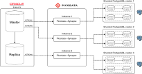

# Synapse

В данном разделе приведены сведения о Synapse, плагине для СУБД
Picodata.

!!! tip "Picodata Enterprise"
    Функциональность плагина доступна только в коммерческой версии Picodata.

## Общие сведения {: #intro }

Основная задача Synapse — предоставить пользователям
инструмент миграции с кластера проприетарной СУБД Oracle (например,
Oracle Exadata) на кластер PostgreSQL, использующий открытое (open
source) программное обеспечение.

Synapse позволяет переносить данные из одного кластера в другой
без их остановки. Для этого в плагине реализованы следующие
модули:

- начальный перенос данных
- перенос и синхронизация изменений (Change Data Capture, CDC)

Оба модуля могут работать параллельно. Консистентное состояние целевого
кластера PostgreSQL будет достигнуто не ранее, чем отработает модуль
начального переноса данных.

Кластер Picodata с плагином Synapse выступает в роли промежуточного
звена, транслируя через себя данные из Oracle в PostgreSQL. Схема
переноса данных показана ниже.


### Подробности реализации {: #detailed_design }

Каждый экземпляр Synapse может работать только с одним подключением по Xstream
и транслировать данные только в один кластер PostgreSQL. С помощью Xstream можно
перенести таблицу или несколько таблиц, причем как с активного инстанса Oracle,
так и с его реплики.

На принимающем кластере PostgreSQL должны быть заранее созданы таблицы с
совместимым набором колонок (число колонок и тип их данных должны
подходить к исходным таблицам). Если кластер PostgreSQL шардирован, то
Synapse должен знать ключ распределения для каждой из таблиц. Если
требуется трансляция данных в несколько кластеров PostgreSQL, то
потребуется соответственное количество инстансов Picodata с плагином
Synapse. Это отражено на схеме ниже.



Все полученные из Oracle данные записываются в кластер PostgreSQL в
виде отдельных транзакций. Фактом записи в целевой кластер является
получение соответствующего сообщения `COMMIT` от кластера Oracle.

При сбое соединения активные транзакции откатываются; в дальнейшем они
повторяются заново без нарушения консистентности и потери данных
(благодаря идемпотентности DML-операций, которые Synapse использует для
сохранения данных в Postgres).

Synapse разумно потребляет вычислительные и сетевые ресурсы: если
скорость записи в целевой кластер PostgreSQL недостаточна для
синхронизации изменений в реальном времени, то Synapse снижает скорость
чтения. Наибольшая производительность достигается в тех случаях, когда
данные на целевом кластере распределяются равномерно между узлами
(шардами).

## Предварительные настройки {: #configure_picodata }

Для переноса данных требуется выполнить следующие условия:

- на стороне Oracle предварительно нужно настроить внешний
[XStream](https://docs.oracle.com/en/database/oracle/oracle-database/19/xstrm/introduction-to-xstream.html#GUID-644C0567-E409-4611-9D9E-C5C51FBF2DE0)
(XStream Out) — API-интерфейс для взаимодействия с внешними системами.
Это специальный механизм Oracle, с помощью которого можно получать
события об изменении состояния данных в порядке очереди
- на стороне PostgreSQL создать таблицы, в которые требуется перенести
  данные из Oracle. Они не обязательно должны повторять схему в Oracle
- подготовить YAML-файл конфигурации для Synapse с настройками
  подключения и шардирования целевых таблиц и [сопоставлением](#mapping)
  структуры данных Oracle в структуру данных Postgres

## Подключение плагина {: #plugin_enable }

Содержимое архива с плагином следует распаковать в любую удобную
директорию, которую после этого нужно будет указать как `PLUGIN_DIR` для
инстанса Picodata.

При запуске одного инстанса из [командной строки] директорию плагина
можно указать с помощью параметра:

```bash
picodata run --plugin-dir=<PLUGIN-DIR> ...
```

Однако, для полноценной использования плагина рекомендуется запустить кластер с помощью [роли Ansible].

[командной строки]: ../reference/cli.md
[роли Ansible]: ../admin/deploy_ansible.md

После запуска Picodata с поддержкой плагинов в заданной директории подключитесь к [административной
консоли] инстанса Picodata.

Установите плагин, добавьте его к тиру и включите его с помощью
следующих SQL-команд:

```sql
CREATE PLUGIN synapse 1.0.0;
ALTER PLUGIN synapse 1.0.0 ADD SERVICE synapse TO TIER default;
ALTER PLUGIN synapse 1.0.0 ENABLE;
```

Для диагностики работы плагина обратитесь к [отладочному журналу] инстанса Picodata.

[отладочному журналу]: ../admin/monitoring.md#reading_log
[административной консоли]: ../tutorial/connecting.md#admin_console

## Проверка с помощью Ansible {: #ansible_test }

### Подготовка {: #preparation }

1. Изучите [документацию по развертыванию кластера Picodata](https://docs.picodata.io/picodata/stable/tutorial/deploy_ansible/). Выполнить инструкции по установке роли.
2. Скачайте нужную версию плагина `synapse` и положите пакет в рабочую директорию.
3. Проверьте наличие конфигурационного файла для плагина `synapse-config.yml`, проверьте настройки в нем (см. ниже).

!!! note "Примечание"
    На сервере, с которого будет происходить установка,
    необходим Ansible и доступ на серверы кластера с повышением привилегий.

### Установка окружения {: #setting_env }

Создайте файл с описанием кластера согласно [руководству по
развертыванию кластера](../admin/deploy_ansible.md).
Ниже показан пример для 4-х серверов, расположенных в 3-х группах (DC1,
DC2 и DC3). Группа — отдельный [домен отказа].

[домен отказа]: ../overview/glossary.md#failure_domain

```yaml title="synapse.yml"
---
all:
  vars:
    user: username # имя пользователя, под которым будут запущены процессы picodata
    group: groupname # группа пользователя, под которой будут запущены процессы picodata
    password: "<password>"
    cluster_name: synapse
    audit: false
    log_level: warn
    log_to: file

    conf_dir: "/opt/picodata/etc"
    data_dir: "/opt/picodata/data"
    run_dir: "/var/run/picodata"
    log_dir: "/opt/picodata/logs"

    fd_uniq_per_instance: true

    purge: true # при очистке кластера удалять в том числе все данные и журналы с сервера

    listen_ip: "{{ ansible_default_ipv4.address }}" # ip-адрес, который будет слушать инстанс, по умолчанию ansible_default_ipv4.address

    first_bin_port: 13301 # начальный бинарный порт для первого инстанса (он же main_peer)
    first_http_port: 18001
    first_pg_port: 15001

    init_system: "supervisord"
    rootless: true

    plugins:
      synapse:                                    # плагин
        path: '../plugins/synapse_1.0.0.tar.gz'   # путь до пакета плагина
        config: '../plugins/synapse-config.yml'   # путь до файла с настройками плагина
        services:
          synapse:
            tiers:                              # список тиров, в которые устанавливается служба плагина
              - default                         # по умолчанию — default
    tiers:                          # описание тиров
      arbiter:                      # имя тира
        replicaset_count: 1         # количество репликасетов
        replication_factor: 1       # фактор репликации
        config:
          memtx:
            memory: 64M             # количество памяти, выделяемое каждому инстансу тира
        host_groups:
          - ARBITERS                # целевая группа серверов для установки инстанса

      default:                      # имя тира
        replicaset_count: 3         # количество репликасетов
        replication_factor: 3       # фактор репликации
        bucket_count: 16384         # количество бакетов в тире
        config:
          memtx:
            memory: 71M             # количество памяти, выделяемое каждому инстансу тира
        host_groups:
          - STORAGES                # целевая группа серверов для установки инстанса

    GROUP1:                             # Группа серверов (failure_domain)
      hosts:                            # серверы в группе
        server-1-1:                     # имя сервера в инвентарном файле
          ansible_host: '192.168.19.21' # IP-адрес или fqdn если не совпадает с предыдущей строкой
          host_group: 'STORAGES'        # определение целевой группы серверов для установки инстансов

        server-1-2:                     # имя сервера в инвентарном файле
          ansible_host: '192.168.19.22' # IP-адрес или fqdn если не совпадает с предыдущей строкой
          host_group: 'ARBITERS'        # определение целевой группы серверов для установки инстансов

    GROUP2:                             # Группа серверов (failure_domain)
      hosts:                            # серверы в группе
        server-2-1:                     # имя сервера в инвентарном файле
          ansible_host: '192.168.20.21' # IP-адрес или fqdn если не совпадает с предыдущей строкой
          host_group: 'STORAGES'        # определение целевой группы серверов для установки инстансов

    GROUP3:                             # Группа серверов (failure_domain)
      hosts:                            # серверы в группе
        server-3-1:                     # имя сервера в инвентарном файле
          ansible_host: '192.168.21.21' # IP-адрес или fqdn если не совпадает с предыдущей строкой
          host_group: 'STORAGES'        # определение целевой группы серверов для установки инстансов
```

### Сопоставление колонок в таблицах {: #mapping }

Для корректного переноса данных требуется указать в файле конфигурации
сопоставление колонок для исходных и соответствующих им целевых таблиц. Для
конфигурации структуры данных воспользуйтесь таблицей ниже.

| Семейство типов значения в Oracle | Тип в PostgreSQL | Значение для файла конфигурации |
| ----------- | ------- | --------- |
| string | TEXT | text |
| binary | BYTE | byte |
| binary | BYTEA | bytea |
| number | INTEGER | int |
| number | BIGINT | bigint |
| number | SMALLINT | smallint |
| number | decimal | decimal |
| date | DATE | date |
| date | TIMESTAMP | timestamp |
| date | TIMESTAMPTZ | timestamptz |
| date with time | DATE | date |
| date with time | TIMESTAMP | timestamp |
| date with time | TIMESTAMPTZ | timestamptz |
| date with time and TZ | DATE | date |
| date with time and TZ | TIMESTAMP | timestamp |
| date with time and TZ | TIMESTAMPTZ | timestamptz |

Правила применения:

- XStream не присылает конкретный тип значения, только семейство типов
- В файле конфигурации следует указать значение (из третьей колонки
  таблицы выше), опираясь на семейство типов колонки в Oracle (первая
  колонка) и желаемый тип в PostgreSQL (вторая колонка)
- Если в конфигурации указаны `smallint`, `int`, `bigint`, то Synapse
  проверит, что число является целым и помещается в указанный тип
- При конвертации `date` -> `timestamp` Synapse выставит время в `00:00`
- При конвертации `date` -> `timestamptz` Synapse считает, что исходное
  значение в UTC. При этом, он сначала выставит время в `00:00`, затем
  сделает`timezoneoffset` в 0 секунд
- При конвертации `date with time` -> `timestamptz` Synapse считает, что
  исходное значение в UTC, и выставляет `timezoneoffset` в 0 секунд.
- При конвертации `date with time and TZ` -> `timestamp` Synapse
  конвертирует время в UTC
- При конвертации `date with time and TZ` -> `date` Synapse сначала
  конвертирует время в UTC, а потом берет от результата дату
- Значение `NULL` считается валидным для любой пары конвертации
- Любая другая пара (тип данных в Oracle, желаемый тип в PostgreSQL)
  приведет к ошибке и останову Synapse.

Создайте файл с конфигурацией `synapse-config.yml`. Пример:

```yaml
 bridges:
    test: # Название моста, используется в журналах.
      oracle:
        name: "test" # Название соединения, используется в журналах.
        host: "127.0.0.1" # Адрес сервера, может быть DNS или IP.
        port: 1521 # Номер порта.
        xstream_db: "TNT" # Название БД (service name), в которой создан Xstream.
        xstream_name: "tntsync" # Название Xtream.
        xstream_username: "c##xstrmadmin" # Имя пользователя, у которого есть права на подключение к Xstream и захвату изменений из него.
        xstream_password: "xstrmadmin" # Пароль пользователя выше.
        init_db: "TNTPDB" # База данных, из которой необходимо забирать начальные данные.
        init_enabled: true # Включен или выключен модуль начального наполнения данных.
        init_username: "PDBADMIN" # Имя пользователя для чтения данных из базы.
        init_password: "tntPswd" # Пароль пользователя выше.
        connect_tries: 2 # Сколько попыток подключения делать перед тем, как инициализация плагина будет признана неуспешной.

      postgres:
        name: "test" # Название соединения, используется в журналах.
        shards: # Если PostgreSQL не шардирован, укажите 1 шард ниже. Для успешной инициализации плагина необходимо подключение ко всем шардам.
          - host: "127.0.0.1" # Адрес шарда.
            port: 4326 # Порт шарда.
            user: "postgres" # Имя пользователя для записи данных в шард.
            password: "tntPswd" # Пароль пользователя выше.
            db: "postgres" # Название БД, в которую пишутся данные.
            pool_size: 2 # Размер пул потоков.
            connect_tries: 2 # Сколько попыток подключения делать перед тем, как инициализация плагина будет признана неуспешной.

          - host: "127.0.0.1"
            port: 4325
            user: "postgres"
            password: "tntPswd"
            db: "postgres"
            pool_size: 2
            connect_tries: 2

      tables: # Настройка маппинга таблиц и колонок. Изменения в данных таблиц, не описанных ниже, будут проигнорированы.
        pdbadmin.deal: # Полное имя таблицы в Oracle.
          pk: ["id"] # Первичный ключ, может быть составным.
          name: "public.deal" # Полное имя таблицы в PostgreSQL.
          bindings: # Маппинг колонок в формате: <название колонки в Oracle> : [ "<название колонки в PostgreSQL>", "<тип данных в колонке>"" ].
            id: ["id", "int"]
            person_id: ["person_id", "int"]
            deal_number: ["deal_number", "text"]
            amount: ["amount", "decimal"]

        pdbadmin.person:
          pk: ["id"]
          name: "public.person"
          bindings:
            id: ["id", "int"]
            age: ["age", "int"]
            salary: ["salary", "decimal"]
            fullname: ["fullname", "text"]
```

Подготовьте плейбук `picodata.yml`:

```yaml
---
- name: Deploy Picodata cluster
  hosts: all
  become: true

  tasks:
    - name: Import picodata-ansible role
      ansible.builtin.import_role:
        name: picodata-ansible
```

В результате в рабочей директории должно быть 4 файла:

- synapse.yml
- picodata.yml
- synapse_config.yml
- synapse_1.0.0.tar.gz

Запустите раскатку Synapse:

```bash
ansible-playbook -i synapse.yml picodata.yml
```

См. также:

- [Управление плагинами](../tutorial/plugins.md)
