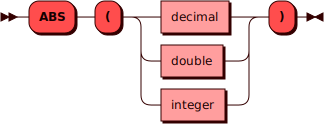

# ABS

Функция `ABS` возвращает абсолютное значение числового аргумента.

Функция является [строгой](../../overview/glossary.md#strict_function).

## Синтаксис {: #syntax }



## Примеры {: #examples }

??? example "Тестовые таблицы"
    Примеры использования команд включают в себя запросы к [тестовым
    таблицам](../legend.md).


```sql title="Функция ABS возвращает абсолютное значение аргумента"
sql> SELECT ABS(-1.2);
+-------+
| col_1 |
+=======+
| 1.2   |
+-------+
(1 rows)
```

```sql title="Функция ABS возвращает аргумент, если аргумент положительный"
sql> SELECT ABS(100);
+-------+
| col_1 |
+=======+
| 100   |
+-------+
(1 rows)
```

```sql title="Функция ABS над колонкой таблицы items"
sql> SELECT name, abs(stock-2000) from items;
+--------+-------+
| name   | col_1 |
+================+
| bricks | 877   |
|--------+-------|
| panels | 1002  |
|--------+-------|
| piles  | 1823  |
|--------+-------|
| bars   | 88211 |
|--------+-------|
| blocks | 1984  |
+--------+-------+
(5 rows)
```
