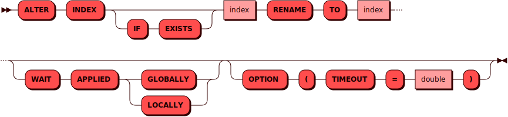

# ALTER INDEX

[DDL](ddl.md)-команда `ALTER INDEX` используется для изменения индекса.

## Синтаксис {: #syntax }



## Параметры {: #params }

* **INDEX** — имя индекса; соответствует правилам имен для всех
  [объектов](object.md) в кластере
* **IF EXISTS** — позволяет избежать ошибки в случае, если такого
  индекса в кластере нет
* **RENAME TO** — позволяет задать индексу новое имя
* **WAIT APPLIED** — при использовании этого параметра контроль
  пользователю будет возвращен только после того как данная операция
  будет применена либо во всем кластере (`GLOBALLY`), либо в рамках
  текущего инстанса (`LOCALLY`)
* **TIMEOUT** — интервал времени, за который Picodata пытается изменить
  индекс. Если времени не хватило и вернулась ошибка, то или индекс не успел
  измениться, или изменился, но нам не хватило времени получить об этом
  подтверждение. Чтобы проверить статус индекса, можно повторить еще раз команду
  его изменения. Если индекс изменен, то в результате вернется нуль
  строк. Если же индекс не был изменен, то вернется одна строка.
  Интервал по умолчанию — 1 день (86400 секунд).

## Примеры {: #examples }

```sql
ALTER INDEX name_year RENAME TO name_year_idx;
```

```sql
ALTER INDEX IF EXISTS name_year
RENAME TO name_year_idx
WAIT APPLIED GLOBALLY
OPTION (TIMEOUT = 3.0);
```
