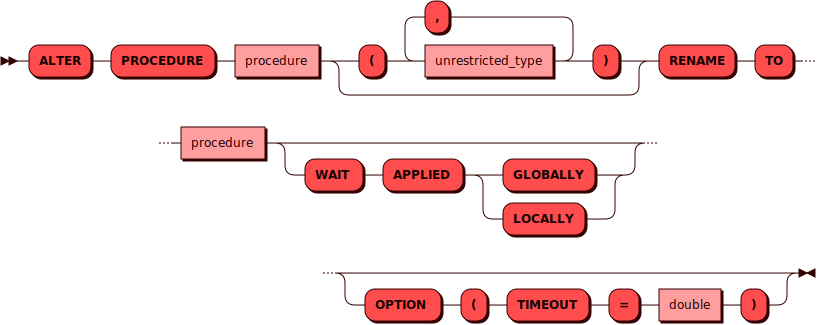

# ALTER PROCEDURE

[DDL](ddl.md)-команда `ALTER PROCEDURE` используется для изменения
существующей [процедуры](../../overview/glossary.md#stored_procedure).

## Синтаксис {: #syntax }



### Тип {: #unrestricted_type }

??? note "Диаграмма"
    

## Параметры {: #params }

* **PROCEDURE** — имя процедуры. Соответствует правилам имен для всех
  [объектов](object.md) в кластере. Опционально после имени процедуры
  можно указать список ее параметров (для совместимости со стандартом).

* **RENAME TO** — команда переименования процедуры.

* **WAIT APPLIED** — при использовании этого параметра контроль
  пользователю будет возвращен только после того как данная операция
  будет применена либо во всем кластере (`GLOBALLY`), либо в рамках
  текущего инстанса (`LOCALLY`)

* **TIMEOUT** — интервал времени, за который Picodata пытается изменить
  процедуру в кластере. Если времени не хватило и вернулась ошибка, то или
  процедура не успела измениться, или изменилась, но нам не хватило времени
  получить об этом подтверждение. Чтобы проверить статус процедуры, можно
  повторить еще раз команду ее изменения. Если она изменена, то в
  результате вернется нуль строк. Если же процедура не была изменена, то
  вернется одна строка.

## Примеры {: #examples }

```sql
ALTER PROCEDURE old RENAME TO new OPTION ( timeout = 4 );
```
