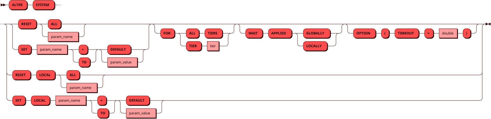

# ALTER SYSTEM

[DDL](ddl.md)-команда `ALTER SYSTEM` используется для изменения
[параметров конфигурации СУБД](../../reference/db_config.md), а также
[динамических параметров](#runtime_params) инстанса.

## Синтаксис {: #syntax }



## Параметры {: #params }

* **SET** — установка значения параметра.

* **RESET** — сброс параметра до значения по умолчанию.

* **RESET ALL** — сброс всех параметров до их значений по умолчанию.

* **FOR TIER** / **FOR ALL TIERS** — применение действия для конкретного
  тира, или глобально для всех тиров. Если этот параметр не указан, то
  подразумевается, что действие распространится глобально.

* **WAIT APPLIED** — при использовании этого параметра контроль пользователю
  будет возвращен только после того как данная операция будет применена либо во
  всем кластере (`GLOBALLY`), либо в рамках текущего инстанса (`LOCALLY`). По
  умолчанию используется поведение `GLOBALLY`.

## Требуемые привилегии {: #required_privileges }

Данная команда требует привилегии [Администратора
СУБД](../../admin/access_control.md#admin) (`admin`).

См. также:

- [Управление доступом — Таблица привилегий](../../admin/access_control.md#privileges_table)

## Примеры {: #examples }

### Системные параметры {: #system_params }

Установка параметра:

```sql
ALTER SYSTEM SET auth_password_enforce_digits to false;
```

Установка параметра для конкретного тира:

```sql
ALTER SYSTEM SET memtx_checkpoint_count = 200 FOR TIER default;
```

Сброс параметра:

```sql
ALTER SYSTEM RESET auth_password_enforce_digits;
```

Сброс всех параметров:

```sql
ALTER SYSTEM RESET all;
```

Сброс параметра для конкретного тира:

```sql
ALTER SYSTEM RESET memtx_checkpoint_interval FOR TIER default;
```

Получить текущее значение параметра:

```sql
SELECT * FROM _pico_db_config WHERE key = 'auth_password_enforce_digits';
```

### Динамические параметры {: #runtime_params }

Для изменения динамических параметров запущенного инстанса используйте
синтаксис `ALTER SYSTEM SET LOCAL`. Такая команда имеет следующие
свойства:

- изменения не записываются в системную таблицу `_pico_db_config`
- изменения локальны и не влияют на работу других инстансов Picodata
- изменения сбрасываются при перезапуске инстанса Picodata

Текущий уровень журналирования можно получить с помощью
[PICO_LOG_LEVEL](pico_log_level.md), а список всех уровней и их числовых
значений — с помощью [PICO_LOG_LEVEL_MAP](pico_log_level_map.md).

Пример использования:

```sql
ALTER SYSTEM SET LOCAL log_level = 'warn';
```
или:

```sql
ALTER SYSTEM SET LOCAL log_level TO 'warn';
```

Сброс на исходное значение, заданное при запуске инстанса:

```sql
ALTER SYSTEM RESET LOCAL log_level;
```

или

```sql
ALTER SYSTEM SET LOCAL log_level TO DEFAULT;
```
