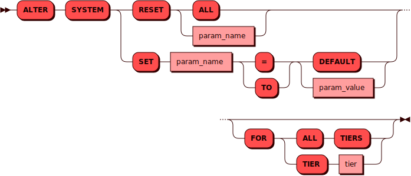

# ALTER SYSTEM

[DDL](ddl.md)-команда `ALTER SYSTEM` используется для изменения
[параметров конфигурации СУБД](../../reference/db_config.md). Команда требует
привилегий [Администратора СУБД](../../admin/access_control.md#admin)
(`admin`).

## Синтаксис {: #syntax }



## Параметры {: #params }

* **SET** — установка значения параметра.

* **RESET** — сброс параметра до значения по умолчанию.

* **RESET ALL** — сброс всех параметров до их значений по умолчанию.

* **FOR TIER** / **FOR ALL TIERS** — применение действия для конкретного
  тира, или глобально для всех тиров. Если этот параметр не указан, то
  подразумевается, что действие распространится глобально.

## Примеры {: #examples }

Установка параметра:

```sql
ALTER SYSTEM SET auth_password_enforce_digits to false;
```

Установка параметра для конкретного тира:

```sql
ALTER SYSTEM SET memtx_checkpoint_count = 200 FOR TIER default;
```

Сброс параметра:

```sql
ALTER SYSTEM RESET auth_password_enforce_digits;
```

Сброс всех параметров:

```sql
ALTER SYSTEM RESET all;
```

Сброс параметра для конкретного тира:

```sql
ALTER SYSTEM RESET memtx_checkpoint_interval FOR TIER default;
```

Получить текущее значение параметра:

```sql
SELECT * FROM _pico_db_config WHERE key = 'auth_password_enforce_digits';
```
