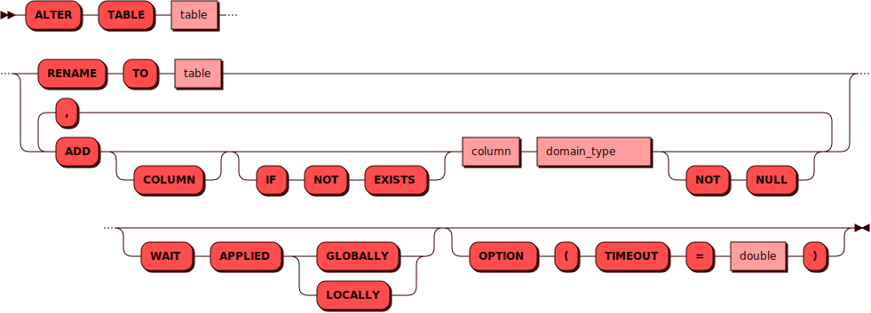

# ALTER TABLE

[DDL](ddl.md)-команда `ALTER TABLE` используется для изменения схемы
таблицы.

## Синтаксис {: #syntax }



### Тип {: #domain_type }

??? note "Диаграмма"
    

## Параметры {: #params }

* **TABLE** — имя таблицы. Соответствует правилам имен для всех [объектов](object.md)
  в кластере

* **RENAME TO** — позволяет задать таблице новое имя

* **RENAME COLUMN ... TO** — позволяет задать колонке таблицы новое имя

* **ADD / ADD COLUMN** — позволяет добавить одну или несколько колонок с
указанием их типа и ограничения на то, может ли колонка принимать
значение `NULL`. Указание `IF NOT EXISTS` позволяет избежать ошибки в
случае, если хотя бы одна из добавляемых колонок уже есть в таблице
<!--

* **DROP / DROP COLUMN** — позволяет удалить указанную колонку или несколько колонок

* **IF EXISTS** — позволяет избежать ошибки в случае, если хотя бы
  одной из удаляемых колонок нет в кластере

* **ALTER / ALTER COLUMN** — позволяет задать для одной или нескольких
  колонок тип данных, а также снять/установить признак `NOT NULL`
-->
* **WAIT APPLIED** — при использовании этого параметра контроль
  пользователю будет возвращен только после того как данная операция
  будет применена либо во всем кластере (`GLOBALLY`), либо в рамках
  текущего инстанса (`LOCALLY`)

* **TIMEOUT** — интервал времени, за который Picodata пытается изменить
  таблицу в кластере. Если времени не хватило и вернулась ошибка, то или
  таблица не успела измениться, или изменилась, но нам не хватило времени
  получить об этом подтверждение. Чтобы проверить статус таблицы, можно
  повторить еще раз команду ее изменения. Если она изменена, то в
  результате вернется нуль строк. Если же таблица не была изменена, то
  вернется одна строка. Интервал по умолчанию — 1 день (86400 секунд).

## Требуемые привилегии {: #required_privileges }

Данная команда требует привилегии `ALTER TABLE`.

См. также:

- [Управление доступом — Таблица привилегий](../../admin/access_control.md#privileges_table)

## Примеры {: #examples }

Как и при [создании таблицы], при добавлении колонки можно указать
требование содержать значение (`NOT NULL`), однако это поддерживается
только для пустых таблиц (т.к. в таблице с данными добавление колонки
автоматически создает поля со значением `NULL`):

```sql title="Добавление колонки к таблице с данными"
ALTER TABLE warehouse
ADD COLUMN "quantity" INT NULL;
```

```sql title="Добавление колонки к пустой таблице"
ALTER TABLE warehouse
ADD COLUMN "quantity" INT NOT NULL;
```

```sql title="Переименование таблицы"
ALTER TABLE warehouse
RENAME TO sklad;
```

```sql title="Переименование колонки таблицы"
ALTER TABLE warehouse
RENAME COLUMN type TO kind;
```

[создании таблицы]: create_table.md
