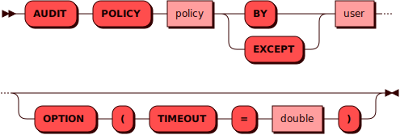

# AUDIT POLICY

[DCL](dcl.md)-команда `AUDIT POLICY` используется для включения/выключения
записи DML-операций в журнал аудита для пользователя.

## Синтаксис {: #syntax }



## Параметры {: #params }

- **policy** — имя политики аудита. На данный момент поддерживается только политика `dml_default`,
  включающая журнал аудита для всех DML-операций (`INSERT`/`UPDATE`/`DELETE`)
- **user** — имя пользователя. Соответствует правилам имен для всех [объектов](object.md)
  в кластере
- **BY** — включение политики аудита (`policy`) для пользователя `user`
- **EXCEPT** — выключение политики аудита (`policy`) для пользователя `user`

## Примеры {: #examples }

Включение журнала аудита DML-операций для пользователя `andy`:

```sql
AUDIT POLICY dml_default BY andy
OPTION (TIMEOUT = 3.0);
```

Выключение журнала аудита DML-операций для пользователя `andy`:

```sql
AUDIT POLICY dml_default EXCEPT andy;
```
