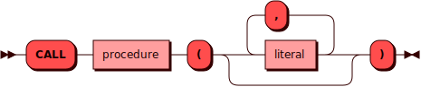

# CALL

[DML](dml.md)-команда `CALL` используется для вызова существующей
процедуры.

## Синтаксис {: #syntax }



### Литерал {: #literal }

??? note "Диаграмма"
    

## Параметры {: #params }

* **PROCEDURE** — имя процедуры. Соответствует правилам имен для всех
  [объектов](object.md) в кластере.

* **LITERAL** — переданное в процедуру значение аргумента.

## Требуемые привилегии {: #required_privileges }

Данная команда требует привилегий `EXECUTE PROCEDURE` и `WRITE TABLE`.

См. также:

- [Управление доступом — Таблица привилегий](../../admin/access_control.md#privileges_table)


## Примеры {: #examples }

```sql
CALL proc(11, 'Pez Cat', 2013) OPTION (
    SQL_MOTION_ROW_MAX = 100,
    SQL_VDBE_OPCODE_MAX = 15000
);
```
