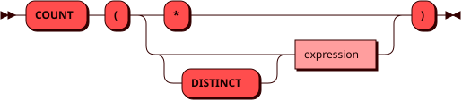

# COUNT

Функция `COUNT` возвращает количество строк или значений в виде
[INTEGER](../sql_types.md#integer).

`COUNT(*)` учитывает все строки. `COUNT(expression)` учитывает только
значения выражения, отличные от `NULL`. Если подходящих строк или значений
нет, результат равен `0`.

## Синтаксис {: #syntax }



## Параметры {: #params }

`DISTINCT` позволяет учитывать только
[уникальные значения](groupby.md#aggregate_distinct) выражения.

`COUNT(DISTINCT expression)` не учитывает `NULL`. Запись `COUNT(DISTINCT *)` не поддерживается.

## Использование в окне {: #window }

Функция также может использоваться [как оконная](window.md#aggregate)
с выражением `OVER` и необязательным `FILTER`.
В оконном вызове `DISTINCT` не поддерживается.

## Примеры {: #examples }

??? example "Подготовка тестового окружения"
    Пример использует [тестовую таблицу](../legend.md) `items`.

```sql
SELECT COUNT(*), COUNT(stock), COUNT(DISTINCT stock) FROM items;
```
