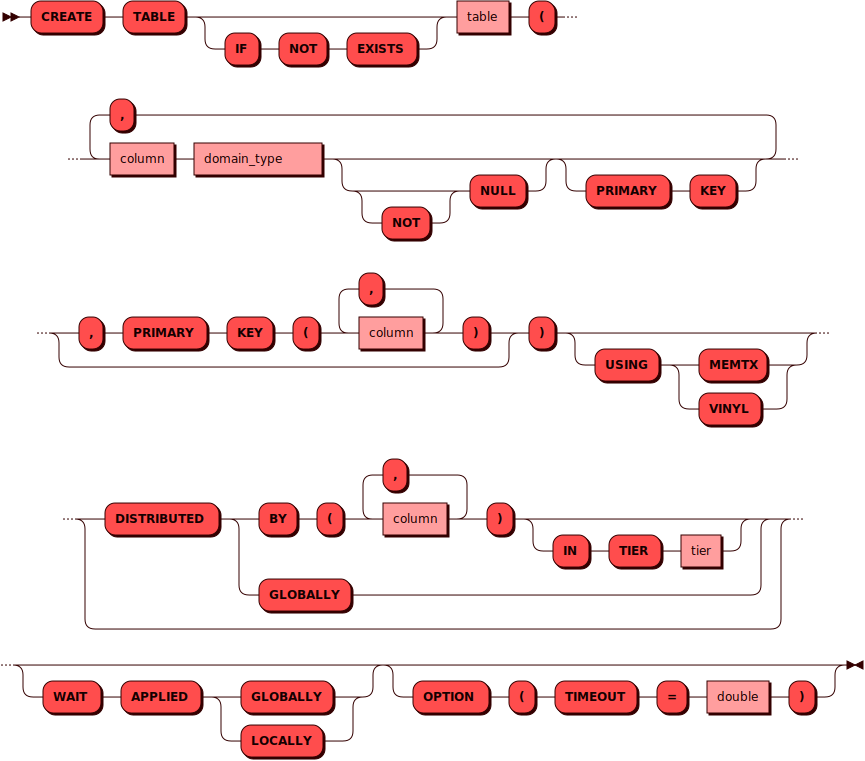

# CREATE TABLE

[DDL](ddl.md)-команда `CREATE TABLE` используется для создания новой
шардированной или глобальной таблицы.

## Синтаксис {: #syntax }



### Тип {: #domain_type }

??? note "Диаграмма"
    

## Параметры {: #params }

* **TABLE** — имя таблицы. Соответствует правилам имен для всех [объектов](object.md)
  в кластере

* **UNLOGGED** — обозначить шардированную таблицу как нежурналируемую.
  Обновления такой таблицы не будут записываться в [журнал упреждающей
  записи](../../overview/glossary.md#wal). Если доступность мастера
  репликасета, на котором хранится нежурналируемая таблица, теряется
  (например, при перезапуске соответствующего инстанса), то данные
  таблицы будут утеряны. Нежурналируемые таблицы не реплицируются, и
  могут быть созданы только на [движке хранения
  данных](../../overview/glossary.md#db_engine) `memtx`. Достоинством
  нежурналируемых таблиц является более быстрое исполнение
  [DML](dml.md)-запросов

* **IF NOT EXISTS** — позволяет избежать ошибки в случае, если такая
  таблица в кластере уже есть

* **PRIMARY KEY** — первичный ключ. Обеспечивает уникальность и сортировку данных только
  в рамках одного экземпляра кластера. Глобальную уникальность записи он не дает

* **DISTRIBUTED GLOBALLY** — глобальное распределение таблицы. В результате данные в
  таблице идентичны на всех экземплярах кластера и синхронизируются через Raft-журнал.
  Поддерживается только для движка хранения данных `memtx`

* **DISTRIBUTED BY** — шардирование таблицы по набору колонок. В
  результате каждый экземпляр содержит только часть данных в таблице.
  Шардирование таблицы задается один раз при ее создании и в дальнейшем
  не может быть изменено

* **IN TIER** — имя [тира](../../overview/glossary.md#tier),
в котором будет создана шардированная таблица.
Если параметр не задан, будет использовано имя тира по умолчанию `default`.

* **MEMTX** — движок хранения данных в памяти

* **VINYL** — дисковый движок хранения данных, использующий LSM-деревья (Log Structured
  Merge Tree)

* **WAIT APPLIED** — при использовании этого параметра контроль
  пользователю будет возвращен только после того как данная операция
  будет применена либо во всем кластере (`GLOBALLY`), либо в рамках
  текущего инстанса (`LOCALLY`)

* **TIMEOUT** — интервал времени, за который Picodata пытается создать
  таблицу в кластере. Если времени не хватило и вернулась ошибка, то или
  таблица не успела создаться, или создалась, но нам не хватило времени
  получить об этом подтверждение. Чтобы проверить статус таблицы, можно
  повторить еще раз команду ее создания. Если таблица создана, то в
  результате вернется нуль строк. Если же таблица не была создана, то
  вернется одна строка. Интервал по умолчанию — 1 день (86400 секунд).

## Требуемые привилегии {: #required_privileges }

Данная команда требует привилегии `CREATE TABLE`.

См. также:

- [Управление доступом — Таблица привилегий](../../admin/access_control.md#privileges_table)

## Примеры {: #examples }

```sql title="Минимально возможная команда"
CREATE TABLE warehouse (
    id INTEGER PRIMARY KEY);
```

!!! note "Примечание"
    Если параметр `DISTRIBUTED` не указан, то по умолчанию таблица будет шардирована по колонкам первичного ключа.

```sql title="Создание таблицы с использованием движка хранения <code>memtx</code>"
CREATE TABLE warehouse (
    id INTEGER NOT NULL,
    item TEXT NOT NULL,
    type TEXT NOT NULL,
    PRIMARY KEY (id))
USING memtx DISTRIBUTED BY (id)
OPTION (TIMEOUT = 3.0);
```

```sql title="Создание таблицы с ограничением PRIMARY KEY в определении колонки"
CREATE TABLE warehouse (
    id INTEGER PRIMARY KEY,
    item TEXT NOT NULL,
    type TEXT NOT NULL)
USING memtx DISTRIBUTED BY (id)
OPTION (TIMEOUT = 3.0);
```

```sql title="Создание таблицы с шардированием в тире <i>default</i>"
CREATE TABLE warehouse (
    id INTEGER PRIMARY KEY,
    item TEXT NOT NULL,
    type TEXT NOT NULL)
USING memtx DISTRIBUTED BY (id)
IN TIER "default"
OPTION (TIMEOUT = 3.0);
```
