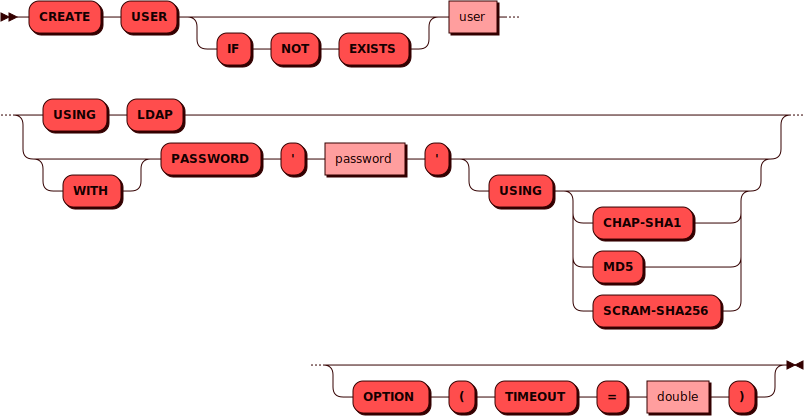

# CREATE USER

[DCL](dcl.md)-команда `CREATE USER` используется для создания нового
[пользователя](../../admin/access_control.md#users).

## Синтаксис {: #syntax }



## Параметры {: #params }

* **USER** — имя пользователя. Соответствует правилам имен для всех
  [объектов](object.md) в кластере
* **IF NOT EXISTS** — позволяет избежать ошибки в случае, если такой
  пользователь в кластере уже есть
* **PASSWORD** — пароль пользователя может использовать русские и
  английские буквы во всех регистрах, а так же цифры и основные знаки
  препинания из [таблицы
  ASCII](https://ru.wikipedia.org/wiki/ASCII#Структурные_свойства_таблицы).
  Действуют [требования к
  паролю](../../admin/access_control.md#allowed_passwords).
* **CHAP-SHA1** — аутентификация пользователя с помощью `chap-sha1`.
  Требуется использовать пароль не короче 8 символов. Рекомендуется
  использовать этот метод только для [системных пользователей].
* **LDAP** — аутентификация пользователя с помощью `ldap`. Пароль не
  используется и его длина не проверяется.
* **MD5** — аутентификация пользователя с помощью `md5` (используется по
  умолчанию). Требуется использовать пароль не короче 8 символов.

[системных пользователей]: ../../admin/access_control.md#system_users

## Примеры {: #examples }

```sql title="Минимально возможная команда"
CREATE USER "andy" USING ldap;
```

```sql title="Указание пароля, типа аутентификации, при котором действуют требования к паролю, и таймаута операции"
CREATE USER "andy" WITH PASSWORD 'P@ssw0rd' USING chap-sha1
OPTION (TIMEOUT = 3.0);
```
