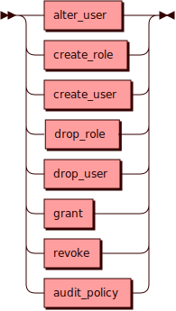

# Data Control Language

Data Control Language — команды языка SQL для управления доступом в
кластере (роли, пользователи или привилегии). К таким командам относятся
`ALTER`, `CREATE` и `DROP` применительно к объектам `USER` и `ROLE`,
команды `GRANT` и `REVOKE` для управления привилегиями, а также команда
`AUDIT POLICY` для управления политикой ведения журнала аудита.

## Синтаксис {: #syntax }

## Параметры {: #params }

* **TIMEOUT** — интервал времени, за который Picodata пытается изменить
  доступ в кластере. Если времени не хватило и вернулась ошибка, то или
  доступ не успел измениться, или изменился, но нам не хватило времени
  получить об этом подтверждение. Чтобы проверить статус доступа, можно
  повторить еще раз команду его изменения. Если доступ изменен, то в
  результате вернется нуль строк. Если же доступ не был изменен, то
  вернется одна строка. Интервал по умолчанию — 1 день (86400 секунд).
