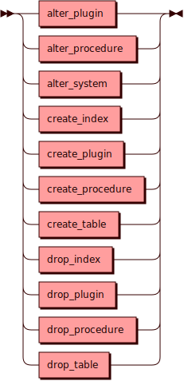

# Data Definition Language

Data Definition Language — команды языка SQL для изменения объектов в
кластере.

## Синтаксис {: #syntax }

## Ограничения {: #limitations }

Если кластер состоит из инстансов разных версий (например, различающихся
в минорной части версии), то DDL будет автоматически ограничен только
DROP-операциями.
