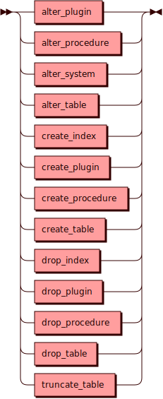

# Data Definition Language

Data Definition Language — команды языка SQL для изменения объектов в
кластере. К таким командам относятся `ALTER`, `CREATE`, `DROP`, `TRUNCATE`
применительно к объектам `INDEX`, `PLUGIN`, `PROCEDURE` и `TABLE`, а также
служебная команда `BACKUP`.

## Синтаксис {: #syntax }

## Ограничения {: #limitations }

Если кластер состоит из инстансов разных версий (например, различающихся
в минорной части версии), то DDL будет автоматически ограничен только
DROP-операциями.
