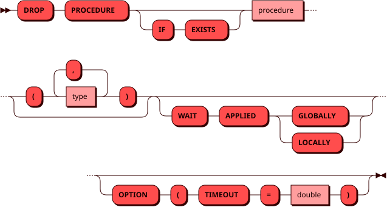
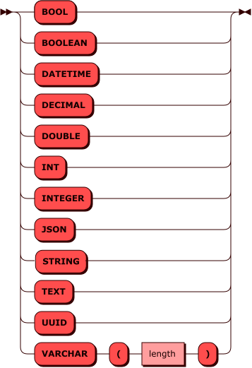

# DROP PROCEDURE

[DDL](ddl.md)-команда `DROP PROCEDURE` используется для удаления
существующей [процедуры](../../overview/glossary.md#stored_procedure).

## Синтаксис {: #syntax }



### Тип {: #unrestricted_type }

??? note "Диаграмма"
    

## Параметры {: #params }

* **PROCEDURE** — имя процедуры. Соответствует правилам имен для всех
  [объектов](object.md) в кластере. Опционально после имени процедуры
  можно указать список ее параметров (для совместимости со стандартом)
* **IF EXISTS** — позволяет избежать ошибки в случае, если такой
  процедуры в кластере нет

## Общие опции и параметры {: #common_options }

Для данной команды доступны следующие общие опции и параметры SQL:

* [TIMEOUT](common_options.md#timeout)
* [WAIT APPLIED](common_options.md#wait_applied)

## Требуемые привилегии {: #required_privileges }

Данная команда требует привилегии `DROP PROCEDURE`.

См. также:

- [Управление доступом — Таблица привилегий](../../admin/access_control.md#privileges_table)

## Примеры {: #examples }

```sql
DROP PROCEDURE proc
OPTION ( timeout = 4 );
```

```sql
DROP PROCEDURE proc
WAIT APPLIED GLOBALLY
OPTION ( timeout = 4 );
```
