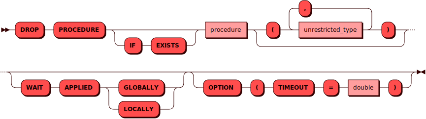
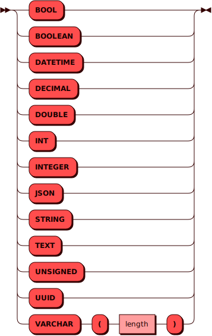

# DROP PROCEDURE

[DDL](ddl.md)-команда `DROP PROCEDURE` используется для удаления
существующей [процедуры](../../overview/glossary.md#stored_procedure).

## Синтаксис {: #syntax }



### Тип {: #type }

??? note "Диаграмма"
    

## Параметры {: #params }

* **PROCEDURE** — имя процедуры. Соответствует правилам имен для всех
  [объектов](object.md) в кластере. Опционально после имени процедуры
  можно указать список ее параметров (для совместимости со стандартом)
* **IF EXISTS** — позволяет избежать ошибки в случае, если такой
  процедуры в кластере нет
* **WAIT APPLIED** — при использовании этого параметра контроль
  пользователю будет возвращен только после того как данная операция
  будет применена либо во всем кластере (`GLOBALLY`), либо в рамках
  текущего инстанса (`LOCALLY`)
* **TIMEOUT** — интервал времени, за который Picodata пытается удалить
  процедуру в кластере. Если времени не хватило и вернулась ошибка, то или
  процедура не успела удалиться, или удалилась, но нам не хватило времени
  получить об этом подтверждение. Чтобы проверить статус процедуры, можно
  повторить еще раз команду ее удаления. Если процедура удалена, то в
  результате вернется нуль строк. Если же процедура не была удалена, то
  вернется одна строка. Интервал по умолчанию — 1 день (86400 секунд).

## Примеры {: #examples }

```sql
DROP PROCEDURE proc
OPTION ( timeout = 4 );
```

```sql
DROP PROCEDURE proc
WAIT APPLIED GLOBALLY
OPTION ( timeout = 4 );
```
