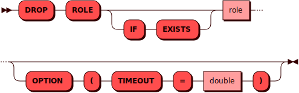

# DROP ROLE

[DCL](dcl.md)-команда `DROP ROLE` используется для удаления существующей
[роли](../../admin/access_control.md#roles).

## Синтаксис {: #syntax }



## Параметры {: #params }

* **ROLE** — имя роли. Соответствует правилам имен для всех
  [объектов](object.md) в кластере
* **IF EXISTS** — позволяет избежать ошибки в случае, если такой
  роли в кластере нет

## Требуемые привилегии {: #required_privileges }

Данная команда требует привилегии `DROP ROLE`.

См. также:

- [Управление доступом — Таблица привилегий](../../admin/access_control.md#privileges_table)

## Примеры {: #examples }

```sql
DROP ROLE toy OPTION (TIMEOUT = 3.0);
```
