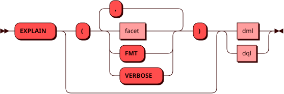
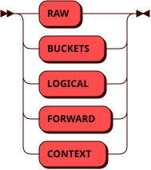

# Использование EXPLAIN

Для анализа производительности запросов в Picodata можно использовать команду
EXPLAIN, с помощью которой можно узнать, как будет выглядеть план исполнения
запроса. План позволяет наглядно оценить структуру и последовательность действий
при выполнении запроса. Основными свойствами нашего EXPLAIN являются:

- [Фасеты (режимы отображения)](#facets)
- [Достоверность плана](#plan-faithfulness)
- [Вывод EXPLAIN для проблемных запросов](#explain-for-err-queries)

## Синтаксис {: #syntax }



## Фасеты (режимы отображения) {: #facets }



Команда EXPLAIN позволяет указывать определенные режимы вывода EXPLAIN, также
называемые фасетами. В настоящий момент можно указывать фасеты RAW, LOGICAL,
BUCKETS, FORWARD и CONTEXT в любом порядке. Каждый фасет отвечает за конкретную
информацию о запросе.

При указании нескольких фасетов одновременно также печатаются их заголовки,
позволяющие быстро ориентироваться в выводе. Например:

```
EXPLAIN (LOGICAL, BUCKETS) SELECT name, id FROM _pico_table;
```

```
──────────────────────────────────────────────────────────────────────
 # Logical plan                                                       
──────────────────────────────────────────────────────────────────────

projection (_pico_table.name::string -> name, _pico_table.id::int -> id)
  scan _pico_table

──────────────────────────────────────────────────────────────────────
 # Buckets                                                            
──────────────────────────────────────────────────────────────────────

buckets = any
```

Если для EXPLAIN не указано ни одного фасета, то фасетами по умолчанию являются
LOGICAL и BUCKETS. Таким образом запросы

```
EXPLAIN (LOGICAL, BUCKETS) SELECT name, id FROM _pico_table;
```

и

```
EXPLAIN SELECT name, id FROM _pico_table;
```

эквивалентны.

Также наряду с фасетами существует опция FMT, которая применяется к фасетам
EXPLAIN. Например, если пользователь указал дополнительно к фасету RAW опцию
FMT, то весь вывод EXPLAIN будет отформатирован. Важно подчеркнуть, что FMT не
является отдельным фасетом EXPLAIN и может быть использована только вместе с
указанными фасетами.

С подробным описанием каждого фасета EXPLAIN можно ознакомиться тут:

- [RAW](./explain_facets/raw.md)
- [LOGICAL](./explain_facets/logical.md)
- [BUCKETS](./explain_facets/buckets.md)
- [FORWARD](./explain_facets/forward.md)
- [CONTEXT](./explain_facets/context.md)


## Достоверность плана {: #plan-faithfulness }

Команда EXPLAIN в Picodata показывает полный план запроса — со всеми операциями,
которые реально выполняются, даже если они не следуют напрямую из текста
запроса. Например, `count(*)` в Picodata исполняется путем частичного подсчёта
на узлах хранения и финального суммирования результатов. Это следует из вывода
фасета LOGICAL:

```sql
EXPLAIN (LOGICAL) SELECT COUNT(*) FROM t;
```

```
projection (sum(count_1::int)::int -> col_1)
  motion [policy: full, program: ReshardIfNeeded]
    projection (count(*)::int -> count_1)
      scan t
```

Узел `motion` отражает перераспределение данных между узлами кластера. Подробнее
об этом можно почитать [здесь](./explain_facets/logical.md#data_motion_types).

## Вывод EXPLAIN для проблемных запросов {: #explain-for-err-queries }

Важной особенностью EXPLAIN в Picodata является возможность получить EXPLAIN для
запросов, которые приводят к ошибке при исполнении. Так, Picodata всегда
старается построить EXPLAIN для синтаксически корректных запросов, даже если они
семантически некорректные. Например:

```
SELECT name, id FROM _pico_table WHERE MAX(id) = 5;
```

```
ERROR:  sbroad: Query 1 from EXPLAIN (RAW): Failed to compile SQL statement: misuse of aggregate function MAX()
```

Однако при попытке выполнить EXPLAIN от такого запроса мы успешно получаем результат:

```
EXPLAIN (RAW) SELECT name, id FROM _pico_table WHERE MAX(id) = 5;
```

```
╭───────────────────╮
│ 1. Query (ROUTER) │
╰───────────────────╯

SELECT "_pico_table"."name", "_pico_table"."id" FROM "_pico_table" WHERE max (CAST ("_pico_table"."id" as int)) = CAST(5 AS int)

plan:
Failed to compile SQL statement: misuse of aggregate function MAX()
```
