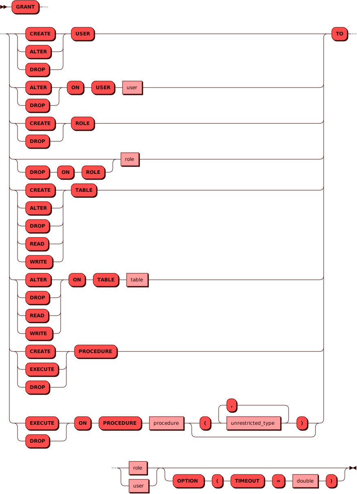

# GRANT

[DCL](dcl.md)-команда `GRANT` используется для выдачи
[привилегий](../../admin/access_control.md#privileges) пользователю
или роли на различные объекты.

## Синтаксис {: #syntax }



### Тип {: #unrestricted_type }

??? note "Диаграмма"
    

## Параметры {: #params }

* **ROLE** — имя роли. Соответствует правилам имен для всех
  [объектов](object.md) в кластере.

* **USER** — имя пользователя. Соответствует правилам имен для всех
  [объектов](object.md) в кластере.

## Примеры {: #examples }

Выдача права изменять данные пользователя `alice` пользователю `bob`:

```sql
GRANT ALTER ON USER alice TO bob OPTION (TIMEOUT = 3.0);
```

Выдача права записи в таблицу `warehouse` для пользователя `alice`:

```sql
GRANT WRITE ON TABLE warehouse to alice OPTION (TIMEOUT = 3.0);
```
