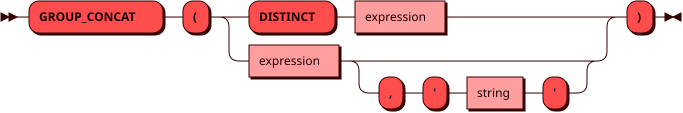

# GROUP_CONCAT

Функция `GROUP_CONCAT` соединяет строковые значения выражения,
добавляя между ними разделитель. Результат имеет тип
[TEXT](../sql_types.md#text).

Значения `NULL` не учитываются. Если строк нет или все значения
равны `NULL`, результат равен `NULL`. По умолчанию разделитель — запятая.
В обычном агрегатном вызове второй аргумент должен быть строковым
литералом.

Порядок соединяемых значений в обычном агрегатном вызове не гарантируется.
Для задания порядка можно использовать [оконный вызов](window.md#aggregate)
с `ORDER BY` внутри `OVER`.

Функция [STRING_AGG](string_agg.md) — другое имя `GROUP_CONCAT`.

## Синтаксис {: #syntax }



## Параметры {: #params }

`DISTINCT` позволяет учитывать только
[уникальные значения](groupby.md#aggregate_distinct) выражения.

С `DISTINCT` разрешен только один аргумент; свой разделитель задать нельзя.

## Использование в окне {: #window }

Функция также может использоваться [как оконная](window.md#aggregate)
с выражением `OVER` и необязательным `FILTER`.
В оконном вызове `DISTINCT` не поддерживается.

## Примеры {: #examples }

??? example "Подготовка тестового окружения"
    Пример использует [тестовую таблицу](../legend.md) `items`.

```sql
SELECT GROUP_CONCAT(name, ', ') FROM items;
```
