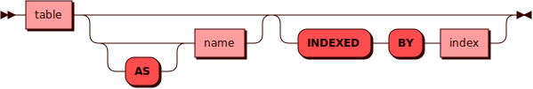

# Выбор индекса

`INDEXED BY` позволяет явно указать индекс, который должен быть
использован при выполнении команд `SELECT`, `UPDATE` и `DELETE`. При построении физического плана запроса Picodata не использует статистику по данным, опираясь только на фиксированные оценки. Поэтому автоматический выбор индексов может быть не оптимальным.
В таких случаях пользователь может явно подсказать системе, какой индекс следует использовать, с помощью выражения `INDEXED BY`.
Для команд `UPDATE` и `DELETE` выражение `INDEXED BY` применяется только к их читающей части - она влияет на способ отбора строк. Сама модификация данных всегда выполняется по первичному ключу,
а `INDEXED BY` может использоваться лишь для эффективного получения
набора первичных ключей, подлежащих изменению или удалению.

## Синтаксис {: #syntax }



## Примеры {: #examples }

```sql
SELECT column1, column2 FROM table_name INDEXED BY index_name WHERE condition;

DELETE FROM table_name INDEXED BY index_name WHERE condition;

UPDATE table_name INDEXED BY index_name SET column2 = 1
```

Запросы выше будут использовать индекс `index_name` при поиске в таблице `table_name`. В этом можно убедиться, сравнив вывод `EXPLAIN (RAW)` для запроса с `INDEXED BY`:

```sql
EXPLAIN (RAW) SELECT column1, column2 FROM table_name INDEXED BY index_name WHERE TRUE;
1. Query (STORAGE):
SELECT "table_name"."column1", "table_name"."column2" FROM "table_name" INDEXED BY "index_name" WHERE CAST(true AS bool)
+----------+-------+------+-----------------------------------------------------------------------+
| selectid | order | from | detail                                                                |
+=================================================================================================+
| 0        | 0     | 0    | SCAN TABLE table_name USING COVERING INDEX index_name (~1048576 rows) |
+----------+-------+------+-----------------------------------------------------------------------+
```

И без него:
```sql
EXPLAIN (RAW) SELECT column1, column2 FROM table_name WHERE TRUE;
1. Query (STORAGE):
SELECT "table_name"."column1", "table_name"."column2" FROM "table_name" WHERE CAST(true AS bool)
+----------+-------+------+---------------------------------------+
| selectid | order | from | detail                                |
+=================================================================+
| 0        | 0     | 0    | SCAN TABLE table_name (~1048576 rows) |
+----------+-------+------+---------------------------------------+
```

