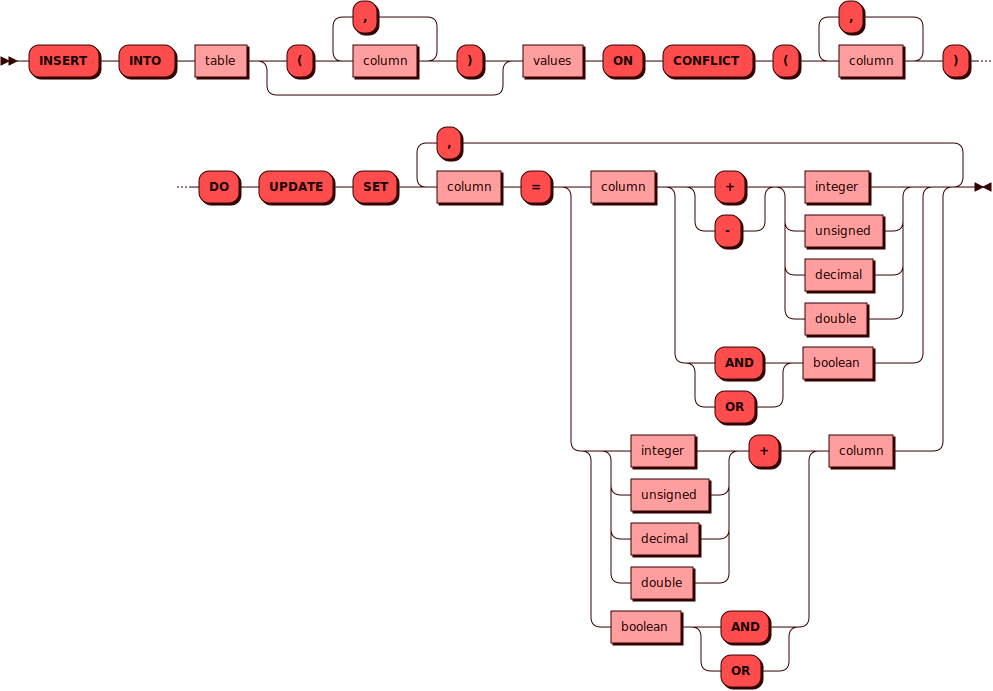

# Вставка с обновлением при конфликте

Конструкция [INSERT](insert.md) с `ON CONFLICT (...) DO UPDATE` объединяет
вставку и обновление в одном запросе:

- если конфликта нет — вставляется новая строка;
- если конфликт найден по первичному ключу или уникальному индексу —
  обновляется существующая строка.

Этот режим работает только внутри [транзакционных
блоков](transactions.md) и только для шардированных таблиц.

## Когда использовать {: #usage }

Режим удобен, когда один и тот же запрос должен либо создать строку, либо
обновить в уже существующей строке простое значение — например, добавить
сумму к балансу, увеличить счетчик заказов или переключить булевый
признак.

## Синтаксис {: #syntax }



Вставке с обновлением соответствует часть
`ON CONFLICT (...) DO UPDATE SET ...`.

## Параметры {: #params }

- **TABLE** — имя таблицы. Соответствует правилам имен для всех
  [объектов](object.md) в кластере.

- **`ON CONFLICT (...)`** — список колонок, по которым Picodata
  определяет конфликт (требования к нему см. в разделе
  [Ограничения](#restrictions)).

- **`SET`** — список присваиваний, которые применяются к найденной
  конфликтующей строке. В выражении `column = column op value` справа
  используется текущее (сохраненное) значение строки, а не вставляемое;
  аналога `excluded` из PostgreSQL нет.

!!! note "Примечание"
    Для шардированных таблиц значение `bucket_id` вставляемой строки
    вычисляется автоматически, поэтому указывать его в `VALUES` не нужно.

## Ограничения {: #restrictions }

- Запрос должен выполняться внутри [транзакционного
  блока](transactions.md), таблица должна быть шардированной, а сам
  запрос — затрагивать один бакет.

- В `ON CONFLICT (...)` колонки нужно перечислить явно (указать имя
  ограничения нельзя). Список колонок должен совпадать с первичным ключом
  или уникальным индексом, и использовать `ON CONFLICT (...)` можно только
  вместе с `DO UPDATE`.

- Выражения в `SET` имеют вид `column = column op value`; для `+`, `AND` и
  `OR` допустима также форма `column = value op column`. Значение `value`
  должно быть константой, [параметром](parametrization.md) (`$1`, `?`) или
  ранее объявленной `LET`-переменной.

- Для `+` и `-` колонка должна иметь тип `INTEGER`, `DECIMAL` или
  `DOUBLE`; для `AND` и `OR` — тип `BOOLEAN`.

- Нельзя обновлять первичный ключ, ключ распределения и системные колонки
  (например, `bucket_id`).

- Одну и ту же колонку нельзя указать дважды в `ON CONFLICT (...)` или в
  `SET`.

- Если обновление нарушит другой уникальный индекс или первичный ключ,
  запрос завершится ошибкой.

- Если конфликтующую строку параллельно удалили или изменили, запрос
  может завершиться ошибкой. В этом случае повторите его.

!!! warning "Особенность оптимизированного UPSERT"
    Если конфликт определяется только по первичному ключу и других
    индексов на таблице нет, Picodata выполняет `DO UPDATE` через
    оптимизированный путь `UPSERT` движка хранения. В этом режиме часть
    ошибок правой части `SET` (например, переполнение при арифметической
    операции) не возвращается клиенту: такая операция обновления
    пропускается движком хранения и попадает в журнал.

    Если важно получать эти ошибки синхронно, учитывайте это при выборе
    схемы таблицы. При наличии вторичных индексов обновление выполняется
    через обычный путь `INSERT` → `UPDATE`, а для таблиц без вторичных
    индексов проверяйте корректность данных до запроса.

!!! warning "Повторные конфликты в одном запросе"
    Если в одном `INSERT ... ON CONFLICT (...) DO UPDATE` несколько
    входных строк попадают на один и тот же конфликтный ключ, Picodata
    обрабатывает их последовательно: для каждой строки выполняется
    отдельная вставка или обновление найденной конфликтующей строки.

    В отличие от PostgreSQL, Picodata не возвращает ошибку, когда один
    запрос обновляет одну и ту же строку несколько раз, поэтому итоговое
    значение может зависеть от порядка входных строк. Если это
    нежелательно, обеспечьте уникальность конфликтного ключа во входных
    данных.

## В транзакционных блоках {: #transactions }

В правой части `SET` можно использовать параметр запроса. Его тип
выводится из типа обновляемой колонки.

Также можно ссылаться на `LET`-переменную, объявленную ранее в том же
блоке. Имя такой переменной не должно совпадать с именами колонок,
доступных в запросе:

```sql
DO $$
BEGIN
  LET increment = (
    SELECT amount FROM account_balances WHERE id = 1
  );
  IF increment > 0 THEN
    INSERT INTO account_balances VALUES (1, 25)
      ON CONFLICT (id) DO UPDATE
      SET amount = amount + increment;
  END IF;
END $$;
```

## Требуемые привилегии {: #required_privileges }

Для выполнения `INSERT ... ON CONFLICT (...) DO UPDATE` нужна привилегия
`WRITE TABLE`. Если при выполнении требуется чтение конфликтующей строки
или поиск по вторичному уникальному индексу, дополнительно нужна
привилегия `READ TABLE`.

См. также:

- [Управление доступом — Таблица привилегий](../../admin/access_control.md#privileges_table)

## Примеры {: #examples }

Обновление по первичному ключу:

```sql
CREATE TABLE account_balances (
    id UNSIGNED PRIMARY KEY,
    amount INTEGER NOT NULL
)
USING memtx DISTRIBUTED BY (id);

DO $$
BEGIN
  INSERT INTO account_balances VALUES (1, 100);
  INSERT INTO account_balances VALUES (1, 25)
    ON CONFLICT (id) DO UPDATE
    SET amount = amount + 25;
END $$;
```

Обновление с параметром:

```sql
CREATE TABLE account_balances (
    id UNSIGNED PRIMARY KEY,
    amount INTEGER NOT NULL
)
USING memtx DISTRIBUTED BY (id);

DO $$
BEGIN
  INSERT INTO account_balances VALUES (1, 100);
END $$;

DO $$
BEGIN
  INSERT INTO account_balances VALUES (1, 0)
    ON CONFLICT (id) DO UPDATE
    SET amount = amount + $1;
END $$ \bind 25 \g
```

Обновление по уникальному вторичному индексу:

```sql
CREATE TABLE orders (
    id UNSIGNED PRIMARY KEY,
    customer_id UNSIGNED NOT NULL,
    total INTEGER NOT NULL
)
USING memtx DISTRIBUTED BY (customer_id);

CREATE UNIQUE INDEX orders_customer_id
ON orders USING TREE (customer_id);

DO $$
BEGIN
  INSERT INTO orders VALUES (1, 10, 100);
  INSERT INTO orders VALUES (2, 10, 25)
    ON CONFLICT (customer_id) DO UPDATE
    SET total = total + 25;
END $$;
```

См. также:

- [INSERT](insert.md)
- [Транзакции](transactions.md)
- [CREATE TABLE](create_table.md)
- [CREATE INDEX](create_index.md)
