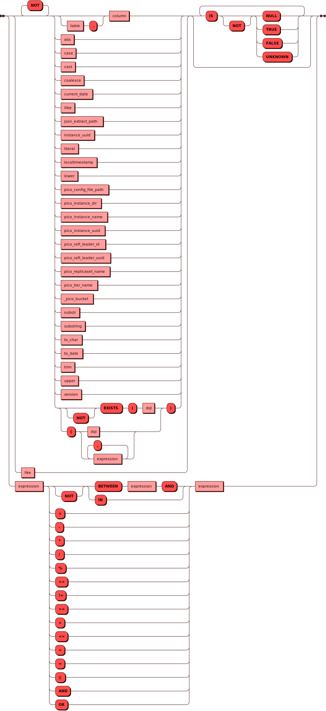
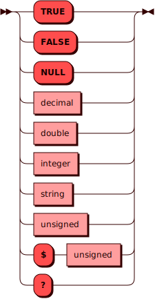

# JSON_EXTRACT_PATH

Функция `JSON_EXTRACT_PATH` извлекает данные из поля в формате JSON
согласно указанным компонентам пути.

## Синтаксис {: #syntax }


Первый аргумент функции — поле типа JSON, из которого извлекаются данные.

Второй и последующие аргументы функции — компоненты пути, по которому извлекаются данные из JSON.
Представляют собой результаты выражений типа [TEXT](../sql_types.md#text).

### Выражение {: #expression }

??? note "Диаграмма"
    

### Литерал {: #literal }

??? note "Диаграмма"
    

## Пример использования {: #using_example }

На данный момент добавление данных в формате JSON  в пользовательские
таблицы с помощью стандартных средства SQL в Picodata не поддерживается.

Тем не менее, извлечение JSON-данных может потребоваться из системных
таблиц. Например, такие данные хранятся для поля [домена отказа].
Запустим инстанс со следующими параметрами в его файле конфигурации:

```shell
instance:
  ...
  name: 'i5'
  failure_domain: { "REGION":"['us']","DC":"us-west-1" }
  ...
```

Получим данные о домене отказа инстанса `i5`:

```sql
SELECT failure_domain FROM _pico_instance where NAME = 'i5';
+-----------------------------------------+
| failure_domain                          |
+=========================================+
| {"REGION": "['US']", "DC": "US-WEST-1"} |
+-----------------------------------------+
(1 rows)
```

[домена отказа]: ../../overview/glossary.md#failure_domain

Получим данные с помощью функции `JSON_EXTRACT_PATH`:

```sql
SELECT json_extract_path(failure_domain, 'DC') FROM _pico_instance WHERE name = 'i5';
```

Вывод:

```shell
+-----------+
| col_1     |
+===========+
| US-WEST-1 |
+-----------+
(1 rows)
```

См. также:

- [Файл конфигурации](../config.md)
