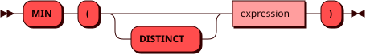

# MIN

Функция `MIN` возвращает минимальное значение выражения.
Значения `NULL` не учитываются. Если строк нет или все значения
равны `NULL`, результат равен `NULL`.

Тип результата совпадает с типом аргумента.

## Синтаксис {: #syntax }



## Параметры {: #params }

`DISTINCT` позволяет учитывать только
[уникальные значения](groupby.md#aggregate_distinct) выражения.

## Использование в окне {: #window }

Функция также может использоваться [как оконная](window.md#aggregate)
с выражением `OVER` и необязательным `FILTER`.
В оконном вызове `DISTINCT` не поддерживается.

## Примеры {: #examples }

??? example "Подготовка тестового окружения"
    Пример использует [тестовую таблицу](../legend.md) `items`.

```sql
SELECT MIN(stock) FROM items;
```
