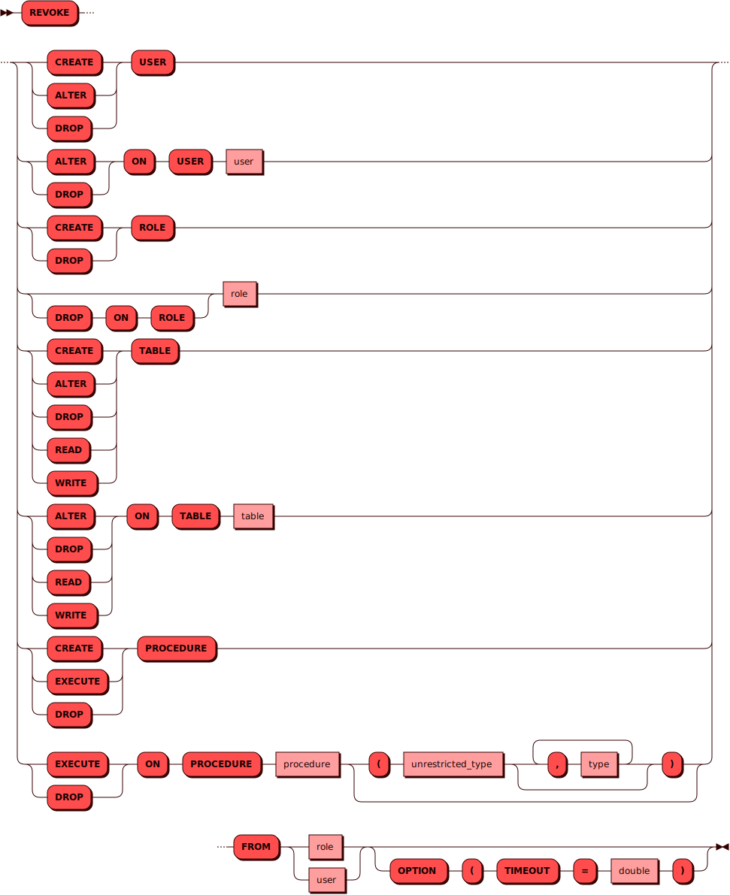

# REVOKE

[DCL](dcl.md)-команда `REVOKE` используется для изъятия
[привилегий](../../admin/access_control.md#privileges) у пользователя
или группы. При работе с собственными объектами
(созданными текущим пользователем) дополнительные привилегии не
требуются; в остальных случаях команда требует привилегий
[Администратора СУБД](../../admin/access_control.md#admin) (`admin`).

## Синтаксис {: #syntax }



### Тип {: #unrestricted_type }

??? note "Диаграмма"
    

## Параметры {: #params }

* **ROLE** — имя роли. Соответствует правилам имен для всех
  [объектов](object.md) в кластере.

* **USER** — имя пользователя. Соответствует правилам имен для всех
  [объектов](object.md) в кластере.

## Примеры {: #examples }

Изъятие права чтения таблиц у пользователя `alice`:

```sql
REVOKE READ TABLE FROM alice OPTION (TIMEOUT = 3.0);
```
