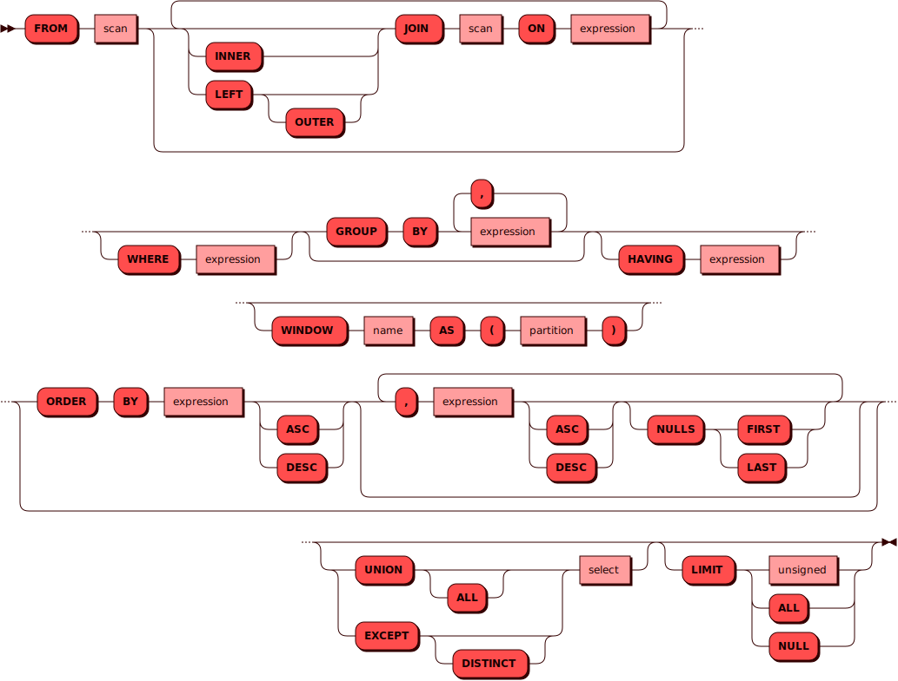

# SELECT

[DQL](dql.md)-команда `SELECT` используется для получения, фильтрации и
преобразования кортежей из множества таблиц в запросе. Такое множество
может представлять собой одну или несколько таблиц, либо вовсе быть
[пустым](#no_scan).

Команда `SELECT` в Picodata работает как с глобальными, так и с
шардированными таблицами. В последнем случае части таблицы могут
храниться на нескольких узлах кластера, и `SELECT` получит данные о всех
таких частях.

!!! note "Примечание"
    При чтении из таблицы большого числа строк может сработать
    ограничение на число
    [инструкций](https://www.sqlite.org/opcode.html) и/или размер
    результирующей виртуальной таблицы. Для обхода ограничений
    используйте дополнительные параметры, описанные в разделе
    [Неблокирующие запросы](non_block.md).

При использовании условии (`SELECT... WHERE...`) часть данных будет
отфильтрована. Если никакие данные не удовлетворяют условиям фильтрации,
то в ответе вернется только описание метаданных колонок без самих
кортежей.

!!! note "Примечание"
    Кортежи в выводе идут в том порядке, в каком их
    отдают узлы Picodata. Гарантии порядка не предоставляются.

## Синтаксис {: #syntax }


### Источник {: #from }

??? note "Диаграмма"
    

### Проекция {: #projection }

??? note "Диаграмма"
    

### Сканирование {: #scan }

??? note "Диаграмма"
    

### Выражение {: #expression }

??? note "Диаграмма"
    

### Литерал {: #literal }

??? note "Диаграмма"
    

## Параметры {: #params }

- **Псевдоним** — позволяет переопределить названия получаемых столбцов
в запросах. Псевдоним вставляется после опционального слова `AS` и может
содержать произвольный текст со следующими ограничениями: он не должен
начинаться с цифры и не может содержать пробелов и специальных служебных
символов (кроме знака подчеркивания).

- **DISTINCT** — возвращаются только уникальные значения кортежей.

- **INNER JOIN** — к колонкам каждого кортежа из внутренней (правой)
  части запроса присоединяются только колонки тех кортежей внешней
  (левой) части, которые удовлетворяют условию соединения `ON`. Если во
  внешней части не нашлось подходящего кортежа, то внутренний кортеж не
  попадает в результат.

- **LEFT OUTER JOIN** — к колонкам каждого кортежа из внешней (левой)
  части запроса присоединяются только колонки тех кортежей внутренней
  (правой) части, которые удовлетворяют условию соединения `ON`. Если во
  внутренней части не нашлось подходящего кортежа, то вместо значений
  его колонок будет подставлен `NULL`.

- **WHERE** — условие фильтрации при сканировании таблицы или
  подзапроса.

- **GROUP BY** — [группировка](aggregate.md) данных по списку колонок
  или выражений.

- **HAVING** — фильтрация уже сгруппированных данных.

- **ORDER BY** — сортировка результата запроса по одной или нескольким
  колонкам. Используется для упорядочивания получаемого набора данных.
  Колонки могут быть указаны как по их именам, так и по порядковым
  номерам.

    - **ASC / DESC** — направление сортировки.
      `ASC` задаёт порядок по возрастанию, `DESC` — по убыванию.
      Если направление не указано, используется порядок по возрастанию.

    - **NULLS FIRST / LAST** — определяет положение пустых значений (`NULL`)
      относительно остальных. `NULLS FIRST` размещает их в начале
      сортировки, `NULLS LAST` — в конце. По умолчанию NULL-значения
      считаются меньшими любых других, поэтому подразумевается
      `NULLS FIRST` при `ASC` и `NULLS LAST` при `DESC`.

- **UNION** — объединение результатов с одинаковым набором колонок
  из нескольких DQL-запросов. При этом результат не содержит
  дубликаты строк.

- **UNION ALL** — объединение результатов с одинаковым набором колонок
  из нескольких DQL-запросов. При этом результат может содержать
  дубликаты строк.

- **EXCEPT DISTINCT** — исключение результатов с одинаковым набором
  колонок одного запроса из другого. При этом результат не содержит
  дубликаты строк.

- **LIMIT** — возвращается количество строк, не превышающее указанное
  значение типа [INTEGER](../sql_types.md#integer).

- **LIMIT ALL**, **LIMIT NULL** — возвращается неограниченное количество
  строк. Является поведением по умолчанию.

См. также:

- [Использование JOIN](join.md)

## Требуемые привилегии {: #required_privileges }

Данная команда требует привилегии `SELECT TABLE`.

См. также:

- [Управление доступом — Таблица привилегий](../../admin/access_control.md#privileges_table)

## Примеры {: #examples }

??? example "Тестовые таблицы"
    Примеры использования команд включают в себя запросы к [тестовым
    таблицам](../legend.md).

### Получение данных из таблицы с фильтрацией {: #select_with_filter }

```sql
SELECT name from items WHERE stock > 1000;
```

### Получение данных без повторов {: #select_distinct }

```sql
SELECT DISTINCT type FROM warehouse;
```

### Внутреннее соединение {: #inner_join }

```sql
SELECT
    c.item,
    c.type,
    a.stock
FROM warehouse AS c
JOIN items AS a
ON c.id = a.id;
```

### Внешнее левое соединение {: #left_outer_join }

```sql
SELECT
    c.item,
    c.type,
    a.stock
FROM warehouse AS c
LEFT JOIN items AS a
ON TRUE;
```

### Множественные соединения {: #multiple_joins }

```sql
SELECT
    warehouse.item,
    items.stock,
    orders.amount
FROM warehouse
INNER JOIN items
ON warehouse.item = items.name
LEFT OUTER JOIN orders
ON items.name = orders.item;
```

### Агрегация {: #aggregation }

```sql
SELECT COUNT(*) FROM warehouse WHERE type = 'heavy';
```

### Группировка с предварительной фильтрацией {: #filter_and_group }

```sql
SELECT type, COUNT(*) FROM warehouse
WHERE id < 5
GROUP BY type;
```

<!--
### Группировка с последующей фильтрацией по сгруппированным данным {: #group_and_filter }

```sql
SELECT type, COUNT(*) as c FROM warehouse
GROUP BY type
HAVING c > 3;

sbroad: column with name "C" not found
```
-->

### Упорядочивание результата по убыванию значений в третьей колонке {: #order_desc }

```sql
SELECT * FROM items
ORDER BY 3 DESC;
```

### Упорядочивание результата c пустыми значениями в конце {: #order_nulls_last }

```sql
INSERT INTO items (id, name) VALUES (6, 'metalware');
SELECT * FROM items
ORDER BY stock
NULLS LAST;
```

### Разнонаправленное упорядочивание результата по двум явно именованным колонкам {: #order_asc_and_desc }

```sql
SELECT * FROM items
ORDER BY name ASC, stock DESC;
```

### Объединение только уникальных строк из результатов двух запросов {: #union_distinct }

```sql
SELECT item FROM warehouse
UNION
SELECT item FROM orders;
```

### Объединение только уникальных строк из результатов многих запросов {: #union_distinct_chain }

```sql
SELECT item FROM warehouse
UNION
SELECT item FROM orders
UNION
SELECT name FROM items;
```

### Полное объединение результатов с использованием подзапроса {: #union_all_subquery }

```sql
SELECT item FROM warehouse WHERE type = 'heavy'
UNION ALL
SELECT * FROM (
    SELECT name FROM items
    UNION ALL
    SELECT item FROM orders WHERE amount > 400
);
```

### Последовательное исключение результатов одного запроса из другого {: #except }

```sql
SELECT item FROM orders
EXCEPT
SELECT item FROM warehouse;
```

### Последовательное исключение результатов с использованием подзапроса {: #except_with_subquery }

```sql
SELECT item FROM warehouse
EXCEPT
SELECT * FROM (
  SELECT item
  FROM orders
  EXCEPT
    SELECT NAME
    FROM items
    WHERE stock > 200
);
```

### Ограничение количества возвращаемых строк {: #limit }

```sql
SELECT * FROM warehouse LIMIT 3;
```

### Пример использования неблокирующего запроса {: #non-block }

```sql
SELECT * FROM warehouse
OPTION(SQL_VDBE_OPCODE_MAX = 10000, SQL_MOTION_ROW_MAX = 15000);
```

### Получение значений по индексам и ключам {: #array_index }

Оператор `[]` (квадратные скобки) применяется для получения значения по
индексу ([целому числу]) для массивов и получения значения по
[строковому ключу] для данных в формате [JSON] (наборов пар
ключ-значение).

[целому числу]: ../sql_types.md#integer
[строковому ключу]: ../sql_types.md#text
[JSON]: ../sql_types.md#json

При запросе пользователь может указать как один индекс/ключ, так и
несколько, в формате `column_name[1][2]` или
`column_name['key1']['key2']` соответственно.

Примеры:

```sql title="получение метода аутентификации пользователей"
SELECT name, auth[1] FROM _pico_user WHERE auth IS NOT NULL;
```

```sql title="пример вывода"
+--------------+-----------+
| name         | col_1     |
+==========================+
| guest        | md5       |
|--------------+-----------|
| admin        | md5       |
|--------------+-----------|
| pico_service | chap-sha1 |
|--------------+-----------|
| andy         | ldap      |
|--------------+-----------|
| alice        | md5       |
+--------------+-----------+
(5 rows)
```

```sql title="получение информации о распределении таблицы"
SELECT name, distribution['ShardedImplicitly'] FROM _pico_table WHERE id=1025;
```

```sql title="пример вывода"
+--------+--------------------------------+
| name   | col_1                          |
+=========================================+
| sklad | [["id"], "murmur3", "default"] |
+--------+--------------------------------+
(1 rows)
```

### Запросы без таблиц {: #no_scan }

Если запрос SELECT делается без таблиц, то имен колонок в нем быть не
может, а значит имеет смысл работать только с константами. Следующий
запрос вернет один кортеж с двум колонками:

```sql
SELECT 42, 24;
```

В примере с манипуляцией данными в результате запроса будет виртуальная
таблица из двух строк и одной колонки:

```sql
SELECT 'cats' UNION SELECT 'dogs';
```
