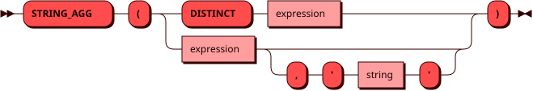

# STRING_AGG

Функция `STRING_AGG` — другое имя [GROUP_CONCAT](group_concat.md),
добавленное для совместимости с PostgreSQL. Она соединяет строковые
значения выражения с разделителем и возвращает
[TEXT](../sql_types.md#text).

Значения `NULL` не учитываются. Если строк нет или все значения
равны `NULL`, результат равен `NULL`. Разделитель по умолчанию — запятая.
В обычном агрегатном вызове второй аргумент должен быть строковым
литералом. Порядок соединения значений не гарантируется; его можно
задать в [оконном вызове](window.md#aggregate) через `ORDER BY` внутри `OVER`.

## Синтаксис {: #syntax }



## Параметры {: #params }

`DISTINCT` позволяет учитывать только
[уникальные значения](groupby.md#aggregate_distinct) выражения.

С `DISTINCT` разрешен только один аргумент; свой разделитель задать нельзя.

## Использование в окне {: #window }

Функция также может использоваться [как оконная](window.md#aggregate)
с выражением `OVER` и необязательным `FILTER`.
В оконном вызове `DISTINCT` не поддерживается.

## Примеры {: #examples }

??? example "Подготовка тестового окружения"
    Пример использует [тестовую таблицу](../legend.md) `items`.

```sql
SELECT STRING_AGG(name, ', ') FROM items;
```
