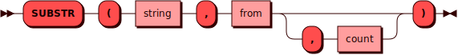

# SUBSTR {: #substr }

Функция `SUBSTR` извлекает подстроку из строки *string*, начиная с позиции
*from*, длиной *count* символов.

Нумерация символов в строке *string* начинается с единицы. Если длина
*count* не указана, конец подстроки будет совпадать с концом строки
*string*.

!!! note "Примечание"
    *from* и *count* — результаты [выражений](#expression) типа [INTEGER].

[INTEGER]: ../sql_types.md#integer

## Синтаксис {: #syntax }



### Выражение {: #expression }

??? note "Диаграмма"
    

### Литерал {: #literal }

??? note "Диаграмма"
    

## Примеры {: #examples }

```sql title="Запрос VALUES с функцией SUBSTR и параметром <i>from</i>"
sql> VALUES ( SUBSTR('picodata', 3) );
+----------+
| COLUMN_1 |
+==========+
| "codata" |
+----------+
(1 rows)
```

```sql title="Запрос VALUES с функцией SUBSTR и параметрами <i>from</i> и <i>count</i>"
sql> VALUES ( SUBSTR('picodata', 3, 4) );
+----------+
| COLUMN_1 |
+==========+
| "coda"   |
+----------+
(1 rows)
```
